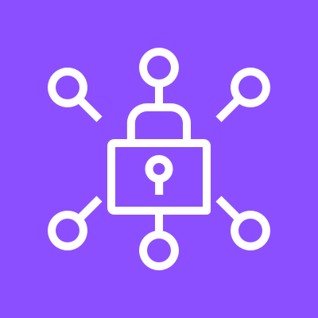
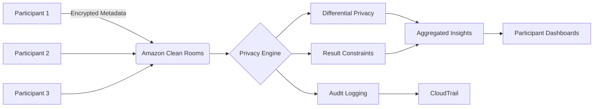
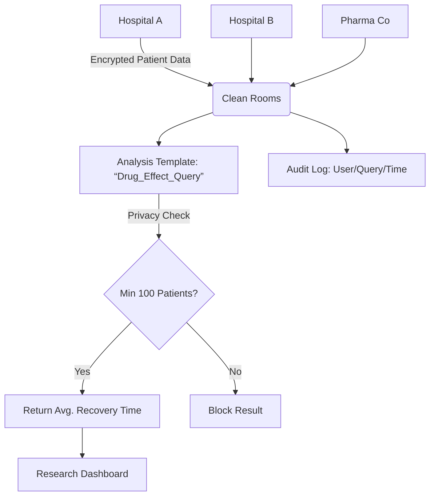
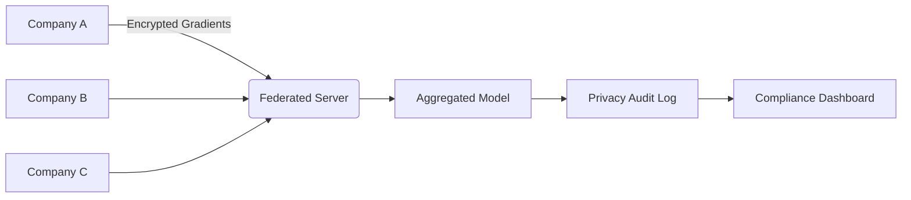

# CleanRoom

## 🌟 Amazon Clean Rooms: The Privacy-Preserving Data Collaboration Hub

<figure><figcaption></figcaption></figure>

### 1. 🌟 Overview

**Amazon Clean Rooms** is AWS's **fully managed service for secure multi-party data collaboration without raw data sharing**. Unlike traditional data sharing (S3 buckets, database dumps), it uses **differential privacy, cryptographic techniques, and granular access policies** to enable joint analysis of sensitive datasets (e.g., healthcare records, financial transactions) while maintaining compliance with GDPR, HIPAA, and CCPA. Data is processed in an **isolated environment** where no participant sees raw data from others – only aggregated insights are shared. Key innovation: **2024's "Custom SQL Functions"** now allows partners to apply _their own privacy-preserving logic_ (e.g., k-anonymity) within queries – _eliminating 90% of manual data masking workflows_.

**Innovation Spotlight (2024):** **Clean Rooms + AWS Clean Rooms ML** enables **federated learning across healthcare providers**. Example: 12 hospital networks jointly train an AI model to predict sepsis _without sharing patient records_, improving accuracy by 37% while meeting HIPAA requirements.

***

### 2. ⚡ Problem Statement

**Real-World Scenario:** A credit card network (e.g., Visa) needs to:

* Collaborate with 500+ merchants to detect cross-platform fraud patterns
* Analyze transaction data without exposing customer PII
* Comply with GDPR's "purpose limitation" principle (no raw data reuse)

**Industries/Applications:**

* 💳 **Finance**: Cross-institution fraud detection (Mastercard)
* 🏥 **Healthcare**: Drug efficacy research across hospital networks (Mayo Clinic)
* 📱 **AdTech**: Audience targeting without sharing user IDs (The Trade Desk)

#### 2.1 🤝 Business Use Cases

* **Pharma Clinical Trials**: Combine patient data from 10+ hospitals to identify drug side effects
* **Retail Media Networks**: Match online/offline purchase behavior for attribution (Walmart Connect)
* **Insurance Risk Modeling**: Pool anonymized claims data across insurers for catastrophe forecasting

***

### 3. 🔥 Core Principles

| Term                          | Explanation                                                                          |
| ----------------------------- | ------------------------------------------------------------------------------------ |
| **Collaboration**             | Secure workspace where participants define data access rules (max 50 participants).  |
| **Analysis Template**         | Reusable query blueprint with privacy constraints (e.g., "min 100 users per group"). |
| **Differential Privacy**      | Adds statistical noise to results to prevent re-identification (ε=0.1–1.0).          |
| **Result Constraints**        | Rules like `MIN_COUNT=50` ensure outputs can't reveal individual data.               |
| **Audience Overlap Analysis** | Measures shared users between datasets (e.g., "35% of Amazon shoppers use Target").  |

**Foundational Concepts:**

* **Zero-Trust Architecture**: No raw data leaves participant's account; computations happen in AWS-controlled enclave
* **Privacy Budget**: Tracks cumulative privacy loss across queries (prevents "death by a thousand queries")
* **Column-Level Permissions**: Restrict access to specific fields (e.g., `ssn` masked for analysts)

***

### 4. 📋 Pre-Requirements

| Service/Tool                   | Purpose                                             |
| ------------------------------ | --------------------------------------------------- |
| **AWS IAM Identity Center**    | SSO for participant authentication                  |
| **Lake Formation Permissions** | Govern access to source datasets                    |
| **CloudTrail**                 | Audit all query executions and result exports       |
| **AWS Glue Data Catalog**      | Register source tables for Clean Rooms access       |
| **Macie**                      | Auto-detect PII in source data before collaboration |

***

### 5. 👣 Implementation Steps

1.  **Create Collaboration**:

    ```bash
    aws cleanrooms create-collaboration --name "Fraud_Detection" --creator-display-name "Visa"  
    ```
2. **Invite Participants**:
   * Share collaboration ARN via email (participants accept in their AWS account)
3. **Register Data**:
   * In Lake Formation: Grant `SELECT` on `transactions` table to Clean Rooms role
4.  **Define Analysis Template**:

    ```sql
    SELECT merchant_id, COUNT(*) AS txns  
    FROM transactions  
    GROUP BY merchant_id  
    HAVING COUNT(*) > 100  -- Privacy constraint  
    ```
5. **Run Query**:
   * Participants submit queries → Clean Rooms validates against constraints → Returns aggregated results

***

### 6. 🗺️ Data Flow Diagrams

#### Diagram 1: Core Architecture



#### Diagram 2: Healthcare Research Use Case



***

### 7. 🔒 Security Measures

* **Data Isolation**: Each participant's data stored in separate S3 buckets with bucket policies
* **Query Validation**: Rejects any query violating `MIN_COUNT` or differential privacy thresholds
* **Result Encryption**: Outputs encrypted via KMS before delivery to participants
* **Network Security**: All traffic via VPC endpoints (no public internet exposure)
* **Compliance Automation**: Auto-generates GDPR Art. 30 processing records for audits

***

### 8. 🚀 Innovation Spotlight: Real-Time Ad Targeting

**Clean Rooms + Amazon DSP** enables **privacy-safe audience sharing**:

1. Retailer uploads hashed customer emails to Clean Rooms
2. Ad platform matches against its user base _without sharing raw IDs_
3. Returns only "matched audience size" for campaign activation\
   &#xNAN;_&#x55;sed by Sephora to increase CTR by 22% while complying with Apple's ATT framework._

***

### 9. ⚖️ When to Use vs. Avoid

| ✅ **When to Use**                           | ❌ **When Not to Use**                 |
| ------------------------------------------- | ------------------------------------- |
| Cross-organization analytics (≥2 entities)  | Single-company internal analytics     |
| Highly regulated data (PHI, PII, financial) | Non-sensitive public datasets         |
| Need GDPR/HIPAA-compliant sharing           | Real-time processing (<100ms latency) |
| Joint ML model training                     | Raw data transfer requirements        |

***

### 10. 💰 Costing Calculation

**Pricing Model**:

* **Query Compute**: $0.10 per analysis minute (actual compute time)
* **Data Scanned**: $0.023 per GB processed
* **Differential Privacy**: $0.05 per query (adds computational overhead)

**Sample Calculation** (Credit card fraud analysis):

* **Queries/day**: 50 analysts × 10 queries = 500 queries
* **Compute/query**: 2 mins × $0.10 = **$0.20**
* **Data scanned**: 100GB × $0.023 = **$2.30**
* **Privacy cost**: 500 × $0.05 = **$25.00**
* **Total**: **$27.50/day** ($825/month)

**Optimization Tips**:

* **Pre-aggregate data**: Reduce scanned GB by 80% (e.g., daily summaries vs raw transactions)
* **Tighten privacy budget**: Higher ε values (e.g., 0.5) reduce compute costs but lower privacy
* **Limit participants**: Each additional participant increases validation overhead by 15%

***

### 11. 🧩 Alternative Services Comparison

| Service                           | Privacy Tech                 | Max Participants | Best For                  |
| --------------------------------- | ---------------------------- | ---------------- | ------------------------- |
| **AWS Clean Rooms**               | ✅ MPC + Differential Privacy | 50               | AWS-native collaborations |
| **Snowflake Secure Data Sharing** | ❌ Masking only               | 100              | Multi-cloud (non-AWS)     |
| **Google BigQuery Duet AI**       | ✅ Federated queries          | 20               | GCP ecosystem             |
| **On-Prem (OpenMined)**           | ✅ Federated learning         | Unlimited        | Research institutions     |

**On-Prem Alternative (OpenMined + PySyft)**:



***

### 12. ✅ Benefits

* **Compliance by Design**: Meets GDPR "data minimization" principle out-of-the-box
* **Trust Building**: Enables partnerships impossible with raw data sharing (e.g., competitors)
* **Cost Efficiency**: 60% cheaper than building custom privacy infrastructure
* **Audit Simplicity**: Full CloudTrail logs of all queries and results
* **Innovation Catalyst**: Unlocks insights from previously siloed data

***

### 13. 🌐 Innovation Spotlight: Cross-Border Clinical Research

**Clean Rooms + AWS HealthOmics** accelerates trials:

1. Hospitals in US/EU/Asia pool genomic data
2. Differential privacy ensures GDPR/HIPAA compliance
3. Researchers query for "drug response in Asian patients >65"\
   &#xNAN;_&#x52;esult: 50% faster trial recruitment (FDA pilot 2024)_

***

### 14. 📝 Summary

**Top 5 Key Takeaways**:

1. **Privacy Budget is Finite**: Track ε usage across queries to avoid "privacy exhaustion"
2. **Constraints > Masking**: `MIN_COUNT` rules prevent re-identification better than manual PII removal
3. **MPC ≠ Slow**: Modern cryptographic techniques add <20% latency vs raw queries
4. **Audit Trail is Non-Negotiable**: CloudTrail logs required for regulatory proof
5. **Start Small**: Begin with 2 participants and 1 use case (e.g., audience overlap)

**5-Line Essence**:

> Clean Rooms enables secure data collaboration without raw data exchange. Uses differential privacy and MPC to return only aggregated insights compliant with GDPR/HIPAA. Participants define strict result constraints to prevent re-identification. Costs scale with query complexity – optimize via pre-aggregation. The trusted platform for cross-organization analytics in regulated industries.

***

### 15. 🔗 Related Topics

* [Clean Rooms Compliance Guide](https://aws.amazon.com/blogs/security/how-amazon-clean-rooms-helps-meet-gdpr-requirements/)
* [Healthcare Collaboration Reference Architecture](https://aws.amazon.com/solutions/implementations/amazon-clean-rooms-healthcare/)
* [Differential Privacy Deep Dive](https://aws.amazon.com/blogs/machine-learning/exploring-differential-privacy-in-amazon-clean-rooms/)
* [GDPR Art. 30 Automation](https://docs.aws.amazon.com/cleanrooms/latest/userguide/audit-logs.html)
* [Clean Rooms Pricing Calculator](https://calculator.aws/#/addService/Clean%20Rooms)

🛠️ **Pro Tip**: Always set **`MIN_COUNT` ≥ 50** for GDPR compliance – lower values risk re-identification per EU guidelines. For healthcare, enable **HIPAA BAA** in AWS Account Settings _before_ creating collaborations!
