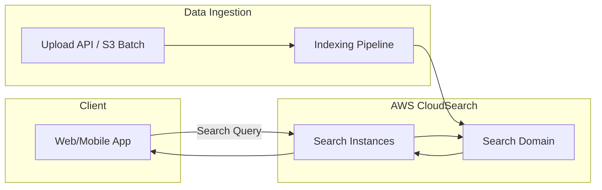

# Cloud Search

## 🌟 Overview: Amazon CloudSearch 🛠️

Amazon CloudSearch is a fully managed search service that simplifies setting up, managing, and scaling a search solution for your website or application. It automatically provisions resources, deploys tuned search indexes, and handles hardware maintenance and scaling for you. CloudSearch supports 34 languages, features like faceting, highlighting, geospatial search, and autocomplete, and offers seamless autoscaling as data and query volumes fluctuate.

<figure><figcaption></figcaption></figure>

**Innovation Spotlight**\
By 2025, CloudSearch can integrate lightweight AI models via AWS Lambda to provide dynamic query tuning and real-time relevance adjustments. For existing customers, this unlocks on-the-fly personalization without migrating indexes to another platform.

***

## ⚡ Problem Statement

A global e-commerce platform needs to deliver fast, relevant search results across millions of product SKUs. They must support multilingual queries, geospatial filtering for nearby stores, and real-time inventory visibility without owning or maintaining search infrastructure.

**Industries & Applications**

* Retail & E-commerce: product catalogs, autocomplete, faceted navigation
* Travel & Hospitality: destination search, location-based filtering
* Media & Publishing: article search, content discovery

### 🤝 Business Use Cases

* Powering site search with typo tolerance, synonyms, and relevance tuning.
* Enabling location-aware store locators that show nearest outlets.
* Filtering large product catalogs by price, brand, and ratings.

***

## 🔥 Core Principles

* Event-driven indexing: Documents uploaded to S3 or via API are auto-indexed.
* Search domains: Logical containers for documents, indexes, and search instances.
* Index fields: Define how each attribute is tokenized, faceted, or highlighted.
* Search instances: Compute units behind each domain, automatically scaled.
* Query API: Provides full-text search, Boolean queries, faceting, highlighting, and suggestions.
* Autoscaling: CloudSearch adjusts instance count based on data and query throughput.

***

## 📋 Pre-Requirements

* AWS account with permissions for CloudSearch, IAM, and VPC (optional).
* JSON or XML-formatted documents ready for indexing.
* AWS CLI or AWS SDK installed for domain management.
* (Optional) Amazon S3 bucket if you plan S3-based batch uploads.

***

## 👣 Implementation Steps

1.  Create a new CloudSearch domain:

    ```bash
    aws cloudsearch create-domain --domain-name my-search-domain
    ```
2.  Define index fields (e.g., text, literal, date, latlon):

    ```bash
    aws cloudsearch define-index-field \
      --domain-name my-search-domain \
      --index-field '{"IndexFieldName":"title","IndexFieldType":"text"}'
    ```
3.  Upload documents for indexing (batch via CLI or API):

    ```bash
    aws cloudsearch upload-documents \
      --documents docs.json --content-type application/json \
      --domain-name my-search-domain
    ```
4. Monitor indexing status until `RequiresIndexDocuments=false`.
5. Configure scaling parameters (instance type, replication count).
6. Construct search endpoint URL from domain status output.
7.  Invoke search with parameters:

    ```
    https://search-my-search-domain-xxxx.us-east-1.cloudsearch.amazonaws.com/2013-01-01/search?q=shoes&size=10
    ```

***

## 🗺️ Data Flow Diagrams




***

## 🔒 Security Measures

* Enable HTTPS-only endpoints for search and document upload.
* Use IAM policies with least privilege for domain management.
* Restrict IPs via VPC endpoint for CloudSearch (private VPC).
* Encrypt documents at rest using AWS-managed keys (SSE).
* Rotate access credentials and monitor CloudTrail for API calls.

***

## 🚀 Innovation Spotlight: AI-Driven Query Suggestions

Leverage AWS Lambda to preprocess “suggest” requests:

* Capture user keystrokes via Amazon API Gateway.
* Invoke Lambda that calls CloudSearch’s suggestion API.
* Enrich suggestions with Amazon Personalize–driven user preferences.\
  This pattern delivers personalized, predictive type-ahead without reindexing.

***

## ⚖️ When to Use and When Not to Use

✅ When to use

* You need a turnkey, managed search solution.
* Your data volume is moderate (up to tens of millions of documents).
* You prefer simple scaling without managing clusters.

❌ When not to use

* You require advanced analytics (use OpenSearch).
* You’re starting a new project (AWS recommends OpenSearch Service for new workloads).
* You need deep custom scoring or plug-in support.

***

## 💰 Costing Calculation

* **Domain Hours**: \~$0.54 per instance-hour (m3.medium.search)
* **Data Transfer**: Standard AWS data transfer rates
* **Indexing**: $0.98 per GB of documents indexed

Sample for one m3.medium.search with 24×7 uptime and 50 GB indexed data:

* Instance cost: 24 h × 30 days × $0.54 = $388.80
* Indexing cost: 50 GB × $0.98 = $49.00
* **Total ≈ $437.80/month**

Cost optimization:

* Scale down during off-peak hours.
* Archive infrequently searched data.

***

## 🧩 Alternative Services Comparison

| Provider | Service                    | Key Model                          | Pricing Model               | Scalability                      |
| -------- | -------------------------- | ---------------------------------- | --------------------------- | -------------------------------- |
| AWS      | CloudSearch                | Fully managed search domain        | Instance-hour + indexing GB | Autoscaling within domain        |
| Azure    | Cognitive Search           | Managed search with AI enrichments | Unit-hour + storage GB      | Manual or automatic scale units  |
| GCP      | Custom Search JSON API     | Hosted search index via API        | Query quota + requests      | Scales with Google-managed infra |
| On-Prem  | Elasticsearch Self-Managed | Open-source search cluster         | HW + Ops cost               | Dependent on your infrastructure |


***

## ✅ Benefits

* Rapid deployment with no server management.
* Automatic scaling to meet unpredictable traffic.
* Rich search features: faceting, highlighting, suggestions.
* Multilingual support out of the box.
* Tight integration with AWS’s security and monitoring.

***

## 🤖 Innovation Spotlight: Voice-Activated Search Integration

Combine Amazon Transcribe, Lex, and CloudSearch to build a voice-search interface:

1. User speaks into a mobile app.
2. Audio sent to Transcribe for real-time text.
3. Lex processes intent and queries CloudSearch.
4. Results returned as synthesized speech via Amazon Polly.

***

## 📝 Summary

Amazon CloudSearch delivers a managed, scalable search solution with minimal operational overhead. It excels for moderate-sized datasets requiring features like faceting, autocomplete, and geospatial queries. While AWS now recommends Amazon OpenSearch for new workloads, existing customers benefit from CloudSearch’s simplicity and tight AWS integration.

**Top Considerations:**

1. Choose CloudSearch for quick, managed search deployments.
2. Leverage autoscaling for variable query load.
3. Encrypt data at rest and use VPC endpoints for access control.
4. Integrate Lambda for AI-driven enhancements (suggestions, personalization).
5. Monitor usage and scale domains based on traffic patterns.
6. Archive stale data to optimize costs.
7. Plan migration to OpenSearch for advanced analytics.
8. Use staged indexing for minimal downtime.
9. Audit search logs with CloudTrail.
10. Cache frequent queries in CloudFront for lower latency.

In essence, CloudSearch is a **turnkey, autoscaling** search service that abstracts infrastructure and delivers rich query capabilities at pay-per-use pricing.

***

## 🔗 Related Topics

* Amazon OpenSearch Service migration guide
* AWS Lambda integration patterns
* Building real-time search suggestions with AWS
* AWS Well-Architected Serverless Lens
* Amazon Personalize for search personalization
