# Data Exchange

## 🌟 Amazon Data Exchange: The Compliant Data Marketplace Engine

### 1. 🌟 Overview

**Amazon Data Exchange** is AWS's **fully managed service for securely subscribing to, publishing, and distributing third-party data products** (e.g., financial feeds, geospatial data, healthcare datasets) _while automating compliance and usage controls_. Unlike generic S3 sharing, it provides **built-in legal frameworks** (GDPR, CCPA, HIPAA) with **automated usage policies**, **entitlement tracking**, and **metered billing** – turning data into a monetizable product. Key innovation: **2024's "Data Product Templates"** auto-apply usage restrictions (e.g., "no resale") during subscription – _reducing legal review time from 2 weeks to 2 hours_.

<figure><figcaption></figcaption></figure>

**Innovation Spotlight (2024):** **Data Exchange + AWS Clean Rooms** enables **compliant multi-party analytics**. Example: 3 pharmaceutical companies jointly analyze clinical trial data _without raw data exchange_ – each pays only for their query usage via automated metering.

***

### 2. ⚡ Problem Statement

**Real-World Scenario:** A hedge fund needs to:

* Subscribe to 50+ premium data sources (satellite imagery, credit card trends, social sentiment)
* Ensure GDPR compliance for EU client data usage
* Pay only for consumed records (not raw data volume)

**Industries/Applications:**

* 📈 **Finance**: Alternative data for trading signals (Bloomberg, FactSet)
* 🌍 **Climate Tech**: Satellite weather data for crop yield prediction (ClimateAi)
* 🏥 **Healthcare**: De-identified patient datasets for drug research (Flatiron Health)

#### 2.1 🤝 Business Use Cases

* **Regulatory Arbitrage**: Access country-specific financial data with auto-applied local compliance
* **Data-as-a-Service**: Sell internal telemetry data (e.g., Uber movement patterns) to retailers
* **Supply Chain Resilience**: Subscribe to port congestion data for logistics optimization

***

### 3. 🔥 Core Principles

| Term                      | Explanation                                                                               |
| ------------------------- | ----------------------------------------------------------------------------------------- |
| **Data Product**          | Curated dataset with metadata, pricing, and usage policies (e.g., "Q4 US Credit Trends"). |
| **Entitlement**           | Automated access control granting subscribers to specific revisions (no manual IAM).      |
| **Usage Reports**         | Per-subscriber consumption metrics (e.g., "12,345 records accessed").                     |
| **Revision**              | Versioned dataset snapshot (immutable S3 objects). Critical for auditability.             |
| **Data Product Template** | Pre-configured policy bundle (e.g., "GDPR-Compliant Financial Data").                     |

**Foundational Concepts:**

* **Zero-Data-Movement Architecture**: Subscribers access data _in publisher's account_ via S3 Access Points
* **Automated Billing**: AWS handles metering, invoicing, and revenue sharing (publisher keeps 70%)
* **Compliance-as-Code**: Policies like `NO_RESELL` enforced at query layer (Athena/Redshift)

***

### 4. 📋 Pre-Requirements

| Service/Tool                   | Purpose                                                       |
| ------------------------------ | ------------------------------------------------------------- |
| **AWS Marketplace Account**    | Required for monetization (links to Data Exchange)            |
| **Lake Formation Permissions** | Enforce column/row-level security on data products            |
| **AWS Organizations**          | Manage multi-account entitlements (for enterprise publishers) |
| **CloudTrail**                 | Audit all subscription/usage events                           |
| **Macie**                      | Auto-scan data for PII before publication                     |

***

### 5. 👣 Implementation Steps

1.  **Publish Data Product**:

    
    ```bash
    aws dataexchange create-data-set --name "US_Traffic_Analytics" --type REVISION_BASED  
    ```
    
2. **Apply Template**:
   * Select "GDPR-Compliant Geospatial" template → Auto-adds `MIN_AGGREGATION=50`
3. **Create Revision**:
   * Upload S3 data → Auto-generates immutable revision (ARN: `rev-12345`)
4. **Configure Entitlements**:
   * Grant subscriber AWS account ID access to revision
5. **Subscribe**:
   * Subscriber uses AWS Marketplace → "Subscribe" → Data appears in _their_ Data Exchange console

***

### 6. 🗺️ Data Flow Diagrams

#### Diagram 1: Core Architecture


#### Diagram 2: Hedge Fund Data Consumption

```mermaid
flowchart TB  
    A[Satellite Provider] -->|Publish| B(Data Exchange)  
    B --> C[Data Product: “Global_Port_Traffic”]  
    C -->|Revision 2024-09| D[Hedge Fund Subscription]  
    D --> E[Athena: “SELECT congestion_level”]  
    E --> F{Usage Policy Check}  
    F -->|Min 100 ports| G[Return Aggregated Data]  
    F -->|Single port query| H[Block Request]  
    G --> I[AWS Billing: $0.0001/record]  
```



***

### 7. 🔒 Security Measures

* **Policy Enforcement Points**: Lake Formation blocks queries violating `MIN_AGGREGATION`
* **Isolated Access**: Subscribers use _publisher's_ S3 Access Point (no bucket permissions)
* **Audit Trail**: CloudTrail logs `StartJob`/`GetJobResult` with subscriber account ID
* **Data Encryption**: KMS keys rotate every 365 days (AWS-managed by default)
* **VPC Endpoints**: Restrict access to private networks (no public internet)

***

### 8. 🚀 Innovation Spotlight: Real-Time Data Monetization

**Data Exchange + Kinesis Data Streams** enables **live data products**:

1. Publisher streams real-time stock options data to KDS
2. Data Exchange creates hourly revisions from KDS
3. Subscribers pay _per-second_ for streaming access\
   &#xNAN;_&#x55;sed by NASDAQ to sell market depth data – revenue up 220% in 2024._

***

### 9. ⚖️ When to Use vs. Avoid

| ✅ **When to Use**                 | ❌ **When Not to Use**                      |
| --------------------------------- | ------------------------------------------ |
| Monetizing internal datasets      | Internal data sharing (use Lake Formation) |
| Compliant third-party data access | Raw data dumps without metadata            |
| Usage-based billing models        | Non-AWS ecosystem data sharing             |
| Automated policy enforcement      | Real-time streaming <1s latency (use KVS)  |

***

### 10. 💰 Costing Calculation

**Pricing Model**:

* **Publishing**: $0.00 (AWS takes 30% revenue share)
* **Subscription**: Publisher sets price (e.g., $0.0001/record)
* **Data Transfer**: $0.09/GB (S3 cross-account)

**Sample Calculation** (Hedge fund subscribing to traffic data):

* **Monthly queries**: 50M records × $0.0001 = **$5,000**
* **Data transfer**: 10TB × $0.09 = **$900**
* **Total**: **$5,900/month**

**Publisher Revenue**: $5,900 × 70% = **$4,130/month**\
**Optimization Tips**:

* Use **columnar formats** (Parquet) to reduce scanned data by 75%
* **Aggregate upfront** (e.g., hourly summaries) to minimize per-record costs
* Set **minimum query thresholds** to block wasteful requests

***

### 11. 🧩 Alternative Services Comparison

| Service                        | Compliance Automation | Revenue Share     | Best For                |
| ------------------------------ | --------------------- | ----------------- | ----------------------- |
| **AWS Data Exchange**          | ✅ Policy templates    | 70% to publisher  | AWS-native monetization |
| **Snowflake Data Marketplace** | ❌ Manual policies     | 85% to publisher  | Multi-cloud (non-AWS)   |
| **Google Cloud Data Exchange** | ⚠️ Limited            | 80% to publisher  | GCP ecosystem           |
| **On-Prem (Astronomer)**       | ❌ Custom code         | 100% to publisher | Air-gapped environments |

**On-Prem Alternative (Astronomer + MinIO)**:


***

### 12. ✅ Benefits

* **Compliance at Scale**: Auto-apply GDPR/CCPA policies to 100+ subscribers
* **Zero Infrastructure**: No servers to manage for data distribution
* **Revenue Acceleration**: Launch data products in **<48 hours** (vs. 6+ months manually)
* **Usage Transparency**: Real-time consumption dashboards for publishers/subscribers
* **Trust Building**: AWS handles legal/financial reconciliation (no disputes)

***

### 13. 🌐 Innovation Spotlight: Climate Risk Analytics

**Data Exchange + Amazon SageMaker** predicts disasters:

1. NOAA publishes hurricane path data as Data Product
2. Insurers subscribe → Train models on historical data
3. Pay only for model-training data usage\
   &#xNAN;_&#x52;esult: 40% faster catastrophe response (proven with Munich Re)_

***

### 14. 📝 Summary

**Top 5 Key Takeaways**:

1. **Revisions = Immutable Snapshots**: Never overwrite data – critical for auditability
2. **Policies > Permissions**: `MIN_AGGREGATION` prevents re-identification better than IAM
3. **AWS Handles Billing**: No invoicing infrastructure needed (revenue share is automatic)
4. **Templates Save Weeks**: Pre-approved policy bundles bypass legal bottlenecks
5. **S3 Access Points Are Key**: Subscribers never see raw bucket paths (isolation by design)

**5-Line Essence**:

> Data Exchange turns datasets into compliant, monetizable products with automated usage policies. Publishers retain data in their account while subscribers access via secure entitlements. Revenue share model (70/30) eliminates billing overhead. Costs scale with consumption – optimize via columnar storage. The only AWS-native platform for data-as-a-service.

***

### 15. 🔗 Related Topics

* [Data Product Publishing Guide](https://aws.amazon.com/blogs/big-data/how-to-publish-data-products-on-aws-data-exchange/)
* [GDPR Policy Template Library](https://docs.aws.amazon.com/data-exchange/latest/userguide/gdpr-templates.html)
* [Monetization Revenue Calculator](https://aws.amazon.com/marketplace/solutions/data-exchange)
* [HIPAA Compliance Checklist](https://aws.amazon.com/compliance/hipaa-eligible-services-ref/)
* [Data Exchange + Clean Rooms Tutorial](https://aws.amazon.com/blogs/industries/combining-aws-clean-rooms-and-aws-data-exchange/)

🛠️ **Pro Tip**: Always start with **"GDPR-Compliant Financial Data" template** – it auto-blocks queries returning <50 records. For real-time data, pair with **Kinesis Data Streams** to create hourly revisions (reduces subscriber costs by 60% vs. raw streams).
