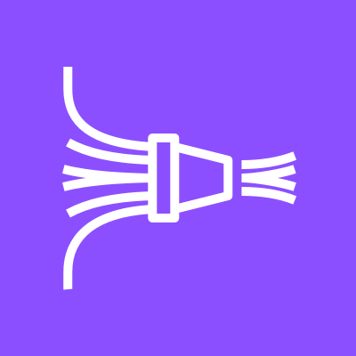
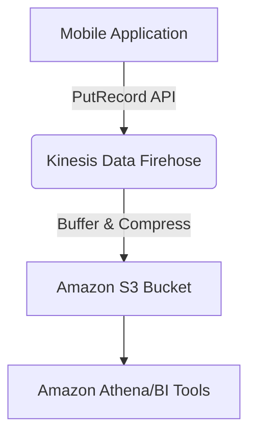
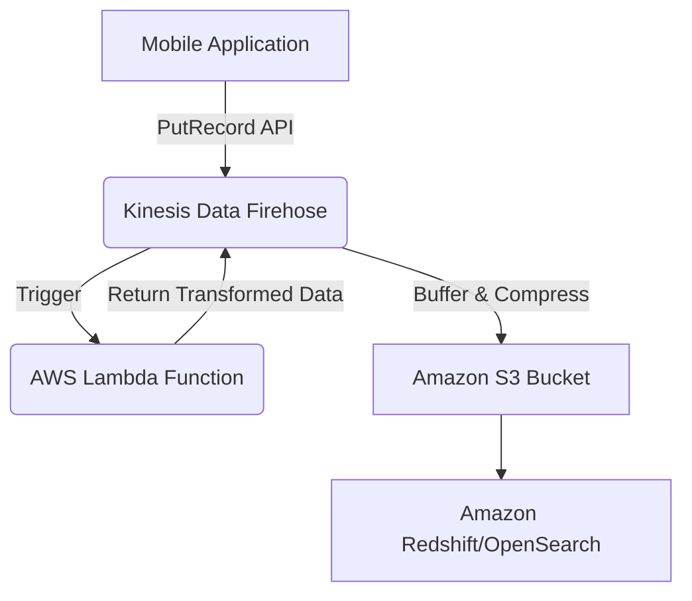
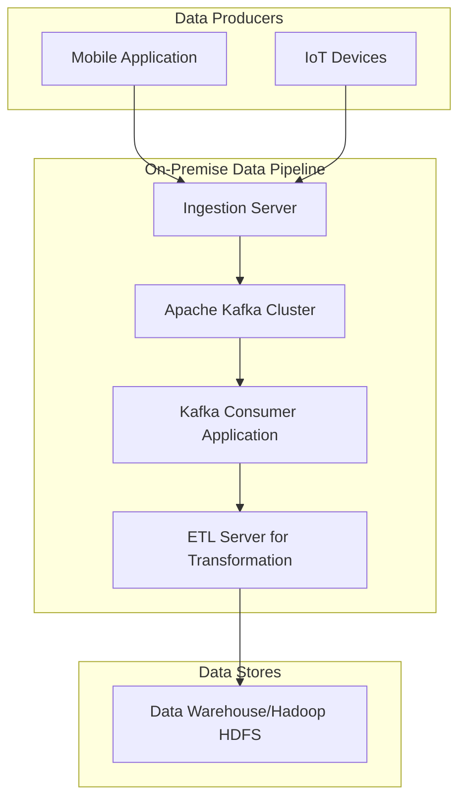

# Data Firehose

## Amazon Data Firehose

***

### 🌟 Overview: Amazon Kinesis Data Firehose 🔥

Amazon Kinesis Data Firehose is a fully managed, serverless service that simplifies the process of reliably capturing, transforming, and loading streaming data into data stores and analytics services. It automatically scales to handle the volume of your incoming data, without you needing to manage any underlying infrastructure. This makes it an ideal choice for building a real-time analytics pipeline for logs, clickstreams, or IoT sensor data.

The service's core value lies in its simplicity and seamless integration. You can create a delivery stream in just a few clicks, and it will handle all the complexities of data ingestion, buffering, compression, and delivery to a wide range of destinations, including Amazon S3, Amazon Redshift, Amazon OpenSearch Service, and even third-party services like Splunk and Datadog.

<figure><figcaption></figcaption></figure>

### 🤖 Innovation Spotlight: Dynamic Partitioning and Schema Evolution

A key innovation in Amazon Kinesis Data Firehose is **dynamic partitioning**. This feature allows Firehose to automatically partition your incoming streaming data based on data values within the records themselves. For example, you can partition log data by customer ID, geographic location, or application name. This results in a more organized and query-efficient data lake in Amazon S3, as it aligns with common querying patterns and improves the performance of services like Amazon Athena.

Another significant advancement is **schema evolution**. Firehose can detect changes in your data's schema as it streams and automatically handle these changes. It can convert the incoming data to a target schema, even if the source schema changes over time. This is particularly useful for dealing with data from evolving applications or IoT devices, ensuring that your data lake remains clean and structured without manual intervention.

***

### ⚡ Problem Statement

A ride-sharing company, "RideSwift," generates massive amounts of real-time data from its mobile application. This includes trip details (pickup/drop-off locations, time, duration), driver location updates, and user interactions. The company needs to analyze this data in near-real-time for several use cases, such as:

* **Operational Analytics:** Monitoring live trip status and identifying potential issues.
* **Business Intelligence:** Analyzing popular routes, peak hours, and driver performance to optimize operations.
* **Machine Learning:** Building predictive models for demand forecasting and surge pricing.

The challenge is ingesting this high-velocity, high-volume data and reliably delivering it to a central data warehouse for analysis without building and managing a complex, custom data ingestion pipeline. A manual solution would involve a cluster of servers, custom scripts, and a lot of maintenance, which is not scalable or cost-effective.

### 🤝 Business Use Cases

* **E-commerce:** Ingesting clickstream data from a website to understand user behavior, personalize product recommendations, and analyze conversion funnels.
* **IoT:** Collecting sensor data from a fleet of connected vehicles to monitor engine performance, fuel efficiency, and maintenance needs.
* **Media & Entertainment:** Streaming user interaction data from a video platform to analyze viewing habits and recommend content.
* **Financial Services:** Ingesting real-time transaction data for fraud detection and risk analysis.

***

### 🔥 Core Principles

Amazon Kinesis Data Firehose operates on the following core principles:

* **Serverless and Fully Managed:** You don't manage servers, scaling, or infrastructure. AWS handles all the operational aspects, so you can focus on your data and applications.
* **Scalability:** It automatically scales up or down to handle changes in data volume and throughput, from megabytes to gigabytes or terabytes per hour.
* **Reliability and Durability:** It uses a retry mechanism to ensure data is delivered to the destination and supports buffer-based delivery to minimize API calls.
* **Data Transformation and Enrichment:** You can use an AWS Lambda function to transform, enrich, or format incoming data before it is delivered to the destination.
* **Flexible Destinations:** It supports a variety of popular destinations, including data lakes (S3), data warehouses (Redshift), search engines (OpenSearch), and third-party services.

### ✨ Core Resources and Terms

* **Delivery Stream:** The central resource in Firehose. It's the pipeline that captures data, buffers it, and delivers it to a destination.
* **Source:** The origin of the data. This can be a Kinesis Data Stream, Kinesis Agent, or direct API calls from applications.
* **Buffer:** Firehose buffers incoming data before delivering it. You can configure the buffer size (in MBs) or buffer interval (in seconds) to optimize delivery.
* **Transformation:** An optional step where a Lambda function can process data records. This is used for data enrichment, conversion, or filtering.
* **Destination:** The final location where data is loaded, such as Amazon S3, Amazon Redshift, Amazon OpenSearch Service, or other supported endpoints.

***

### 📋 Pre-Requirements

To set up a data ingestion pipeline using Amazon Kinesis Data Firehose, you will need the following services and tools:

* **AWS Account:** The fundamental requirement.
* **AWS IAM Role:** A service-linked role for Firehose to access other AWS services (e.g., S3, Redshift, Lambda). It must have the necessary permissions (least privilege).
* **Amazon S3 Bucket:** A required destination for all Firehose delivery streams, even if you are using another final destination like Redshift. S3 serves as a backup or a data lake layer.
* **AWS Lambda Function:** (Optional but highly recommended) for data transformation or enrichment.
* **Source of Data:** An application, a Kinesis Agent on a server, or an existing Kinesis Data Stream.

***

### 👣 Implementation Steps

Here is a step-by-step guide to setting up a Kinesis Data Firehose delivery stream for RideSwift's trip data.

1. **Create an Amazon S3 Bucket:**
   * Navigate to the Amazon S3 console and create a new bucket (e.g., `rideswift-trip-data-firehose`).
   * This bucket will be the primary destination for the streaming data.
2. **Create a Kinesis Data Firehose Delivery Stream:**
   * Open the Kinesis console and choose **Data Firehose**.
   * Click **Create delivery stream**.
   * **Source:** Choose "Direct PUT" for a simple setup, or "Kinesis Data Stream" if you have a separate stream for data processing.
   * **Destination:** Select **Amazon S3**.
   * **S3 Bucket:** Choose the bucket you created in Step 1.
3. **Configure Data Transformation (Optional):**
   * Under the **Transform records** section, choose "Enabled."
   * Select or create an AWS Lambda function. This function can parse the incoming JSON data, add a timestamp, or filter out incomplete records.
   * For example, the Lambda function could add a `partition_key` field based on the trip's start time and city.
4. **Configure Dynamic Partitioning:**
   * Under the **Advanced settings** section, enable "Dynamic partitioning."
   * Define the partition keys using a JQ expression (e.g., `!{customer_id}`, `!{city}`).
   * This will automatically organize the data in S3 into logical folders (e.g., `s3://bucket/city=NewYork/customer_id=123/`).
5. **Configure Data Format Conversion and S3 Compression:**
   * Under the **Data format conversion** section, choose "Enabled."
   * Select a source and destination format (e.g., JSON to Parquet). This improves query performance and reduces storage costs.
   * Select a compression algorithm (e.g., Snappy or GZIP) to compress the files in S3.
6. **Set Up IAM Role:**
   * Firehose will prompt you to create or select an IAM role. Create a new role with the necessary permissions to `PutRecord`, write to S3, and invoke the Lambda function.
7.  **Send Data to the Delivery Stream:**

    * Use the AWS SDK in your application to send data records to the delivery stream using the `PutRecord` API call.
    * Example Python code snippet:

    ```python
    import boto3
    import json

    client = boto3.client('firehose', region_name='us-east-1')
    data = {'trip_id': '12345', 'city': 'NewYork', 'driver_id': 'D1', 'pickup_time': '...'}

    response = client.put_record(
        DeliveryStreamName='rideswift-trip-data-firehose',
        Record={
            'Data': json.dumps(data) + '\n'
        }
    )
    print(response)
    ```

***

### 🗺️ Data Flow Diagram

**Diagram 1: Simple Data Ingestion**

This diagram shows the basic, direct-put data flow to Amazon S3.



**Diagram 2: Data Ingestion with Transformation**

This diagram illustrates how an AWS Lambda function can transform data before it reaches its destination.



**Diagram 3: Ingestion with Dynamic Partitioning**

This diagram highlights the data flow when dynamic partitioning is enabled, showing how data is organized in S3.

```mermaid
graph TD
    A[Mobile Application] -->|PutRecord API| B(Kinesis Data Firehose)
    B -->|Data Transformation| C(AWS Lambda)
    C -->|Return Partition Key| B
    B -->|Buffer & Compress| D[Amazon S3 (Data Lake)]
    subgraph Amazon S3 Folders
        E[.../city=NewYork/date=2025-09-07]
        F[.../city=London/date=2025-09-07]
    end
    D --> E
    D --> F
    E --> G[Amazon Athena Query]
    F --> G
```

***

### 🔒 Security Measures

* **IAM Roles with Least Privilege:** Use a specific IAM role for your Firehose delivery stream with only the permissions necessary to write to the destination and invoke the Lambda function.
* **S3 Bucket Policies:** Implement a bucket policy on your S3 destination to ensure that only the Firehose IAM role can write data to it.
* **Encryption at Rest and in Transit:** Use AWS Key Management Service (KMS) to encrypt data at rest in your S3 bucket. Firehose automatically encrypts data in transit using HTTPS.
* **VPC Endpoints:** To ensure that data ingestion traffic does not traverse the public internet, configure a VPC endpoint for the Kinesis Data Firehose API.
* **CloudTrail Logging:** Enable AWS CloudTrail to log all API calls to your Firehose delivery stream for auditing and security analysis.

***

### ⚖️ When to use and when not to use

✅ **When to use Amazon Kinesis Data Firehose:**

* You need a simple, fully managed, and serverless solution for ingesting streaming data.
* Your primary goal is to load data into a data lake (S3), data warehouse (Redshift), or a search/analytics service (OpenSearch).
* You require automatic scaling and don't want to manage servers or clusters.
* You need to perform light-weight transformations or enrichment on data before it's loaded.
* You want to minimize API calls and cost by buffering data before delivery.

❌ **When not to use Amazon Kinesis Data Firehose:**

* You need to build a custom real-time application that reads data from a stream and processes it on a record-by-record basis (e.g., real-time fraud detection). For this, **Amazon Kinesis Data Streams** is the better choice.
* You need complex, stateful data processing or stream analytics (e.g., windowed aggregates, joins across streams). Use **Amazon Kinesis Data Analytics** for this.
* You have a low volume of data that can be handled by direct API calls to your destination, without the need for a buffering service.

***

### 💰 Costing Calculation

Amazon Kinesis Data Firehose pricing is based on the volume of data ingested. The cost is calculated per gigabyte (GB) of data that is passed through the service.

* **Data Ingestion:** Cost is based on the GB of data ingested. The price per GB decreases at higher volumes.
* **Data Transformation:** You pay for the amount of data processed by the Lambda function, which is charged based on the Lambda service's pricing model (requests and duration).
* **Format Conversion/Dynamic Partitioning:** An additional charge applies for data format conversion (e.g., JSON to Parquet) and dynamic partitioning.

**Sample Calculation:**

Assume a business ingests 500 GB of data per month into an S3 bucket with a Lambda transformation and data format conversion to Parquet.

* **Data Ingestion Cost:** 500 GB \* $0.029/GB = $14.50
* **Data Transformation (Lambda):** Assuming a small function and 500 GB of data, the cost would be minimal, likely less than $5.00 due to Lambda's generous free tier.
* **Format Conversion & Dynamic Partitioning:** 500 GB \* $0.007/GB = $3.50
* **Total Estimated Cost:** $14.50 + $5.00 + $3.50 = **$23.00 / month**

**Efficient Way of Handling Cost:**

* **Optimize Buffer Size and Interval:** Tweak these settings to find a balance between real-time needs and cost. Larger buffers can reduce the number of API calls, which can be a factor in some pricing models (e.g., with destination services), and larger files are better for analytics.
* **Compress Data:** Use compression (GZIP, Snappy) to reduce the size of the data delivered to S3, which lowers storage costs and I/O costs for analytics.
* **Use Format Conversion:** Converting data to a columnar format like Parquet dramatically improves query performance and reduces the amount of data scanned by services like Athena, leading to significant cost savings on the analytics side.

***

### 🧩 Alternative Services in AWS/Azure/GCP/On-Premise

| Service                         | Platform         | Key Comparison/Difference                                                                                                                                                                            |
| ------------------------------- | ---------------- | ---------------------------------------------------------------------------------------------------------------------------------------------------------------------------------------------------- |
| **Amazon Kinesis Data Streams** | AWS              | Provides a persistent stream for real-time applications. Use it when you need to read and process data on a per-record basis. More complex to manage but offers more control.                        |
| **Azure Event Hubs**            | Azure            | A highly scalable data streaming platform and event ingestion service. Similar to Kinesis Data Streams.                                                                                              |
| **GCP Pub/Sub**                 | GCP              | A simple, reliable, and scalable messaging service for building real-time data pipelines. More of a message queuing system than a full-fledged streaming service.                                    |
| **Apache Kafka**                | On-Premise/Cloud | An open-source, distributed streaming platform. Requires significant operational overhead for setup, scaling, and maintenance. Many cloud providers offer managed Kafka services (e.g., Amazon MSK). |

**On-Premise Alternative Data Flow (Manual Process with Apache Kafka)**

This diagram shows a typical on-premise, manual process for data ingestion using Apache Kafka, highlighting the operational complexity that Firehose simplifies.



***

### ✅ Benefits

* **Simplicity and Ease of Use:** A fully managed, serverless service that drastically reduces the effort required to build and maintain a data pipeline.
* **Cost-Effective:** Pay only for the data volume you ingest, with no upfront costs or server management overhead.
* **High Scalability:** Automatically scales to handle bursts in data volume without any manual intervention.
* **High Reliability:** Ensures data is delivered to its destination reliably with buffering and automatic retries.
* **Seamless Integration:** Works out-of-the-box with popular AWS services like S3, Redshift, and OpenSearch.
* **Data Transformation:** Built-in ability to transform and enrich data using Lambda functions.

***

### 📝 Summary

Amazon Kinesis Data Firehose is a fundamental service for any organization dealing with streaming data. It serves as an easy-to-use, scalable, and reliable pipeline that gets your data from various sources to a multitude of destinations. By handling the complexities of buffering, compression, and delivery, it allows developers and data engineers to focus on generating insights rather than managing infrastructure. The new features like dynamic partitioning and schema evolution further streamline the process of building a clean and structured data lake.

**Top 5 Things to Keep in Mind:**

1. **Serverless and Managed:** You don't manage any servers. AWS handles everything.
2. **It's for Delivery, not Processing:** Firehose is a loading service. Use Kinesis Data Streams for real-time, per-record processing or Data Analytics for complex stream processing.
3. **S3 is the Primary Destination:** Even if your final destination is Redshift or OpenSearch, Firehose writes a copy to S3, which is a great backup and allows for a data lake strategy.
4. **Use Lambda for Transformation:** This is a powerful feature that allows you to clean, enrich, or reformat your data before it's delivered.
5. **Leverage Dynamic Partitioning:** This can significantly improve the query performance of your S3 data lake and reduce costs.

**In short, what Amazon Kinesis Data Firehose is all about:** Amazon Kinesis Data Firehose is a managed service that streams data from your applications and loads it automatically into your chosen data stores. It's designed for simplicity and scalability, handling data buffering, compression, and transformation so you can build a real-time analytics pipeline without managing any infrastructure.

### 🔗 Related Topics

* **Amazon Kinesis Data Streams:** For building custom applications that need to process or analyze streaming data in real-time.
* **Amazon Kinesis Data Analytics:** For running SQL queries on streaming data to gain real-time insights.
* **AWS Glue:** For data cataloging and ETL jobs on the data landed in your S3 data lake.
* **Amazon Redshift & Amazon S3:** Common destinations for Firehose delivery streams.
* **AWS Lambda:** The serverless compute service used to transform data within Firehose.
