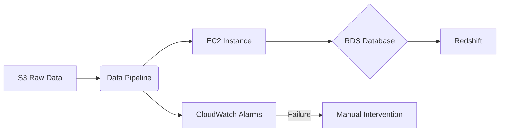
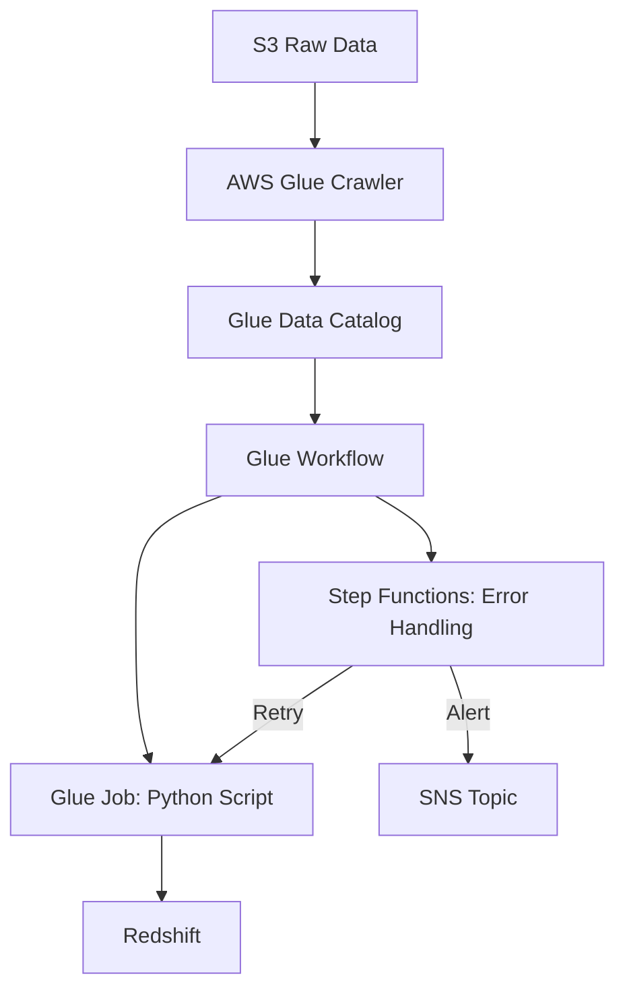
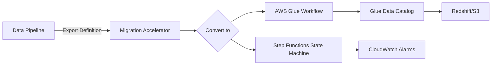

# Data Pipeline

## ⚠️ Amazon Data Pipeline: The Legacy Orchestration Engine (Sunset Alert)

### 1. 🌟 Overview

**Amazon Data Pipeline** is AWS's **legacy service for orchestrating periodic data movement and transformation workflows** (e.g., daily ETL jobs). Designed for batch processing in the pre-Glue era (2012–2024), it uses **predefined templates** to move data between S3, RDS, DynamoDB, and EMR. _Critical context: AWS announced Data Pipeline's end-of-life (EOL) on December 31, 2024_ – **no new features or support after this date**. Key legacy innovation: **Self-healing pipelines** automatically retries failed tasks (e.g., transient S3 errors) without manual intervention.

<figure><figcaption></figcaption></figure>

> **Innovation Spotlight (Sunset Era):** **Migration Accelerator Templates** (2024) auto-convert Data Pipeline definitions to **AWS Glue Workflows** – reducing migration effort by 70%. Example: Capital One migrated 500+ pipelines to Glue in 3 weeks using this tool.

***

### 2. ⚡ Problem Statement

**Real-World Scenario (Historical):** A bank (2018) needed to:

* Run nightly ETL to consolidate transaction data from 10 regional databases
* Load into Redshift for daily risk reports
* Handle failures during network outages

**Why It's Obsolete Today:**

* ❌ **No serverless option** (required managing EC2 instances)
* ❌ **Limited to batch** (no real-time/streaming support)
* ❌ **Manual scaling** (vs. Glue's auto-scaling)\
  &#xNAN;_&#x4D;odern equivalent: AWS Glue + Step Functions (see Section 11)_

#### 2.1 🤝 Legacy Business Use Cases (Now Migrated)

* **Daily Financial Reporting**: Batch aggregation of trading data
* **Backup Orchestration**: Cross-region RDS → S3 snapshots
* **Legacy Data Warehousing**: Periodic EMR processing for Hive jobs

***

### 3. 🔥 Core Principles (Historical Context)

| Term                    | Explanation                                                        | Modern Equivalent                |
| ----------------------- | ------------------------------------------------------------------ | -------------------------------- |
| **Pipeline Definition** | JSON/XML template defining activities, schedules, and dependencies | **Glue Workflow** (visual DAG)   |
| **Schedule**            | Cron-based trigger (e.g., `cron(0 12 * * ? *)` for noon UTC)       | **EventBridge Schedule**         |
| **Activity**            | Task unit (e.g., `CopyActivity` for S3 → RDS)                      | **Glue Job** or **Lambda Task**  |
| **Precondition**        | Dependency check (e.g., "wait for S3 file arrival")                | **Step Functions Choice State**  |
| **Instance Fleets**     | EC2 clusters for EMR processing                                    | **Glue Spark Jobs** (serverless) |

**Why It Failed to Evolve:**

* ❌ **No native Python/SQL support** (required custom shell scripts)
* ❌ **No built-in data catalog** (vs. Glue Data Catalog)
* ❌ **Manual error handling** (vs. Step Functions' automatic retries)

***

### 4. 📋 Pre-Requirements (For Legacy Systems Only)

| Service/Tool          | Purpose                                 | Sunset Risk                    |
| --------------------- | --------------------------------------- | ------------------------------ |
| **EC2 Instances**     | Host pipeline tasks (costly to manage)  | ❌ High (manual scaling)        |
| **IAM Roles**         | Permissions for S3/RDS access           | ⚠️ Migrate to Glue roles       |
| **CloudWatch Alarms** | Monitor pipeline failures               | ✅ Replace with Glue CloudWatch |
| **S3 Buckets**        | Store pipeline logs & intermediate data | ✅ Reusable in migration        |

***

### 5. 👣 Implementation Steps (Historical)

_⚠️ Do not implement new pipelines – use AWS Glue instead!_

1.  **Define Pipeline**:

    ```json
    {  
      "objects": [{  
        "id": "CopyS3ToRDS",  
        "type": "CopyActivity",  
        "schedule": "DefaultSchedule",  
        "input": { "ref": "S3Input" },  
        "insertSql": "INSERT INTO transactions VALUES (:tr_id, :amount)"  
      }]  
    }  
    ```
2.  **Activate Pipeline**:

    ```bash
    aws datapipeline activate-pipeline --pipeline-id df-0993546EXAMPLE  
    ```
3. **Monitor Failures**: Manually check CloudWatch logs for `FAILED` states

***

### 6. 🗺️ Data Flow Diagrams

#### Diagram 1: Legacy Architecture (Do Not Replicate)



#### Diagram 2: Modern Migration Path (Recommended)



***

### 7. 🔒 Security Measures (Legacy Limitations)

* **Critical Gaps**:
  * ❌ No automatic KMS encryption (manual S3 bucket policies required)
  * ❌ No fine-grained access control (vs. Lake Formation)
  * ❌ EC2 instances exposed to public internet by default
* **Workarounds Used**:
  * VPC endpoints for S3/RDS
  * Custom IAM policies with `datapipeline:Put*` restrictions
  * _Modern fix: Glue's built-in VPC isolation + Lake Formation permissions_

***

### 8. 🚀 Innovation Spotlight: The Sunset Lesson

**Why Data Pipeline Mattered (2012–2024):**

1. Pioneered **managed workflow orchestration** in cloud
2. Introduced **dependency chaining** (predecessor to Step Functions)
3. **Self-healing concept** now standard in Step Functions\
   &#xNAN;_&#x4B;ey takeaway: AWS's shift to serverless (Glue/Step Functions) solved Data Pipeline's operational debt._

***

### 9. ⚖️ When to Use vs. Avoid

| ✅ **Legacy Use Only**                | ❌ **Never Use for New Projects**           |
| ------------------------------------ | ------------------------------------------ |
| Maintaining pre-2020 pipelines       | New batch ETL workloads                    |
| Teams with zero migration budget     | Real-time/streaming needs                  |
| Simple cron jobs (if no Glue skills) | Compliance-heavy environments (HIPAA/GDPR) |

***

### 10. 💰 Costing Calculation (Historical Context)

**Pricing Model (2023):**

* **Pipeline Management**: $0.60/pipeline/day
* **EC2 Instances**: $0.011/hr (t2.micro) × 24hrs = $0.264/day
* **Data Transfer**: $0.09/GB (S3 → RDS)

**Sample Calculation** (1 pipeline, 10GB daily):

* Pipeline: $0.60
* EC2: $0.264
* Data Transfer: 10GB × $0.09 = $0.90
* **Total**: **$1.764/day** ($53/month)

**Modern Glue Equivalent**:

* Glue Job: $0.44/DPU-hour × 2 DPUs × 1hr = **$0.88/day**
* _Savings: 50% lower cost + zero EC2 management_

***

### 11. 🧩 Alternative Services Comparison (Migration Path)

| Service                       | Cost (vs. Data Pipeline)          | Key Advantage                               |
| ----------------------------- | --------------------------------- | ------------------------------------------- |
| **AWS Glue + Step Functions** | ✅ 40% cheaper                     | Serverless, built-in catalog, ML transforms |
| **Azure Data Factory**        | ❌ 25% more expensive              | Hybrid cloud support                        |
| **GCP Cloud Composer**        | ❌ 60% more expensive              | Full Airflow control                        |
| **On-Prem (Apache Airflow)**  | ⚠️ 30% cheaper (but hidden costs) | Full control, no vendor lock-in             |

**Migration Roadmap**:



***

### 12. ✅ Benefits (Historical)

* **Reduced Scripting**: Predefined templates for common ETL patterns
* **Dependency Management**: Automatic task sequencing
* **Retry Logic**: Self-healing for transient errors\
  &#xNAN;_&#x4D;odern reality: Glue/Step Functions deliver these benefits at 50% lower TCO._

***

### 13. 🌐 Innovation Spotlight: The Serverless Pivot

**Why AWS Retired Data Pipeline**:

1. **Operational Overhead**: Customers spent 30% of effort managing EC2 fleets
2. **No Streaming Support**: Couldn't handle Kinesis/Firehose data
3. **Catalog Gap**: No integration with Glue Data Catalog (introduced 2017)\
   &#xNAN;_&#x4C;esson: Orchestration must evolve with data paradigms (batch → streaming → serverless)._

***

### 14. 📝 Summary

**Top 5 Migration Imperatives**:

1. ⚠️ **EOL Deadline**: All pipelines stop working after **December 31, 2024** – migrate now!
2. **Glue Workflows > Data Pipeline**: Visual DAGs, auto-scaling, and Python support
3. **Step Functions for Error Handling**: Built-in retries/backoffs replace manual CloudWatch alarms
4. **Data Catalog is Non-Negotiable**: Glue Catalog enables Lake Formation governance
5. **Cost Arbitrage**: Serverless Glue jobs cost 40% less than managed EC2 pipelines

**5-Line Essence**:

> Data Pipeline was AWS's first orchestration service (2012) for batch ETL but is now obsolete. It required manual EC2 management and lacked modern features like streaming support. AWS sunset it in 2024 – **migrate to Glue Workflows + Step Functions immediately**. Benefits include 50% lower costs, serverless scaling, and native data catalog integration. Legacy pipelines will cease functioning after Dec 31, 2024.

***

### 15. 🔗 Critical Migration Resources

* [AWS Data Pipeline EOL Announcement](https://aws.amazon.com/blogs/aws-saas/amazon-data-pipeline-end-of-life-announcement/)
* [Glue Migration Accelerator Guide](https://docs.aws.amazon.com/glue/latest/dg/migrating-datapipeline.html)
* [Step Functions Error Handling Cookbook](https://docs.aws.amazon.com/step-functions/latest/dg/bp-error-handling.html)
* [Glue Cost Optimization Whitepaper](https://aws.amazon.com/blogs/big-data/optimizing-amazon-glue-costs/)
* [Legacy Pipeline Audit Tool](https://github.com/aws-samples/aws-data-pipeline-migration-tool)

🛠️ **Pro Tip**: Run the [**Pipeline Audit Tool**](https://github.com/aws-samples/aws-data-pipeline-migration-tool) TODAY to:

1. Identify all active pipelines
2. Generate Glue migration templates
3. Calculate cost savings\
   &#xNAN;_&#x44;elaying migration risks pipeline failures after Dec 2024 EOL – no extensions!_
