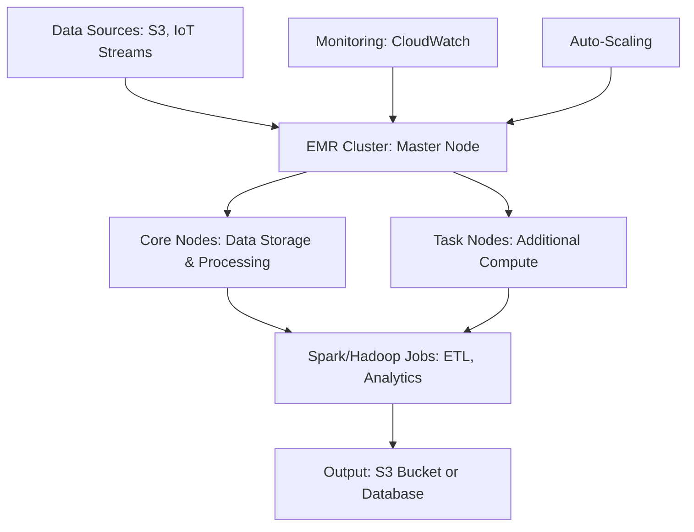
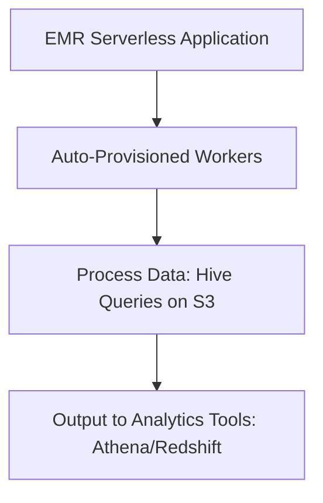
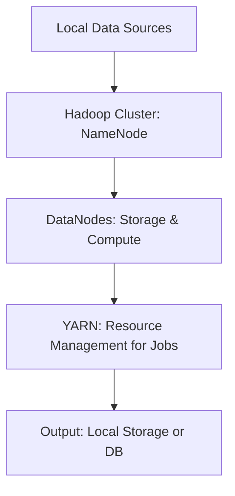

# EMR

## Amazon EMR

### 🌟 Overview

Amazon EMR (Elastic MapReduce) is a fully managed cloud service from AWS that simplifies running big data frameworks like Apache Hadoop, Spark, HBase, and Presto on scalable clusters. It enables processing vast amounts of data for analytics, machine learning, ETL (Extract, Transform, Load), and more, without managing underlying infrastructure. EMR automatically handles provisioning, configuration, scaling, and monitoring of clusters, supporting open-source tools while integrating seamlessly with other AWS services like S3 for storage and EC2 for compute.

<figure><figcaption></figcaption></figure>

> :gem: Deep Dive: EMR clusters can be transient (short-lived for specific jobs) or long-running, with options for spot instances to reduce costs. It supports EMR Studio for collaborative notebooks, EMR on EKS for Kubernetes orchestration, and EMR Serverless for auto-scaling without cluster management. As of 2025, EMR has evolved with enhanced AI/ML integrations, such as native support for Apache Spark 3.x with GPU acceleration for faster processing, and improved data lake analytics via integration with Amazon SageMaker and Lake Formation. It also features EMR Launch for streamlined cluster templates and better observability through Amazon Managed Grafana.

🤖 Innovation Spotlight: EMR's integration with Graviton3 processors offers up to 30% better price-performance for big data workloads, enabling sustainable computing with ARM-based efficiency. Recent advancements include EMR on Outposts for hybrid edge processing, allowing data analytics closer to on-premises sources for low-latency IoT applications.

### ⚡ Problem Statement

A large e-commerce company generates petabytes of customer transaction logs, clickstream data, and inventory records daily. Traditional on-premises Hadoop clusters struggle with scaling during peak seasons, leading to delays in generating insights for personalized recommendations and fraud detection. EMR addresses this by providing a scalable, cost-effective platform to process and analyze this data in near real-time.

Industries/Applications: Retail for customer behavior analysis; Finance for risk modeling and fraud detection; Healthcare for genomic sequencing; Media for content recommendation engines. For example, a streaming service like Netflix could use EMR to process viewer data for personalized playlists.

### 🤝 Business Use Cases

* **Retail Analytics**: Process sales data to forecast demand and optimize supply chains.
* **Financial Services**: Analyze transaction logs for anomaly detection in real-time.
* **Healthcare**: Run genomic pipelines on large datasets for drug discovery.
* **IoT Data Processing**: Handle sensor data from manufacturing plants for predictive maintenance.
* **Machine Learning**: Train models on historical data integrated with SageMaker for recommendation systems.

### 🔥 Core Principles

EMR is built on event-driven, distributed computing principles, emphasizing scalability, fault tolerance, and serverless-like benefits for big data. Key concepts include:

* **Distributed Processing**: Data is split across nodes using frameworks like MapReduce (for batch jobs) or Spark (for in-memory processing), enabling parallel execution.
* **Scalability**: Auto-scaling clusters add/remove nodes based on workload; supports horizontal scaling up to thousands of instances.
* **Fault Tolerance**: Built-in replication and checkpointing ensure jobs resume from failures without data loss.
* **Serverless Benefits**: EMR Serverless abstracts cluster management, charging only for compute used.

### 🔑 Key Resources/Services Terms:

* **Cluster**: A collection of EC2 instances (master, core, task nodes) running big data software. Master manages the cluster, core nodes store data, task nodes process only.
* **EMR Notebooks**: Jupyter-based environments for interactive data exploration.
* **EMR Studio**: IDE for developing, visualizing, and debugging EMR jobs.
* **EMR on EKS**: Runs EMR workloads on Amazon EKS for containerized big data apps.
* **EMR Serverless**: Fully managed, auto-provisioning for Spark and Hive jobs without cluster setup.
* **Steps**: Units of work submitted to clusters, like Spark jobs or Hive queries.
* **Release Labels**: Versions of EMR software stacks, e.g., emr-7.0.0 with latest open-source tools.

### 📋 Pre-Requirements

* **AWS Account**: For accessing EMR console and APIs.
* **S3 Bucket**: To store input/output data and logs; purpose: durable, scalable storage.
* **EC2 Key Pair**: For SSH access to clusters if needed.
* **IAM Roles**: EMR\_DefaultRole for cluster permissions, EMR\_EC2\_DefaultRole for instance access.
* **VPC/Subnets**: For network isolation; purpose: secure cluster deployment.
* **Tools**: AWS CLI or SDK for automation; Apache Spark/Hadoop installed via EMR (no manual install needed).

### 👣 Implementation Steps

1. **Set Up S3 Bucket**: Create a bucket via AWS Console or CLI (`aws s3 mb s3://my-emr-bucket`). Upload input data.
2. **Create IAM Roles**: Use IAM to create default EMR roles if not present.
3. **Launch EMR Cluster**: In EMR Console, choose "Create cluster," select release label (e.g., emr-7.0.0), instance types (e.g., m5.xlarge), and enable auto-scaling. Configure S3 logging.
4. **Submit Jobs/Steps**: Add steps like a Spark job (`spark-submit --deploy-mode cluster script.py`).
5. **Monitor and Scale**: Use EMR Console or CloudWatch to monitor; adjust cluster size manually or via policies.
6. **Terminate Cluster**: Once jobs complete, terminate to avoid costs (for transient clusters). For EMR Serverless, simply submit applications without cluster creation.

### 🗺️ Data Flow Diagram

### 🔒 Security Measures

* Enable encryption at rest (SSE-S3/KMS) and in transit (TLS).
* Use least privilege IAM roles; e.g., restrict EMR to specific S3 buckets.
* Deploy in private VPC subnets with security groups limiting inbound traffic.
* Enable Kerberos for authentication in clusters.
* Use Amazon GuardDuty for threat detection and audit logs via CloudTrail.
* For EMR on EKS, apply Kubernetes RBAC and network policies.

***

> 🚀 Graviton-Powered EMR for Sustainable Analytics\
> Leverage ARM-based Graviton instances in EMR for up to 40% energy savings in big data workloads, ideal for eco-conscious enterprises processing climate data.

### ⚖️ When to Use and When Not to Use

✅ **When to Use**: For large-scale data processing needing frameworks like Spark/Hadoop; cost-effective for variable workloads; integrates with AWS ecosystem for data lakes.\
❌ **When Not to Use**: For small datasets better suited to single-instance tools like EC2; real-time streaming (use Kinesis instead); if preferring fully managed SQL analytics (opt for Athena).

### 💰 Costing Calculation

EMR pricing is based on instance hours (EC2 costs + EMR uplift of \~$0.25/hour per instance) plus data transfer/storage. EMR Serverless charges per vCPU-hour and GB-hour used.\
Efficient Handling: Use spot instances (up to 90% savings), transient clusters, and auto-termination.\
Sample: A 10-node m5.xlarge cluster (4 vCPU each) running 2 hours: EC2 \~$1.92/hour x 10 x 2 = $38.40; EMR uplift $0.25 x 10 x 2 = $5; Total \~$43.40. With spots, reduce to \~$15.

### 🧩 Alternative Services in AWS/Azure/GCP/On-Premise

| Service                        | Provider   | Key Differences/Comparisons                                                                    |
| ------------------------------ | ---------- | ---------------------------------------------------------------------------------------------- |
| Amazon EMR                     | AWS        | Managed Hadoop/Spark; tight S3 integration; serverless option.                                 |
| Azure HDInsight                | Azure      | Similar managed clusters; better Azure Blob Storage integration; supports Windows-based tools. |
| Dataproc                       | GCP        | Faster cluster startup; BigQuery integration; lower costs for preemptible VMs.                 |
| Cloudera/Hortonworks (On-Prem) | On-Premise | Full control over hardware; no cloud lock-in; higher setup/maintenance costs.                  |

On-Premise Data Flow (Cloudera Example):

### ✅ Benefits

* **Cost Savings**: Pay-per-use with spot instances; no upfront hardware costs.
* **Scalability**: Handle petabyte-scale data with auto-scaling.
* **Automation**: Managed provisioning reduces ops overhead.
* **Performance**: In-memory processing with Spark accelerates jobs.
* **Integration**: Seamless with S3, Glue, SageMaker for end-to-end workflows.

### 🛡️ Advanced EMR Monitoring with AI

Use Amazon Managed Grafana integrated with EMR for AI-driven anomaly detection in cluster metrics, predicting failures before they occur.

### 📝 Summary

Amazon EMR empowers efficient big data processing with managed scalability and open-source tools, ideal for analytics-driven decisions.\
Top 5 Points to Keep in Mind:

1. Choose EMR Serverless for simplicity in variable workloads.
2. Optimize costs with spot/reserved instances.
3. Ensure security via IAM and encryption.
4. Leverage integrations for data lakes/ML.
5. Monitor with CloudWatch for performance.\
   In Short: EMR is AWS's managed big data platform for running Hadoop/Spark clusters, offering scalability, cost-efficiency, and integrations for processing massive datasets in analytics, ETL, and ML pipelines.

### 🔗 Related Topics

* AWS EMR Documentation: https://docs.aws.amazon.com/emr/
* EMR Pricing: https://aws.amazon.com/emr/pricing/
* Big Data on AWS Guide: https://aws.amazon.com/big-data/
* Apache Spark on EMR: https://aws.amazon.com/emr/features/spark/
