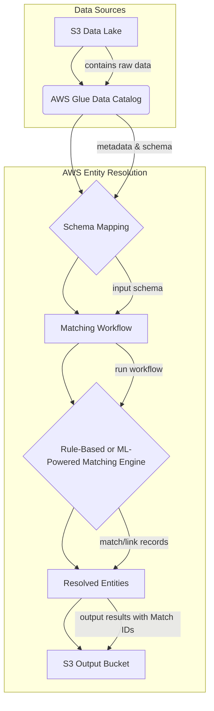
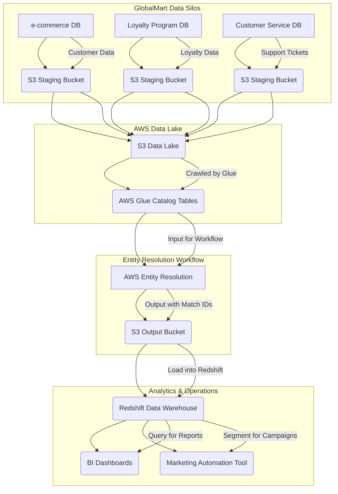

# Entity Resolution

## 🌟Overview: Amazon Entity Resolution 🤝

Amazon Entity Resolution is a fully managed service that helps you **match and link related records** from multiple data sources into a single, unified view of a real-world entity, such as a customer, product, or business. This process, known as entity resolution, is crucial for improving data quality and creating a "single source of truth" for your analytics, marketing, and operational workflows.

<figure><figcaption></figcaption></figure>

Before this service, organizations had to build complex, custom solutions using data science and machine learning, which was time-consuming and required specialized expertise. Entity Resolution simplifies this process by providing a configurable, scalable, and pre-built service that can be integrated with your existing AWS data ecosystem.

🤖 **Innovation Spotlight:** The innovation of Amazon Entity Resolution lies in its **hybrid matching approach and its integration with third-party data providers**. It offers a choice between **machine learning (ML)-powered matching** and **rule-based matching**, allowing you to choose the most effective technique for your data. Furthermore, its ability to integrate with third-party data providers like LiveRamp and TransUnion allows you to enrich your first-party data, enhancing the accuracy of your entity resolution and enabling better customer understanding. This dual approach provides both precision and scalability, making it a powerful tool for data unification.

***

### ⚡ Problem Statement

A large retail company, "GlobalMart," has customer data scattered across various systems: an e-commerce website, a physical store loyalty program, a mobile app, and a customer service database. This leads to fragmented and inconsistent customer records. For example, a single customer, "Jane Doe," might be listed as "Jane D." in the loyalty program, "Jane Doe" with a different address in the e-commerce system, and "J. Doe" with a different phone number in the customer service log. This data fragmentation makes it impossible to create a holistic view of the customer, leading to ineffective marketing campaigns, poor customer service, and inaccurate analytics.

**Current Pain Points:**

* **Duplicate Records:** The same customer appears multiple times, bloating the database and skewing analytics.
* **Data Inconsistency:** Different systems have conflicting information (e.g., old vs. new addresses).
* **Ineffective Personalization:** Without a 360-degree view, marketing campaigns can't be personalized effectively, leading to wasted spend and a poor customer experience (e.g., sending the same offer multiple times).
* **Manual Effort:** The data team spends an enormous amount of time manually cleaning and de-duplicating records, which is slow, error-prone, and doesn't scale.

### 🤝 **Business Use Cases**

* **Customer 360:** Consolidate customer data from sales, support, marketing, and loyalty programs to create a unified customer profile. This enables personalized marketing and improved customer service.
* **Fraud Detection:** Link seemingly unrelated transactions or accounts to identify individuals or entities involved in fraudulent activities.
* **Product Master Data Management:** Unify product data from different systems (e.g., inventory, e-commerce, and supply chain) to create a single, accurate product catalog.
* **Media and Advertising:** Create accurate audience segments for targeted advertising by matching first-party data with third-party data from data service providers.

***

### 🔥 Core Principles

Amazon Entity Resolution is built on three core principles:

1. **Flexible Workflows:** You can choose between different matching techniques—rule-based, machine learning (ML)-powered, or a combination—to best suit your data and business needs.
2. **Scalable and Serverless:** The service is fully managed, meaning you don't need to provision or manage any servers. It scales automatically to handle large datasets, from thousands to millions of records.
3. **Data Privacy and Security:** The service is designed to protect your data. It reads records where they live (in your S3 bucket) and doesn't store your sensitive data after processing. You can also use encrypted datasets.

**Resources & Terms:**

* **Schema Mapping:** A blueprint that tells Entity Resolution which columns in your input data (from AWS Glue tables) correspond to which standard attributes (e.g., `NAME`, `ADDRESS`, `EMAIL`).
* **Matching Workflow:** A series of steps that you configure to perform the entity resolution process. It defines the input data, the matching technique, and the output location.
* **Rule-based Matching:** A technique that uses a set of customizable rules to match records. You define conditions like "match if first name and last name are an exact match, or if email is a fuzzy match."
* **ML-powered Matching:** An advanced technique that uses pre-trained machine learning models to identify matches, even with typos, abbreviations, and formatting inconsistencies. It's ideal for dirty or inconsistent data.
* **Provider Service Matching:** An optional workflow that links your data to external data sets from third-party providers to resolve identities and enhance records.

***

### 📋 Pre-Requirements

1. **AWS Account:** An active AWS account.
2. **AWS IAM:** An IAM user or role with permissions to access Amazon Entity Resolution, AWS S3, and AWS Glue.
3. **Amazon S3:** Your data must be stored in an Amazon S3 bucket.
4. **AWS Glue:** You need to have an AWS Glue Data Catalog table that points to your data in S3. This provides the schema and metadata for Entity Resolution to understand your data.
5. **Data Schema:** Your input data should be structured and have a schema defined in AWS Glue.

***

### 👣 Implementation Steps

1. **Prepare Your Data:**
   * Ensure your customer data from different sources is in a structured format (e.g., CSV, JSON) and uploaded to an S3 bucket.
   * Create an **AWS Glue table** for each data source. This acts as a logical pointer to the data in S3.
2. **Create a Schema Mapping:**
   * In the Entity Resolution console, create a new schema mapping.
   * Select your AWS Glue table and map the source columns (e.g., `cust_email`) to the standard destination attributes (e.g., `EMAIL`).
3. **Create a Matching Workflow:**
   * Select **Create a matching workflow** from the console.
   * Choose the schema mapping you created in the previous step as your input.
   * Select your **matching technique**:
     * **Rule-based:** Define rules like `if email is an exact match OR (first_name is a fuzzy match AND last_name is an exact match), then match.`
     * **ML-powered:** Simply select "ML matching" and specify a confidence threshold.
4. **Run the Workflow:**
   * Specify an S3 location for the output, which will contain the matched records.
   * Run the workflow. Entity Resolution will read the data from S3, apply your rules or ML model, and write the output to your specified S3 bucket.
5. **Consume the Output:**
   * The output will include a `matchId` for each group of linked records.
   * Use this output to create a "golden record" for each entity in your data warehouse (e.g., Amazon Redshift) or data lake (e.g., Amazon S3).

***

### 🗺️ Data Flow Diagram

**Diagram 1: How Amazon Entity Resolution Works**

**Diagram 2: GlobalMart's Customer 360 Use Case**

***

### 🔒 Security Measures

1. **IAM and Least Privilege:** Use dedicated IAM roles with the principle of least privilege. Grant Entity Resolution only the necessary permissions to read from your source S3 buckets and write to the output bucket.
2. **Data Encryption:** Ensure your data is encrypted both at rest and in transit. AWS Entity Resolution supports data encrypted with **AWS Key Management Service (KMS)**, and all data transferred between AWS services is encrypted by default.
3. **VPC Endpoints:** Use **AWS PrivateLink** to create private VPC endpoints for Entity Resolution. This ensures that traffic between your VPC and the service does not traverse the public internet, enhancing security.
4. **Logging and Monitoring:** Enable **AWS CloudTrail** to log all API calls to Amazon Entity Resolution. This allows you to audit all actions performed on the service, ensuring accountability and security.

***

### ⚖️ When to use and when not to use

✅ **When to use Amazon Entity Resolution:**

* You have customer, product, or business data scattered across multiple, inconsistent sources.
* You need to deduplicate records to improve data quality for analytics, machine learning, and business intelligence.
* You want to create a unified view of your entities (e.g., a "Customer 360") without the heavy lifting of building a custom solution.
* You have a mix of clean and messy data and need both rule-based and ML-powered matching capabilities.
* You need to enrich your data with external third-party data sets to improve accuracy.

❌ **When not to use Amazon Entity Resolution:**

* You have a single, clean data source with a unique identifier for every record, and therefore no need for entity resolution.
* Your data sets are very small, and a simple SQL query or a script could handle the de-duplication.
* You require real-time entity resolution for a specific, low-latency application (e.g., a real-time transactional system). While Entity Resolution can handle incremental updates, it's designed for batch processing.

***

### 💰 Costing Calculation

**How it is calculated?**

* Amazon Entity Resolution is priced based on the **number of records processed** per thousand records.
* The pricing is different for each matching technique:
  * **Rule-based or ML-powered matching:** Charged per 1,000 records processed.
  * **Provider service matching:** Charged per 1,000 records processed, in addition to any licensing fees from the third-party provider.

**Efficient way of handling this service:**

* **Process only what you need:** Use incremental processing to only match new or updated records against your existing data set. This significantly reduces the number of records processed and, thus, the cost.
* **Optimize your schema mapping:** Only include the necessary columns for your matching workflow to reduce the data volume processed.
* **Start with a rule-based approach:** For simple datasets, start with rule-based matching, which can be more cost-effective. If the results are not accurate enough, then move to ML-powered matching.

**Sample Calculation:**

Let's assume the price is **$0.25 per 1,000 records** for rule-based or ML-powered matching.

Scenario: A company processes an initial data set of 1 million records.

* **Initial Run:** (1,000,000 records / 1,000) \* $0.25 = **$250.00**

Scenario: The company then processes 100,000 new, incremental records per month.

* **Incremental Run:** (100,000 records / 1,000) \* $0.25 = **$25.00** per month

***

### 🧩 Alternative services in AWS/Azure/GCP/On-Premise

| Service Name                                                         | Cloud Provider | Key Comparison/Difference                                                                                                                                                                                                                                     |
| -------------------------------------------------------------------- | -------------- | ------------------------------------------------------------------------------------------------------------------------------------------------------------------------------------------------------------------------------------------------------------- |
| **AWS Glue**                                                         | AWS            | While not a dedicated entity resolution service, AWS Glue can be used with custom scripts (e.g., using PySpark or Spark MLlib) to perform de-duplication and matching. This requires significant manual coding and expertise.                                 |
| **Azure Purview**                                                    | Azure          | A unified data governance service that includes capabilities for data mapping, cataloging, and lineage. It has built-in features for identity matching, but is part of a broader data governance suite.                                                       |
| **Google Cloud Data Fusion**                                         | GCP            | A fully managed, cloud-native data integration service that includes data quality and preparation capabilities, which can be used to perform some level of entity resolution. It relies more on data pipelines and transformations.                           |
| **On-Premise (e.g., IBM InfoSphere Master Data Management, Reltio)** | On-Premise     | These are traditional master data management (MDM) platforms that offer comprehensive entity resolution capabilities. They require significant upfront software and hardware costs, as well as ongoing maintenance, but offer full control and customization. |

***

### ✅ Benefits

* **Improved Data Quality:** By linking and de-duplicating records, you create a cleaner, more accurate, and more reliable data set for all business operations.
* **Enhanced Customer Understanding:** A unified view of your customers enables better personalization, more effective marketing, and improved customer service.
* **Cost and Time Savings:** Eliminates the need for manual data cleaning and the expensive, time-consuming process of building and maintaining custom entity resolution solutions.
* **Scalability:** The service scales automatically to handle data sets of any size, from small to massive, without any effort on your part.
* **Flexibility:** The choice between rule-based and ML-powered matching allows you to tailor the solution to your specific data and business needs.

***

### 📝 Summary

Amazon Entity Resolution is a managed, machine learning-powered service that helps organizations overcome the challenges of fragmented data by matching and linking related records. It provides flexible workflows, including rule-based and ML-powered matching, and seamlessly integrates with your existing AWS data infrastructure, such as S3 and AWS Glue. This empowers businesses to create a single, accurate view of their data, which is essential for improving analytics, customer experience, and operational efficiency.

**Top 5-10 Points to Keep in Mind:**

1. **It is not a real-time service.** It is designed for batch processing of large data sets.
2. **It needs a schema to work.** Your data must be structured and have a schema defined in AWS Glue.
3. **Choose your matching technique wisely.** Rule-based is great for precise control, while ML-powered is better for handling messy data.
4. **Cost is based on records processed.** Use incremental processing to save money.
5. **Security is paramount.** Leverage IAM, KMS, and PrivateLink to keep your data secure.
6. **It's a specialized service.** It's purpose-built for entity resolution and is more efficient than building a custom solution with general-purpose tools.

In short, Amazon Entity Resolution automates the complex task of data unification. It takes your siloed, inconsistent data and intelligently links related records, creating a clean, single source of truth that powers better business decisions and customer experiences.

***

### 🔗 Related Topics

* [What Is AWS Entity Resolution?](https://www.google.com/search?q=https://www.youtube.com/watch%3Fv%3DkYJtS6tE-6k)
* [AWS Glue Data Catalog](https://www.google.com/search?q=https://aws.amazon.com/glue/features/datacatalog/)
* [AWS Identity and Access Management (IAM)](https://aws.amazon.com/iam/)
* [AWS PrivateLink](https://aws.amazon.com/privatelink/)

The provided video offers an excellent overview of the service and its purpose.
