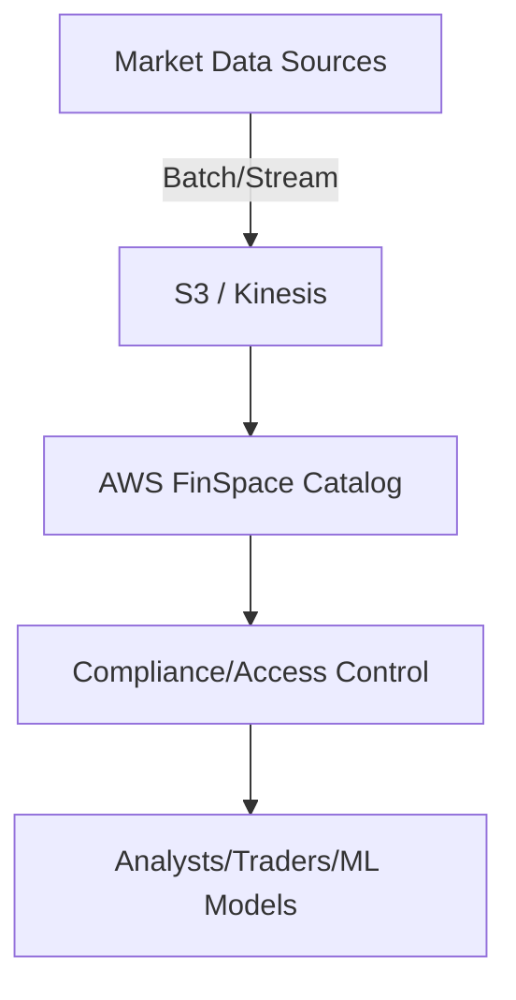
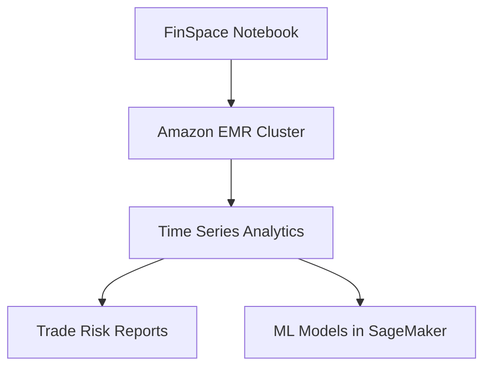
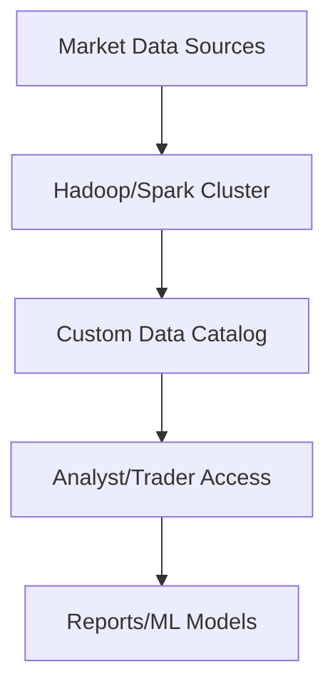

# FinSpace

## AWS FinSpace

## 🚀 AWS FinSpace – Transforming Financial Data Analytics at Scale

### 🌟 Overview

AWS FinSpace is a **fully managed data management and analytics service** designed specifically for the **financial services industry**. It enables organizations like hedge funds, banks, insurance firms, and fintech startups to **aggregate, catalog, and analyze petabytes of financial data** efficiently, while meeting strict compliance requirements. Unlike generic data platforms, FinSpace comes with **industry-specific data models, analytics libraries, and compliance controls** built-in, reducing what typically takes months of infrastructure work down to days or hours.

<figure><figcaption></figcaption></figure>

**🤖 Innovation Spotlight:** FinSpace integrates with **machine learning (Amazon SageMaker)** and **real-time data ingestion (Kinesis, MSK)**, allowing firms to perform **risk analysis, fraud detection, and ESG (Environmental, Social, Governance) investment analytics** seamlessly.

***

### ⚡ Problem Statement

Financial firms handle **massive volumes of market, trade, and reference data**. Challenges include:

* Data silos across trading desks and compliance teams.
* Complex regulations (SEC, MiFID II, GDPR).
* High compute needs for **Monte Carlo simulations, backtesting, and fraud detection**.

#### Example Scenario

A **hedge fund** needs to analyze **20 years of historical tick data** (petabytes in size) to build and validate a new algorithmic trading strategy. Doing this on-premises is **slow, expensive, and difficult to scale**.

***

### 🤝 Business Use Cases

* **Risk Management:** Stress testing across millions of positions.
* **Fraud Detection:** Real-time transaction monitoring with ML.
* **Trading Analytics:** Backtesting and performance analysis.
* **Regulatory Compliance:** Centralized catalog with audit trails.
* **ESG Analytics:** Processing alternative datasets (e.g., climate, social impact).

***

### 🔥 Core Principles

* **Time Series Data Management** – Store, catalog, and index financial data efficiently.
* **Data Catalog & Search** – Metadata-driven discovery of datasets.
* **Compute Scaling with Spark Clusters** – Built-in Jupyter notebooks powered by Amazon EMR.
* **Compliance & Governance** – Fine-grained data access controls, encryption, audit logging.

***

### 📋 Pre-Requirements

* **AWS FinSpace** – Core service for data management.
* **Amazon S3** – Storage for raw & curated datasets.
* **Amazon EMR / FinSpace Clusters** – For scalable computation.
* **AWS IAM** – Role-based access control.
* **Amazon SageMaker (optional)** – For ML-driven analytics.

***

### 👣 Implementation Steps

1. **Set up a FinSpace Environment** via AWS Console.
2. **Ingest datasets** into FinSpace from S3, Kinesis, or on-premises.
3. **Define metadata catalog** with dataset classification and permissions.
4. **Launch a FinSpace Notebook** (Spark/Jupyter environment).
5. **Run analytics** (time series analysis, Monte Carlo, ML).
6. **Share insights** securely with analysts, traders, or compliance officers.

***

### 🗺️ Data Flow Diagrams

#### 1. Ingestion & Cataloging

#### 2. Analytics Workflow

***

### 🔒 Security Measures

* **IAM fine-grained policies** per user/team.
* **Encryption at rest (KMS)** and **in transit (TLS)**.
* **Audit logs** with AWS CloudTrail.
* **VPC isolation** for EMR clusters.
* **Data masking** for PII compliance.

***

### ⚖️ When to Use vs When Not to Use

✅ **When to Use:**

* Large-scale **financial data analytics**.
* Need for **regulatory compliance and auditability**.
* Firms adopting **quantitative trading & ML-driven insights**.

❌ **When Not to Use:**

* Small firms with minimal data (cheaper to use Athena/Redshift).
* Non-financial industries (unless adapted).
* Workloads that don’t require compliance-heavy infrastructure.

***

### 💰 Costing Calculation

* **FinSpace Environment**: Charged per active cluster-hour.
* **Storage**: S3 costs for raw and processed data.
* **Compute**: EMR cluster usage per vCPU-hour.

💡 **Cost Optimization Tips:**

* Shut down idle clusters.
* Use spot instances in EMR.
* Archive old datasets in **S3 Glacier**.

**Example:** If a hedge fund runs a **10-node EMR cluster (4 vCPUs each) for 5 hours**: `10 × 4 × 5 × $0.052 = $10.40` approx.

***

### 🧩 Alternatives

| Feature               | AWS FinSpace    | AWS Athena/Redshift | Azure Synapse | GCP BigQuery | On-Prem (Hadoop/Spark) |
| --------------------- | --------------- | ------------------- | ------------- | ------------ | ---------------------- |
| Industry-Specific     | ✅ Yes (Finance) | ❌ No                | ❌ No          | ❌ No         | ❌ No                   |
| Time Series Analytics | ✅ Built-in      | ❌ Limited           | ❌ Limited     | ❌ Limited    | ⚠️ Custom              |
| Compliance Controls   | ✅ Yes           | ❌ Manual            | ⚠️ Add-ons    | ⚠️ Add-ons   | ⚠️ Manual              |
| Setup Time            | Hours           | Days                | Days          | Days         | Weeks/Months           |
| Cost Efficiency       | High            | Medium              | Medium        | Medium       | Low (infra heavy)      |

#### On-Premises Data Flow

***

### ✅ Benefits

* **Faster analytics** – reduces months of setup to hours.
* **Built-in compliance** – audit-ready architecture.
* **Petabyte-scale handling** – optimized for financial datasets.
* **Integration with ML** – advanced predictive insights.
* **Reduced TCO** – no infra management overhead.

***

### 📝 Summary

AWS FinSpace is a **specialized analytics platform** for the financial industry. It simplifies **data ingestion, cataloging, governance, and scalable analytics**, while ensuring **compliance and auditability**. It is best suited for **trading firms, banks, and insurers** that rely on **large-scale time series and market data analysis**.

**Top 5 Key Points:**

1. Purpose-built for **financial services analytics**.
2. Handles **petabyte-scale time series data**.
3. Provides **compliance-ready governance**.
4. Integrated with **EMR, SageMaker, and S3**.
5. Reduces setup time from **months to hours**.

***

### 🔗 Related Topics

* [AWS FinSpace Documentation](https://docs.aws.amazon.com/finspace/)
* [Amazon EMR](https://aws.amazon.com/emr/)
* [AWS SageMaker](https://aws.amazon.com/sagemaker/)
* [Financial Services on AWS](https://aws.amazon.com/financial-services/)

***
