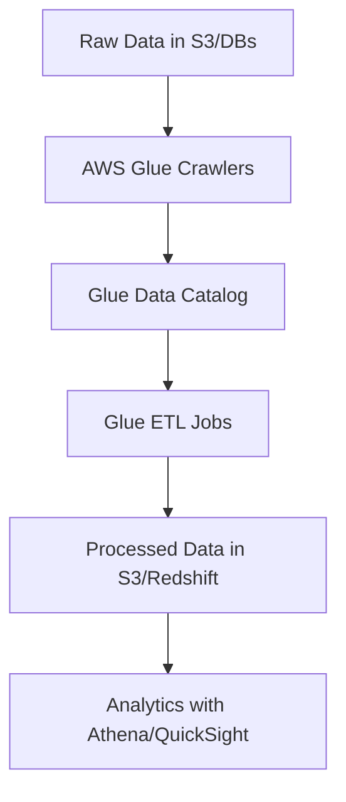
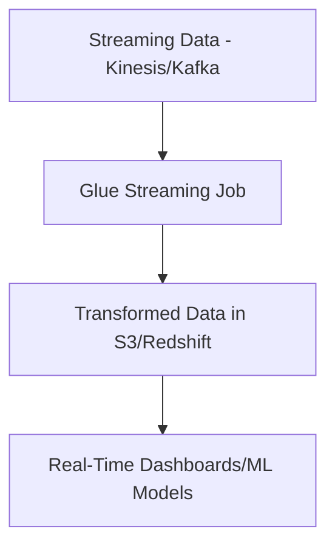
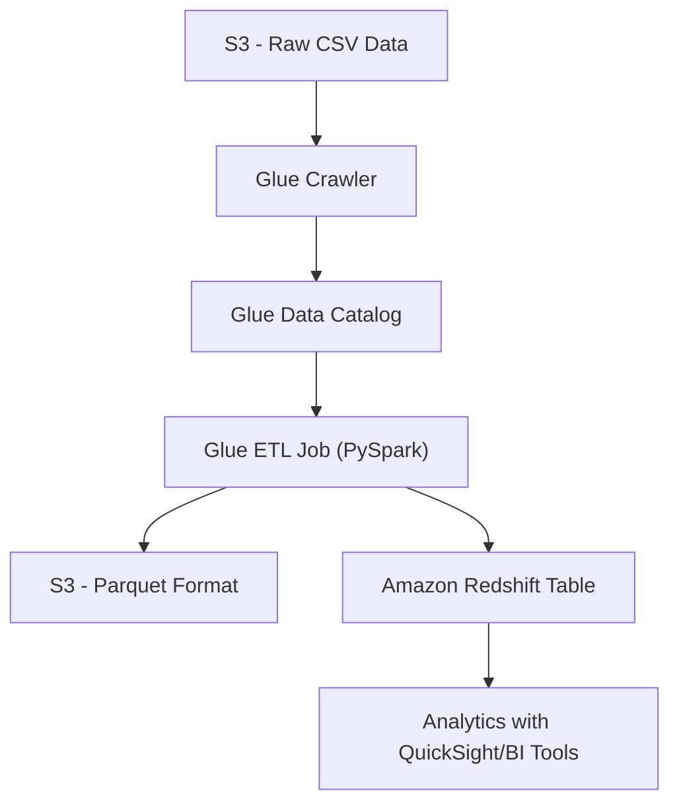

# Glue

## AWS Glue

## 🛠️ AWS Glue – Serverless Data Integration for Modern Analytics

### 🌟 Overview

AWS Glue is a **serverless data integration and ETL (Extract, Transform, Load) service** that helps organizations **discover, prepare, and combine data** for analytics, ML, and application development. It eliminates the heavy lifting of **managing ETL servers**, scaling jobs, and handling data schema evolution.

<figure><figcaption></figcaption></figure>

With Glue, you can:

* **Catalog** data across S3, RDS, Redshift, DynamoDB, etc.
* **Transform data** using serverless Spark jobs.
* **Run streaming ETL** for near real-time pipelines.
* **Integrate with ML** for data preparation (via Glue DataBrew & SageMaker).

**🤖 Innovation Spotlight:** AWS Glue Studio & Glue DataBrew provide a **visual interface** to build and monitor pipelines without writing complex code, democratizing ETL for both engineers and analysts.

***

### ⚡ Problem Statement

Enterprises struggle with **scattered data silos** across on-premises databases, cloud storage, SaaS applications, and logs. Preparing this data for **analytics, AI/ML, or BI dashboards** often requires **custom ETL pipelines** that are costly and time-consuming.

#### Example Scenario

A **retail company** collects sales data from **POS systems (SQL DBs)**, **e-commerce platforms (S3 logs)**, and **customer feedback (DynamoDB)**. To generate **real-time sales dashboards** and feed ML models for demand forecasting, they need a **scalable ETL pipeline**—this is where Glue fits.

***

### 🤝 Business Use Cases

* **Data Lake Ingestion** – Ingest structured & unstructured data into S3.
* **Data Warehouse ETL** – Prepare and load data into Amazon Redshift.
* **Machine Learning** – Feature engineering and dataset preparation.
* **Streaming Analytics** – Real-time log & clickstream processing.
* **Compliance & Governance** – Metadata cataloging and lineage.

***

### 🔥 Core Principles

* **AWS Glue Data Catalog** – Central metadata repository for all datasets.
* **Glue Jobs** – Serverless Spark jobs to transform data.
* **Glue Crawlers** – Automatically detect schema & partitions in raw data.
* **Glue Studio** – Low-code visual ETL workflow builder.
* **Glue DataBrew** – Data preparation with 250+ built-in transformations.
* **Glue Streaming** – Near real-time ETL for Kafka/Kinesis streams.

***

### 📋 Pre-Requirements

* **Amazon S3** – For storing raw and processed data.
* **AWS IAM** – Permissions for Glue to access other services.
* **Amazon Redshift/Athena** – To query transformed data.
* **Kinesis / MSK (optional)** – For streaming data.
* **SageMaker (optional)** – For ML integration.

***

### 👣 Implementation Steps

1. **Create a Data Catalog** with AWS Glue.
2. **Run Crawlers** to automatically infer schema from raw data sources.
3. **Create ETL Jobs** (Python/Scala Spark scripts or Glue Studio visual jobs).
4. **Transform Data** (e.g., cleansing, joins, aggregations).
5. **Load Transformed Data** into S3, Redshift, or RDS.
6. **Query Data** using Athena/Redshift or feed into ML pipelines.

***

### 🗺️ Data Flow Diagrams

#### 1. Batch ETL with Glue



#### 2. Streaming ETL with Glue



***

### 🔒 Security Measures

* **IAM Role Isolation** – Separate roles for Glue jobs and crawlers.
* **Encryption** – S3 bucket encryption (KMS), job bookmark encryption.
* **VPC Endpoints** – For private Glue job execution.
* **Audit Logging** – CloudTrail logs for compliance.
* **Row/Column Security** – Via Lake Formation integration.

***

### ⚖️ When to Use vs When Not to Use

✅ **When to Use:**

* Data lake ETL pipelines.
* Metadata catalog across AWS services.
* Need serverless, auto-scaling Spark jobs.
* Streaming & batch data integration.

❌ **When Not to Use:**

* Very simple transformations (Athena SQL or Lambda may be enough).
* Real-time <1s latency workloads (use Kinesis Analytics).
* Legacy ETL pipelines tightly coupled to on-prem infrastructure.

***

### 💰 Costing Calculation

* **Data Catalog**: $1 per 100,000 objects/month.
* **Crawlers**: Per Data Processing Unit (DPU)-hour.
* **ETL Jobs**: $0.44 per DPU-hour.
* **Streaming ETL**: $0.44 per DPU-hour (billed per second).

💡 **Optimization Tips:**

* Use **job bookmarks** to avoid reprocessing old data.
* Auto-stop idle jobs.
* Compress data with **Parquet/ORC**.

**Example:** ETL job with **2 DPUs running for 30 minutes** → `2 × 0.5 × $0.44 = $0.44`.

***

### 🧩 Alternatives

| Feature            | AWS Glue    | AWS Data Pipeline | Azure Data Factory | GCP Dataflow | On-Prem (Informatica/Talend) |
| ------------------ | ----------- | ----------------- | ------------------ | ------------ | ---------------------------- |
| Serverless         | ✅ Yes       | ❌ No              | ❌ No               | ✅ Yes        | ❌ No                         |
| Auto Schema Detect | ✅ Yes       | ❌ No              | ✅ Yes              | ✅ Yes        | ⚠️ Partial                   |
| Streaming ETL      | ✅ Yes       | ❌ No              | ✅ Yes              | ✅ Yes        | ⚠️ Limited                   |
| Pricing Model      | Pay-per-use | Fixed infra       | Pay-per-use        | Pay-per-use  | License + Infra              |
| ML Integration     | ✅ Yes       | ❌ No              | ⚠️ Add-ons         | ✅ Yes        | ⚠️ Custom                    |

***

### ✅ Benefits

* **Fully serverless** – no infra to manage.
* **Flexible** – supports batch & streaming.
* **Cost-effective** – pay only for used compute.
* **Rich ecosystem** – integrates with S3, Redshift, Athena, SageMaker.
* **Democratized ETL** – visual tools (Studio, DataBrew).

***

### Now a rea-time Example of using Glue

Now lets see a **hands-on demo example** with AWS Glue, showing how to build a simple ETL pipeline.

We’ll use **AWS Glue Job Script (PySpark)** to transform&#x20;

**CSV data in S3 → Parquet format → load into Amazon Redshift**.

***

## 🧪 Hands-On Demo: Transform S3 Data with AWS Glue and Load into Redshift

### 📋 Pre-Requisites

* **Amazon S3** bucket with raw CSV data (e.g., `s3://my-retail-data/orders.csv`).
* **AWS Glue Data Catalog** set up.
* **Amazon Redshift cluster** (with a schema/table created).
* **IAM Role** for Glue with permissions to S3, Redshift, and Glue Catalog.

***

### 👣 Steps

#### Step 1: Create a Glue Crawler

1. Go to **AWS Glue Console → Crawlers**.
2. Add a new crawler pointing to your **S3 bucket**.
3. Configure the **Data Catalog Database** (e.g., `retail_db`).
4. Run the crawler → It creates a **table schema** in Glue Catalog.

***

#### Step 2: Create a Redshift Connection

1. In Glue Console → **Connections**.
2. Add a JDBC connection to your Redshift cluster.
3. Provide Redshift endpoint, port, username, and password.

***

#### Step 3: Create a Glue ETL Job

1. Go to **Jobs → Add Job**.
2. Choose **Spark (Python)**.
3. Attach IAM role & Redshift connection.
4. Use the script below.

***

#### Step 4: Glue ETL Script (PySpark)

```python
import sys
from awsglue.transforms import *
from awsglue.utils import getResolvedOptions
from pyspark.context import SparkContext
from awsglue.context import GlueContext
from awsglue.job import Job

# Glue context
args = getResolvedOptions(sys.argv, ['JOB_NAME'])
sc = SparkContext()
glueContext = GlueContext(sc)
spark = glueContext.spark_session
job = Job(glueContext)
job.init(args['JOB_NAME'], args)

# Step 1: Read CSV data from S3
datasource = glueContext.create_dynamic_frame.from_catalog(
    database="retail_db",
    table_name="orders_csv"
)

# Step 2: Transform - Convert to Parquet format
parquet_data = datasource.toDF()
parquet_data = parquet_data.withColumnRenamed("orderid", "order_id") \
                           .withColumnRenamed("customerid", "customer_id")

# Step 3: Write back to S3 as Parquet
parquet_data.write.mode("overwrite").parquet("s3://my-retail-data/orders_parquet/")

# Step 4: Load into Redshift
glueContext.write_dynamic_frame.from_jdbc_conf(
    frame=DynamicFrame.fromDF(parquet_data, glueContext, "orders_transformed"),
    catalog_connection="redshift-conn",
    connection_options={
        "dbtable": "public.orders",
        "database": "dev"
    },
    redshift_tmp_dir="s3://my-retail-data/temp/"
)

job.commit()
```

***

#### Step 5: Run & Validate

* Run the Glue Job.
* Verify **S3 Parquet data** in the target bucket.
* Run SQL in Redshift to confirm load:

```sql
SELECT COUNT(*) FROM public.orders;
```

***

### 🗺️ Demo Data Flow



***

### ✅ What You Learned

* How to **discover schema** using Glue Crawler.
* How to **transform CSV → Parquet** in Glue Job.
* How to **load transformed data into Redshift**.
* How Glue automates **scalable ETL** with minimal effort.

***

### 📝 Summary

AWS Glue is a **serverless data integration service** that automates the process of **discovering, cataloging, transforming, and loading data** into data lakes, warehouses, and ML models. It is best suited for **scalable, cloud-native ETL pipelines** where compliance, flexibility, and cost-efficiency matter.

**Top 5 Key Points:**

1. Serverless ETL with **auto-scaling Spark jobs**.
2. Centralized **Data Catalog** across AWS services.
3. Supports **batch & streaming** workloads.
4. Cost-efficient with **pay-per-use pricing**.
5. Easy to use with **Glue Studio & DataBrew**.


***

### 🔗 Related Topics

* [AWS Glue Documentation](https://docs.aws.amazon.com/glue/)
* [AWS Lake Formation](https://aws.amazon.com/lake-formation/)
* [Amazon Athena](https://aws.amazon.com/athena/)
* [Amazon Redshift](https://aws.amazon.com/redshift/)

***
