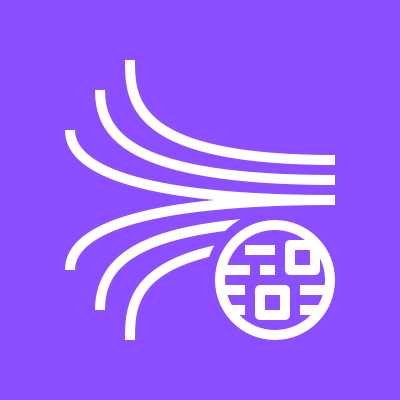
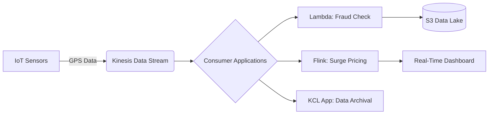
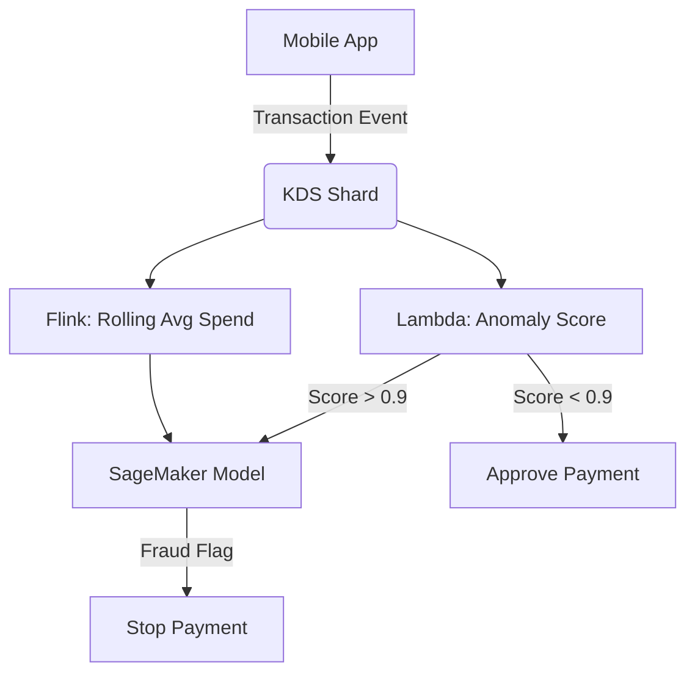
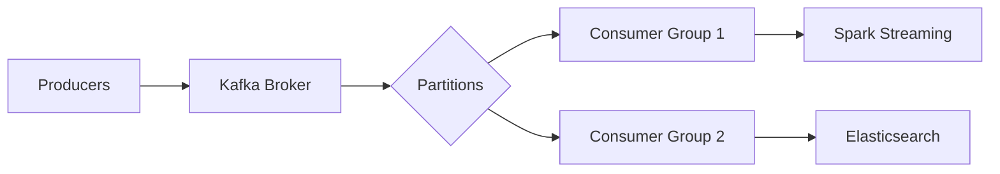

# Kinesis DataStream

## Kinesis Data Streams

## 🌟 Amazon Kinesis Data Streams: Real-Time Data Firehose Engine

### 1. 🌟 Overview

**Amazon Kinesis Data Streams (KDS)** is AWS's fully managed service for **ingesting, processing, and analyzing real-time streaming data at massive scale** (terabytes/hour). Unlike batch processing, KDS captures data _as it happens_ from sources like IoT sensors, clickstreams, logs, and financial transactions. Data is organized into **shards** (parallel data pipes), with each shard supporting **1 MB/s input and 2 MB/s output**. Key innovation: **Server-Side Encryption with AWS KMS keys is now DEFAULT** (2024), eliminating manual configuration for compliance.

<figure><figcaption></figcaption></figure>

**Innovation Spotlight (2024):** **Kinesis + Amazon Managed Service for Apache Flink** enables **zero-ETL streaming analytics**. Process data _in-flight_ (e.g., fraud detection in <100ms) without managing servers. Example: Capital One uses this to analyze 1M+ transactions/sec for real-time fraud prevention.

***

### 2. ⚡ Problem Statement

**Real-World Scenario:** A ride-sharing company (e.g., Uber) needs to:

* Track 500K+ vehicles' GPS coordinates/sec
* Detect surge pricing zones in <1 second
* Prevent fake ride requests via real-time fraud scoring

**Industries/Applications:**

* 🚕 **Transportation**: Real-time fleet optimization (Lyft)
* 💰 **Finance**: Fraud detection (Stripe, PayPal)
* 📱 **Gaming**: Live leaderboards & cheat detection (Fortnite)

#### 2.1 🤝 Business Use Cases

* **Dynamic Pricing Engine**: Process location data to adjust prices during high demand
* **IoT Telemetry**: Monitor industrial equipment sensors for predictive maintenance
* **Clickstream Analytics**: Personalize user experience based on live browsing behavior

***

### 3. 🔥 Core Principles

| Term                      | Explanation                                                                                             |
| ------------------------- | ------------------------------------------------------------------------------------------------------- |
| **Shard**                 | Basic throughput unit (1MB/s input, 2MB/s output). Auto-scaling adjusts shards based on traffic.        |
| **Data Record**           | Unit of data (max 1MB) ingested via `PutRecord`/`PutRecords`. Contains partition key (e.g., `user_id`). |
| **Retention Period**      | Data stored 24h–365d (vs. 7d default). Critical for replayability during failures.                      |
| **Enhanced Fan-Out**      | Dedicated 2MB/s throughput per consumer (no sharing). Ideal for low-latency apps.                       |
| **Consumer Applications** | Apps reading data (e.g., Lambda, Flink, KCL). Use **shard iterators** to track position.                |

**Foundational Concepts:**

* **Event-Driven Architecture**: Producers push data → KDS buffers → Consumers process
* **At-Least-Once Delivery**: Data guaranteed to be delivered (requires idempotent consumers)
* **Horizontal Scalability**: Add shards to increase throughput (no downtime)

***

### 4. 📋 Pre-Requirements

| Service/Tool                     | Purpose                                                                  |
| -------------------------------- | ------------------------------------------------------------------------ |
| **IAM Roles**                    | Grant permissions to producers (e.g., `kinesis:PutRecord`) and consumers |
| **CloudWatch Logs**              | Monitor `IncomingBytes`, `IteratorAgeMilliseconds`                       |
| **Kinesis Client Library (KCL)** | Manages shard leasing/checkpointing for Java/.NET apps                   |
| **Amazon S3**                    | Store processed data for long-term analytics (via Lambda)                |
| **AWS SDK**                      | For custom producers (Python/Boto3, Java)                                |

***

### 5. 👣 Implementation Steps

1.  **Create Stream**:

    ```bash
    aws kinesis create-stream --stream-name ride-data --shard-count 2  
    ```
2. **Enable Auto-Scaling**:
   * Set target utilization to 60% (CloudWatch → Auto Scaling)
3.  **Produce Data**:

    ```python
    import boto3  
    kinesis = boto3.client('kinesis')  
    kinesis.put_record(StreamName='ride-data', Data=json.dumps(event), PartitionKey='vehicle_id')  
    ```
4. **Consume with Lambda**:
   * Configure Lambda trigger → Set batch size (100 records), starting position (TRIM\_HORIZON)
5. **Process in Flink**:
   * Use Amazon Managed Service for Apache Flink → Connect to KDS as source → Apply windowed aggregations

***

### 6. 🗺️ Data Flow Diagrams

#### Diagram 1: Core Architecture



#### Diagram 2: Fraud Detection Use Case



***

### 7. 🔒 Security Measures

* **Encryption**: Enable **KMS-SSE** (default since 2024) for data at rest
* **Network**: Restrict access via VPC endpoints (interface type)
* **IAM Policies**: Least privilege (e.g., `kinesis:DescribeStream` only for analysts)
* **Audit**: CloudTrail logs for `PutRecord`/`GetRecords` API calls
* **Data Protection**: Use **record-level encryption** for PII (client-side)

***

### 8. 🚀 Innovation Spotlight: Real-Time Feature Engineering

**Kinesis + SageMaker Feature Store** creates **live ML features**:

1. KDS ingests raw clickstream data
2. Flink computes `user_session_duration` in 10-sec windows
3. Feature Store updates `click_rate` feature in <500ms\
   &#xNAN;_&#x55;sed by Netflix for real-time recommendation tuning._

***

### 9. ⚖️ When to Use vs. Avoid

| ✅ **When to Use**                                    | ❌ **When Not to Use**                        |
| ---------------------------------------------------- | -------------------------------------------- |
| >100K events/sec ingestion                           | <100 events/sec (use SQS)                    |
| Real-time processing needs (<1s latency)             | Batch processing (use Kinesis Firehose → S3) |
| Multiple consumers needed (e.g., analytics + alerts) | Simple pub/sub (use SNS/SQS)                 |
| Data replay required (7d–365d retention)             | Message ordering critical (use SQS FIFO)     |

***

### 10. 💰 Costing Calculation

**Pricing Model**:

* **Shard Hours**: $0.015/shard-hour (us-east-1)
* **PUT Payload Units**: $0.014 per million (1 unit = 25KB)
* **Enhanced Fan-Out**: $0.0225/shard-hour/consumer

**Sample Calculation** (100K records/sec, 5KB avg):

* **Shards needed**: 100K records × 5KB = 500MB/s → **500 shards** (500 × $0.015 = **$7.50/hour**)
* **PUT Units**: 500MB/s = 20,000 PUT units/sec → **$0.28/hour**
* **Total**: \~$7.78/hour ($5,601/month)

**Optimization Tips**:

* Use **on-demand mode** for spiky traffic (no shard planning)
* **Aggregate records** (KPL) to reduce PUT units by 75%
* Scale down shards during off-peak hours

***

### 11. 🧩 Alternative Services Comparison

| Service                      | Throughput      | Latency | Best For                    |
| ---------------------------- | --------------- | ------- | --------------------------- |
| **AWS Kinesis Data Streams** | 1MB/s per shard | <100ms  | Custom real-time apps       |
| **Azure Event Hubs**         | 1MB/s per TU    | \~100ms | Azure ecosystem integration |
| **GCP Pub/Sub**              | Auto-scaled     | \~100ms | Global, serverless pub/sub  |
| **Apache Kafka (on EC2)**    | Configurable    | <10ms   | Full control, open-source   |

**On-Prem Alternative (Kafka)**:



***

### 12. ✅ Benefits

* **Scalability**: Handle 1 → 1M+ records/sec with auto-scaling
* **Fault Tolerance**: 99.999999999% durability (3x replication)
* **Cost Efficiency**: Pay only for active shards (vs. over-provisioned Kafka clusters)
* **Ecosystem Integration**: Native links to Lambda, Flink, Redshift, SageMaker
* **Zero Maintenance**: AWS manages patching, scaling, monitoring

***

### 13. 🌐 Innovation Spotlight: Predictive Auto-Scaling with ML

**Kinesis + SageMaker Autopilot** predicts traffic spikes:

1. Historical shard utilization → SageMaker model
2. Model triggers auto-scaling 5 mins _before_ peak demand\
   &#xNAN;_&#x52;esult: 40% cost reduction vs. manual scaling (proven by AWS customer)_

***

### 14. 📝 Summary

**Top 5 Key Takeaways**:

1. **Shards = Throughput Units**: Scale by adjusting shard count (not instance size)
2. **Retention ≠ Processing Time**: Data stays 24h–365d, but consumers must read within retention window
3. **Enhanced Fan-Out = Low Latency**: Mandatory for sub-second processing (costs extra)
4. **Replayability is Free**: Re-process data after fixing consumer bugs
5. **KPL Aggregation Saves 75% Costs**: Bundle small records client-side

**5-Line Essence**:

> Kinesis Data Streams ingests high-velocity data into scalable shards. Consumers process events in real-time with millisecond latency. Auto-scaling handles traffic spikes while KMS encryption secures data by default. Ideal for fraud detection, IoT telemetry, and live analytics. Cost-optimized via on-demand mode and record aggregation.

***

### 15. 🔗 Related Topics

* [Kinesis Data Streams vs. Firehose](https://aws.amazon.com/kinesis/data-streams/faqs/)
* [Real-Time Fraud Detection Reference Architecture](https://docs.aws.amazon.com/solutions/latest/fraud-detection-using-machine-learning/welcome.html)
* [Kinesis Auto-Scaling Best Practices](https://aws.amazon.com/blogs/big-data/scaling-amazon-kinesis-data-streams-with-aws-application-auto-scaling/)
* [Serverless Streaming with Lambda](https://aws.amazon.com/blogs/compute/new-for-aws-lambda-processing-streams-with-extended-batching-windows/)
* [Kinesis Data Streams Pricing Calculator](https://calculator.aws/#/addService/Kinesis)

> 🛠️ **Pro Tip**: Always start with **on-demand mode** for new streams—switch to provisioned only after traffic patterns stabilize!
