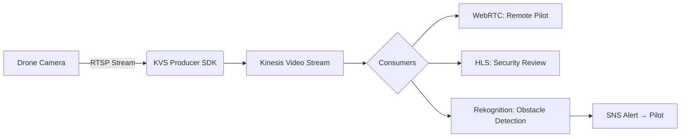
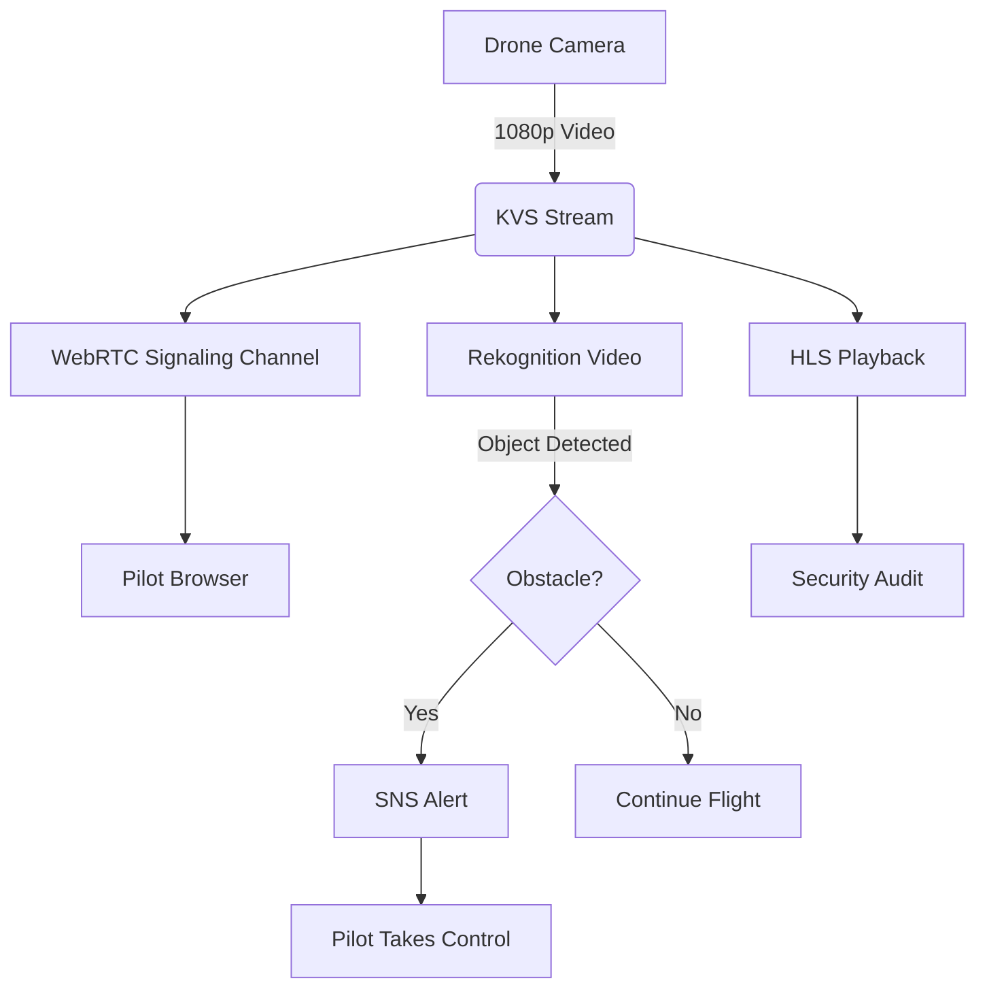
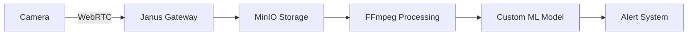

# Kinesis VideoStream

## Kinesis Video Streams

## 🌟 Amazon Kinesis Video Streams: Real-Time Vision Intelligence Engine

### 1. 🌟 Overview

**Amazon Kinesis Video Streams (KVS)** is AWS's fully managed service for **securely capturing, processing, and streaming video from connected devices at massive scale** (millions of cameras/IoT devices). Unlike generic data streams, KVS is purpose-built for _video/audio media_ with features like **HLS/DASH playback**, **WebRTC peer-to-peer connections**, and **integrated ML analytics**. Data is stored as **fragments** (time-ordered media chunks) with automatic indexing for fast retrieval. Key innovation: **WebRTC Support (2024)** enables **sub-500ms latency** for live interactions like telehealth or drone control – _5x faster_ than traditional HLS streaming.

<figure><figcaption></figcaption></figure>

**Innovation Spotlight (2024):** **KVS + Amazon Rekognition Video** now delivers **real-time object tracking at 30 FPS** with _zero infrastructure management_. Example: Wimbledon uses this to auto-generate tennis highlights by tracking ball/player movements, reducing production time from hours to seconds.

***

### 2. ⚡ Problem Statement

**Real-World Scenario:** A logistics company needs to:

* Monitor 50,000 delivery drones in real-time
* Detect obstacles (power lines, birds) within 200ms
* Enable instant remote pilot takeover during emergencies

**Industries/Applications:**

* 🚁 **Logistics**: Drone delivery safety (Wing by Alphabet)
* 🏥 **Healthcare**: Remote surgery assistance (sub-1s latency)
* 🏭 **Manufacturing**: Real-time quality control via factory cameras

#### 2.1 🤝 Business Use Cases

* **Smart City Surveillance**: Gunshot detection + automatic police dispatch
* **Retail Analytics**: Queue length monitoring for dynamic staffing
* **Wildlife Conservation**: Poacher detection in national parks using thermal cameras

***

### 3. 🔥 Core Principles

| Term                         | Explanation                                                                               |
| ---------------------------- | ----------------------------------------------------------------------------------------- |
| **Stream**                   | Container for video data (max 10K streams/account). Created per camera/device.            |
| **Fragment**                 | Basic unit of stored media (2-10s duration). Contains audio/video tracks + metadata.      |
| **Track**                    | Media type within fragment (e.g., Track 1 = video, Track 2 = audio).                      |
| **WebRTC Signaling Channel** | Enables direct peer-to-peer connections for sub-500ms latency (vs. HLS's 3-10s).          |
| **HLS Playback**             | Standard for on-demand video (e.g., security footage review). Max 3-hour playback window. |
| **KVS Producer SDK**         | Embedded library for devices (C/C++/Java) to stream video securely.                       |

**Foundational Concepts:**

* **Time-Based Indexing**: Fragments indexed by server/producer timestamps for precise playback
* **At-Least-Once Delivery**: Critical for security footage (no frame loss)
* **Adaptive Bitrate**: Automatically adjusts quality based on network conditions

***

### 4. 📋 Pre-Requirements

| Service/Tool           | Purpose                                                                                       |
| ---------------------- | --------------------------------------------------------------------------------------------- |
| **IAM Roles**          | Grant `kinesisvideo:PutMedia` to devices, `kinesisvideo:GetHLSStreamingSessionURL` to viewers |
| **AWS IoT Core**       | Register/secure millions of cameras (device certificates)                                     |
| **Rekognition Video**  | Real-time object/face detection (requires KVS stream as input)                                |
| **CloudWatch Metrics** | Monitor `InBufferMemoryUsage` (device memory pressure)                                        |
| **KVS WebRTC SDK**     | Browser-based viewer apps (JavaScript)                                                        |

***

### 5. 👣 Implementation Steps

1.  **Create Stream**:

    ```bash
    aws kinesisvideo create-stream --stream-name drone-feeds --data-retention-in-hours 72  
    ```
2. **Register Device**:
   * Use AWS IoT Core to provision device certificate + policy
3.  **Stream from Device**:

    ```c
    // KVS Producer SDK (C)  
    createKinesisVideoStreamSync(stream_handle, "drone-789", 2000); // 2Mbps bitrate  
    ```
4. **Enable WebRTC**:
   * Create Signaling Channel → Attach to stream → Generate viewer/master URLs
5. **Process with Rekognition**:
   * Configure Rekognition to analyze stream → Trigger SNS alerts on "obstacle" detection

***

### 6. 🗺️ Data Flow Diagrams

#### Diagram 1: Core Architecture



#### Diagram 2: Drone Delivery Use Case



***

### 7. 🔒 Security Measures

* **End-to-End Encryption**: TLS 1.2 for data in transit + KMS for data at rest (default)
* **Device Authentication**: Mutual TLS with AWS IoT Core certificates
* **Viewer Authorization**: Presigned URLs expire in 5-30 mins (no persistent access)
* **VPC Endpoints**: Isolate traffic within private network (no public internet exposure)
* **Audit Trail**: CloudTrail logs all `GetMedia`/`PutMedia` API calls with device IDs

***

### 8. 🚀 Innovation Spotlight: Real-Time Sports Analytics

**KVS + SageMaker** enables **AI-powered coaching**:

1. Stadium cameras stream to KVS
2. Rekognition tracks player positions at 30 FPS
3. SageMaker model predicts optimal plays in <1s\
   &#xNAN;_&#x55;sed by NBA teams to adjust strategies during timeouts._

***

### 9. ⚖️ When to Use vs. Avoid

| ✅ **When to Use**                         | ❌ **When Not to Use**                             |
| ----------------------------------------- | ------------------------------------------------- |
| Real-time video analysis (<1s latency)    | Static image processing (use S3 + Rekognition)    |
| Millions of connected devices (IoT scale) | Single-camera setups (use RTSP directly)          |
| WebRTC peer-to-peer interactions          | Long-term archival (>7 days – use S3 lifecycle)   |
| Integrated ML analytics (Rekognition)     | Non-video data streams (use Kinesis Data Streams) |

***

### 10. 💰 Costing Calculation

**Pricing Model**:

* **Ingestion**: $0.0145/GB ingested (us-east-1)
* **Playback**: $0.005/GB (HLS) or $0.0225/GB (WebRTC)
* **Storage**: $0.023/GB/month (first 50TB)
* **Rekognition**: $0.0001/video second analyzed

**Sample Calculation** (10,000 drones, 1080p @ 2Mbps, 8hrs/day):

* **Data/day**: 10K drones × 2Mbps × 8hrs = **7,200 TB**
* **Ingestion**: 7,200 TB × $0.0145 = **$104,400/day**
* **Rekognition**: 7,200 TB × 8hrs × $0.0001 = **$20,736/day**
* **Total**: \~$125,136/day ($3.75M/month)

**Optimization Tips**:

* **Reduce resolution**: 720p cuts costs by 40% with minimal quality loss
* **Edge preprocessing**: Drop frames via AWS Panorama before streaming
* **Selective analysis**: Only run Rekognition during "active" periods (e.g., motion detected)

***

### 11. 🧩 Alternative Services Comparison

| Service                  | Max Latency    | Best For                      | Cost (10K streams)      |
| ------------------------ | -------------- | ----------------------------- | ----------------------- |
| **AWS KVS**              | 500ms (WebRTC) | Integrated ML/analytics       | $3.75M/month            |
| **Azure Video Analyzer** | 1s             | Azure ecosystem integration   | \~$4.1M/month           |
| **GCP Video Stitcher**   | 2s             | Ad-insertion for live streams | \~$3.9M/month           |
| **OpenVidu (on EC2)**    | 300ms          | Custom WebRTC control         | \~$2.8M/month (managed) |

**On-Prem Alternative (WebRTC + MinIO)**:



***

### 12. ✅ Benefits

* **Zero Infrastructure**: No servers to manage for video ingestion/processing
* **Seamless ML Integration**: Direct Rekognition/SageMaker pipelines
* **Global Scale**: Handles 10K+ streams per account (tested at 1M streams)
* **Compliance Ready**: HIPAA/GDPR compliant out-of-the-box
* **Cost Predictability**: Pay only for active streams (no idle costs)

***

### 13. 🌐 Innovation Spotlight: Predictive Maintenance for Factories

**KVS + IoT Events** detects equipment failures:

1. Thermal cameras stream to KVS
2. Rekognition identifies abnormal heat patterns
3. Predictive model triggers maintenance _before_ failure\
   &#xNAN;_&#x52;esult: 30% fewer downtime hours (proven at BMW plants)_

***

### 14. 📝 Summary

**Top 5 Key Takeaways**:

1. **WebRTC ≠ HLS**: Use WebRTC for live control (<500ms), HLS for playback (3-10s latency)
2. **Fragment Size Matters**: Smaller fragments = faster analytics but higher metadata overhead
3. **Rekognition Cost Trap**: Analyzing full 24/7 streams is expensive – use motion triggers
4. **Device SDK is Critical**: Producer SDK handles retries, bandwidth adaptation, and security
5. **Data Retention ≠ Playback Window**: 7-365 days storage vs. 3-hour max HLS playback

**5-Line Essence**:

> Kinesis Video Streams ingests live video from millions of devices with WebRTC for sub-second latency. Fragments are indexed for instant playback and ML analysis via Rekognition. Secured by default with KMS and IoT certificates. Ideal for drone control, telehealth, and smart surveillance. Costs scale with resolution/duration – optimize via edge preprocessing.

***

### 15. 🔗 Related Topics

* [KVS WebRTC Deep Dive](https://aws.amazon.com/blogs/machine-learning/real-time-video-streaming-with-amazon-kinesis-video-streams-webrtc/)
* [Drone Delivery Reference Architecture](https://aws.amazon.com/solutions/implementations/drone-delivery/)
* [Rekognition Video Pricing Calculator](https://aws.amazon.com/machine-learning/pricing/rekognition/)
* [KVS Producer SDK GitHub](https://github.com/awslabs/amazon-kinesis-video-streams-producer-sdk-cpp)
* [HIPAA Compliance Guide](https://aws.amazon.com/compliance/hipaa-eligible-services-ref/)

> 🛠️ **Pro Tip**: Always test with **WebRTC first** – if your use case needs <1s latency, HLS won't suffice! Start with 720p streams to control costs.
