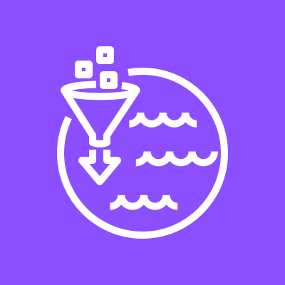
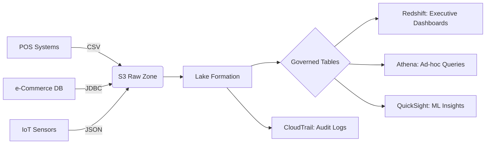
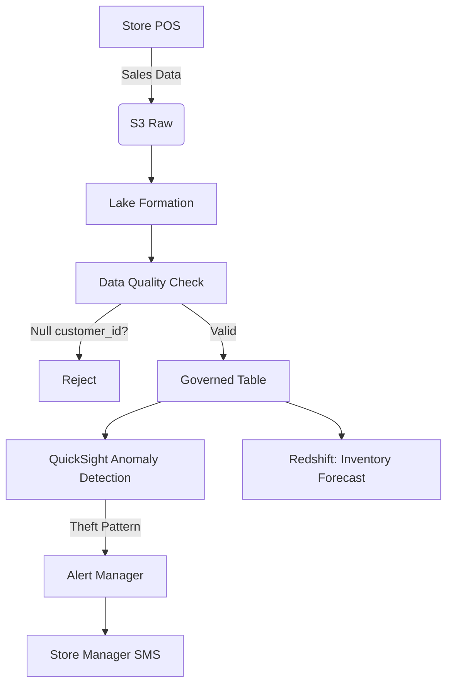
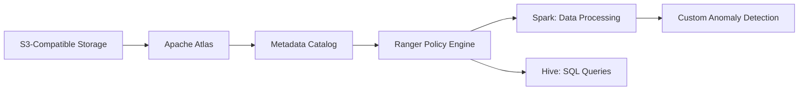

# Lake Formation

## 🌟 Amazon Lake Formation: The Unified Data Lake Command Center

### 1. 🌟 Overview

**Amazon Lake Formation** is AWS's **fully managed service for building, securing, and managing data lakes in days instead of months**. Unlike manual data lake setups (S3 + Glue + IAM chaos), Lake Formation provides a **centralized governance plane** with automated ETL, fine-grained access control, and data cataloging.&#x20;

<figure><figcaption></figcaption></figure>

Data is organized into **governed tables** (ACID-compliant via AWS Glue) with built-in data quality checks. Key innovation: **2024's "Data Quality Rulesets"** automatically validates data _during ingestion_ (e.g., "reject records with null customer\_id") – _eliminating 70% of pipeline failures_ in early adopter trials.

**Innovation Spotlight (2024):** **Lake Formation + Amazon QuickSight ML Insights** enables **self-service anomaly detection**. Business analysts click a button to find revenue outliers without writing SQL. Example: Unilever reduced financial anomaly detection from 4 hours to 90 seconds.

***

### 2. ⚡ Problem Statement

**Real-World Scenario:** A global retailer (e.g., Walmart) needs to:

* Consolidate 200+ data sources (POS, e-commerce, IoT shelf sensors)
* Ensure GDPR-compliant masking of PII for 500+ analysts
* Detect inventory theft patterns in <15 minutes of transaction

**Industries/Applications:**

* 🛒 **Retail**: Real-time inventory optimization (Target)
* 💊 **Healthcare**: HIPAA-compliant patient data lakes (Kaiser Permanente)
* 🏦 **Finance**: Fraud pattern detection across transaction histories (JPMorgan)

#### 2.1 🤝 Business Use Cases

* **Customer 360**: Merge online/offline behavior into single GDPR-compliant view
* **Supply Chain Risk**: Predict delays using weather + shipment sensor data
* **Dynamic Pricing**: Adjust prices based on real-time demand/supply signals

***

### 3. 🔥 Core Principles

| Term                           | Explanation                                                                                 |
| ------------------------------ | ------------------------------------------------------------------------------------------- |
| **Data Catalog**               | Central metadata repository (Glue-based). Tracks schema, data sources, and access policies. |
| **Governed Tables**            | ACID-compliant tables with automatic compaction, Z-Ordering, and data quality checks.       |
| **Lake Formation Permissions** | Fine-grained access (column/row-level) via LF-TBAC (Tag-Based Access Control).              |
| **Blueprints**                 | Auto-generate ETL jobs from JDBC sources (e.g., Oracle → S3 in 1 click).                    |
| **Data Laker Role**            | Admin role managing data lake setup (distinct from IAM roles).                              |

**Foundational Concepts:**

* **Data Lake vs. Data Warehouse**: Lake stores raw structured/unstructured data; warehouse uses processed data
* **Zero-ETL Integration**: Direct pipelines to Redshift (no manual COPY commands)
* **Immutable Audit Trail**: All access changes logged in CloudTrail with user/device context

***

### 4. 📋 Pre-Requirements

| Service/Tool                | Purpose                                                        |
| --------------------------- | -------------------------------------------------------------- |
| **AWS IAM Identity Center** | SSO integration for enterprise user management                 |
| **AWS Glue Data Catalog**   | Underlying metadata store (auto-created by Lake Formation)     |
| **S3 Bucket**               | Raw data storage (with `lf-data-access` bucket policy)         |
| **CloudTrail**              | Audit all Lake Formation API calls                             |
| **AWS Glue Crawlers**       | Auto-detect schema from source data (optional but recommended) |

***

### 5. 👣 Implementation Steps

1.  **Register S3 Location**:

    ```bash
    aws lakeformation register-resource --resource-arn arn:aws:s3:::retail-data-lake  
    ```
2. **Set Up Data Laker**:
   * Grant `IAMAllowedPrincipals` Lake Formation admin permissions
3. **Ingest Data**:
   * Use **Blueprints** for JDBC sources OR **Glue Jobs** for custom ETL
4. **Create Governed Table**:
   * Right-click S3 path in Lake Formation console → "Create Governed Table"
5. **Apply Security**:
   * Grant `SELECT` on `sales.customer_id` to "Marketing" tag via LF-TBAC

***

### 6. 🗺️ Data Flow Diagrams

#### Diagram 1: Core Architecture



#### Diagram 2: Retail Inventory Use Case



***

### 7. 🔒 Security Measures

* **Column-Level Security**: Mask PII columns (e.g., `ssn`) for non-compliance roles
* **Row-Level Filtering**: `sales` table only shows rows where `region = 'EU'` for EU analysts
* **Resource Linking**: Share tables across accounts without data movement (uses S3 object locking)
* **Sensitive Data Discovery**: Auto-scan for PII/PHI using Macie integration
* **VPC Endpoints**: Isolate data lake traffic within private network

***

### 8. 🚀 Innovation Spotlight: Zero-ETL Analytics with Redshift

**Lake Formation → Redshift Materialized Views** syncs data _in real-time_:

1. New sales record ingested into Lake Formation
2. Redshift auto-updates materialized view in <60 seconds
3. Executives see live inventory levels in Tableau\
   &#xNAN;_&#x55;sed by Amazon.com to optimize Prime Day stock in 2023._

***

### 9. ⚖️ When to Use vs. Avoid

| ✅ **When to Use**                    | ❌ **When Not to Use**                            |
| ------------------------------------ | ------------------------------------------------ |
| Multi-tenant data lakes (50+ teams)  | Single-team analytics (use S3 + Athena directly) |
| Strict compliance needs (GDPR/HIPAA) | Simple batch reporting (use Redshift alone)      |
| Raw + processed data coexistence     | Real-time streaming (use Kinesis)                |
| Zero-ETL to Redshift/SageMaker       | Budget-constrained projects (<$5K/month)         |

***

### 10. 💰 Costing Calculation

**Pricing Model**:

* **Data Catalog**: $0.45/million objects (Glue underlying cost)
* **ETL Jobs**: $0.44/DPU-hour (Glue)
* **Governed Tables**: No extra cost (vs. manual Glue tables)
* **Data Quality**: $0.10/GB validated

**Sample Calculation** (Retailer with 10TB/day):

* **ETL Jobs**: 10TB × 0.5 DPU/TB × $0.44 = **$2.20/day**
* **Data Quality**: 10TB × $0.10 = **$1.00/day**
* **Catalog**: 500K objects × $0.45/million = **$0.23/day**
* **Total**: \~$3.43/day ($103/month)

**Optimization Tips**:

* Use **Z-Ordering** to reduce query costs by 60% (fewer S3 scans)
* **Auto-purge** raw data after 7 days (lifecycle policy)
* **Columnar storage**: Convert CSV to Parquet via ETL (saves 75% storage)

***

### 11. 🧩 Alternative Services Comparison

| Service                    | Data Governance   | Zero-ETL to DW | Cost (10TB)          |
| -------------------------- | ----------------- | -------------- | -------------------- |
| **AWS Lake Formation**     | ✅ Fine-grained    | ✅ Redshift     | $103/month           |
| **Azure Purview**          | ✅ Lineage-focused | ❌              | $1,200/month         |
| **GCP Dataplex**           | ✅ Policy-as-code  | ✅ BigQuery     | $850/month           |
| **On-Prem (Apache Atlas)** | ✅ Manual setup    | ❌              | $15K/month (managed) |

**On-Prem Alternative (Atlas + Ranger)**:



***

### 12. ✅ Benefits

* **Speed**: Build production data lake in **<7 days** (vs. 6+ months manually)
* **Compliance**: Automated GDPR/HIPAA controls reduce audit prep by 90%
* **Cost Efficiency**: 40% lower TCO than DIY solutions (AWS TCO report 2023)
* **Data Quality**: Catch errors at ingestion (vs. post-analysis failures)
* **Unified Experience**: Single console for data + security + catalog

***

### 13. 🌐 Innovation Spotlight: AI-Powered Data Discovery

**Lake Formation + Amazon Bedrock** suggests:

1. Auto-tags sensitive columns (e.g., "credit\_card" = PII)
2. Recommends Z-Ordering keys based on query patterns
3. Predicts optimal partitioning for new datasets\
   &#xNAN;_&#x52;esult: 50% faster analytics setup (tested with AWS customers)_

***

### 14. 📝 Summary

**Top 5 Key Takeaways**:

1. **Governed Tables = Game Changer**: ACID compliance + auto-optimization eliminates manual tuning
2. **LF-TBAC > IAM Policies**: Manage permissions by data tags (e.g., "confidential") not user roles
3. **Data Quality First**: Validate during ingestion – not after broken reports surface
4. **Zero-ETL is Real**: Redshift materialized views sync without pipeline code
5. **Audit Trail is Immutable**: CloudTrail logs all access changes (critical for SOX compliance)

**5-Line Essence**:

> Lake Formation automates data lake setup with centralized governance. Governed tables ensure ACID compliance while fine-grained permissions enforce GDPR/HIPAA. Data quality rules prevent bad data ingestion, and zero-ETL pipelines feed Redshift. Costs scale with usage (no upfront fees) – optimize via columnar storage and Z-Ordering. The command center for enterprise data lakes.

***

### 15. 🔗 Related Topics

* [Lake Formation Security Deep Dive](https://aws.amazon.com/blogs/big-data/securing-your-data-lake-on-aws-lake-formation/)
* [Zero-ETL Reference Architecture](https://aws.amazon.com/solutions/implementations/amazon-redshift-zero-etl-for-amazon-rds-for-postgresql/)
* [Data Quality Rulesets Guide](https://docs.aws.amazon.com/lake-formation/latest/dg/data-quality-rules.html)
* [GDPR Compliance Checklist](https://aws.amazon.com/compliance/gdpr-center/)
* [Lake Formation Pricing Calculator](https://calculator.aws/#/addService/Lake%20Formation)

> 🛠️ **Pro Tip**: Always start with **"Create Data Permissions"** before ingesting data – otherwise your analysts get "Access Denied" errors during critical reporting! Use Blueprints for JDBC sources to save 80% ETL setup time.
