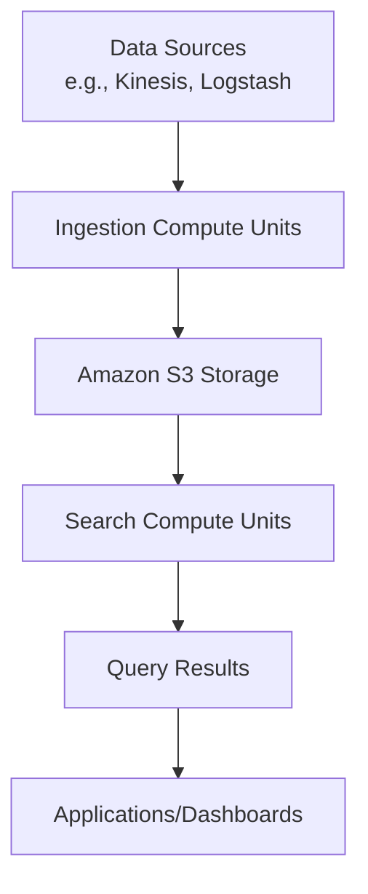

# OpenSearch Serverless

## OpenSearch Serverless

### 🌟 **Overview of Amazon OpenSearch Serverless**

Amazon OpenSearch Serverless is an on-demand, auto-scaling configuration for Amazon OpenSearch Service that simplifies deploying and running petabyte-scale search and analytics workloads without provisioning, managing, or scaling clusters.

<figure><figcaption></figcaption></figure>

It automatically scales compute resources based on application demand, ensuring high performance and cost-efficiency. OpenSearch Serverless uses the same core components as the open-source OpenSearch project, including a distributed search engine and visualization tools like OpenSearch Dashboards.

**🤖 Innovation Spotlight**:

* **Decoupled Compute and Storage**: Indexing and search operations scale independently using a cloud-native architecture with Amazon S3 for durable storage.
* **Vector Search Integration**: Supports high-performance vector embeddings for generative AI applications like Retrieval-Augmented Generation (RAG).
* **Serverless Efficiency**: Eliminates manual cluster management, automatically handling sharding, indexing, and software updates.

***

### ⚡ **Problem Statement**

**Real-World Scenario**: An e-commerce company experiences unpredictable traffic spikes during sales events, requiring real-time search and analytics for customer queries and log data. Managing provisioned OpenSearch clusters for such variable workloads leads to over-provisioning (increasing costs) or under-provisioning (causing performance issues).

**Industries/Applications**:

* **E-commerce**: Real-time product search and recommendation systems.
* **Healthcare**: Log analytics for patient monitoring systems.
* **Financial Services**: Fraud detection using transactional data streams.
* **Media**: Content search and analytics for platforms like SmugMug.

#### 🤝 **Business Use Cases**

1. **Log Analytics**: Centralized logging for microservices architectures.
2. **Real-Time Search**: Powering search functionalities in applications.
3. **AI-Augmented Search**: Vector-based similarity search for RAG pipelines.
4. **Development/Test Environments**: Rapidly scalable environments for testing.

***

### 🔥 **Core Principles**

* **Serverless Architecture**: Automatically provisions and scales compute resources (measured in OpenSearch Compute Units - OCUs) without user intervention.
* **Collection Types**:
  * **Time Series**: Optimized for time-stamped data (e.g., logs, metrics).
  * **Vector Search**: Designed for high-dimensional vector data (e.g., AI/ML embeddings).
* **Storage**: Data is stored in Amazon S3 for durability and scalability.
* **Integration**: Works with AWS services like Kinesis, Lambda, and IAM for seamless data ingestion and security.

***

### 📋 **Pre-Requirements**

1. **AWS Account**: With permissions for OpenSearch Serverless actions (e.g., `aoss:CreateCollection`).
2. **IAM Policies**: Configure policies for data access and security.
3. **Network Setup**: VPC or public access configuration based on security needs.
4. **Data Sources**: Defined pipelines for data ingestion (e.g., Kinesis, Logstash).

***

### 👣 **Implementation Steps**

1. **Configure IAM Permissions**:
   * Create a policy allowing actions like `aoss:CreateCollection` and `aoss:CreateAccessPolicy`.
2. **Create a Collection**:
   * Use AWS Console or CLI to create a collection (e.g., `vector-search` type for AI workloads).
   * Specify encryption (AWS KMS or service-managed keys) and network settings.
3. **Set Up Data Access Policies**:
   * Define policies at the collection or index level using IAM principles.
4. **Ingest Data**:
   * Use OpenSearch APIs or tools like Logstash to upload data.
5. **Query and Visualize**:
   * Use OpenSearch Dashboards for analytics and search.

***

### 🗺️ **Data Flow Diagram**

#### **Diagram 1: How OpenSearch Serverless Works**

#### **Diagram 2: Vector Search for RAG Pipeline**

***

### 🔒 **Security Measures**

* **Encryption**: All data encrypted at rest (AWS KMS or service-managed keys) and in transit (TLS).
* **Access Control**: IAM-based policies for collection-level security.
* **Network Isolation**: VPC endpoints for private network access.
* **Auditing**: Integration with AWS CloudTrail for API call logging.

***

### ⚖️ **When to Use and When Not to Use**

* ✅ **When to Use**:
  * Unpredictable or variable workloads (e.g., seasonal traffic spikes).
  * AI/ML applications requiring vector search.
  * Development environments needing rapid scalability.
* ❌ **When Not to Use**:
  * Steady-state workloads with predictable traffic (provisioned clusters may be cheaper).
  * Advanced OpenSearch features not yet supported (e.g., alerting, custom plugins).
  * On-premises deployments requiring full infrastructure control.

***

### 💰 **Costing Calculation**

* **Pricing Model**:
  * **Compute**: $0.24/hour per OCU (1 OCU = 6 GB RAM + vCPU).
  * **Storage**: $0.024/GB-month in Amazon S3.
* **Sample Calculation**:
  * 2 OCUs (minimal for production) running 24/7 for 30 days: 2 \* $0.24 \* 24 \* 30 = $345.60.
  * 1 TB storage: 1024 \* $0.024 = $24.58.
  * **Total**: \~$370/month.
* **Cost Optimization**:
  * Use development mode (0.5 OCU) for non-production workloads.
  * Leverage auto-scaling to reduce idle resource costs.

***

### 🧩 **Alternative Services**

| **Provider**      | **Service**              | **Key Differences**                                    |
| ----------------- | ------------------------ | ------------------------------------------------------ |
| **AWS**           | Provisioned OpenSearch   | Manual cluster management, better for steady workloads |
| **Elastic Cloud** | Elasticsearch            | SSPL licensing, more plugins but less AWS integration  |
| **Azure**         | Azure Cognitive Search   | Azure-native, weaker vector search capabilities        |
| **GCP**           | BigQuery                 | SQL-focused, less suited for real-time search          |
| **On-Premise**    | OpenSearch/Elasticsearch | Full control but high operational overhead             |

#### **On-Premise Data Flow Diagram**

***

### ✅ **Benefits**

* **Operational Simplicity**: No cluster management or capacity planning.
* **Cost-Efficiency**: Pay only for resources consumed.
* **Scalability**: Handles petabyte-scale data with automatic scaling.
* **Performance**: Millisecond response times for queries and ingestion.
* **Security**: Built-in encryption and IAM integration.

***

### 📝 **Summary**

Amazon OpenSearch Serverless simplifies running search and analytics workloads by automating infrastructure management. Key takeaways:

1. **Automated Scaling**: Resources scale based on demand, reducing operational overhead.
2. **Vector Search Ready**: Ideal for AI-driven applications like RAG.
3. **Cost-Effective**: Pay-per-use model avoids over-provisioning.
4. **Secure**: Encryption and IAM policies ensure data protection.
5. **Use Cases**: Best for variable workloads, log analytics, and real-time search.

***

### 🔗 **Related Topics**

* [Amazon OpenSearch Serverless Documentation](https://docs.aws.amazon.com/opensearch-service/latest/developerguide/serverless.html)
* [Vector Search with OpenSearch](https://medium.com/@MUmarAmanat/building-smarter-search-vector-search-on-aws-opensearch-serverless-ce788a15d098)
* [OpenSearch vs. Elasticsearch](https://www.instaclustr.com/education/opensearch/complete-guide-to-opensearch-in-2025/)

For hands-on learning, explore AWS tutorials or consider courses on **Data Engineering with OpenSearch**.
