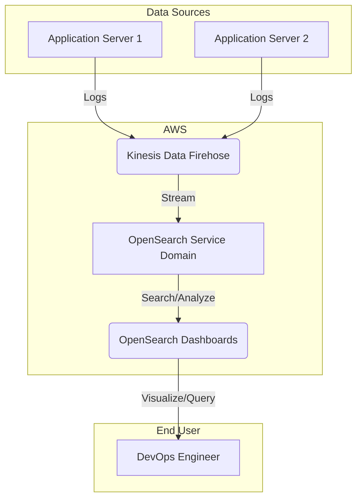
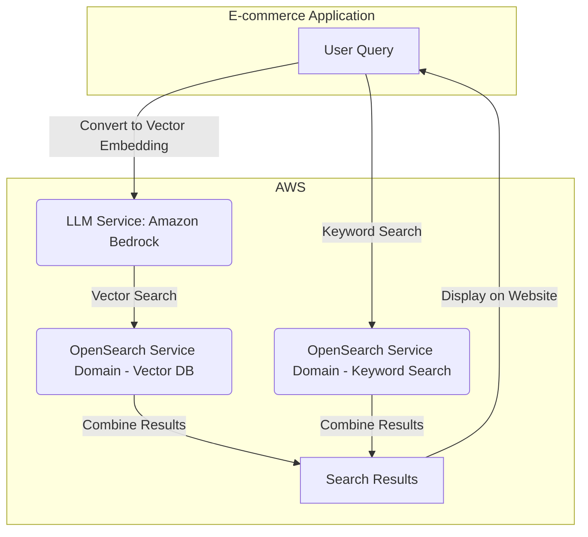
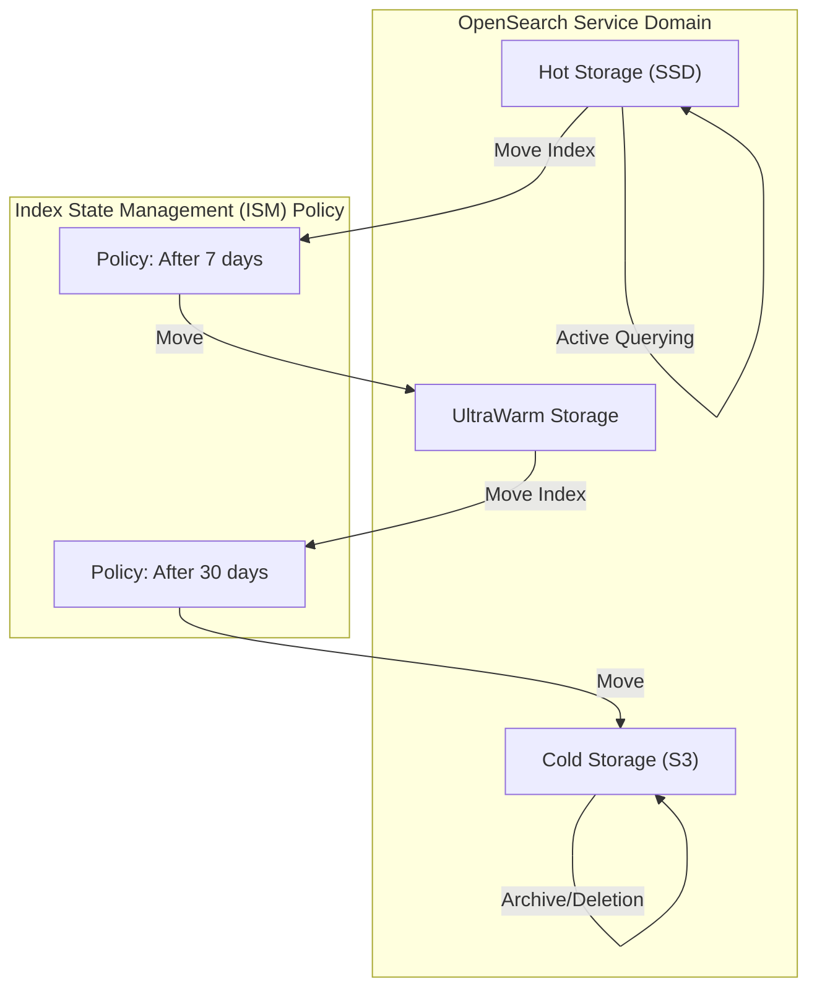
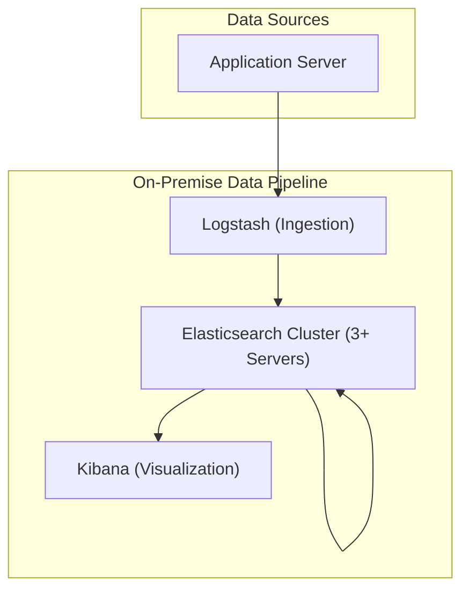

# OpenSearch Service

## OpenSearch Service

### 🌟 Overview: Amazon OpenSearch Service 🔍

Amazon OpenSearch Service is a fully managed service that makes it easy for you to deploy, operate, and scale OpenSearch clusters in the AWS Cloud. OpenSearch is a community-driven, open-source search and analytics suite derived from Elasticsearch and Kibana. It is a powerful tool for a wide range of use cases, including log analytics, real-time application monitoring, security analytics, and website search.

The service abstracts away the operational complexities of managing an OpenSearch cluster, such as hardware provisioning, software patching, and scaling. It provides a robust, secure, and highly available environment, allowing you to focus on ingesting, searching, and visualizing your data. OpenSearch Service also offers a serverless option, **Amazon OpenSearch Serverless**, which automatically provisions and scales resources, simplifying the experience even further.

<figure><figcaption></figcaption></figure>

### # 🤖 Innovation Spotlight: Generative AI and Vector Search 🧠

In a major innovative push, Amazon OpenSearch Service is now a key component for building Generative AI applications. It has become a powerful **vector database**, allowing you to store and efficiently search high-dimensional vector embeddings. This is crucial for applications that require semantic search, where you search for meaning and context rather than just keywords.

By integrating with services like Amazon Bedrock and Amazon SageMaker, OpenSearch Service enables you to build Retrieval-Augmented Generation (RAG) applications. In this architecture, a user's query is converted into a vector embedding, which is then used to perform a vector search against a knowledge base of your proprietary data. The retrieved, relevant data is then used to "augment" the prompt to a large language model (LLM), resulting in more accurate, contextually aware, and up-to-date responses. This is a game-changer for building intelligent chatbots, personalized recommendation engines, and enterprise search solutions.

***

### ⚡ Problem Statement

A major e-commerce company, "ShopFusion," runs a highly dynamic online marketplace. They face a critical challenge in managing and analyzing a constant stream of operational data, including application logs, server metrics, and customer clickstream data. They need a centralized platform to:

* **Monitor Application Health:** Proactively identify and troubleshoot application performance issues by analyzing logs in real-time.
* **Security Analytics:** Detect unusual activity or potential security threats by monitoring access logs and network traffic.
* **Search Functionality:** Provide a fast, relevant, and personalized search experience for their customers across millions of products.
* **Operational Intelligence:** Analyze trends in user behavior and system performance to optimize business operations.

Manually collecting, indexing, and analyzing this data is a complex and resource-intensive task, requiring a dedicated team to manage servers, ensure scalability, and handle security. This approach is not feasible for a company operating at ShopFusion's scale.

### 🤝 Business Use Cases

* **Log Analytics:** A DevOps engineer at ShopFusion uses OpenSearch Service to centralize all application logs. They create dashboards to monitor API response times and set up alerts for error spikes, ensuring they can respond to issues before they impact customers.
* **E-commerce Search:** The product team uses OpenSearch Service to power the website's search bar. They implement features like fuzzy search, spell correction, and personalized recommendations, leading to higher conversion rates and a better user experience.
* **Security Analytics:** A security analyst uses OpenSearch Service to collect and analyze security logs from various sources. They can quickly query for a user's activity across different systems and set up anomaly detection to be notified of suspicious behavior.
* **Observability:** An engineering manager combines logs, metrics, and traces in OpenSearch to get a unified view of the application's health. They use this data to identify performance bottlenecks and optimize resource allocation.

***

### 🔥 Core Principles

* **Fully Managed and Serverless:** The service handles all the heavy lifting of infrastructure management, from provisioning and patching to scaling and backups. The serverless option removes cluster management entirely.
* **Open-Source Roots:** Built on the OpenSearch project, it provides the powerful search and analytics capabilities of Elasticsearch and Kibana with the benefits of a managed service and a truly open-source license.
* **Scalability and Tiered Storage:** It can scale horizontally by adding more nodes to the cluster and offers tiered storage (hot, UltraWarm, and cold) to optimize cost for different data access patterns.
* **Deep AWS Integration:** It integrates seamlessly with other AWS services like Amazon Kinesis Data Firehose, AWS Lambda, Amazon S3, AWS IAM, and Amazon CloudWatch, making it easy to build end-to-end data pipelines.
* **Vector Search for AI:** The new vector search capability enables you to build advanced AI-powered applications that rely on semantic search and generative AI.

### # Core Resources and Terms

* **Domain:** A synonym for an OpenSearch cluster. It is the logical container for your cluster configuration, including instance types, storage options, and security settings.
* **Node:** A single server within an OpenSearch cluster. Nodes can be of different types: data nodes, master nodes (to manage the cluster), or UltraWarm/cold nodes.
* **Index:** A collection of documents with similar characteristics. In OpenSearch, you index documents to make their data searchable.
* **Document:** The fundamental unit of data in OpenSearch, represented as a JSON object.
* **Shard:** An index is broken down into smaller, manageable pieces called shards. Each shard is a full-fledged, independent index that can be hosted on a separate node.
* **Replicas:** Copies of an index's shards. Replicas provide high availability and improve search performance.
* **OpenSearch Dashboards:** The visualization tool (forked from Kibana) that comes with every OpenSearch domain. It allows you to build dashboards, create visualizations, and run ad-hoc queries.

***

### 📋 Pre-Requirements

To implement a solution with Amazon OpenSearch Service for ShopFusion, you will need the following services:

* **AWS Account:** The foundational requirement.
* **Amazon VPC:** Recommended to deploy your OpenSearch domain within a private network for enhanced security.
* **AWS IAM Role/User:** To manage access to the OpenSearch Service console and APIs, and to configure fine-grained access control.
* **Data Ingestion Service:** Services to stream data into OpenSearch, such as:
  * **Amazon Kinesis Data Firehose:** For real-time streaming data ingestion.
  * **AWS Lambda:** To push data to the cluster or to act as a proxy.
  * **Logstash/Fluentd:** Open-source tools that can be configured to send data to OpenSearch.
* **Data Source:** The source of your logs, metrics, or other data, such as application servers, CloudWatch logs, or network flow logs.

***

### 👣 Implementation Steps

Here is a step-by-step guide to setting up an OpenSearch domain for ShopFusion's log analytics.

1. **Create an OpenSearch Domain:**
   * Navigate to the Amazon OpenSearch Service console.
   * Click **Create domain**.
   * **Deployment type:** Choose "Standard" for a managed cluster or "Serverless" for the no-op option.
   * **Domain name:** Enter a unique name (e.g., `shopfusion-logs`).
   * **Engine:** Select the latest OpenSearch version.
2. **Configure Cluster and Data Nodes:**
   * Select an appropriate instance type for your data nodes (e.g., `r6g.large.search` for memory-intensive workloads).
   * Specify the number of data nodes. A production setup should have at least 3 data nodes for high availability.
   * Enable dedicated master nodes (at least 3) for cluster stability.
3. **Configure Tiered Storage:**
   * Enable UltraWarm and Cold Storage. This is crucial for cost-effective log retention.
   * Configure the Index State Management (ISM) policy to automatically move older indices (e.g., logs older than 7 days) from hot storage to UltraWarm and then to cold storage.
4. **Set Up Security:**
   * **VPC access:** Select your VPC and configure security groups to allow traffic only from authorized sources (e.g., your application servers or a bastion host).
   * **Fine-grained access control:** Enable this feature.
   * **Master user:** Create a master user with a strong username and password to log in to OpenSearch Dashboards.
5. **Configure a Data Ingestion Pipeline:**
   * For real-time logs, use Amazon Kinesis Data Firehose.
   * Create a Firehose delivery stream with your OpenSearch domain as the destination.
   * Configure the Firehose stream to handle buffering, transformation (optional), and routing of the logs.
   * Point your application's logging library (e.g., Log4j, Winston) to the Firehose endpoint.
6. **Create an Index Template and Ingest Data:**
   * In OpenSearch Dashboards, create an index template that defines the mapping for your log data.
   * Start sending data from your applications to the Firehose stream.
   * Firehose will automatically index the data into your OpenSearch domain.
7. **Visualize and Alert:**
   * In OpenSearch Dashboards, create an index pattern for your log data.
   * Build dashboards and visualizations to monitor key metrics.
   * Use the built-in alerting features to set up notifications for critical events, such as a high rate of HTTP 500 errors.

***

### 🗺️ Data Flow Diagram

**Diagram 1: Real-Time Log Analytics**

This diagram illustrates how application logs are ingested via Amazon Kinesis Data Firehose and then made available for analysis and visualization in OpenSearch.

**Diagram 2: E-commerce Search with Vector Embeddings**

This diagram shows the flow for a modern, AI-powered search function using vector embeddings.

**Diagram 3: Data Lifecycle with Tiered Storage**

This diagram shows how data moves between storage tiers within OpenSearch Service to optimize cost.

***

### 🔒 Security Measures

* **VPC Access:** Always deploy your OpenSearch domain within a private VPC to prevent public access. Use VPC security groups to control which resources can access the cluster's endpoint.
* **IAM and Fine-Grained Access Control:** Use a combination of IAM policies for cluster-level access and OpenSearch's fine-grained access control for more granular permissions (e.g., index, document, and field-level security). This is a significant advantage over a self-managed cluster.
* **Encryption:** Enable encryption at rest using AWS KMS and encryption in transit for node-to-node communication. This protects your data both on disk and as it moves between nodes.
* **Audit Logging:** Enable audit logs to record all requests made to your cluster. This provides a detailed trail for compliance and security analysis.
* **Cognito or SAML Authentication:** Integrate with Amazon Cognito or a SAML 2.0 provider to provide secure user authentication for OpenSearch Dashboards.

***

### ⚖️ When to use and when not to use

✅ **When to use Amazon OpenSearch Service:**

* You need a fully managed, scalable, and secure platform for log analytics, application monitoring, or operational intelligence.
* You want to implement a fast and relevant search function for your website or application (e.g., e-commerce search, document search).
* You are building a modern Generative AI application and need a cost-effective, scalable vector database for RAG.
* You are already using the open-source Elasticsearch/Kibana stack and want to offload the operational burden of managing it.
* Your data is primarily unstructured or semi-structured and needs to be indexed and searched in real-time.

❌ **When not to use Amazon OpenSearch Service:**

* Your primary use case is transaction-heavy, relational data that requires ACID properties. Use a relational database like Amazon RDS or Amazon Aurora.
* Your data is primarily structured and you only need simple reporting and analysis, which can be handled by a data warehouse like Amazon Redshift or a BI tool like Amazon QuickSight.
* You need absolute, low-level control over every aspect of the OpenSearch cluster and its underlying infrastructure.
* You have a very small, short-term project where the cost of a managed service might not be justified. In this case, a single-node, self-hosted deployment might suffice.

***

### 💰 Costing Calculation

Amazon OpenSearch Service pricing is primarily based on the following factors:

1. **Instance Hours:** The number and type of instances you run (data nodes, master nodes). This is the largest component of the cost.
2. **EBS Storage:** The amount of Amazon EBS storage attached to your data nodes.
3. **Data In Transit:** Data transfer costs can apply for data moving out of the AWS region.
4. **Tiered Storage:** UltraWarm and cold storage have a different, much lower cost per GB compared to hot storage.
5. **Snapshots:** You pay for the S3 storage consumed by manual or automated snapshots.

**Sample Calculation:**

Let's estimate the monthly cost for a medium-sized log analytics cluster:

* **Cluster Size:** 3 data nodes, `m6g.xlarge.search` (4 vCPU, 16 GiB RAM).
* **Storage:** 200 GB of EBS storage per node.
* **Data Retention:** 7 days in hot storage, 30 days in UltraWarm.
* **Instance Cost (On-Demand):**
  * 3 nodes \* $0.256/hour \* 24 hours/day \* 30 days/month = $552.96
* **EBS Storage Cost:**
  * 3 nodes \* 200 GB/node \* $0.10/GB-month = $60.00
* **UltraWarm Storage Cost (assuming 1 TB of data):**
  * $0.024/GB-month \* 1000 GB = $24.00
* **Total Estimated Cost:** $552.96 (Hot) + $60.00 (EBS) + $24.00 (UltraWarm) = **$636.96 / month**

**Efficient Way of Handling Cost:**

* **Tiered Storage:** This is the most effective way to manage costs. Use hot storage for recent, frequently accessed data and move older, less-frequently accessed data to UltraWarm or cold storage.
* **Right-Size Your Cluster:** Use the AWS Pricing Calculator and monitoring data to select the right instance types and number of nodes for your workload. You can use smaller, more cost-effective instances for search-heavy workloads and larger, memory-optimized instances for ingestion-heavy workloads.
* **Use Amazon OpenSearch Serverless:** For unpredictable or spiky workloads, OpenSearch Serverless eliminates the need to over-provision and can lead to significant cost savings.
* **Reserved Instances:** For stable, long-term workloads, purchasing Reserved Instances can provide a substantial discount (up to 50%) on your hourly instance costs.

***

### 🧩 Alternative Services in AWS/Azure/GCP/On-Premise

| Service                           | Platform      | Key Comparison/Difference                                                                                                                                                                                                                     |
| --------------------------------- | ------------- | --------------------------------------------------------------------------------------------------------------------------------------------------------------------------------------------------------------------------------------------- |
| **Amazon Kinesis Data Analytics** | AWS           | An alternative for real-time stream processing, especially for complex SQL queries on streams. It is not a search engine or data store like OpenSearch.                                                                                       |
| **Azure Cosmos DB**               | Azure         | A multi-model database that supports document, key-value, and graph data. It can be used for search and analytics but is a more general-purpose database, not specifically optimized for search like OpenSearch.                              |
| **Google Cloud Logging**          | GCP           | A scalable service for storing, searching, and analyzing log data. It is a powerful tool for log management but is less flexible for custom search applications or advanced analytics compared to OpenSearch.                                 |
| **Splunk**                        | On-Prem/Cloud | A proprietary enterprise platform for log management, security information and event management (SIEM), and operational intelligence. It is a very comprehensive solution but typically has a much higher cost due to volume-based licensing. |
| **Elasticsearch (Self-Managed)**  | On-Prem/Cloud | The open-source origin of OpenSearch. A self-managed deployment gives you full control but requires significant operational overhead, and commercial features require a proprietary license.                                                  |

**On-Premise Alternative Data Flow (Self-Managed ELK Stack)**

This diagram shows the classic, self-managed ELK (Elasticsearch, Logstash, Kibana) stack, highlighting the complexity that Amazon OpenSearch Service simplifies.

***

### ✅ Benefits

* **Reduced Operational Overhead:** Offloads the burden of cluster management, patching, and scaling to AWS.
* **Cost-Effective:** Tiered storage and serverless options help manage costs efficiently, especially for large volumes of time-series data.
* **Scalability and Performance:** Scales easily to handle petabytes of data and provides fast, interactive search and analytics capabilities.
* **Enhanced Security:** Deep integration with AWS security services like IAM, VPC, and KMS provides enterprise-grade security out-of-the-box.
* **AI-Powered Capabilities:** The new vector search feature enables building advanced Generative AI applications and semantic search.
* **Open-Source Flexibility:** You get the power of the open-source OpenSearch engine with the reliability and support of a managed AWS service.

***

### 📝 Summary

Amazon OpenSearch Service is a powerful, managed service that simplifies the deployment and scaling of OpenSearch clusters for a variety of search and analytics use cases. By providing a serverless option and deeply integrating with the AWS ecosystem, it removes the operational complexities of running a search engine at scale. The addition of vector search capabilities has cemented its role as a key component for building modern, AI-powered applications, from intelligent chatbots to semantic search engines.

<strong>Top 5 Things to Keep in Mind</strong>

1. **It's for Search and Analytics:** OpenSearch is optimized for free-text search and real-time analytics, not for transactional workloads.
2. **Managed vs. Serverless:** Choose a managed cluster for predictable workloads and fine-grained control, or go serverless for unpredictable, spiky usage.
3. **Security is Paramount:** Always use VPC access, IAM policies, and fine-grained access control to secure your cluster.
4. **Tiered Storage is a Cost-Saver:** For log analytics, implement an Index State Management (ISM) policy to move older data to UltraWarm or cold storage to drastically reduce costs.
5. **Embrace the Vector Search:** For new projects, consider leveraging OpenSearch's vector search capabilities to build more intelligent and context-aware applications.

**In short, what Amazon OpenSearch Service is all about:** Amazon OpenSearch Service is a fully managed service that provides a scalable and secure environment for running OpenSearch clusters. It is designed to simplify real-time log analytics, application monitoring, and full-text search, with recent innovations that position it as a powerful vector database for building modern, AI-driven applications.
