# QuickSight

## 🌟 Amazon QuickSight: The AI-Powered Analytics Accelerator

### 1. 🌟 Overview

**Amazon QuickSight** is AWS’s **serverless, ML-integrated business intelligence (BI) service** that transforms raw data into interactive dashboards with **sub-second query performance** – even at petabyte scale. Unlike legacy BI tools (Tableau, Power BI), QuickSight natively leverages **SPICE (Super-fast, Parallel, In-memory Calculation Engine)** for automatic query acceleration and **generative AI via QuickSight Q** for natural language analytics.

<figure><figcaption></figcaption></figure>

> Key innovation: **2024’s "AutoML Insights"** delivers **automated anomaly detection and forecasting** _without data science skills_ – reducing insight discovery from hours to seconds.

> **Innovation Spotlight (2024):** **QuickSight Q + Amazon Bedrock** enables **enterprise-grade conversational analytics** with private LLMs. Example: Coca-Cola’s executives ask _"Show me Q3 revenue outliers by region"_ and get instant visualizations with root-cause analysis – _zero SQL required_.

***

### 2. ⚡ Problem Statement

**Real-World Scenario:** A global e-commerce platform (e.g., Shopify) needs to:

* Monitor $2B/day in transactions across 178 countries
* Detect revenue anomalies within 60 seconds of occurrence
* Enable non-technical teams to self-serve analytics (no SQL)

**Industries/Applications:**

* 🛒 **Retail**: Real-time inventory-sales correlation (Walmart)
* 💊 **Healthcare**: Patient outcome trend analysis (Mayo Clinic)
* 🏦 **Finance**: Fraud pattern visualization (Stripe)

#### 2.1 🤝 Business Use Cases

* **Executive Pulse Dashboard**: Live revenue/COGS metrics with AI-driven explanations
* **Customer Churn Predictor**: Identify at-risk segments using built-in ML
* **Supply Chain War Room**: Visualize shipment delays with geospatial heatmaps

***

### 3. 🔥 Core Principles

| Term                  | Explanation                                                                           |
| --------------------- | ------------------------------------------------------------------------------------- |
| **SPICE Engine**      | Columnar, in-memory cache (auto-scales to 10GB/node). Processes 10M+ rows/sec.        |
| **QuickSight Q**      | Natural language query engine powered by ML (e.g., _"Why did sales drop in Texas?"_). |
| **Calculated Fields** | Custom metrics using functions (e.g., `coalesce(revenue, 0)`).                        |
| **Parameters**        | Dynamic filters (e.g., `DateRange` slider for time comparisons).                      |
| **ML Insights**       | Auto-detects anomalies, forecasts, and clustering (no model training).                |

**Foundational Concepts:**

* **Serverless Architecture**: Zero infrastructure management (scales from 1 to 10K users)
* **Data Federation**: Query S3, Redshift, RDS _without_ data movement
* **Row-Level Security**: Restrict data access via IAM/AD groups (e.g., `region = 'EMEA'`)

***

### 4. 📋 Pre-Requirements

| Service/Tool                | Purpose                                            |
| --------------------------- | -------------------------------------------------- |
| **AWS IAM Identity Center** | SSO integration for user management                |
| **SPICE Capacity**          | Configure node count (25-500GB) for large datasets |
| **CloudFormation**          | Deploy standardized dashboards via templates       |
| **AWS Glue Data Catalog**   | Central metadata source for S3/Redshift tables     |
| **QuickSight Q License**    | Enable natural language queries ($18/user/month)   |

***

### 5. 👣 Implementation Steps

1.  **Enable QuickSight**:

    
    ```bash
    aws quicksight create-account-subscription --edition ENTERPRISE --admin-user-name admin  
    ```
    
2. **Connect Data Source**:
   * S3: Select bucket → Auto-detect schema via Glue crawler
3. **Optimize with SPICE**:
   * In dataset settings → "Schedule refresh" (e.g., hourly)
4. **Build Dashboard**:
   * Drag/drop fields → Apply ML Insights (right-click metric)
5. **Enable QuickSight Q**:
   * Dashboard settings → "Turn on Q" → Train with business terms (e.g., "revenue" = `sales.amount`)

***

### 6. 🗺️ Data Flow Diagrams

#### Diagram 1: Core Architecture


#### Diagram 2: E-Commerce Fraud Detection

```mermaid
flowchart TB  
    A[Transaction Stream] --> B(Kinesis Data Streams)  
    B --> C[QuickSight Dataset]  
    C --> D[SPICE Acceleration]  
    D --> E[ML Insights: Anomaly Detection]  
    E -->|Anomaly Score > 0.85| F[Real-Time Alert]  
    F --> G[Slack Channel]  
    D --> H[QuickSight Q: “Why fraud spiked?”]  
    H --> I[Root Cause: Suspicious IPs]  
```



***

### 7. 🔒 Security Measures

* **Column-Level Security**: Mask PII columns (e.g., `credit_card`) for non-finance roles
* **VPC Isolation**: Deploy in private subnet via QuickSight VPC endpoint
* **Data Encryption**: AES-256 for SPICE data + KMS keys for S3 sources
* **Session Controls**: Enforce MFA via IAM Identity Center policies
* **Audit Trail**: CloudTrail logs all `DescribeDashboard`/`Query` API calls

***

### 8. 🚀 Innovation Spotlight: Generative Dashboards with Bedrock

**QuickSight Q + Titan Text** creates **self-updating dashboards**:

1. User asks _"Show top product categories by margin"_
2. Q generates SQL → Fetches data → Builds visualization
3. _Auto-adds annotations_: _"Margin drop in Electronics due to supplier cost increase"_\
   &#xNAN;_&#x55;sed by Adobe to reduce dashboard creation time from 4 hours to 8 minutes._

***

### 9. ⚖️ When to Use vs. Avoid

| ✅ **When to Use**                           | ❌ **When Not to Use**                           |
| ------------------------------------------- | ----------------------------------------------- |
| Embedded analytics (white-label dashboards) | Pixel-perfect report formatting (use Tableau)   |
| AI-powered anomaly detection                | Complex financial modeling (use Power BI + DAX) |
| Serverless scaling (1 → 10K users)          | Offline report generation                       |
| Tight AWS ecosystem integration             | Multi-cloud analytics (use Looker)              |

***

### 10. 💰 Costing Calculation

**Pricing Model**:

* **Standard Edition**: $12.50/user/month (SPICE + dashboards)
* **Enterprise Edition**: $22.50/user/month (+ VPC, SSO, audit)
* **SPICE Capacity**: $0.25/GB-hour (billed per node)
* **QuickSight Q**: $18/user/month (add-on)

**Sample Calculation** (E-commerce with 50 analysts + 500 viewers):

* **Analysts (Enterprise)**: 50 × $22.50 = **$1,125/month**
* **Viewers (Standard)**: 500 × $12.50 = **$6,250/month**
* **SPICE**: 200GB × $0.25 × 730 hrs = **$36,500/month**
* **Total**: **$43,875/month**

**Optimization Tips**:

* **SPICE Right-Sizing**: Use `spice-utilization` CloudWatch metric to downscale idle capacity
* **Aggregated Datasets**: Pre-compute daily summaries (saves 90% SPICE usage)
* **Viewer-Only Licenses**: 80% of users need only dashboard access ($12.50 vs $22.50)

***

### 11. 🧩 Alternative Services Comparison

| Service                | AI Capabilities   | Embedded Cost | Max Data Size        |
| ---------------------- | ----------------- | ------------- | -------------------- |
| **AWS QuickSight**     | ✅ AutoML Insights | $0.06/view    | 10GB SPICE/node      |
| **Microsoft Power BI** | ✅ Premium AI      | $15/view      | 1GB dataset          |
| **Google Looker**      | ❌ Limited         | $15/user      | Unlimited (BigQuery) |
| **Tableau Cloud**      | ✅ Einstein AI     | $15/view      | 10GB extract         |

**On-Prem Alternative (Metabase + DuckDB)**:


***

### 12. ✅ Benefits

* **Speed**: Sub-second queries on billion-row datasets (vs. minutes in legacy BI)
* **AI Democratization**: Business users get ML insights without data scientists
* **Cost Predictability**: Pay-per-use (no upfront server costs)
* **Embedded Analytics**: White-label dashboards in SaaS apps (e.g., Shopify apps)
* **Unified Governance**: Single pane for data + access control + audit

***

### 13. 🌐 Innovation Spotlight: Predictive Supply Chain Optimization

**QuickSight + SageMaker Forecast** predicts disruptions:

1. Historical shipment data → QuickSight dashboard
2. "Forecast" button triggers SageMaker model
3. Visualizes delays 14 days in advance with confidence intervals\
   &#xNAN;_&#x52;esult: 22% fewer stockouts (proven at Siemens)_

***

### 14. 📝 Summary

**Top 5 Key Takeaways**:

1. **SPICE ≠ Cache**: It’s a purpose-built query engine – _always_ refresh datasets for real-time data
2. **Q Requires Training**: Feed business glossary terms (e.g., "revenue" = `sales.amount`) for accuracy
3. **Embedded is Killer Feature**: $0.06/view enables monetizing analytics in SaaS products
4. **ML Insights Need Context**: Anomaly detection works best with >30 days of historical data
5. **VPC Matters**: Isolate sensitive dashboards from public internet (Enterprise-only)

**5-Line Essence**:

> QuickSight delivers serverless BI with AI-powered insights at scale. SPICE accelerates queries on petabyte data while QuickSight Q enables natural language analytics. Embedded analytics monetizes dashboards, and AutoML detects anomalies without data science skills. Costs scale with users/data – optimize via SPICE right-sizing. The AWS-native path to data democratization.

***

### 15. 🔗 Related Topics

* [QuickSight Q Implementation Guide](https://aws.amazon.com/blogs/big-data/using-amazon-quicksight-q-for-natural-language-queries/)
* [Embedded Analytics Reference Architecture](https://aws.amazon.com/solutions/implementations/amazon-quicksight-embedded-analytics/)
* [SPICE Capacity Optimization Whitepaper](https://aws.amazon.com/blogs/big-data/optimizing-amazon-quicksight-spice-capacity/)
* [GDPR Compliance Checklist](https://aws.amazon.com/compliance/data-privacy/quicksight/)
* [QuickSight Pricing Calculator](https://calculator.aws/#/addService/QuickSight)

🛠️ **Pro Tip**: Always start with **Standard Edition** – upgrade to Enterprise _only_ when you need VPC isolation or SSO. For SPICE, set **auto-pause after 15 mins of inactivity** to cut costs by 30%!
