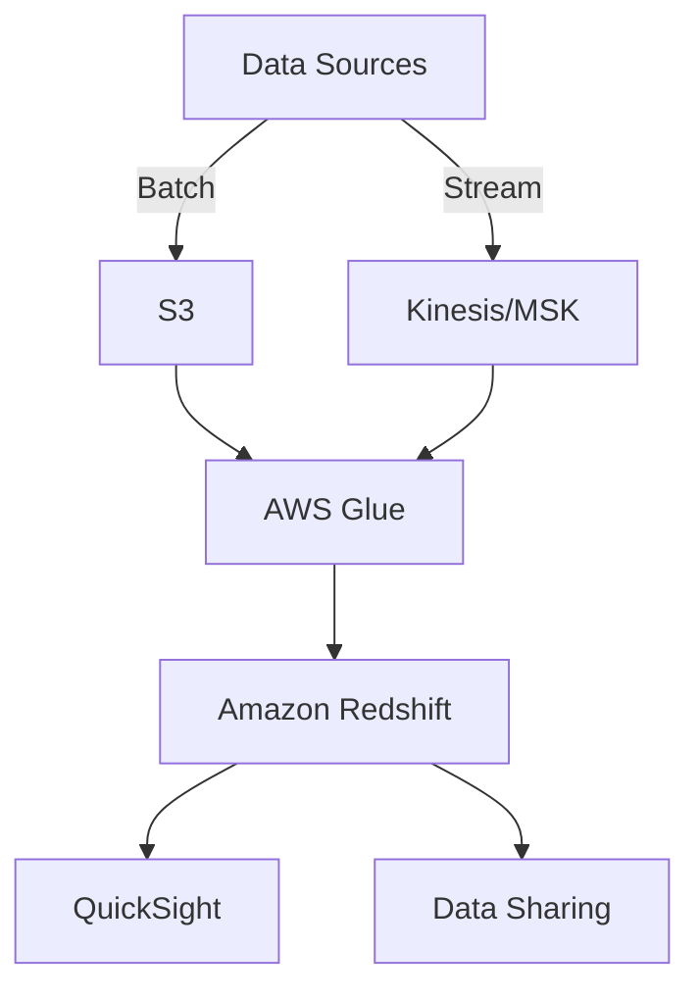
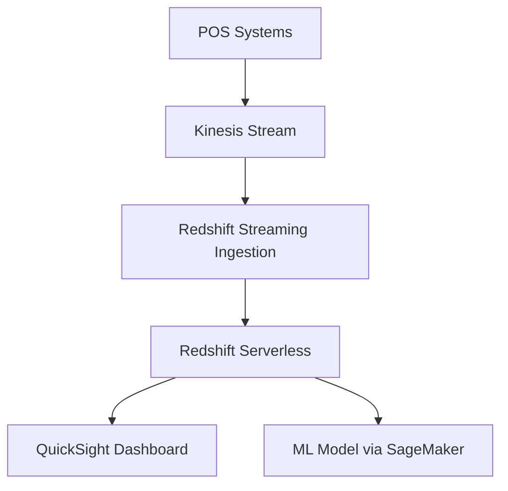
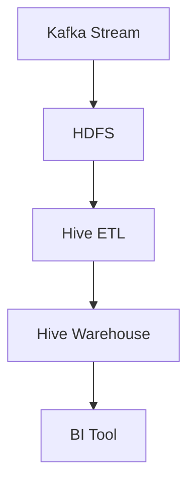

# RedShift

## 🛠️ **Amazon Redshift – Cloud Data Warehousing Reinvented**

### 🌟 Overview

**Amazon Redshift** is AWS’s fully managed, petabyte-scale cloud data warehouse designed for **high-performance analytics**. It supports **standard SQL**, integrates deeply with AWS services, and now offers **Redshift Serverless**, enabling analytics without managing infrastructure.

<figure><figcaption></figcaption></figure>

#### 🚀 Innovation Spotlight (2025)

* **Redshift AI Integration**: Seamless integration with Amazon Q and SageMaker for predictive analytics.
* **Streaming Ingestion**: Native support for Kinesis and MSK for near real-time analytics.
* **Data Sharing Across Accounts**: Secure, cross-account data sharing without duplication.
* **Lakehouse Architecture**: Unified querying across Redshift and S3 via Redshift Spectrum.

***

### ⚡ Problem Statement

**Scenario**: A retail chain wants to analyze customer behavior across 500+ stores in real-time to optimize inventory and promotions.

**Challenge**: Traditional databases can't handle the volume, velocity, and variety of data efficiently.

#### 2.1 🤝 Business Use Cases

* 🏥 Healthcare: Patient data analytics across hospitals.
* 🛒 Retail: Real-time sales and inventory optimization.
* 🏦 Finance: Fraud detection using historical and streaming data.
* 🎮 Gaming: Player behavior analysis and matchmaking.

***

### 🔥 Core Principles

* **Massively Parallel Processing (MPP)**: Distributes queries across nodes for speed.
* **Columnar Storage**: Optimized for analytical queries.
* **Redshift Spectrum**: Query S3 data without loading.
* **Redshift Serverless**: Auto-scaling, pay-per-use model.
* **Data Sharing**: Share datasets securely across accounts.

#### Key Resources

| Resource                  | Description                                  |
| ------------------------- | -------------------------------------------- |
| Cluster                   | Traditional Redshift deployment with nodes   |
| Serverless                | No infrastructure management, auto-scaling   |
| Spectrum                  | Query data directly from S3                  |
| Workload Management (WLM) | Prioritize queries and manage concurrency    |
| Data Sharing              | Share data across Redshift accounts securely |

***

### 📋 Pre-Requirements

| Service     | Purpose                  |
| ----------- | ------------------------ |
| S3          | Store raw data           |
| AWS Glue    | ETL/ELT processing       |
| IAM         | Secure access control    |
| CloudWatch  | Monitoring and alerts    |
| Kinesis/MSK | Streaming data ingestion |
| QuickSight  | Visualization and BI     |

***

### 👣 Implementation Steps

1. **Create IAM roles** for Redshift access to S3 and Glue.
2. **Set up Redshift Serverless** or provisioned cluster.
3. **Configure S3 buckets** for raw and processed data.
4. **Use AWS Glue** to transform and load data.
5. **Enable Redshift Spectrum** to query S3 directly.
6. **Set up Kinesis/MSK** for streaming ingestion.
7. **Connect QuickSight** for dashboards and reports.
8. **Configure WLM** for query prioritization.
9. **Enable encryption and VPC isolation**.

***

### 🗺️ Data Flow Diagram

#### Diagram 1 – How Amazon Redshift Works

#### Diagram 2 – Retail Analytics Use Case

***

### 🔒 Security Measures

* 🔐 **Encryption**: Enable at-rest and in-transit encryption.
* 🛡️ **IAM Roles**: Use least privilege principle.
* 🌐 **VPC Isolation**: Deploy Redshift in private subnets.
* 📊 **Audit Logging**: Enable logging to CloudTrail.
* 🧠 **Data Masking**: Use views to restrict sensitive data.

***

### ⚖️ When to Use and When Not to Use

#### ✅ When to Use

* Large-scale analytics with structured data.
* Real-time + historical data blending.
* Integrated AWS ecosystem use cases.

#### ❌ When Not to Use

* OLTP workloads (use RDS or Aurora).
* Small datasets with infrequent queries.
* Complex unstructured data processing (use OpenSearch or Athena).

***

### 💰 Costing Calculation

#### Pricing Factors

* Compute (nodes or serverless usage)
* Storage (managed or S3 via Spectrum)
* Data transfer and backups

#### Sample Calculation

* **Redshift Serverless**: $0.25 per RPU-hour
* **Storage**: $0.024/GB-month
* **Example**: 100 RPU-hours/month + 500GB storage\
  → Compute: $25\
  → Storage: $12\
  → **Total: \~$37/month**

#### Efficiency Tips

* Use **Spectrum** for infrequent queries.
* Schedule **pause/resume** for clusters.
* Optimize queries and WLM settings.

***

### 🧩 Alternative Services

| Feature        | AWS Redshift       | Azure Synapse        | GCP BigQuery | On-Premise    |
| -------------- | ------------------ | -------------------- | ------------ | ------------- |
| Deployment     | Serverless/Cluster | Dedicated/Serverless | Serverless   | Hadoop + Hive |
| Query Engine   | SQL + Spectrum     | T-SQL + Spark        | SQL + ML     | HiveQL        |
| Streaming      | Kinesis/MSK        | Event Hub            | Pub/Sub      | Kafka         |
| ML Integration | SageMaker          | Azure ML             | Vertex AI    | Custom        |

#### On-Premise Data Flow (Hive + Kafka)

***

### ✅ Benefits

* 💸 Cost-effective with serverless and Spectrum
* ⚡ High performance via MPP and columnar storage
* 🔄 Real-time + batch analytics
* 🔐 Enterprise-grade security
* 🔗 Deep AWS integration
* 📈 Scalable and flexible

***

### 📝 Summary

Amazon Redshift is a **high-performance, scalable cloud data warehouse** that supports real-time and batch analytics. With **serverless deployment**, **streaming ingestion**, and **ML integration**, it’s ideal for modern data-driven enterprises.

Top Takeaways to keep in mind

1. Redshift supports petabyte-scale analytics.
2. Serverless mode removes infrastructure overhead.
3. Spectrum enables querying S3 without loading.
4. MPP and columnar storage boost performance.
5. Ideal for BI, ML, and real-time analytics.
6. Deep integration with AWS ecosystem.
7. Secure with VPC, IAM, and encryption.
8. Cost-effective with usage-based pricing.
9. Supports cross-account data sharing.
10. Easily visualized via QuickSight.

***

### 🔗 Related Topics

* [Amazon Redshift Official Docs](https://aws.amazon.com/redshift/)
* [Redshift Serverless Overview](https://aws.amazon.com/redshift/serverless/)
* [Lakehouse Architecture with Redshift](https://aws.amazon.com/blogs/big-data/power-highly-resilient-use-cases-with-amazon-redshift/)
* [Redshift vs Competitors – 2025 Analysis](https://www.baytechconsulting.com/blog/amazon-redshift-a-comprehensive-analysis-2025)

***

