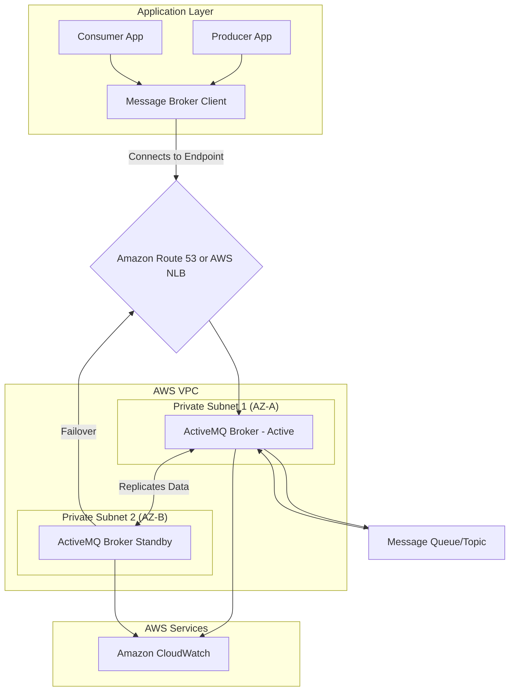
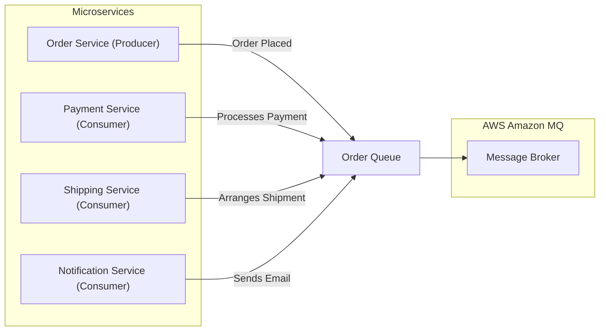
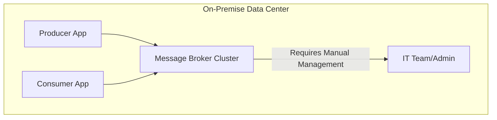

# Amazon MQ

## 🌟 Amazon MQ

### 🚀Overview&#x20;

**Amazon MQ** is a managed message broker service for Apache ActiveMQ and RabbitMQ that makes it easy to set up, operate, and scale message brokers in the cloud. It is designed for applications that require a traditional message broker, enabling you to migrate your existing applications to the cloud without rewriting code. Amazon MQ handles the heavy lifting of broker provisioning, setup, patching, and maintenance, allowing you to focus on your application logic.

<figure><figcaption></figcaption></figure>

#### ✨Innovation Spotlight&#x20;

> Amazon MQ's key innovation is providing a **fully managed service for open-source message brokers**. This allows companies to leverage familiar, industry-standard messaging protocols (like JMS, NMS, AMQP, etc.) while offloading the significant operational overhead of managing these brokers themselves. This is particularly valuable for hybrid cloud strategies and for legacy applications that are difficult to refactor.

***

### Problem Statement & Business Use Cases 🛠️

In many enterprise applications, particularly those built with older technologies or complex service-oriented architectures, message brokers are a critical component for decoupling services and enabling asynchronous communication. Managing these brokers (e.g., Apache ActiveMQ, RabbitMQ) on-premise requires significant effort for provisioning, patching, scaling, and ensuring high availability.

#### **Example Scenario: A Financial Trading Platform**

A legacy financial services company has a high-volume trading platform where order requests are processed by multiple back-end systems. The platform uses an on-premise Apache ActiveMQ broker to handle millions of real-time trading requests, ensuring that messages are delivered reliably and in a specific order. The company is looking to modernize its infrastructure by migrating to the cloud to reduce operational costs and improve scalability. However, rewriting the entire application to use a different messaging service would be a massive, time-consuming, and risky undertaking.

By using Amazon MQ, the company can:

* **Migrate to the cloud with minimal code changes:** They can simply point their existing applications to the new Amazon MQ broker endpoint.
* **Ensure high availability:** Amazon MQ provides active/standby brokers across multiple Availability Zones, offering built-in failover.
* **Offload operational burden:** AWS takes care of all administrative tasks, freeing up the IT team to focus on new business features.

#### **Industries & Applications:**

* **Financial Services:** High-frequency trading, real-time transaction processing.
* **Telecommunications:** Call center routing, network provisioning.
* **E-commerce:** Order processing, inventory management, and shipping updates.
* **Logistics:** Fleet management, supply chain coordination, and real-time tracking.

***

### 💡Core Principles

Amazon MQ provides a managed environment for two open-source message brokers: **Apache ActiveMQ** and **RabbitMQ**.

* **Apache ActiveMQ:** A powerful, open-source, multi-protocol message broker. Amazon MQ supports a subset of its features, including message queues and topics.
* **RabbitMQ:** An open-source message broker that is known for its flexible routing capabilities. Amazon MQ supports its core features, including queues, exchanges, and bindings.

#### **Key Concepts:**

* **Message Broker:** A software intermediary that enables applications to communicate with each other by sending and receiving messages.
* **Message Queue:** A destination where messages are stored until they are consumed. It provides point-to-point communication.
* **Message Topic:** A destination where a message is published and then broadcast to all interested subscribers. It enables a publish/subscribe pattern.
* **Broker Instance:** The core unit of a message broker, running on specific hardware configurations (e.g., mq.m5.large, mq.t3.micro).
* **Broker Deployment Modes:**
  * **Single-instance:** For development and testing environments.
  * **Active/Standby (High Availability):** A pair of brokers in two different Availability Zones with automatic failover, ideal for production workloads.
  * **Cluster (RabbitMQ):** A group of RabbitMQ nodes that share resources and data, providing high availability and scalability.

***

### 📋Pre-Requirements

* **An AWS Account:** You need an active AWS account with appropriate permissions.
* **IAM User:** An IAM user with permissions to create and manage Amazon MQ brokers, and access to other related services like VPC and Security Groups.
* **VPC & Subnets:** A pre-existing VPC and subnets to launch the broker into. For high availability, you need subnets in at least two different Availability Zones.
* **Security Group:** A security group to control inbound and outbound network traffic to the broker. You must configure inbound rules for the messaging protocols you will use (e.g., AMQP, MQTT, JMS) and the ActiveMQ/RabbitMQ web console.

***

### 🚀 Implementation Steps

Here's a step-by-step guide to setting up a high-availability ActiveMQ broker using the AWS Management Console:

1. **Log in to the AWS Console:** Navigate to the Amazon MQ service.
2. **Create a Broker:** Click "Create broker".
3. **Choose Broker Engine:** Select "Apache ActiveMQ" and choose "Active/standby broker" for high availability.
4. **Configure Broker:**
   * Give your broker a unique name.
   * Choose an instance type (e.g., `mq.m5.large`).
   * Specify the `user name` and `password` for the ActiveMQ Web Console.
5. **Configure Network and Security:**
   * Choose your VPC and at least two private subnets in different Availability Zones.
   * Select or create a new security group.
   * Make sure the security group has inbound rules to allow traffic on the relevant ports (e.g., `61617` for OpenWire, `8162` for the web console).
6. **Review and Launch:** Review all the settings, and click "Create broker". The process will take a few minutes to provision the instances.
7. **Connect Your Application:** Once the broker status is `Running`, get the endpoints from the broker details page and update your application's connection strings.

***

### 🗺️ Data Flow Diagram

#### Diagram 1: Active/Standby Broker Deployment

This diagram shows a typical high-availability setup with an Active/Standby ActiveMQ broker.

m

#### Diagram 2: Microservices Communication

This diagram illustrates how Amazon MQ decouples microservices in a modern architecture.

***

### 🔒 Security Measures

* **VPC Isolation:** Launch the broker within a private VPC subnet to prevent public internet access.
* **Security Groups:** Use security groups as a virtual firewall to control inbound and outbound traffic. Only allow access from specific EC2 instances or IP ranges that need to communicate with the broker.
* **IAM Roles and Policies:** Grant the least privilege necessary. Use IAM roles for EC2 instances or Lambda functions to interact with the broker. This prevents hardcoding credentials.
* **Encryption:**
  * **Encryption in transit:** Amazon MQ automatically enforces SSL/TLS for all connections to the broker endpoints.
  * **Encryption at rest:** Enable encryption for broker storage. For ActiveMQ, it uses Amazon EBS or EFS, which can be encrypted with AWS KMS. RabbitMQ uses EBS which can also be encrypted.
* **Broker User Management:** Use the built-in broker user management for ActiveMQ and RabbitMQ to control which applications can connect and what queues or topics they can access.

***

### 📊 Amazon MQ vs. Other AWS Messaging Services

Choosing a messaging service on AWS can be confusing due to the variety of options. The key is to understand the different use cases.

* **Amazon MQ:** The best choice for **lift-and-shift migrations**. Use it when you have existing applications that rely on industry-standard messaging protocols (JMS, AMQP) and you want to move to a managed service without rewriting your application's messaging logic.
* **Amazon SQS (Simple Queue Service):** A fully managed, highly scalable, and serverless queueing service. Use SQS for simple message queues, decoupling microservices, and handling asynchronous tasks. It's a great choice for new, cloud-native applications because it has unlimited scalability and a simple API, but it does not support JMS/AMQP protocols.
* **Amazon SNS (Simple Notification Service):** A serverless publish/subscribe service. Use SNS for broadcasting messages to a large number of subscribers (e.g., email, SMS, SQS queues, Lambda functions). It's primarily a notification service, not a full-featured message broker.
* **Amazon Kinesis:** A service for real-time processing of high-volume streaming data. Use Kinesis when you need to process large amounts of data (MBs per second) in real-time, such as for log analytics or IoT telemetry.

***

### 🤔 When to use and when not to use

#### **When to Use Amazon MQ:**

* **Legacy Application Migration:** You have existing applications that use JMS or other standard protocols and need to migrate them to the cloud with minimal code changes.
* **Hybrid Cloud Environments:** You need to integrate on-premise applications with cloud-based services using a common message broker.
* **Specific Protocol Requirements:** Your application is tightly coupled to a specific protocol like AMQP, MQTT, or OpenWire.

#### **When NOT to Use Amazon MQ:**

* **New Cloud-Native Applications:** For new applications, it's often more efficient and cost-effective to use serverless and scalable services like Amazon SQS and SNS, which offer unlimited scaling and less operational overhead.
* **High-throughput Real-time Streaming:** For real-time data ingestion and processing at a very high velocity, Amazon Kinesis is a better fit.
* **Tight Cost Constraints for Simple Use Cases:** For simple queueing and decoupling, Amazon SQS is generally more cost-effective as you only pay for what you use, without an hourly broker instance cost.

***

### 💰 Costing Calculation

Amazon MQ pricing is based on three main components:

1. **Broker Instance Usage:** You pay for the time your broker instance runs, billed hourly. The cost depends on the instance size (e.g., `mq.m5.large`).
2. **Broker Storage:** You pay for the average amount of storage used per month. This is calculated in "GB-Months". The cost varies by storage type (durability-optimized with EFS vs. throughput-optimized with EBS).
3. **Data Transfer:** Standard AWS data transfer charges apply for data transferred in and out of Amazon MQ.

#### **Efficient Cost Management:**

* **Right-Size Your Broker:** Choose the smallest instance type that meets your performance and throughput needs. Use `mq.t3.micro` for development and testing.
* **Optimize Storage:** For high-throughput but short-lived messages, use throughput-optimized EBS storage. For durability-critical, long-lived messages, use EFS-backed storage.
* **Use the Free Tier:** New AWS accounts can get up to 750 hours of `mq.t3.micro` and 20GB of storage for free per month for the first year.
* **Shut Down Unused Brokers:** For non-production environments, shut down the brokers when they are not in use to avoid hourly charges.

#### **Sample Calculation:**

Let's assume a single-instance `mq.m5.large` broker in the US East (N. Virginia) region, with an average of 10 GB of throughput-optimized storage per month.

* **Broker Cost:** `730 hours/month` (approx. 31 days) \* `$0.288/hour` (mq.m5.large) = `$210.24`
* **Storage Cost:** `10 GB` \* `$0.10/GB-month` = `$1.00`
* **Data Transfer:** Data transfer costs will vary based on usage but are typically low for internal AWS traffic.
* **Total Estimated Monthly Cost:** `$210.24 + $1.00` = **`$211.24`** (excluding data transfer).

***

### 🔁 Alternative Services

| Feature             | Amazon MQ (ActiveMQ/RabbitMQ)                                                              | AWS SQS/SNS                                   | On-Premise Message Broker (e.g., RabbitMQ, ActiveMQ)     | GCP Pub/Sub                                         | Azure Service Bus                          |
| ------------------- | ------------------------------------------------------------------------------------------ | --------------------------------------------- | -------------------------------------------------------- | --------------------------------------------------- | ------------------------------------------ |
| **Managed Service** | ✅ Fully Managed                                                                            | ✅ Fully Managed (Serverless)                  | ❌ Self-Managed                                           | ✅ Fully Managed (Serverless)                        | ✅ Fully Managed                            |
| **Protocols**       | JMS, NMS, AMQP, STOMP, MQTT, OpenWire                                                      | Proprietary AWS API (HTTP/HTTPS)              | Varies (e.g., AMQP for RabbitMQ)                         | Proprietary API                                     | AMQP, HTTP/HTTPS                           |
| **Scalability**     | Horizontal scaling via network of brokers or clusters; vertical scaling via instance size. | Automatically scales infinitely.              | Manual scaling, requires cluster management.             | Automatically scales infinitely.                    | Automatically scales.                      |
| **Cost Model**      | Hourly instance + storage + data transfer.                                                 | Pay-per-use (requests/messages).              | High upfront cost for hardware and operational overhead. | Pay-per-use (data volume/messages).                 | Pay-per-use (data volume/messages).        |
| **Use Case**        | Lift-and-shift, hybrid cloud, protocol-specific apps.                                      | Decoupling microservices, asynchronous tasks. | Maximum control, specific security/compliance needs.     | Asynchronous messaging, event-driven architectures. | Enterprise messaging, hybrid integrations. |

#### On-Premise Message Broker Data Flow

This diagram shows the data flow for an on-premise message broker, highlighting the manual management aspect.

***

### ⭐ Benefits

* **Ease of Migration:** Seamlessly move existing applications to the cloud without rewriting messaging code.
* **Reduced Operational Overhead:** Offloads tedious tasks like hardware provisioning, patching, and maintenance to AWS.
* **High Availability & Durability:** Offers automatic failover and multi-AZ deployment to ensure messages are never lost and applications remain available.
* **Industry Standard Protocols:** Supports a wide range of standard APIs and protocols, ensuring compatibility with a vast ecosystem of tools and applications.
* **Integration with AWS Ecosystem:** Works seamlessly with other AWS services like EC2, Lambda, and CloudWatch for monitoring and automation.

***

### 🌉 Amazon MQ for Event-Driven Architectures

> While SQS and SNS are often the go-to for modern, event-driven architectures, Amazon MQ still has a place, especially for hybrid or legacy systems. You can use it as a bridge between a traditional system and a modern, event-driven one. For example, a legacy application could publish messages to an Amazon MQ queue, which in turn can be consumed by a modern microservice, or even integrated with a Lambda function to trigger a serverless workflow. This allows for a phased migration strategy, where you can gradually modernize components without a full-scale rewrite.

***

### 📝 Summary

Amazon MQ is a managed message broker service that simplifies the process of running Apache ActiveMQ and RabbitMQ in the cloud. It's an excellent choice for migrating existing applications that are tightly coupled to industry-standard messaging protocols, enabling a "lift-and-shift" to AWS with minimal changes. It offloads operational tasks, provides high availability, and integrates with the wider AWS ecosystem, making it a powerful tool for enterprise cloud modernization.

#### **Top 5 Things to Keep in Mind:**

1. **It's for Lift-and-Shift:** Don't use it for new, cloud-native applications unless you have specific protocol requirements. SQS and SNS are often better for greenfield projects.
2. **High-Availability is Key:** For production, always use the active/standby deployment mode to ensure automatic failover and message durability.
3. **Security is Your Responsibility:** While AWS manages the underlying service, you are responsible for securing your broker's network access using VPCs and security groups.
4. **Pricing is Instance-Based:** Unlike SQS's pay-per-request model, Amazon MQ has an hourly instance cost, which can make it more expensive for low-volume or intermittent workloads.
5. **Know Your Protocols:** Ensure your application's messaging protocol is supported by either ActiveMQ or RabbitMQ on Amazon MQ before you begin.

***

### 📚 Related Topics

* **AWS SQS Developer Guide:** [https://docs.aws.amazon.com/sqs/latest/dg/welcome.html](https://www.google.com/search?q=https://docs.aws.amazon.com/sqs/latest/dg/welcome.html)
* **AWS SNS Developer Guide:** [https://docs.aws.amazon.com/sns/latest/dg/welcome.html](https://docs.aws.amazon.com/sns/latest/dg/welcome.html)
* **Amazon MQ Best Practices:** [https://docs.aws.amazon.com/amazon-mq/latest/developer-guide/amazon-mq-best-practices.html](https://docs.aws.amazon.com/amazon-mq/latest/developer-guide/amazon-mq-best-practices.html)
* **AWS Whitepaper on Message Brokers:** [https://d1.awsstatic.com/whitepapers/aws-messaging-options.pdf](https://www.google.com/search?q=https://d1.awsstatic.com/whitepapers/aws-messaging-options.pdf)
