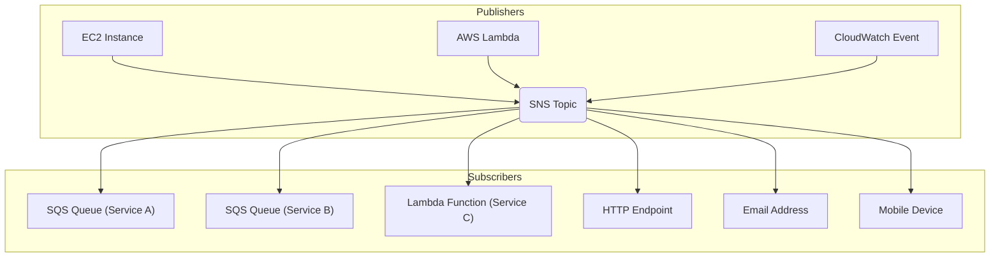
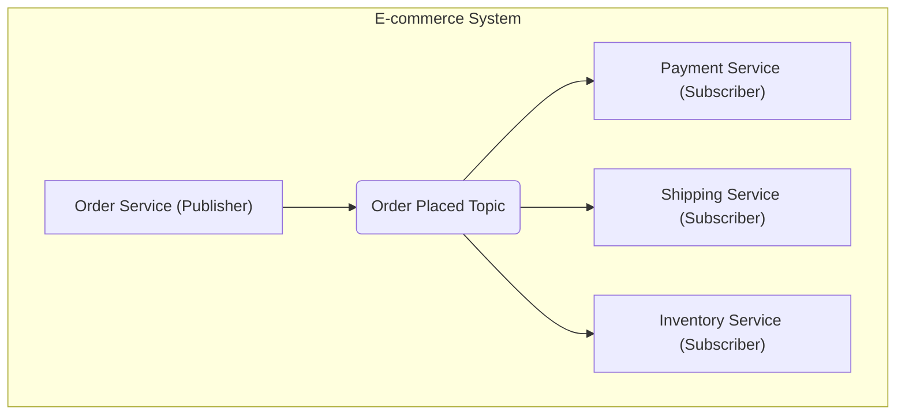
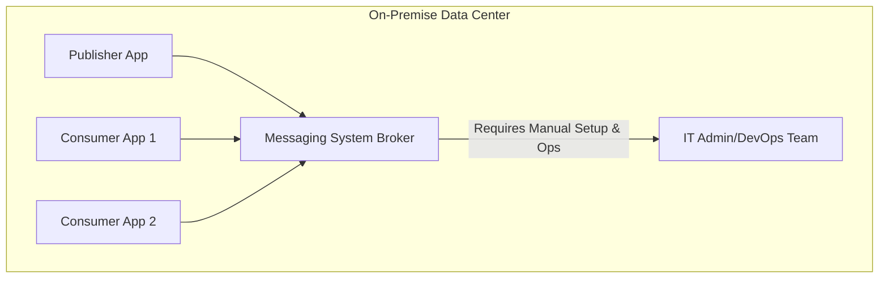

# Amazon SNS

## Amazon SNS

### 🚀 Overview&#x20;

**Amazon Simple Notification Service (Amazon SNS)** is a fully managed, serverless, publish-subscribe messaging service provided by AWS. It enables you to fan out messages to a large number of subscribers, including other AWS services, HTTP/HTTPS endpoints, email, and mobile devices. SNS is designed for decoupling microservices, enabling event-driven architectures, and building applications that can send notifications to users or other services.&#x20;

<figure><figcaption></figcaption></figure>

### ✨ Innovation Spotlight&#x20;

> Amazon SNS's core innovation lies in its **serverless, "fan-out" capability**. It allows a single message to be broadcast to a vast number of diverse endpoints simultaneously and reliably without you having to manage any underlying infrastructure. This capability simplifies complex event-driven workflows and eliminates the need for polling, reducing latency and improving system efficiency.

***

### 🛠Problem Statement & Business Use Cases

In many distributed systems and microservices architectures, there's a need for services to communicate asynchronously. A service might need to notify multiple other services about an event without needing to know which services are interested. For example, in an e-commerce system, a single "order placed" event might need to trigger actions in a payment service, a shipping service, an inventory service, and a customer notification service. Manually managing these direct connections can be complex, brittle, and difficult to scale.

**Example Scenario: E-commerce Order Processing** A large e-commerce platform needs to process orders efficiently. When a customer places an order, the system must perform several actions:

1. **Process payment.**
2. **Update inventory.**
3. **Initiate shipping.**
4. **Send an order confirmation email to the customer.**
5. **Notify the analytics team of the new transaction.**

Instead of having the "Order" service directly call each of these other services, the Order service can publish a single "Order Placed" message to an SNS topic. All the interested services subscribe to this topic and receive the message, allowing them to perform their tasks independently. This decoupling makes the system more resilient, scalable, and easier to maintain.

**Industries & Applications:**

* **E-commerce:** Order updates, inventory alerts, and shipping notifications.
* **Media & Entertainment:** Real-time content updates and live-streaming event notifications.
* **IoT (Internet of Things):** Device telemetry alerts, sensor data processing triggers.
* **Financial Services:** Transaction alerts, fraud detection notifications.

***

### 💡Core Principles

SNS operates on a **publish-subscribe (pub/sub)** model.

* **Topics:** A communication channel where publishers send messages. Topics are a logical access point that acts as a central hub for message distribution.
* **Publishers:** The entities that send messages to a topic.
* **Subscribers:** The endpoints that receive messages from a topic. SNS supports a wide variety of subscriber types, including:
  * **Amazon SQS Queues:** For reliable, asynchronous processing by applications.
  * **AWS Lambda Functions:** To trigger serverless functions in response to events.
  * **HTTP/S Endpoints:** To send messages to web servers or other services.
  * **Email:** To send notifications to email addresses.
  * **SMS:** To send text messages to mobile phone numbers.
  * **Mobile Push Notifications:** To send notifications to Android, iOS, and other mobile devices.

**Message Attributes:** You can add metadata to your messages in the form of attributes. Subscribers can use **message filtering** to receive only the messages they're interested in, reducing unnecessary processing.

**Standard vs. FIFO Topics:**

* **Standard Topics:** The default type. They offer high throughput and best-effort message ordering. Messages may be delivered more than once.
* **FIFO Topics (First-In, First-Out):** Guarantees strict message ordering and ensures a message is delivered exactly once. This is crucial for applications where the order of operations matters, like financial transaction processing or log synchronization.

***

### 📋 Pre-Requirements

* **An AWS Account:** You need an active AWS account with the necessary permissions.
* **IAM User/Role:** An IAM user or role with permissions to create and manage SNS topics, subscriptions, and policies.
* **Subscriber Endpoints:** Depending on your use case, you'll need the resources you want to subscribe to the topic (e.g., an SQS queue, a Lambda function, or an email address).

***

### 🚀 Implementation Steps

Here's a step-by-step guide to setting up a standard SNS topic and subscribing an SQS queue to it:

1. **Create an SNS Topic:**
   * Go to the Amazon SNS console and choose **Topics**.
   * Click **Create topic**.
   * Choose **Standard** or **FIFO**. For this example, select **Standard**.
   * Give your topic a name (e.g., `OrderProcessingTopic`) and click **Create topic**.
2. **Create an SQS Queue:**
   * Go to the Amazon SQS console and click **Create queue**.
   * Choose **Standard** or **FIFO** (matching the SNS topic type).
   * Give your queue a name (e.g., `PaymentServiceQueue`).
   * Click **Create queue**.
3. **Create a Subscription:**
   * Go back to your SNS topic in the SNS console.
   * In the **Subscriptions** section, click **Create subscription**.
   * Select **SQS queue** as the protocol.
   * For the endpoint, paste the ARN of the SQS queue you created earlier.
   * Click **Create subscription**.
4. **Publish a Message:**
   * From the SNS topic details page, click **Publish message**.
   * Enter a subject and a message body (e.g., `Order Placed`).
   * Click **Publish message**.
   * The message will be immediately sent to the SQS queue, ready to be consumed by your application.

***

### 🗺️ Data Flow Diagram

#### Diagram 1: Basic Pub/Sub with Diverse Subscribers

This diagram illustrates the core fan-out capability of SNS. A single message published to a topic is sent to multiple different types of subscribers.

#### Diagram 2: Event-Driven Microservices

This diagram showcases how SNS can be used to decouple microservices, as described in the e-commerce example.

***

### 🔒 Security Measures

* **IAM Policies:** Use granular IAM policies to control who can create topics, publish messages, and subscribe endpoints. Apply the principle of least privilege.
* **Topic Access Policies:** Use topic policies to specify which publishers and subscribers can interact with a topic. For example, you can allow a specific SQS queue to subscribe to a topic.
* **Encryption:**
  * **Encryption in transit:** All communication to and from SNS is secured using SSL/TLS.
  * **Encryption at rest:** Use **server-side encryption (SSE)** with AWS KMS to encrypt messages in the topic. This protects sensitive data while it's waiting to be delivered.
* **VPC Endpoints:** Use VPC endpoints to allow private access to SNS from within your VPC, avoiding exposure to the public internet.

***

### 📊 Related AWS Services

* **Amazon SQS:** Often used with SNS. SNS handles the fan-out, and SQS provides durable, reliable queues for subscribers to consume messages at their own pace. This combination is a powerful pattern for building scalable, decoupled systems.
* **AWS Lambda:** SNS can directly invoke Lambda functions, enabling a serverless, event-driven architecture where messages trigger code execution without provisioning servers.
* **Amazon CloudWatch:** SNS can be used as a notification channel for CloudWatch alarms, allowing you to trigger actions (like sending an email or text message) when a metric threshold is breached.

***

### 🤔 When to use and when not to use

**When to Use Amazon SNS:**

* **Decoupling Microservices:** For asynchronous communication between services where one-to-many messaging is needed.
* **Notification Services:** To send messages to a variety of endpoints, including email, SMS, and mobile push.
* **Event-Driven Architectures:** When an event needs to trigger multiple actions across different systems.
* **Real-time Alerts:** For sending alerts from monitoring systems like CloudWatch or other services.

**When NOT to Use Amazon SNS:**

* **Point-to-Point Messaging:** If you only need to send a message from one service to exactly one other service, a simple SQS queue might be a better and more straightforward choice.
* **Complex Message Routing:** For complex routing logic based on message content, you might consider services like **Amazon EventBridge** which provides advanced event filtering and schema-based routing capabilities.
* **Traditional Enterprise Messaging:** If you need features like request-reply patterns or guaranteed transactional behavior, a full-featured message broker like **Amazon MQ** might be more appropriate.

***

### 💰 Costing Calculation

Amazon SNS is a cost-effective, pay-per-use service with no upfront fees. Pricing is based on the number of messages you publish and the number of notifications you deliver.

* **Publishing:** You pay per 1 million requests (API calls).
* **Delivery:** You pay per 1 million deliveries. The cost varies by endpoint type:
  * **HTTP/S, SQS, Lambda:** The delivery cost is generally low.
  * **Email/SMS:** Costs are higher per message due to carrier and third-party fees.
  * **Mobile Push Notifications:** Typically very low or free.

**Efficient Cost Management:**

* **Use Filtering:** Implement message filtering to ensure messages are only delivered to subscribers who need them, reducing delivery costs.
* **Batching:** If possible, batch multiple messages into a single publish request to reduce API call costs.

**Sample Calculation:** Assume you have a system that publishes 10 million messages per month. Each message is delivered to an SQS queue and an HTTP endpoint.

* **Publishing Cost:** `10 million` messages / `1 million` requests = `10 units` \* `$0.50` = `$5.00`
* **Delivery Cost (SQS):** `10 million` deliveries / `1 million` deliveries = `10 units` \* `$0.60` = `$6.00`
* **Delivery Cost (HTTP):** `10 million` deliveries / `1 million` deliveries = `10 units` \* `$0.60` = `$6.00`
* **Total Estimated Monthly Cost:** `$5.00 + $6.00 + $6.00` = **`$17.00`**

***

### 🔁 Alternative Services in AWS/Azure/GCP/On-Premise

| Feature                | Amazon SNS                            | Azure Service Bus (Topics)                           | GCP Pub/Sub                      | On-Premise (e.g., RabbitMQ, Kafka)                      |
| ---------------------- | ------------------------------------- | ---------------------------------------------------- | -------------------------------- | ------------------------------------------------------- |
| **Managed Service**    | Fully Managed (Serverless)            | Fully Managed                                        | Fully Managed                    | Self-Managed                                            |
| **Messaging Model**    | Pub/Sub, fan-out                      | Pub/Sub, Request-Reply                               | Pub/Sub                          | Pub/Sub (Kafka), Queues (RabbitMQ)                      |
| **Scalability**        | Unlimited automatic scaling           | Automatic scaling                                    | Unlimited automatic scaling      | Manual scaling, cluster management required             |
| **Pricing**            | Pay-per-use (publish & delivery)      | Pay-per-use (operations, data volume)                | Pay-per-use (data volume)        | High upfront cost for hardware and operational overhead |
| **Key Differentiator** | Powerful fan-out to diverse endpoints | Advanced enterprise messaging features, more robust. | Simple, highly scalable, global. | Total control, but with high operational burden.        |

#### On-Premise Alternative Data Flow

This diagram shows how a self-managed, on-premise messaging system would function, highlighting the need for manual setup and management.

***

### ⭐ Benefits

* **Scalability:** SNS automatically scales to handle any volume of messages, from a single message to billions per day, with no infrastructure management required.
* **Cost-Effective:** It's a pay-per-use model, so you only pay for what you use, without having to provision and manage servers.
* **Reliability:** SNS is highly durable and fault-tolerant, with messages stored across multiple Availability Zones.
* **Decoupling:** It allows for building decoupled, event-driven architectures, which are more resilient and easier to maintain.
* **Variety of Endpoints:** Supports a wide range of subscriber types, making it highly versatile for various use cases.

***

### 🧐 Message Filtering & Attributes

A key advanced feature of Amazon SNS is **message filtering**. This allows subscribers to receive only a subset of the messages published to a topic. By adding attributes (key-value pairs) to a message when you publish it, you can define a filter policy on the subscription. For example, in an e-commerce system, a `ShippingService` could subscribe to the `Order Placed Topic` but set a filter policy to only receive messages where the `Country` attribute is `USA`, ignoring international orders. This significantly reduces the volume of messages and processing load on the subscribing services, leading to cost savings and improved efficiency.

***

### 📝 Summary

Amazon SNS is a powerful, serverless, and highly scalable publish-subscribe service that simplifies the process of sending notifications to a wide array of endpoints. It's a foundational service for building resilient, decoupled, and event-driven architectures on AWS.

**Top 5 Things to Keep in Mind:**

1. **Fan-Out is the Core Use Case:** SNS is best for one-to-many communication, where a single message needs to reach multiple subscribers.
2. **SNS + SQS is a Powerful Pattern:** Use SNS for fan-out and SQS for durable, reliable queueing to build robust, asynchronous workflows.
3. **Choose the Right Topic Type:** Use Standard topics for high-throughput, best-effort delivery and FIFO topics for strict ordering and exactly-once delivery.
4. **Leverage Message Filtering:** Use message attributes and filter policies to reduce the message load on subscribers and improve efficiency.
5. **Secure Your Topics:** Use IAM and topic access policies, along with encryption, to control who can publish and subscribe to your topics.

***

### 📚 Related Topics

* **Amazon SQS Developer Guide:** [https://docs.aws.amazon.com/sqs/latest/dg/welcome.html](https://www.google.com/search?q=https://docs.aws.amazon.com/sqs/latest/dg/welcome.html)
* **AWS Lambda Developer Guide:** [https://docs.aws.amazon.com/lambda/latest/dg/welcome.html](https://docs.aws.amazon.com/lambda/latest/dg/welcome.html)
* **Amazon EventBridge User Guide:** [https://docs.aws.amazon.com/eventbridge/latest/userguide/what-is-eventbridge.html](https://www.google.com/search?q=https://docs.aws.amazon.com/eventbridge/latest/userguide/what-is-eventbridge.html)
* **AWS Whitepaper on Messaging Options:** [https://d1.awsstatic.com/whitepapers/aws-messaging-options.pdf](https://www.google.com/search?q=https://d1.awsstatic.com/whitepapers/aws-messaging-options.pdf)
