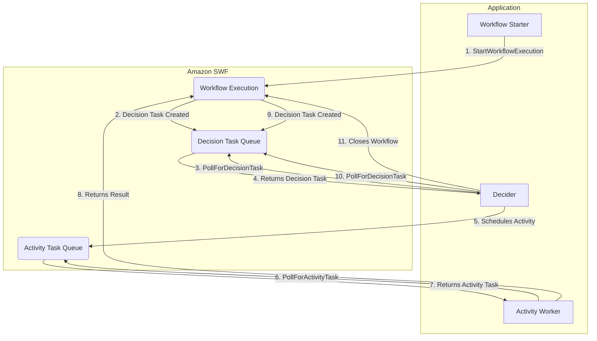
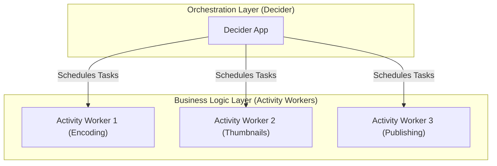
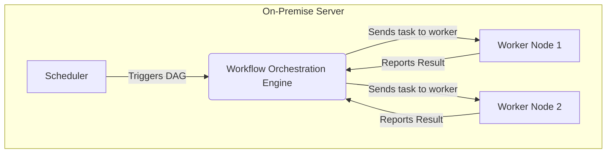

# Amazon SWF

## Amazon Simple Workflow Service

### 🚀 Overview

**Amazon Simple Workflow Service (SWF)** is a fully managed service that helps developers coordinate, track, and scale background jobs with parallel or sequential steps. You can think of it as a state tracker and task coordinator for distributed applications. Unlike a message queue that simply passes messages, SWF maintains the complete state of a workflow, ensuring that tasks are executed in the correct order, handling failures, and providing a full audit trail.

<figure><figcaption></figcaption></figure>

### ✨ Innovation Spotlight

> The primary innovation of SWF is its **explicit separation of workflow logic from business logic**. This allows developers to use a "decider" program to manage the flow of tasks, retries, and conditional logic, while the "activity workers" simply execute the actual business code. This separation makes it easier to manage, maintain, and scale complex, multi-step processes without tightly coupling components.

***

### 🛠️ Problem Statement & Business Use Cases

Many modern applications are composed of distributed, asynchronous components. Coordinating these components to perform a complex, multi-step task can be challenging. You have to handle task dependencies, failures, retries, and ensure the process can be audited. A simple message queue isn't enough because it doesn't maintain the state of the overall workflow.

**Example Scenario: Video Encoding Pipeline** A media company needs to process and encode user-uploaded videos. The process involves multiple steps:

1. **Ingest the video file** from a user's upload.
2. **Encode the video** into different formats (e.g., 480p, 720p, 1080p).
3. **Create thumbnails** at various timestamps.
4. **Publish the video and thumbnails** to a content delivery network (CDN).
5. **Notify the user** that the video is ready.

This workflow is complex and prone to failures (e.g., an encoding task times out). Using Amazon SWF, the company can orchestrate this entire pipeline. The decider controls the flow—if an encoding task fails, it can automatically retry it. If it fails repeatedly, the decider can trigger an alert or a different fallback process.

**Industries & Applications:**

* **Media Processing:** Video and image encoding, content publishing.
* **E-commerce:** Multi-step order fulfillment, payment processing.
* **Human Workflows:** Processes that require human input or approval (e.g., product catalog moderation).
* **Data Processing:** ETL (Extract, Transform, Load) jobs and analytics pipelines.

***

### 💡Core Principles

SWF is built around four core components:

* **Workflows:** The logical series of steps, or "activities," that an application performs. A workflow execution represents a single, specific run of a workflow.
* **Actors:** The components that participate in a workflow.
  * **Workflow Starters:** The application or event that initiates a workflow execution.
  * **Deciders:** The program that implements the workflow's logical flow. It receives "decision tasks" from SWF and responds by telling SWF what to do next (e.g., schedule a new activity, close the workflow, or cancel a task).
  * **Activity Workers:** The programs that perform the actual business logic of an activity. They poll SWF for tasks, execute the work, and report the results.
* **Domains:** A logical container for your workflows, activities, and workflow executions. It helps to isolate and manage groups of related resources.
* **Tasks:** A unit of work for an actor. SWF has two types of tasks:
  * **Decision Tasks:** Given to a decider to process and decide the next steps.
  * **Activity Tasks:** Given to an activity worker to perform a specific action.

***

### 📋 Pre-Requirements

* **An AWS Account:** You need an active AWS account.
* **IAM User/Role:** An IAM user or role with permissions to interact with Amazon SWF. This includes permissions for `StartWorkflowExecution`, `PollForDecisionTask`, and `PollForActivityTask`, among others.
* **Application Components:** You must write the code for your workflow starter, deciders, and activity workers. This code can be written in any programming language and can run on-premises or on AWS resources like EC2 instances.

***

### 🚀Implementation Steps&#x20;

Here is a high-level guide to setting up a simple SWF workflow:

1. **Create a Domain:** In the Amazon SWF console, create a domain to contain your workflow resources.
2. **Register Workflow and Activity Types:** Use the SWF API or console to register your workflow and activity types within the domain. This defines the names and versions of your workflow and activities.
3. **Implement Your Activity Workers:** Write the code that performs the specific tasks (e.g., an encoding script). The workers will poll SWF for activity tasks.
4. **Implement Your Decider:** Write the program that contains your workflow's logic. This decider will poll for decision tasks and instruct SWF to schedule activities based on the workflow state.
5. **Start a Workflow Execution:** Use a workflow starter application to initiate an execution of your registered workflow. This will trigger the first decision task.

***

### 🗺️ Data Flow Diagram

### Diagram 1: Amazon SWF Workflow Execution

This diagram shows the full lifecycle of a single workflow execution with the roles of the different actors.

### Diagram 2: The Decoupled Architecture

This diagram illustrates the logical separation of the decider and the activity workers.

***

### 🔒 Security Measures

* **IAM Roles and Policies:** Use specific IAM roles for your workflow starters, deciders, and activity workers. Grant them only the minimum necessary permissions to interact with SWF and other services they need to access.
* **VPC Endpoints:** Access SWF from within a private VPC using VPC endpoints to avoid exposing your workflow traffic to the public internet.
* **Encryption:** While SWF data is encrypted at rest by default, ensure that data passed between your application components and SWF is secured using SSL/TLS.
* **Code Signing:** If you use Lambda as a component, ensure you sign your Lambda code to verify its integrity.

***

### 📊 SWF vs. AWS Step Functions vs. SQS

Choosing the right service for a workflow depends on your use case.

* **Amazon SWF:** Provides a high degree of **programmatic control** over a workflow. It's ideal for **long-running, complex, human-involved, or legacy processes** where you need a great deal of customization and the ability to manage state at a very granular level.
* **AWS Step Functions:** A more modern, serverless alternative that uses a declarative, visual workflow language (Amazon States Language). It is generally preferred for **new applications, microservices orchestration, and serverless workflows**. It abstracts away much of the complexity of managing deciders and is easier to use.
* **Amazon SQS:** A simple message queue. It's for **decoupling components** and handling simple asynchronous tasks. It does not manage state, dependencies, or provide an audit trail of a full workflow. You would have to build that logic yourself on top of SQS.

***

### 🤔 When to use and when not to use

**When to Use Amazon SWF:**

* **Long-Running Processes:** When your workflow steps take a long time (more than a few seconds), potentially up to a year.
* **Human-Involved Workflows:** If a step in your workflow requires human input or intervention.
* **High-Level of Control:** When you need very fine-grained control over the workflow logic and state, handling complex branching and conditional logic.
* **Hybrid Architectures:** When your application components run on-premises, and you want a managed service to coordinate them with cloud services.

**When NOT to Use Amazon SWF:**

* **New Serverless Applications:** For most new projects, especially those using Lambda, **AWS Step Functions** is the recommended choice due to its simplicity, visual nature, and native integrations with over 200 AWS services.
* **Simple Asynchronous Tasks:** For simple decoupling tasks, **Amazon SQS** is much more cost-effective and easier to implement.

***

### 💰 Costing Calculation

Amazon SWF pricing is based on three main metrics:

1. **Workflow Executions:** You are charged for each workflow execution that is initiated.
2. **Workflow-Days:** The number of days a workflow execution is open or retained. A "workflow-day" is a 24-hour period.
3. **Task Usage:** You are charged for each task (decision and activity) that is processed.

**Efficient Cost Management:**

* **Keep workflows short:** Close workflows as soon as they are completed to avoid accruing `workflow-day` charges.
* **Optimize task count:** Design your workflow to minimize the number of tasks processed, as this is a key cost driver.
* **Leverage the Free Tier:** AWS provides a generous free tier for SWF, which is a great way to experiment with the service.

**Sample Calculation:** Suppose you have a workflow that runs 100 times per month. Each execution takes 2 days and involves 50 tasks (10 decision tasks and 40 activity tasks).

* **Workflow Executions:** `100` executions \* `$0.0001` per execution = `$0.01`
* **Workflow-Days:** `100` executions \* `2` days/execution \* `$0.000005` per day = `$0.001`
* **Task Usage:** `100` executions \* `50` tasks/execution \* `$0.000005` per task = `$0.025`
* **Total Estimated Monthly Cost:** `$0.01 + $0.001 + $0.025` = **`$0.036`** (This is a simplified example; actual costs may vary based on specific usage).

***

### 🔁 Alternative Services in AWS/Azure/GCP/On-Premise

| Feature                 | Amazon SWF                              | AWS Step Functions                           | Azure Logic Apps                         | GCP Cloud Workflows                   | On-Premise (e.g., Apache Airflow, Camunda)   |
| ----------------------- | --------------------------------------- | -------------------------------------------- | ---------------------------------------- | ------------------------------------- | -------------------------------------------- |
| **Managed Service**     | Fully Managed                           | Fully Managed (Serverless)                   | Fully Managed                            | Fully Managed                         | Self-Managed                                 |
| **Orchestration Model** | Programmatic (Deciders)                 | Visual (State Machine)                       | Visual (Designer)                        | Declarative (YAML/JSON)               | Programmatic or Visual                       |
| **Use Case**            | Complex, long-running, custom workflows | Serverless microservices, business processes | Enterprise integration, visual workflows | Connecting GCP services, event-driven | Maximum control, specific compliance needs   |
| **Learning Curve**      | High                                    | Low to Medium                                | Low                                      | Low to Medium                         | High                                         |
| **Cost Model**          | Pay-per-use (execs, days, tasks)        | Pay-per-state-transition                     | Pay-per-action/connector                 | Pay-per-step executed                 | High upfront cost for infrastructure and Ops |

#### On-Premise Alternative Data Flow

This diagram shows how a self-managed orchestration engine like Apache Airflow would coordinate tasks, highlighting the manual setup and maintenance.

***

### ⭐ Benefits

* **Reliability:** SWF durably stores workflow state, ensuring your application is resilient to failures. If a worker fails, SWF can automatically reassign the task.
* **Scalability:** It automatically scales to handle any number of workflow executions and tasks.
* **Flexibility:** You have complete control over the workflow logic and can use any programming language for your workers and deciders.
* **Auditing:** SWF maintains a full, searchable history of every workflow execution, which is invaluable for debugging and auditing.
* **Logical Separation:** Promotes a clean separation of concerns, allowing teams to independently manage the business logic and the workflow coordination.

***

### 🔍 Visibility & Monitoring

SWF provides a powerful visibility API and a console interface to monitor your workflows. You can:

* **View workflow execution history:** See a detailed log of every event that occurred in a workflow run. This is crucial for debugging.
* **Search for workflows:** Filter and search for specific workflow executions by ID, status, or tags.
* **View open tasks:** See which tasks are pending and where bottlenecks might exist.
* **View metrics:** Use Amazon CloudWatch to monitor key metrics like the number of running workflows or the latency of decision tasks.

This visibility is a major advantage over a simple queue, as it provides a clear, high-level view of the entire business process.

***

### 📝 Summary

Amazon SWF is a durable and highly reliable workflow orchestration service designed for complex, long-running processes that require explicit state management. While more modern services like AWS Step Functions have become the preferred choice for new, serverless applications, SWF remains a powerful tool for specific use cases, particularly those involving human-in-the-loop tasks or hybrid cloud architectures.

**Top 5 Things to Keep in Mind:**

1. **SWF is for Control:** Choose it when you need granular, programmatic control over every aspect of your workflow.
2. **Decoupling is Key:** The service's strength lies in its separation of the decider (workflow logic) and activity workers (business logic).
3. **It’s Not Serverless:** Unlike Step Functions, your deciders and workers are custom code that must be hosted on compute resources (e.g., EC2).
4. **Long-Running Tasks:** It is purpose-built for tasks that take seconds, minutes, or even days to complete.
5. **Auditability is a Benefit:** The full execution history provides an invaluable tool for debugging and auditing.

***

### 📚 Related Topics

* [AWS Simple Workflow Service vs AWS Step Functions](https://www.google.com/search?q=https://www.youtube.com/watch%3Fv%3DkR2wLp_XpWw) This video provides a comparison between Amazon SWF and AWS Step Functions, which are both used for workflow orchestration on AWS.
