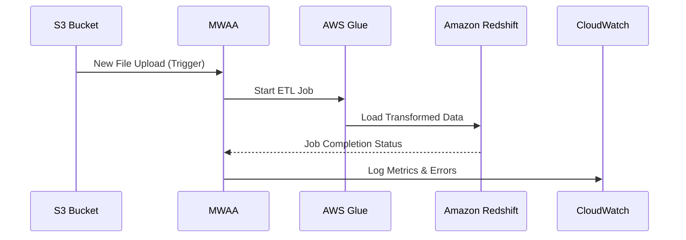
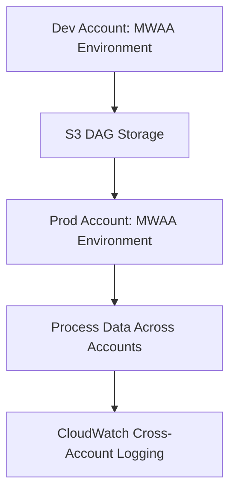

# Apache Airflow

## Apache AirFlow

### Amazon Managed Workflows for Apache Airflow (MWAA)

### 🌟 The Complete Guide to Serverless Data Orchestration\*\*

Amazon Managed Workflows for Apache Airflow  (MWAA) is a **fully managed service** that simplifies the deployment and operation of **Apache Airflow** on AWS. It enables developers and data engineers to build, schedule, and monitor complex data workflows without managing the underlying infrastructure, ensuring scalability, security, and reliability.

<figure><figcaption></figcaption></figure>

***

### 🔍 **Problem Statement & Business Use Cases**

> &#x20;:globe\_with\_meridians: **Real-World Scenario**: A healthcare organization needs to process patient data from multiple sources (e.g., EHR systems, IoT devices) for analytics and compliance. Manually orchestrating ETL jobs, managing dependencies, and ensuring data consistency across systems is complex and error-prone. MWAA automates these workflows, reducing operational overhead and ensuring HIPAA compliance.

**Industries/Applications**:

* **Healthcare**: Automate patient data processing, compliance reporting, and integration with EHR systems.
* **Finance**: Orchestrate fraud detection pipelines, transaction processing, and regulatory reporting.
* **E-commerce**: Coordinate order processing, inventory updates, and personalized marketing campaigns.
* **IoT**: Ingest and process real-time sensor data for predictive maintenance and analytics.
* **Big Data**: Manage large-scale ETL workflows across AWS services like S3, Glue, and Redshift.

***

### ⚙️ **Core Principles & Key Components**

MWAA leverages Apache Airflow's core concepts while automating infrastructure management:

* **Directed Acyclic Graphs (DAGs)**: Define workflows as code (Python) with tasks and dependencies.
* **Operators**: Pre-built components for tasks (e.g., `PythonOperator`, `BashOperator`) or AWS services (e.g., `S3Operator`, `GlueJobOperator`).
* **Scheduling**: Execute DAGs on-demand or via cron expressions.
* **Managed Infrastructure**: AWS handles Airflow setup, scaling, patching, and monitoring.

#### **Architecture**:

* **Scheduler/Worker Hybrid**: For smaller environments (e.g., `mw1.micro`), MWAA combines scheduler and worker into a single container for cost efficiency.
* **Web Server**: Provides access to the Airflow UI via public or private VPC endpoints.
* **Metadatabase**: Uses Amazon Aurora PostgreSQL to store workflow metadata.
* **Integration**: Supports 200+ AWS services and third-party tools (e.g., Hadoop, Spark) via Airflow plugins.

***

### 📋 **Pre-Requirements**

* **AWS Account**: With IAM permissions to create MWAA environments, S3 buckets, and VPC resources.
* **S3 Bucket**: Store DAGs, plugins, and dependency files (`requirements.txt`).
* **VPC Configuration**: Deploy MWAA in a VPC with public/private subnets for network isolation.
* **IAM Roles**: Define execution roles for MWAA to access AWS services (e.g., S3, Glue, Lambda).

***

### 🛠️ I**mplementation Steps**

1. **Create S3 Bucket**:
   * Upload DAGs, plugins, and `requirements.txt` to designated folders (e.g., `dags/`, `plugins/`).
2. **Configure VPC**:
   * Use existing VPC or create a new one with public/private subnets.
3. **Set Up MWAA Environment**:
   * Specify Airflow version, environment class (e.g., `mw1.micro` for development), and S3 paths.
4. **Define DAGs**:
   * Write Python scripts to orchestrate workflows (e.g., trigger Glue jobs, process S3 data).
5. **Monitor Workflows**:
   * Use Airflow UI and CloudWatch logs to track task execution and debug issues.

***

### 🔄 **Data Flow Diagram**

**Diagram 1: ETL Pipeline with MWAA**

**Diagram 2: Multi-Account MWAA Deployment**

***

### 🔒 **Security Measures**

* **Encryption**: Data encrypted at rest (AWS KMS) and in transit (TLS).
* **Network Isolation**: Deploy MWAA in a VPC with security groups and NACLs for traffic control.
* **IAM Policies**: Least-privilege access for MWAA execution roles.
* **Private Endpoints**: Use VPC endpoints to access AWS services without internet exposure.

***

### 💡 **Innovation Spotlight: Micro Environments & Cost Optimization**

* **Micro Environment Class (`mw1.micro`)**:
  * **Cost-Effective**: Ideal for development/testing with 1 vCPU, 3GB RAM, and support for up to 25 DAGs.
  * **Hybrid Scheduler/Worker**: Combines components into a single container to reduce resource usage.
  * **Use Cases**: Small-scale workflows, proof-of-concepts, and isolated team environments.
* **Generative AI Integration**: Use Amazon Bedrock to auto-generate DAG code for common workflows.

***

### ⚖️ **When to Use and When Not to Use**

| **When to Use**                                                                         | **When NOT to Use**                                                                  |
| --------------------------------------------------------------------------------------- | ------------------------------------------------------------------------------------ |
| **Complex Workflows**: Orchestrating multi-step ETL/ML pipelines across AWS services.   | **Simple Cron Jobs**: Basic scheduling without dependencies (use CloudWatch Events). |
| **Hybrid Environments**: Integrating on-premises systems with cloud resources.          | **Real-Time Streaming**: High-throughput data streaming (use Kinesis or Kafka).      |
| **Cost-Sensitive Development**: Leveraging `mw1.micro` for testing and small workloads. | **Static Workflows**: Infrequent tasks with minimal operational overhead.            |

***

### 💰 **Costing Calculation**

* **Pricing Model**:
  * **Environment Class**: From `mw1.micro` ($0.11/hour) to `mw1.large` ($1.10/hour).
  * **Metadata Storage**: $0.10/GB-month for Aurora PostgreSQL.
* **Cost Optimization**:
  * Use `mw1.micro` for development/testing to reduce costs by 70-80%.
  * Archive old DAGs and logs to S3 Glacier for long-term storage.
* **Example Calculation**:
  * `mw1.micro` environment + 10 GB metadata storage = $80/month + $1/month = **$81/month**.

***

### 🔁 **Alternative Services**

| **AWS**                                              | **Azure**                                     | **GCP**                                    | **On-Premise**                                       |
| ---------------------------------------------------- | --------------------------------------------- | ------------------------------------------ | ---------------------------------------------------- |
| **Amazon MWAA**                                      | **Azure Data Factory**                        | **Google Cloud Composer**                  | **Apache Airflow**                                   |
| Native AWS integration, serverless, managed service. | Low-code UI, Microsoft ecosystem integration. | Managed Airflow, GCP-centric integrations. | Self-managed, full control but operational overhead. |

***

### ✅ **Benefits**

* **Reduced Operational Overhead**: AWS manages provisioning, scaling, and patching.
* **Scalability**: Automatically scales workers based on workload demand.
* **Security**: Built-in encryption, IAM integration, and VPC isolation.
* **Cost-Efficiency**: Pay-per-use pricing with no upfront costs.
* **Extensibility**: Support for custom plugins and 200+ AWS services.

***

### 🚀 **Innovation Spotlight: AWS Integration & Auto-Scaling**

* **Seamless AWS Integration**:
  * **AWS Glue**: Orchestrate ETL jobs without managing Spark clusters.
  * **Amazon SageMaker**: Train and deploy ML models within workflows.
  * **EventBridge**: Trigger DAGs based on events (e.g., S3 uploads).
* **Auto-Scaling Workers**: Dynamically adjusts resources to handle task queues, reducing latency during peak loads.

***

### 📊 **Summary**

Amazon MWAA simplifies Airflow-based workflow orchestration by providing a fully managed, secure, and scalable service. Key takeaways:

1. **Ideal for Complex Pipelines**: Coordinate ETL, ML, and hybrid workflows across AWS and on-premises systems.
2. **Leverage Micro Environments**: Use `mw1.micro` for development/testing to optimize costs.
3. **Ensure Security**: Deploy in VPCs with encryption and IAM policies for compliance.
4. **Monitor with CloudWatch**: Track performance, errors, and resource utilization.
5. **Explore Integrations**: Use pre-built operators for AWS services to accelerate development.

***

### 🔗 **Related Topics & References**

* [**MWAA Documentation**](https://docs.aws.amazon.com/mwaa/latest/userguide/what-is-mwaa.html): Detailed guides on setup, DAG creation, and troubleshooting.
* [**Airflow Operators for AWS**](https://airflow.apache.org/docs/apache-airflow-providers-amazon/stable/operators/mwaa.html): Reference for AWS-specific operators and sensors.
* [**Cost Optimization Guide**](https://aws.amazon.com/blogs/big-data/introducing-amazon-mwaa-micro-environments-for-apache-airflow/): Best practices for using `mw1.micro` environments.
* [**HIPAA Compliance**](https://aws.amazon.com/compliance/hipaa-eligible-services-reference/): Ensure healthcare workflows meet regulatory requirements.

For hands-on learning, try the [**MWAA Workshop**](https://docs.aws.amazon.com/mwaa/latest/userguide/getting-started.html) or explore [**sample DAGs**](https://github.com/aws-samples/aws-mwaa-examples) for common use cases.
