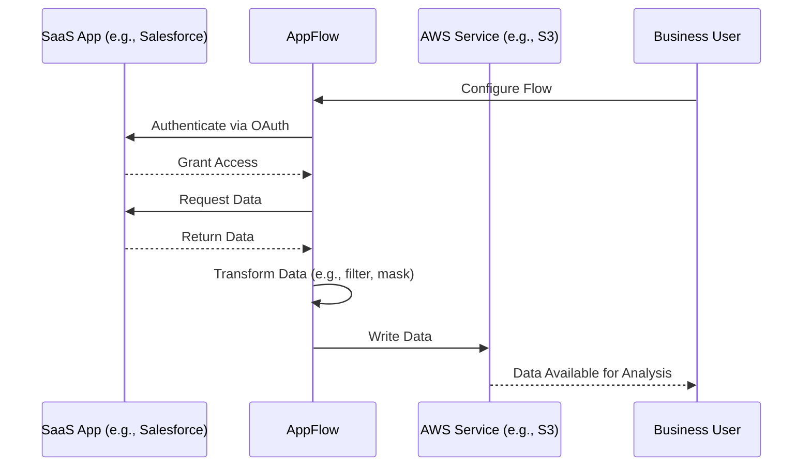
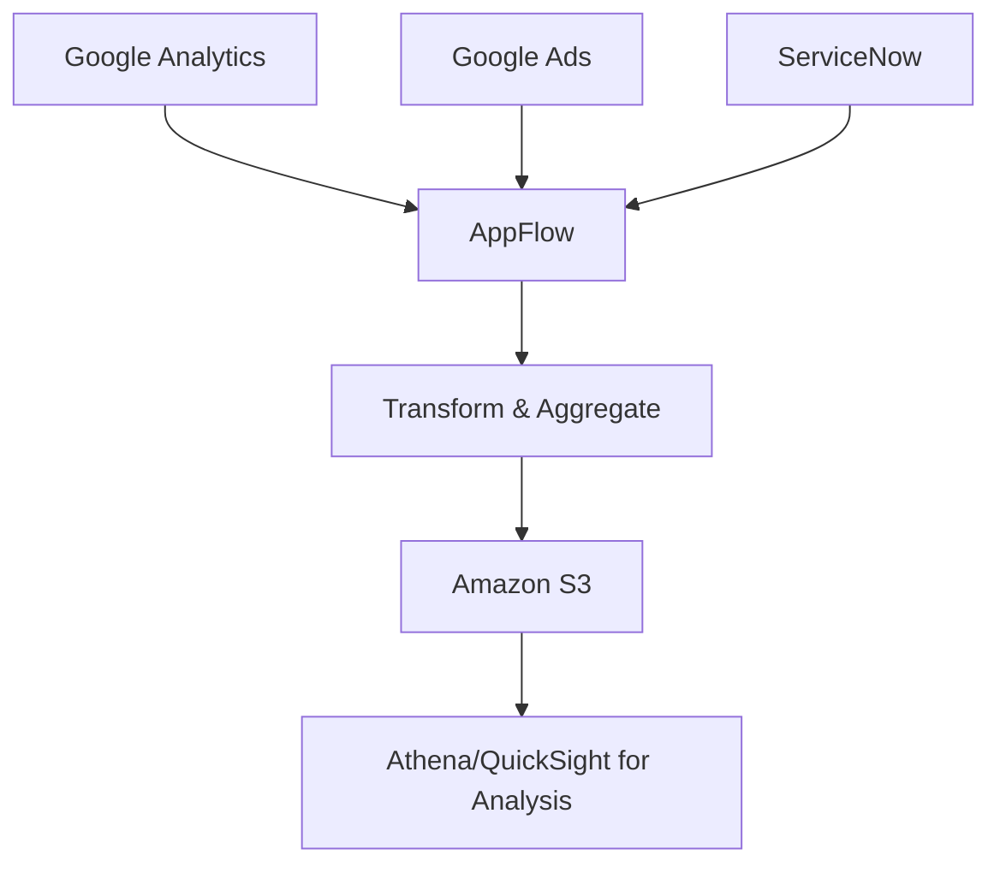

# App Flow

## Amazon AppFlow

### 🌟 **Amazon AppFlow: The Complete Guide to SaaS Data Integration on AWS**

Amazon AppFlow  is a **fully managed integration service** that enables secure and scalable data transfer between Software-as-a-Service (SaaS) applications (e.g., Salesforce, ServiceNow, Slack, Google Analytics) and AWS services (e.g., Amazon S3, Amazon Redshift). It simplifies data integration without requiring custom code, making it accessible to business users and developers alike.

<figure><figcaption></figcaption></figure>

***

### 🔍 **Problem Statement & Business Use Cases**

> :globe\_with\_meridians: **Real-World Scenario**: A marketing team needs to consolidate data from multiple SaaS applications (e.g., Google Analytics, Salesforce, Slack) into a centralized data lake on AWS for analysis. Manually exporting and integrating data is time-consuming, error-prone, and lacks real-time capabilities. AppFlow automates this process, ensuring data is always up-to-date and actionable.

#### 🏢 **Industries/Applications**:

* **Marketing**: Integrate Google Analytics, Google Ads, and Facebook Ads data into Amazon S3 for analysis.
* **Finance**: Sync Salesforce CRM data with Amazon Redshift for financial reporting.
* **Healthcare**: Transfer patient data from SaaS applications to AWS for compliance and analytics.
* **Supply Chain**: Synchronize SAP data with AWS services for real-time inventory tracking.

***

### ⚙️ **Core Principles & Key Components**

* **Fully Managed Service**: No infrastructure to provision or manage; AWS handles scaling, monitoring, and maintenance.
* **Connectors**: Pre-built integrations for 50+ SaaS applications (e.g., Salesforce, Slack, SAP) and AWS services.
* **Data Flow**: Supports bidirectional data transfer (SaaS to AWS or AWS to SaaS).
* **Transformations**: Perform data masking, filtering, aggregation, and validation during transfer.
* **Triggers**: Execute flows on a schedule, on-demand, or in response to business events (e.g., new Salesforce lead).

***

### 📋 **Pre-Requirements**

* **AWS Account** with IAM permissions to configure AppFlow and access integrated services.
* **SaaS Credentials**: OAuth 2.0 tokens or API keys for connecting to SaaS applications.
* **Data Storage**: Configured AWS services (e.g., S3 buckets, Redshift clusters) as data destinations.

***

### 🛠️ **Implementation Steps**

1. **Create a Flow**:
   * In the AppFlow console, define the source (SaaS app) and destination (AWS service).
2. **Configure Connection**:
   * Authenticate with the SaaS application using OAuth 2.0 or API keys.
3. **Map Data Fields**:
   * Select specific fields to transfer and apply transformations (e.g., merge names, mask credit card numbers).
4. **Set Triggers**:
   * Choose between scheduled, on-demand, or event-based execution.
5. **Run and Monitor**:
   * Execute the flow and monitor performance using CloudWatch metrics.

***

### 🔄 **Data Flow Diagram**

**Diagram 1: AppFlow Integration with SaaS and AWS Services**

**Diagram 2: Real-Time Data Sync for Marketing Analytics**

***

### 🔒 **Security Measures**

* **Encryption**: Data encrypted in transit (TLS) and at rest (AWS KMS).
* **AWS PrivateLink**: Ensures data never traverses the public internet for supported SaaS apps.
* **IAM Policies**: Granular access control for flows and data.
* **Compliance**: HIPAA eligibility and SOC certification for regulated industries.

***

### 💡 **Innovation Spotlight: No-Code Integration and Custom Connectors**

* **No-Code UI**: Business users can configure data flows without developer assistance.
* **Custom Connectors**: Use the AppFlow SDK to build connectors for proprietary or unsupported applications.
* **Glue Data Catalog Integration**: Automatically catalog transferred data for discovery with AWS analytics services.

***

### ⚖️ **When to Use and When Not to Use**

| **When to Use**                                                                    | **When NOT to Use**                                                                         |
| ---------------------------------------------------------------------------------- | ------------------------------------------------------------------------------------------- |
| **SaaS to AWS Integration**: Regular data sync between SaaS apps and AWS services. | **Real-Time Streaming**: For millisecond-latency data streaming (use Kinesis instead).      |
| **Data Transformation**: Need to clean, mask, or aggregate data during transfer.   | **On-Premises Systems**: Integrating non-SaaS, on-premises databases (use AWS DMS instead). |
| **Event-Driven workflows**: Trigger data transfers based on business events.       | **Simple File Transfers**: One-time file uploads to S3 (use AWS CLI directly).              |

***

### 💰 **Costing Calculation**

* **Pricing Model**:
  * **Flow Runs**: $0.001 per successful flow run (even if no data is transferred).
  * **Data Processing**: $0.02 per GB of data processed.
* **Cost Optimization**:
  * Avoid frequent "check for data" runs if data updates are rare.
  * Use filtering to reduce unnecessary data transfer.
* **Example Calculation**:
  * 100 flow runs + 50 GB data processed = $0.10 + $1.00 = $1.10/month.

***

### 🔁 **Alternative Services**

| **AWS**                             | **Azure**                                     | **GCP**                      | **On-Premise**                                   |
| ----------------------------------- | --------------------------------------------- | ---------------------------- | ------------------------------------------------ |
| **AWS AppFlow**                     | **Azure Logic Apps**                          | **Google Cloud Data Fusion** | **Apache NiFi**                                  |
| Fully managed, 50+ SaaS connectors. | Low-code UI, Microsoft ecosystem integration. | GUI-based ETL/ELT pipelines. | Open-source, requires infrastructure management. |

***

### ✅ **Benefits**

* **No Infrastructure Management**: Fully serverless; scales automatically.
* **Ease of Use**: No-code UI for business users.
* **Cost-Effective**: Pay-per-use pricing; no upfront costs.
* **Security**: End-to-end encryption and PrivateLink support.
* **Integration**: Works with 50+ SaaS apps and AWS analytics services.

***

### 🚀 **Innovation Spotlight: Event-Driven Flows and AWS Integration**

* **Event-Driven Triggers**: Execute flows in response to business events (e.g., new support ticket in Zendesk).
* **AWS Glue Integration**: Automatically catalog data in the Glue Data Catalog for use with Athena and Redshift.
* **Custom Transformations**: Use AWS Lambda for advanced data processing during flows.

***

### 📊 **Summary**

Amazon AppFlow simplifies SaaS-to-AWS data integration with a fully managed, secure, and cost-effective service. Key takeaways:

1. **Use for SaaS Integration**: Ideal for syncing data between SaaS apps and AWS.
2. **No-Code Setup**: Business users can configure flows without coding.
3. **Pay-Per-Use Pricing**: Cost-effective for periodic data transfers.
4. **Secure**: Encryption and PrivateLink ensure data privacy.
5. **Event-Driven**: Trigger flows based on business events or schedules.

***

### 🔗 **Related Topics & References**

* [AWS AppFlow Documentation](https://docs.aws.amazon.com/appflow/)
* [AppFlow Pricing Examples](https://aws.amazon.com/appflow/pricing/)
* [Building a Marketing Data Lake with AppFlow](https://medium.com/@willyzhuang/)
* [AppFlow Security and Compliance](https://aws.amazon.com/appflow/features/)

For hands-on learning, try the [AppFlow Workshop](https://aws.amazon.com/getting-started/hands-on/create-data-flow-between-saas-app-and-amazon-s3/).

***

## :bookmark: Fact Check

🦄 Unique Interesting Facts

1. **Enterprise-Grade Data Transformations On-the-Fly**: Amazon AppFlow enables complex data transformations (like filtering, mapping, and aggregation) directly within the data flow _without requiring additional AWS services_, streamlining ETL processes for SaaS integrations.
2. **Real-Time Event-Driven Syncing**: Unlike batch-only tools, AppFlow supports _event-triggered data transfers_ (e.g., syncing new Salesforce records instantly when created), enabling true real-time operational workflows between SaaS applications.
3. **Native SaaS-to-AWS Service Integration**: It uniquely bridges SaaS platforms (like Slack or Salesforce) directly with AWS analytics/services (S3, Redshift), eliminating the need for intermediate staging or custom API coding.
4. **Automatic Data Partitioning for Large Volumes**: AppFlow intelligently partitions massive datasets during transfer, optimizing performance and cost by splitting data into manageable chunks before loading into destinations like Amazon S3.
5. **No-Code Enterprise Integration**: With its intuitive drag-and-drop interface, AppFlow empowers non-technical users to build secure, production-grade SaaS integrations—unlike traditional AWS services that often require coding expertise.

