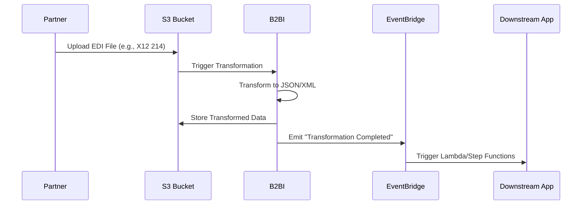
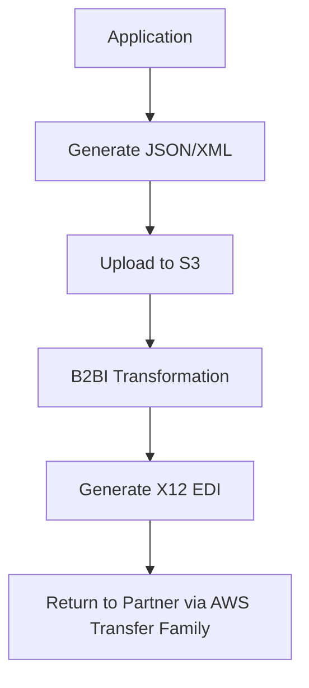

# B2B Data Interchange

## Amazon B2B Data Interchange&#x20;

### 🌟 **Amazon B2B Data Interchange: The Complete Guide to Modern EDI Transformation on AWS**

Amazon B2B Data Interchange  (AWS B2BI) is a **fully managed service** that automates the transformation and generation of **Electronic Data Interchange (EDI)** documents, enabling seamless business-to-business (B2B) transactions at scale. It simplifies the complexities of traditional EDI systems by providing a low-code interface, generative AI-assisted mapping, and native integration with AWS services, allowing organizations to focus on deriving insights rather than managing infrastructure.

<figure><figcaption></figcaption></figure>

***

### 🔍 **Problem Statement & Business Use Cases**

**Real-World Scenario**: A global healthcare provider needs to process insurance claims, enrollments, and patient data exchanges with thousands of partners. Traditional EDI systems are expensive, difficult to scale, and lack real-time visibility, leading to manual interventions, compliance risks, and delayed processing. AWS B2BI automates these workflows, ensuring HIPAA compliance, reducing errors, and accelerating transactions.

#### 🏢 **Industries/Applications**:

* **Healthcare**: Exchange protected health information (PHI) for claims processing, eligibility checks, and patient enrollments while maintaining HIPAA compliance.
* **Supply Chain & Logistics**: Automate purchase orders, shipping notices, and invoices with suppliers and logistics partners to enhance resiliency.
* **Financial Services**: Expedite mortgage applications, tax assessments, and other complex financial transactions securely.
* **Retail**: Streamline order fulfillment, inventory management, and supplier communications.

***

### ⚙️ **Core Principles & Key Components**

AWS B2BI transforms EDI documents (e.g., X12 standards) into JSON/XML and vice versa, using event-driven architectures and AI-assisted mapping.

#### **Key Concepts**:

* **Profiles**: Store contact details and metadata for your organization and trading partners.
* **Transformers**: Define how EDI documents are transformed to/from JSON/XML using **JSONata** (for JSON) or **XSLT** (for XML). Generative AI (via Amazon Bedrock) assists in creating mapping code, reducing development time by up to 50%.
* **Trading Capabilities**: Specify EDI direction (inbound/outbound), document types, and S3 locations for automated processing.
* **Partnerships**: Represent relationships with trading partners, linking profiles and trading capabilities for end-to-end workflow management.

#### **Supported Standards**:

* **X12 EDI**: Versions 4010 to 5010, including HIPAA transactions.
* **Unsupported Standards**: EDIFACT, HL7v2, CSV, and IDoc are not natively supported.

***

### 📋 **Pre-Requirements**

* **AWS Account** with IAM permissions for B2BI, S3, EventBridge, and related services.
* **S3 Buckets**: Configured for input (incoming EDI/JSON/XML) and output (transformed data) storage.
* **Trading Partner Agreements**: Define document types, formats, and communication protocols (e.g., SFTP/AS2 via AWS Transfer Family).

***

### 🛠️ **Implementation Steps**

1. **Create Profiles**:
   * Define your organization and trading partner details in B2BI.
2. **Configure Transformers**:
   * Specify EDI transaction sets (e.g., X12 214 for shipping notices) and use AI-assisted mapping to generate transformation logic.
3. **Set Up Trading Capabilities**:
   * Link transformers to S3 buckets for automated processing. Enable EventBridge on S3 to trigger transformations.
4. **Establish Partnerships**:
   * Combine profiles and trading capabilities to activate workflows.
5. **Integrate with AWS Ecosystem**:
   * Use EventBridge to trigger downstream actions (e.g., Lambda functions, Step Functions) for post-processing.
6. **Monitor via CloudWatch**:
   * Track document volumes, errors, and performance metrics.

***

### 🔄 **Data Flow Diagram**

**Diagram 1: Inbound EDI Processing**

**Diagram 2: Outbound EDI Generation**

***

### 🔒 **Security Measures**

* **Encryption**: Data encrypted at rest (S3 SSE/KMS) and in transit (TLS).
* **HIPAA Compliance**: Built-in for healthcare workloads.
* **AWS PrivateLink**: Secure connectivity to avoid public internet exposure.
* **IAM Policies**: Least-privilege access control for B2BI resources.

***

### 💡 **Innovation Spotlight: Generative AI & Event-Driven Architecture**

* **Generative AI Mapping**: Leverages Anthropic’s Claude models (via Bedrock) to auto-generate mapping code, reducing manual effort by 50%.
* **Splitting Large Files**: Processes multi-transaction EDI files up to **5GB** (recently upgraded from 150MB), splitting them into individual transactions for independent processing.
* **Event-Driven Automation**: Integrates with EventBridge to trigger real-time workflows (e.g., AWS Glue ETL, Lambda functions) for downstream processing.

***

### ⚖️ **When to Use and When Not to Use**

| **When to Use**                                                                      | **When NOT to Use**                                                                               |
| ------------------------------------------------------------------------------------ | ------------------------------------------------------------------------------------------------- |
| **High-Volume EDI Workflows**: Automating thousands of daily transactions.           | **Non-EDI Formats**: Needs for CSV, EDIFACT, or HL7v2 (unsupported).                              |
| **Regulated Industries**: Healthcare, finance, or supply chain requiring compliance. | **Simple File Transfers**: Basic SFTP/AS2 without transformation (use AWS Transfer Family alone). |
| **Real-Time Processing**: Event-driven integrations with AWS analytics/AI services.  | **On-Premises Systems**: Legacy EDI systems without cloud integration.                            |

***

### 💰 **Costing Calculation**

* **Pricing Model**:
  * **Partnership Fee**: $8.00 per partnership per month.
  * **Transformation Cost**: $0.01 per 200KB of data processed.
* **Cost Optimization**:
  * Use **data filtering** to reduce unnecessary transformations.
  * **Archive processed data** to S3 Glacier for long-term storage.
* **Example Calculation**:
  * 10 partnerships + 10GB data processed monthly = $80 + ($0.01 \* 50,000 units) = $80 + $500 = **$580/month**.

***

### 🔁 **Alternative Services**

| **AWS**                                               | **Azure**                                     | **GCP**                                 | **On-Premise**                                   |
| ----------------------------------------------------- | --------------------------------------------- | --------------------------------------- | ------------------------------------------------ |
| **AWS B2BI**                                          | **Azure Logic Apps**                          | **Google Cloud Data Fusion**            | **IBM Sterling B2B Integrator**                  |
| Fully managed, AI-assisted mapping, HIPAA compliance. | Low-code UI, Microsoft ecosystem integration. | GUI-based ETL/ELT, limited EDI support. | Traditional, high-cost, requires infrastructure. |

***

### ✅ **Benefits**

* **Reduced Operational Overhead**: Fully managed service with no infrastructure to maintain.
* **Faster Onboarding**: Generative AI cuts mapping development time by 50%.
* **Scalability**: Handles millions of transactions with pay-as-you-go pricing.
* **Enhanced Visibility**: Real-time monitoring via CloudWatch and EventBridge.
* **Compliance**: HIPAA eligibility and SOC certifications.

***

### 🚀 **Innovation Spotlight: Recent Enhancements**

* **Large File Splitting**: Processes multi-transaction EDI files up to 5GB, emitting individual EventBridge events for each transaction.
* **Customizable Acknowledgments**: Automatically generates 997/999 and TA1 acknowledgments, with options to include/exclude AK2 loops.
* **Native AWS Integration**: Seamlessly works with Transfer Family (SFTP/AS2), EventBridge, and Bedrock for end-to-end automation.

***

### 📊 **Summary**

AWS B2B Data Interchange modernizes EDI processing by combining serverless architecture, AI-assisted mapping, and deep AWS integration. Key takeaways:

1. **Ideal for Regulated Industries**: Healthcare, finance, and supply chain with high compliance needs.
2. **Event-Driven**: Triggers real-time downstream processing via EventBridge.
3. **Cost-Effective**: Pay-per-use pricing with no upfront costs.
4. **AI-Powered**: Generative AI reduces mapping complexity and development time.
5. **Scalable**: Processes millions of transactions and files up to 5GB.

***

### 🔗 **Related Topics & References**

* [**AWS B2BI User Guide**](https://docs.aws.amazon.com/b2bi/latest/userguide/what-is-b2bi.html): Detailed documentation on configurations and best practices.
* [**Self-Paced Workshop**](https://docs.aws.amazon.com/b2bi/latest/userguide/getting-started.html): Hands-on lab for building EDI workflows.
* [**Pricing Calculator**](https://aws.amazon.com/b2b-data-interchange/pricing/): Estimate costs based on partnerships and data volume.
* [**AWS Transfer Family**](https://aws.amazon.com/transfer/): Managed file transfer for SFTP/AS2 integrations.

For further learning, explore the [**AWS B2BI Workshop**](https://docs.aws.amazon.com/b2bi/latest/userguide/getting-started.html) or read case studies from customers like [**Included Health**](https://aws.amazon.com/b2b-data-interchange/).

***

## :bookmark: Fact Check

🦄 Unique Interesting Facts

1. **Native EDI-JSON/XML Bidirectional Conversion**: AWS B2B Data Interchange automates the transformation of Electronic Data Interchange (EDI) documents to and from modern JSON/XML formats, enabling seamless integration between legacy B2B systems and cloud-native applications.
2. **Event-Driven S3 Document Processing**: The service monitors specific Amazon S3 locations for new EDI documents and automatically triggers transformations without manual intervention, enabling real-time business transaction workflows.
3. **Cloud-Scale EDI with Pay-As-You-Go Pricing**: Unlike traditional EDI solutions, it handles enterprise-level transaction volumes with AWS elasticity while charging only for actual usage, eliminating upfront infrastructure costs.
4. **Fully Managed EDI Orchestration**: As a turnkey service, it simplifies complex EDI integrations by managing infrastructure, scaling, and compliance, reducing the need for specialized EDI expertise or custom code.
5. **X12 EDI Standard Specialization**: It natively automates X12 EDI transformations — the dominant standard for North American supply chains — making it ideal for retail, healthcare, and logistics partnerships requiring strict format compliance.

