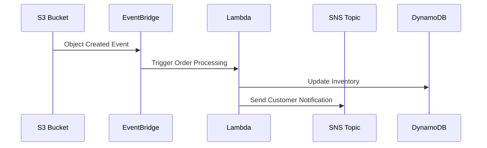
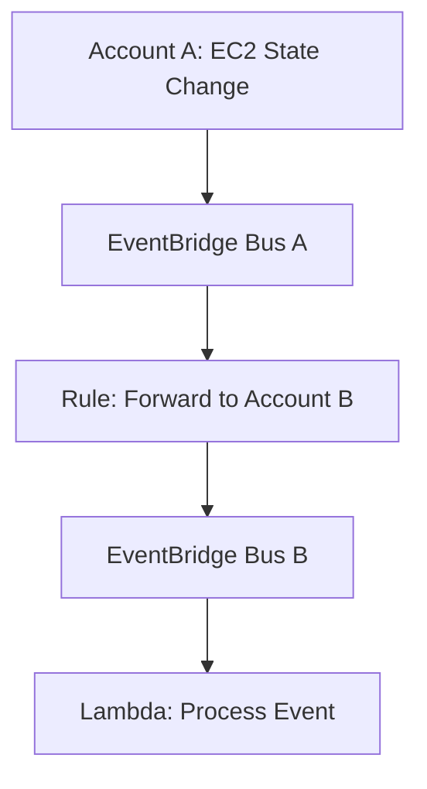

# EventBridge

## <i class="fa-bridge">:bridge:</i> Amazon EventBridge

## 🌟 **The Complete Guide to Serverless Event-Driven Architecture**

<figure><figcaption></figcaption></figure>

Amazon EventBridge  is a **serverless event bus service** that enables developers to build scalable, event-driven applications by connecting applications and services using events from various sources, including AWS services, integrated SaaS applications, and custom applications. It provides a powerful, flexible, and cost-effective way to route events between components, ensuring loose coupling, real-time processing, and robust automation.

***

### 🔍 **Problem Statement & Business Use Cases**

**Real-World Scenario**: An e-commerce company needs to process orders, update inventory, notify customers, and trigger marketing campaigns in real-time. Traditional monolithic architectures or point-to-point integrations lead to tight coupling, scalability issues, and operational overhead. EventBridge decouples these processes, allowing each service to operate independently while responding to events asynchronously.

**🏢 Industries/Applications**:

* **E-commerce**: Order processing, inventory updates, and personalized marketing campaigns.
* **Healthcare**: Real-time patient data processing, compliance monitoring, and integration with EHR systems.
* **Finance**: Fraud detection, transaction processing, and automated compliance reporting.
* **IoT**: Real-time data ingestion from devices for analytics and alerting.
* **Multi-Account AWS Environments**: Centralized event management across accounts and regions for governance and security.

***

### ⚙️ **Core Principles & Key Components**

EventBridge operates on **event-driven architecture (EDA)**, where systems communicate via events (JSON messages) indicating a change in state. Key components include :

* **Event**: A JSON message containing metadata (e.g., `source`, `detail-type`, `time`) and data (`detail`) about a state change.
* **Event Bus**: A router that receives events and delivers them to targets based on rules. Types include:
  * **Default Event Bus**: For AWS service events (e.g., S3 uploads, EC2 state changes).
  * **Custom Event Bus**: For custom applications or multi-tenant isolation.
  * **Partner Event Bus**: For SaaS integrations (e.g., Datadog, Zendesk).
* **Rules**: Filter events using pattern matching (e.g., `source: aws.s3` and `detail-type: Object Created`) and route them to targets. Each rule can support up to 5 targets.
* **Targets**: Services that process events, including AWS Lambda, SNS, SQS, Step Functions, and over 200 AWS services.
* **EventBridge Pipes**: Point-to-point integrations for filtering, enriching, and transforming events from sources like DynamoDB Streams or Kinesis.
* **EventBridge Scheduler**: Create, run, and manage tasks using cron or rate expressions (e.g., invoke Lambda every 5 minutes).

***

### 📋 **Pre-Requirements**

* **AWS Account** with IAM permissions to create EventBridge rules, buses, and targets.
* **Event Sources**: Configure AWS services (e.g., S3, CloudWatch), SaaS applications, or custom applications to emit events.
* **Target Services**: Set up Lambda functions, SQS queues, or other AWS services to process events.

***

### 🛠️ **Implementation Steps**

1. **Create an Event Bus**:
   * Use the default bus for AWS services or create custom buses for specific applications.
2. **Define Rules**:
   * Use event patterns (e.g., `{ "source": ["aws.s3"], "detail-type": ["Object Created"] }`) to filter events.
3. **Configure Targets**:
   * Attach targets (e.g., Lambda, SNS) to rules. For cross-account/region routing, use event buses as targets.
4. **Set Up Transformations**:
   * Use input transformers or EventBridge Pipes to modify event payloads before delivery.
5. **Enable Monitoring**:
   * Use CloudWatch Metrics and Logs to track event delivery and errors.

***

### 🔄 **Data Flow Diagram**

**Diagram 1: Real-Time Order Processing**

**Diagram 2: Cross-Account Event Routing**

***

### 🔒 **Security Measures**

* **IAM Policies**: Control access to EventBridge APIs and resources using least-privilege principles.
* **Encryption**: Data encrypted in transit (TLS 1.2+) and at rest (AWS KMS).
* **VPC Endpoints**: Securely access EventBridge from within a VPC without internet exposure.
* **Dead-Letter Queues (DLQ)**: Handle failed events by routing them to SQS or SNS for reprocessing.

***

### 💡 **Innovation Spotlight: Global Endpoints & Event Replay**

* **Global Endpoints**: Automatically fail over event ingestion to a secondary region during outages, minimizing data loss.
* **Event Replay**: Reprocess archived events for debugging, testing, or recovery from errors.
* **Schema Registry**: Automatically discover and store event schemas, generating code bindings for Java/Python to accelerate development.

***

### ⚖️ **When to Use and When Not to Use**

| **When to Use**                                                                              | **When NOT to Use**                                                                               |
| -------------------------------------------------------------------------------------------- | ------------------------------------------------------------------------------------------------- |
| **Decoupled Microservices**: Coordinate microservices without direct dependencies.           | **Simple Polling Tasks**: Use CloudWatch Events for basic scheduling.                             |
| **Real-Time Processing**: React to events instantly (e.g., S3 uploads, IoT data).            | **High-Throughput Streaming**: Use Kinesis for large-scale data streaming.                        |
| **SaaS Integrations**: Connect SaaS apps (e.g., Zendesk, Datadog) to AWS workflows.          | **Direct Service-to-Service Calls**: For synchronous communication (e.g., API Gateway to Lambda). |
| **Cross-Account/Region Routing**: Centralize event management in multi-account environments. | **Static Workflows**: Simple, linear workflows with no dynamic routing needs.                     |

***

### 💰 **Costing Calculation**

* **Pricing Model**:
  * **Event Ingestion**: $1.00 per million events (for custom and partner events).
  * **AWS Service Events**: Free on the default bus.
  * **Schema Registry**: $0.10 per million events discovered and $0.10 per GB/month for storage.
* **Cost Optimization**:
  * Use **event filtering** to reduce unnecessary event processing.
  * **Archive and replay** only critical events to minimize storage costs.
* **Example Calculation**:
  * 5 million custom events + schema discovery for 1 million events = $5.00 + $0.10 = **$5.10/month**.

***

### 🔁 **Alternative Services**

| **AWS**                                           | **Azure**                                  | **GCP**                          | **On-Premise**                           |
| ------------------------------------------------- | ------------------------------------------ | -------------------------------- | ---------------------------------------- |
| **Amazon EventBridge**                            | **Azure Event Grid**                       | **Google Eventarc**              | **Apache Kafka**                         |
| Native AWS integration, serverless, 200+ targets. | Azure-centric, integrates with Logic Apps. | GCP-focused, triggers Cloud Run. | Self-managed, high-throughput streaming. |

***

### ✅ **Benefits**

* **Serverless**: No infrastructure management; automatic scaling.
* **Real-Time Processing**: React to events within seconds.
* **Decoupling**: Teams work independently, improving agility.
* **Cost-Effective**: Pay-per-use pricing; no upfront costs.
* **Broad Integration**: 200+ AWS services, 50+ SaaS apps, and custom applications.

***

### 🚀 **Innovation Spotlight: API Destinations & Pipes**

* **API Destinations**: Send events to HTTP endpoints (e.g., SaaS APIs) with built-in authentication (OAuth, API keys).
* **EventBridge Pipes**: Point-to-point integrations with built-in filtering, enrichment (via Lambda/API Gateway), and transformation. For example, enrich DynamoDB stream events with customer data before processing.

***

### 📊 **Summary**

Amazon EventBridge simplifies event-driven architecture by providing a fully managed, scalable, and secure event routing service. Key takeaways:

1. **Use for Decoupled Workflows**: Ideal for microservices, SaaS integrations, and real-time processing.
2. **Leverage Rules and Filters**: Reduce costs by processing only relevant events.
3. **Ensure Reliability**: Use DLQs and retry policies for fault tolerance.
4. **Explore Advanced Features**: Global Endpoints for disaster recovery, Schema Registry for development acceleration.
5. **Monitor with CloudWatch**: Track event delivery and performance.

***

### 🔗 **Related Topics & References**

* [**EventBridge Documentation**](https://docs.aws.amazon.com/eventbridge/): Detailed guides and API references.
* [**Serverless Framework Integration**](https://www.serverless.com/blog/eventbridge-use-cases-and-tutorial): Build EventBridge applications with Serverless Framework.
* [**S3 EventBridge Integration**](https://docs.aws.amazon.com/AmazonS3/latest/userguide/EventBridge.html): Use S3 events with EventBridge.
* [**EventBridge Scheduler**](https://docs.aws.amazon.com/scheduler/latest/UserGuide/what-is-scheduler.html): Schedule tasks with precision.

For hands-on learning, try the [**EventBridge Workshop**](https://www.datacamp.com/tutorial/amazon-eventbridge) or explore [**use cases**](https://osamadev.medium.com/amazon-eventbridge-a-detailed-guide-to-building-event-driven-applications-fe2d71f8ffb8) for practical examples.

## :bookmark: Fact Check

🦄 Unique Interesting Facts

1. **Schema Registry with Automatic Code Generation**: EventBridge’s Schema Registry auto-discovers event structures from AWS services and custom applications, then generates SDKs in 7+ programming languages (C#, Python, Java, etc.) to streamline event processing—eliminating manual schema parsing.
2. **SaaS-to-EventBridge Direct Publishing**: Over 60 SaaS partners (including Salesforce, GitHub, and Datadog) publish events _natively_ to EventBridge via Partner Event Sources, bypassing webhooks or middleware for real-time, secure integrations.
3. **90-Day Event Archiving and Replay**: Unlike competing event buses, EventBridge allows storing events for up to 90 days and _replaying_ them for debugging or reprocessing—critical for recovering from application errors without disrupting live workflows.
4. **Zero-Code Event Filtering at Scale**: Its built-in content-based filtering evaluates event attributes (e.g., "only process orders > $100") _before_ invoking targets, reducing unnecessary Lambda invocations and costs by up to 70% for high-volume use cases.
5. **Cross-Region Event Routing as a Native Feature**: EventBridge uniquely enables seamless event propagation across AWS regions via event buses—without requiring custom replication logic—making it ideal for global disaster recovery and multi-region architectures.

