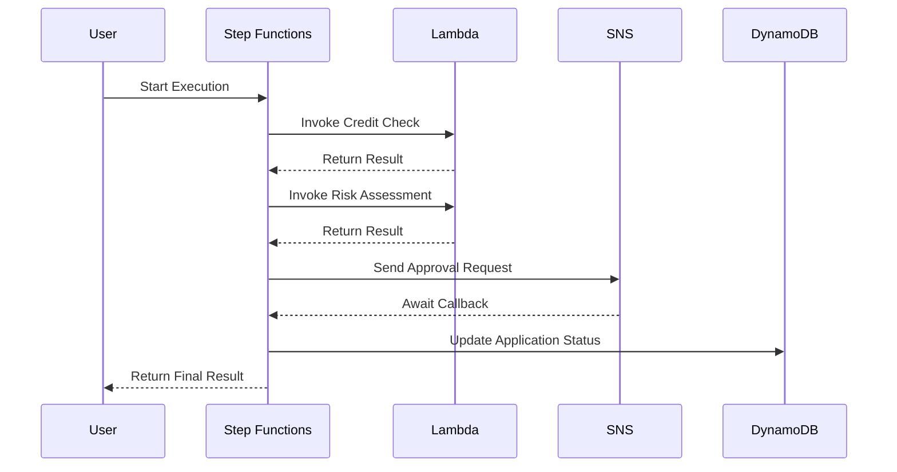
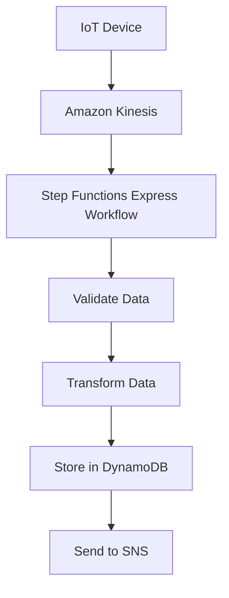

# Step Function

## <i class="fa-stairs">:stairs:</i> AWS Step Function

### 🌟 **AWS Step Functions: The Complete Guide to Serverless Workflow Orchestration**

AWS Step Functions  is a **serverless orchestration service** that enables developers to build and manage **multi-step workflows** for distributed applications. It allows you to coordinate multiple AWS services, automate processes, orchestrate microservices, and create data and machine learning pipelines with visual workflows .

<figure><figcaption></figcaption></figure>

***

### 🔍 **Problem Statement & Business Use Cases**

Step Functions addresses the need for **orchestrating complex workflows** across distributed systems, where managing state, error handling, and retries manually would be cumbersome and error-prone.

> :globe\_with\_meridians: **Real-World Scenario**
>
> A financial institution needs to process loan applications, which involves multiple steps: credit checks, identity verification, risk assessment, and approval. Each step may require calling different services (databases, ML models, human approval), and failures must be handled gracefully without losing progress.

**Industries/Applications**

* **Financial Services**: Loan processing, fraud detection, and transaction reconciliation .
* **E-commerce**: Order fulfillment, inventory management, and payment processing .
* **Healthcare**: Patient data processing, lab report generation, and compliance workflows .
* **Media & Entertainment**: Video processing, content transformation, and batch data processing .
* **IoT & Telematics**: Real-time data ingestion, device state management, and alerting systems .

***

### ⚙️ **Core Principles & Key Components**

Step Functions is built around **state machines** and **tasks**, which define the workflow logic and execution flow .

**Key Concepts**

* **State Machine**: A workflow defined using the **Amazon States Language (ASL)**, which is a JSON-based language. It consists of states (steps) and transitions .
* **States**:
  * **Task State**: Performs work (e.g., invoking a Lambda function or AWS service) .
  * **Choice State**: Makes decisions based on input data .
  * **Parallel State**: Executes multiple branches in parallel .
  * **Map State**: Dynamically iterates over a dataset .
  * **Wait State**: Pauses execution for a specified time .
  * **Succeed/Fail State**: Stops execution with success or failure .
* **Workflow Types**:
  * **Standard Workflows**: Long-running (up to 1 year), exactly-once execution, ideal for auditable workflows .
  * **Express Workflows**: Short-running (up to 5 minutes), high-throughput (100k+ executions/sec), ideal for event-processing workloads .

**Integration Patterns**

* **Request-Response**: Call a service and proceed immediately after response .
* **Run a Job (.sync)**: Call a service and wait for job completion (e.g., AWS Batch, AWS Glue) .
* **Wait for Callback (.waitForTaskToken)**: Pause workflow until an external system sends a callback .

***

### 📋 **Pre-Requirements**

To use Step Functions, ensure the following:

* **AWS Account** with appropriate IAM permissions for Step Functions and integrated services (e.g., Lambda, SNS, DynamoDB) .
* **Workflow Design**: Define the workflow steps and error handling logic using ASL .
* **Integrated Services**: Configure AWS services (e.g., Lambda functions, SNS topics) that will be invoked within the workflow .

***

### 🛠️ **Implementation Steps**

1. **Define State Machine**:
   * Use ASL to define states, transitions, and error handling .
   *   Example ASL snippet:

       ```json
       {
         "StartAt": "ProcessData",
         "States": {
           "ProcessData": {
             "Type": "Task",
             "Resource": "arn:aws:lambda:us-east-1:123456789012:function:ProcessData",
             "Next": "NotifySuccess"
           },
           "NotifySuccess": {
             "Type": "Task",
             "Resource": "arn:aws:sns:us-east-1:123456789012:NotifyTopic",
             "End": true
           }
         }
       }
       ```
2. **Create State Machine**:
   * Use AWS Management Console, CLI, or SDK to create the state machine .
3. **Execute Workflow**:
   * Trigger execution via API, EventBridge, or SDK .
4. **Monitor and Debug**:
   * Use CloudWatch logs and Step Functions console to track execution history and debug failures .

***

### 🔄 **Data Flow Diagram**

**Diagram 1: Standard Workflow for Loan Processing**




**Diagram 2: Express Workflow for IoT Data Ingestion**



***

### 🔒 **Security Measures**

* **IAM Roles**: Use least-privilege policies for Step Functions and integrated services .
* **Encryption**: Data encrypted at rest and in transit using AWS KMS .
* **VPC Endpoints**: Access Step Functions privately via AWS PrivateLink to avoid public internet exposure .
* **CloudTrail Integration**: Log all API calls for auditing and compliance .

***

### 💡 **Innovation Spotlight: Enhanced Payload Management**

Step Functions recently introduced **Variables** and **JSONata support** for advanced payload manipulation . This allows:

* **Data Transformation**: Perform complex operations (e.g., date formatting, math operations) without custom code.
* **Payload References**: Store and reference data across states without passing entire payloads.
* **Reduced State Count**: Simplify workflows by reducing the number of Pass states needed for data manipulation.

***

### ⚖️ **When to Use and When Not to Use**

| **When to Use**                                                                                | **When NOT to Use**                                                                                             |
| ---------------------------------------------------------------------------------------------- | --------------------------------------------------------------------------------------------------------------- |
| **Long-Running Workflows**: Processes requiring human approval or external callbacks .         | **Simple API Calls**: Single-step tasks that don’t require state management.                                    |
| **Complex Error Handling**: Workflows needing retries, fallbacks, or custom error handling .   | **High-Performance Computing**: Tasks requiring sub-millisecond latency.                                        |
| **Microservices Orchestration**: Coordinating multiple services into a cohesive workflow .     | **Static Workflows**: Processes with fixed, linear steps without branching logic.                               |
| **Data Processing Pipelines**: ETL jobs, batch processing, or large-scale parallel workloads . | **Tight Budgets**: For very high-volume workloads, Express Workflows may be more cost-effective than Standard . |

***

### 💰 **Costing Calculation**

* **Pricing Models**:
  * **Standard Workflows**: Priced per **state transition** ($0.025 per 1,000 transitions) .
  * **Express Workflows**: Priced per **execution** ($0.000001 per execution) and **duration** ($0.00001667 per GB-second) .
* **Cost Optimization**:
  * Use **Express Workflows** for high-volume, short-duration tasks .
  * Avoid **polling loops** in Standard Workflows; use `.sync` or callback patterns instead .
  * Minimize payload size (max 256 KB) to reduce data transfer costs .
* **Sample Calculation**:
  * **Standard Workflow**: 100,000 state transitions/month = $2.50.
  * **Express Workflow**: 10 million executions/month + 100 GB-second duration = $10.00 + $0.001667 = \~$10.001667.

***

### 🔁 **Alternative Services**

| **AWS**                                           | **Azure**                             | **GCP**                                   | **On-Premise**                                      |
| ------------------------------------------------- | ------------------------------------- | ----------------------------------------- | --------------------------------------------------- |
| **AWS Step Functions**                            | **Azure Logic Apps**                  | **Google Cloud Workflows**                | **Apache Airflow**                                  |
| Native AWS integration, serverless, supports ASL. | Low-code UI, enterprise integrations. | YAML-based, integrates with GCP services. | Open-source, Python-based, requires infrastructure. |
| **Amazon Managed Workflows**                      | **Azure Durable Functions**           | **Google Cloud Composer**                 | **Kubernetes Operators**                            |
| For Apache Airflow (MWAA).                        | Serverless, code-based workflows.     | Managed Apache Airflow.                   | Custom operators for Kubernetes.                    |

***

### ✅ **Benefits**

* **Simplified Orchestration**: Coordinates distributed components without custom code .
* **Resilience**: Built-in retry, catch, and timeout mechanisms ensure robust executions .
* **Visibility**: Real-time execution history and visual debugging for easy monitoring .
* **Serverless Scaling**: Automatically scales to handle millions of executions .
* **Cost-Effective**: Pay-per-use pricing with no upfront costs .

***

### 🚀 **Innovation Spotlight: Private API Integration**

Step Functions now supports **AWS PrivateLink** and **VPC Lattice** for secure integration with private APIs and on-premises systems . This enables:

* **Hybrid Workflows**: Orchestrate services across cloud and on-premises environments.
* **SaaS Integrations**: Connect to SaaS applications (e.g., Salesforce, Slack) securely.
* **Compliance**: Meet regulatory requirements by keeping data within private networks.

***

### 📊 **Summary**

AWS Step Functions simplifies serverless workflow orchestration by providing a fully managed service for building resilient, scalable, and visual workflows. Key takeaways:

1. **Use Standard Workflows** for long-running, auditable processes .
2. **Use Express Workflows** for high-volume, short-duration tasks .
3. **Leverage ASL** to define workflows with error handling and complex logic .
4. **Integrate with 220+ AWS services** for seamless orchestration .
5. **Monitor with CloudWatch** for visibility and debugging .
6. **Optimize Costs** by choosing the right workflow type and minimizing state transitions .
7. **Ensure Security** with IAM, encryption, and VPC endpoints .

***

### 🔗 **Related Topics & References**

* [AWS Step Functions Documentation](https://docs.aws.amazon.com/step-functions/)
* [Amazon States Language Specification](https://states-language.net/)
* [Step Functions Use Cases](https://aws.amazon.com/step-functions/use-cases/)
* [Step Functions Pricing](https://aws.amazon.com/step-functions/pricing/)
* [AWS Well-Architected Guide for Serverless](https://docs.aws.amazon.com/wellarchitected/latest/serverless-applications-lens/step-functions-workflows.html)

For hands-on learning, try the [Step Functions Workshop](https://docs.aws.amazon.com/step-functions/latest/dg/getting-started.html).

