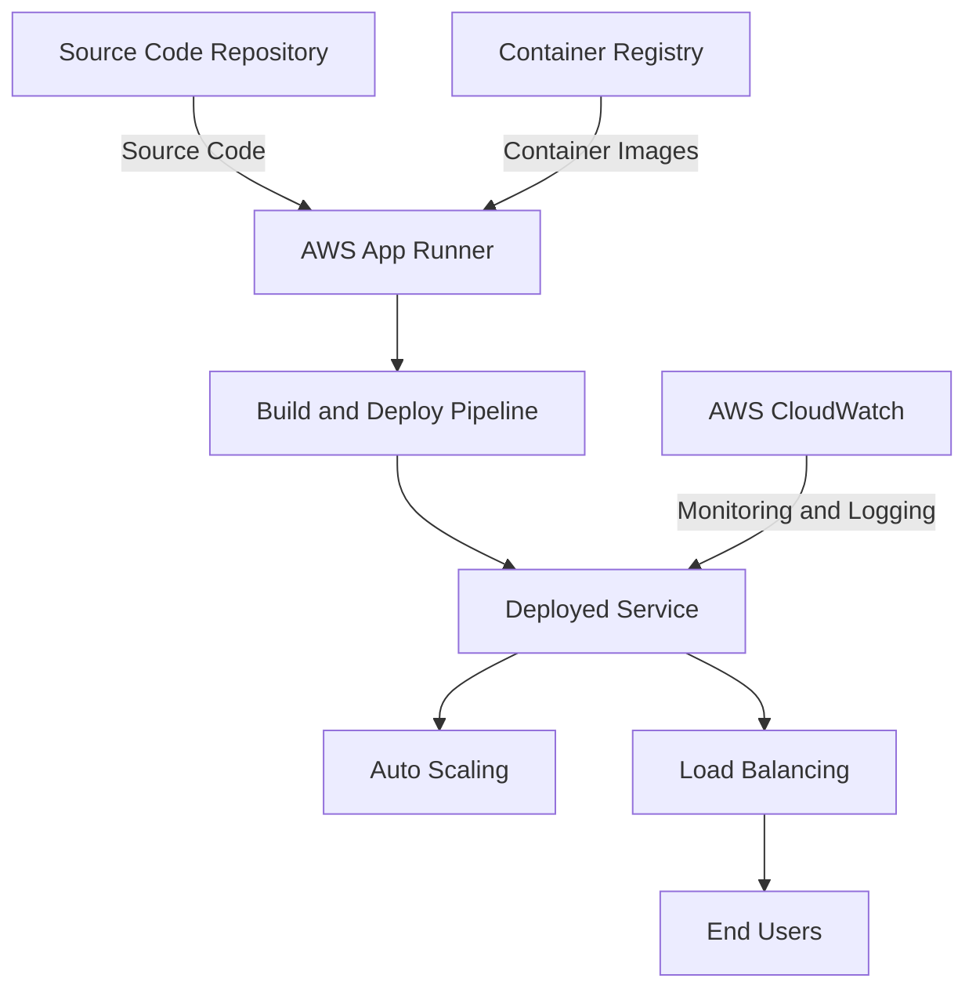
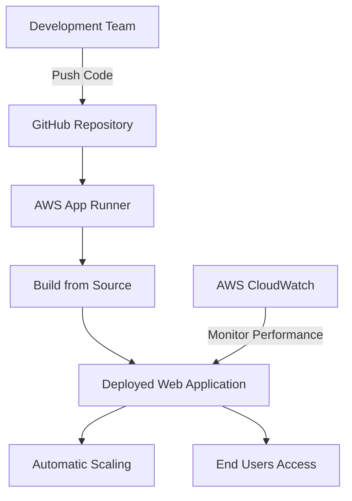
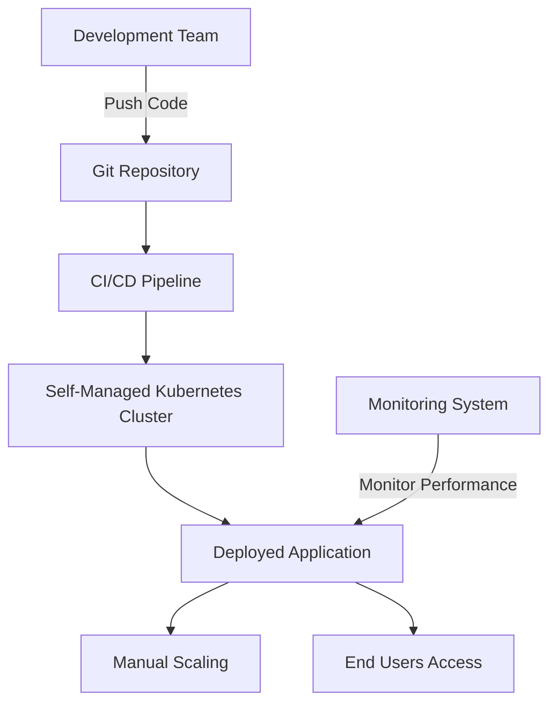

# App Runner

## AWS App Runner: A Comprehensive Overview

### 1. 🌟 Overview

AWS App Runner is a fully managed service that makes it easy for developers to quickly deploy containerized web applications and APIs, with automatic scaling and load balancing. It abstracts away much of the complexity involved in infrastructure management, allowing developers to focus on building their applications. AWS App Runner simplifies deploying applications directly from source code or container images and handles all the operational tasks such as load balancing, scaling, and monitoring.

<figure><figcaption></figcaption></figure>

#### 🤖 Innovation Spotlight

AWS App Runner has recently introduced enhancements including **automatic scaling improvements** to better handle variable workloads and deeper integration with AWS services such as AWS CodeBuild and CodeDeploy for CI/CD pipelines. These updates further streamline the deployment and scaling process, making it easier for teams to adopt DevOps practices.

### 2. ⚡ Problem Statement

**Real-World Scenario:** A small development team needs to deploy a containerized web application quickly and efficiently, without managing underlying infrastructure or configuring complex CI/CD pipelines. They require a solution that automatically scales with their user demand and minimizes operational overhead.

**Industries/Applications:**

* **Startups and Small Businesses:** Rapidly deploying web applications and APIs with minimal setup.
* **Development Teams:** Utilizing a simplified deployment process to focus more on development and less on infrastructure management.
* **Educational Projects:** Providing students and educators with practical experience in deploying containerized applications.

### 2.1 🤝 Business Use Cases

AWS App Runner is particularly beneficial for:

* **Web Applications:** Deploying containerized web apps directly from source code or container registries.
* **APIs and Microservices:** Quickly scaling and managing backend services with ease.
* **Prototyping and Testing:** Enabling rapid iterations and testing of new application versions.

### 3. 🔥 Core Principles

AWS App Runner operates on several core principles that enhance its functionality and usability:

* **Fully Managed Service:** Automates deployment, scaling, and load balancing, abstracting infrastructure management.
* **Source-to-Service Simplicity:** Directly integrates with repositories to build and deploy applications from source code.
* **Automatic Scaling:** Adjusts resources based on traffic to maintain performance without manual intervention.
* **Containerized Applications:** Supports deployment from container images stored in public and private registries.

Key Resource Terms:

* **Service:** A deployed application or API running on App Runner.
* **Container Image:** A packaged application, including all dependencies and configurations, stored in a container registry.
* **Build and Deploy Pipeline:** The automated workflow that App Runner uses to build applications from source code and deploy them.
* **Auto Scaling:** Adjusts compute resources based on application demand.

### 4. 📋 Pre-Requirements

To implement AWS App Runner, you need the following AWS services and tools:

* **AWS Identity and Access Management (IAM):** For securely managing access to AWS services and resources.
* **AWS CodeCommit, GitHub, or Bitbucket:** For storing and managing source code that will be deployed to App Runner.
* **AWS ECR (Elastic Container Registry) or Docker Hub:** To store container images used by App Runner for deployments.
* **AWS CloudWatch:** For monitoring and logging application performance and issues.

### 5. 👣 Implementation Steps

1. **Create an App Runner Service:**
   * Log in to the AWS Management Console and navigate to the AWS App Runner service.
   * Click on "Create Service" and select whether to deploy from a source code repository or a container image.
2. **Configure Source and Deployment:**
   * If deploying from source code, connect to your source repository (e.g., GitHub) and specify the build and deployment settings.
   * If deploying from a container image, provide the image’s location in a container registry (e.g., AWS ECR).
3. **Configure Service Settings:**
   * Set up the service name, auto-scaling configuration, and environment variables as needed.
   * Define any health check paths and set scaling limits based on expected traffic.
4. **Deploy and Monitor:**
   * Review the configuration, start the deployment, and monitor the build and deployment process via the App Runner console and AWS CloudWatch.
5. **Manage and Scale:**
   * Utilize AWS App Runner’s automatic scaling to manage application traffic and monitor performance using CloudWatch.

### 6. 🗺️ Data Flow Diagram

Here is a Mermaid diagram illustrating the architecture of AWS App Runner:

The second Mermaid diagram below illustrates a specific use case of a development team deploying a web application using AWS App Runner:

### 7. 🔒 Security Measures

To secure your AWS App Runner service, follow these best practices:

* **IAM Roles and Policies:** Apply the least privilege principle to restrict access to App Runner services and associated resources.
* **Secure Source Code and Container Images:** Ensure access to source code repositories and container registries is controlled and monitored.
* **Network Security:** Use AWS networking features, such as VPC endpoints, to secure traffic to and from your application.
* **Monitoring and Logging:** Utilize AWS CloudWatch and AWS CloudTrail to monitor application access and potential security incidents.

### 8. 🤝 Integration with Other AWS Services

AWS App Runner integrates seamlessly with various AWS services to enhance its functionality:

* **AWS CodePipeline:** For implementing CI/CD pipelines that integrate with App Runner deployments.
* **AWS ECR:** Storing and managing container images used by App Runner.
* **AWS Secrets Manager:** For securely managing and accessing secrets and sensitive data.
* **Amazon RDS/Aurora:** For applications needing managed relational database services.

These integrations allow for building comprehensive solutions leveraging App Runner as part of a broader AWS ecosystem.

### 9. ⚖️ When to Use and When Not to Use

#### ✅ When to Use

AWS App Runner is ideal for:

* Deploying containerized web applications and APIs quickly and with minimal management overhead.
* Projects requiring automatic scaling and load balancing without the need for complex infrastructure management.
* Teams looking for a simplified deployment process that integrates directly with source code repositories.

#### ❌ When Not to Use

AWS App Runner might not be suitable for:

* Applications requiring extensive customization of the underlying infrastructure or complex networking setups.
* Large-scale enterprise applications needing advanced orchestration and multi-cloud deployments.

### 10. 💰 Costing Calculation

AWS App Runner pricing is based on several components:

* **vCPU and Memory Usage:** Costs based on the amount of compute resources provisioned.
* **Request Volume:** Charges may apply based on the number of requests handled by the service.
* **Outbound Data Transfer:** Costs for data transferred out of AWS to the internet.

**Example Cost Calculation:**

Suppose you have an App Runner service with:

* 1 vCPU and 2 GB memory priced at $0.08 per vCPU-hour and $0.01 per GB-hour.
* 1 million requests per month priced at $0.01 per million requests.
* 50 GB of outbound data transfer priced at $0.09 per GB.

**Monthly Costs:**

* vCPU and Memory Cost: 1 vCPU × $0.08/vCPU-hour × 730 hours + 2 GB × $0.01/GB-hour × 730 hours = $58.40 + $14.60 = $73.00
* Request Volume Cost: 1 million requests × $0.01/million = $0.01
* Data Transfer Cost: 50 GB × $0.09/GB = $4.50

**Total Estimated Monthly Cost:** $73.00 + $0.01 + $4.50 = $77.51

_Note: Prices may vary by region and are subject to change. Always refer to the latest AWS pricing for accurate calculations._

### 11. 🧩 Alternative Services

Here’s a comparison table of AWS App Runner with alternative services:

| Feature/Service           | AWS App Runner | AWS ECS/Fargate | Azure Container Apps | Google Cloud Run | On-Premise Kubernetes |
| ------------------------- | -------------- | --------------- | -------------------- | ---------------- | --------------------- |
| **Managed Service**       | Yes            | Yes             | Yes                  | Yes              | No                    |
| **Deployment Simplicity** | High           | Medium          | High                 | High             | Low                   |
| **Pricing Model**         | Pay-as-you-go  | Pay-as-you-go   | Pay-as-you-go        | Pay-as-you-go    | Capital Expenditure   |
| **Automatic Scaling**     | Yes            | Yes             | Yes                  | Yes              | Manual                |

Mermaid Diagram for an on-premise alternative (e.g., self-managed Kubernetes):

### 12. ✅ Benefits

AWS App Runner offers several advantages:

* **Simplified Deployment:** Rapidly deploys applications directly from source code or container images.
* **Automatic Scaling:** Efficiently manages resource usage and scales with application demand.
* **Managed Service:** Reduces operational overhead with managed infrastructure and automated updates.
* **Integration with AWS Ecosystem:** Benefits from seamless connectivity with AWS services for enhanced functionality.

### 13. 🚀 Startup and Prototyping

AWS App Runner is particularly appealing for startups and prototyping projects due to its ease of use and rapid deployment capabilities. It allows:

* **Rapid Prototyping:** Quickly iterate and deploy new application features.
* **Cost-Effective Development:** Pay-as-you-go pricing helps manage development costs efficiently.
* **Focus on Application Logic:** Frees developers from managing infrastructure, allowing them to concentrate on core features and functionalities.

### 14. 📝 Summary

AWS App Runner is a fully managed service designed to simplify the deployment and scaling of containerized web applications and APIs.

* **Top 5 Points to Remember:**
  1. Simplifies deploying containerized applications directly from source code or container images.
  2. Offers automatic scaling and load balancing as part of its managed service.
  3. Integrates effectively with AWS services, enhancing application deployment workflows.
  4. Supports both development and production needs with ease of use and operational simplicity.
  5. Predictable pricing model based on resource usage, requests, and data transfer.

In short, AWS App Runner is all about providing a straightforward, scalable, and managed deployment service for containerized applications, reducing the complexity and overhead traditionally associated with deploying and managing applications in the cloud.

### 15. 🔗 Related Topics

* **AWS ECS and Fargate:** For more complex container orchestration needs.
* **AWS CodePipeline:** For implementing comprehensive CI/CD pipelines.
* **AWS Cloud Development Kit (CDK):** For defining cloud infrastructure as code.
* **AWS Best Practices for Containerization:** Guidelines for optimizing containerized application deployments on AWS.
