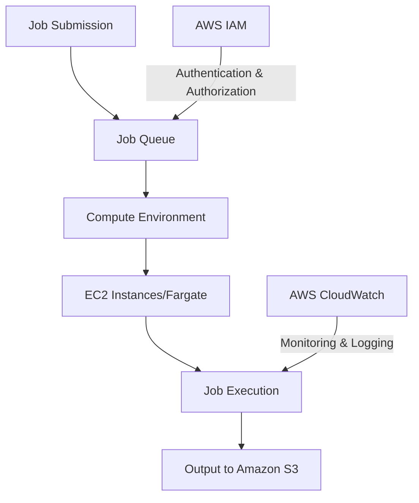
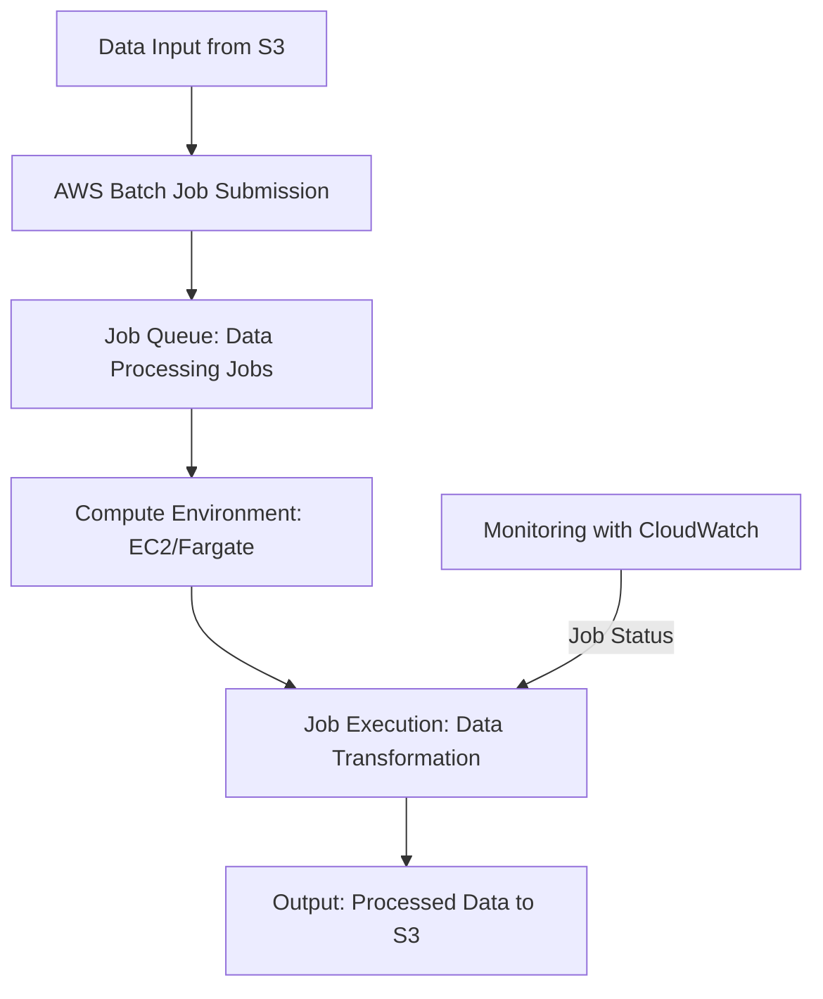
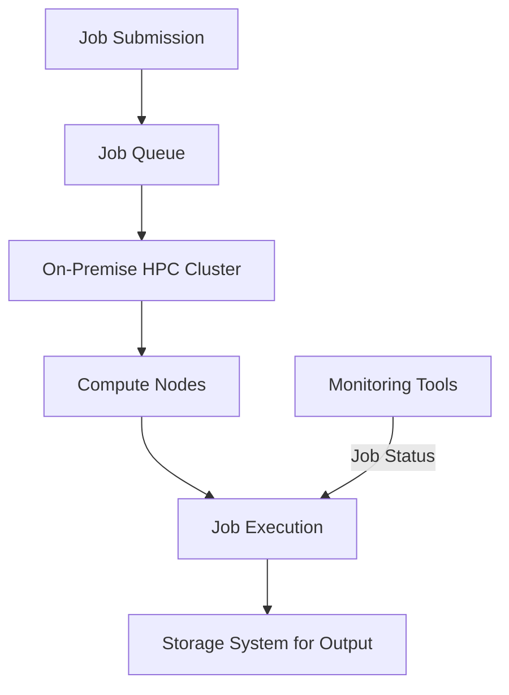

# Batch

## AWS Batch: A Comprehensive Overview

### 1. 🌟 Overview

AWS Batch is a fully managed service that enables developers, scientists, and engineers to run large-scale batch computing workloads efficiently on AWS. By dynamically provisioning the optimal quantity and type of compute resources (e.g., CPU or memory) based on the volume and specific resource requirements of the batch jobs, AWS Batch eliminates the need for manual management of compute resources. This makes it an ideal solution for workloads that involve processing large datasets or running large-scale simulations.

<figure><figcaption></figcaption></figure>

#### 🤖 Innovation Spotlight

AWS Batch has recently introduced enhancements such as **support for multi-node parallel jobs**, allowing complex workloads that require multiple EC2 instances to run concurrently. Additionally, AWS Batch has improved integration with AWS Fargate, providing serverless compute capability for batch workloads that don’t require full EC2 instances, further optimizing cost and resource utilization.

### 2. ⚡ Problem Statement

**Real-World Scenario:** A data analytics company needs to process vast amounts of data on a regular basis. Their workload involves running multiple data processing jobs that vary in duration and resource requirements. They require a solution that efficiently manages job scheduling, resource allocation, and execution without manual intervention, ensuring timely and cost-effective processing of data.

**Industries/Applications:**

* **Data Analytics:** Processing large datasets for insights and reporting.
* **Financial Services:** Batch processing of end-of-day transactions and risk analysis.
* **Life Sciences:** Running genomic sequencing and other large-scale computations.
* **Media and Entertainment:** Rendering and processing multimedia files in batch.

### 2.1 🤝 Business Use Cases

AWS Batch is particularly beneficial for:

* **Large-Scale Batch Processing:** Efficient execution of batch jobs that process large datasets.
* **High-Performance Computing:** Supporting complex simulations and modeling tasks.
* **Automated Data Pipelines:** Building data processing pipelines that require scheduled or event-driven execution.

### 3. 🔥 Core Principles

AWS Batch operates on several core principles to enhance its functionality and efficiency:

* **Job Definitions:** Specify how jobs are to be executed, including the Docker container image to use, vCPU and memory requirements, and IAM roles.
* **Job Queues:** Organize and prioritize job execution, allowing for different job priorities and scheduling strategies.
* **Compute Environments:** Define the infrastructure resources (EC2 instances or Fargate) that are used to execute jobs, including scaling policies.
* **Job Scheduling and Execution:** Automatically schedules jobs and provisions resources based on job requirements and queue priorities.

Key Resource Terms:

* **Job:** A unit of work submitted to AWS Batch, such as a data processing task or simulation.
* **Job Array:** A collection of similar jobs submitted as a single unit, useful for parameter sweep tasks or batch processing tasks.
* **Job Queue:** A queue to which jobs are submitted and from which AWS Batch distributes jobs to compute environments.
* **Compute Environment:** A set of managed or unmanaged compute resources within AWS Batch that execute jobs.

### 4. 📋 Pre-Requirements

To implement AWS Batch, you need the following AWS services and tools:

* **AWS Identity and Access Management (IAM):** For securely managing access to AWS services and resources.
* **AWS EC2 or AWS Fargate:** To provide the underlying compute resources for executing batch jobs.
* **AWS CloudFormation (Optional):** For defining and deploying infrastructure as code.
* **Docker:** For creating container images that AWS Batch jobs will execute.
* **Amazon S3:** For storing data inputs and outputs for batch jobs.

### 5. 👣 Implementation Steps

1. **Set Up Compute Environment:**
   * Access the AWS Management Console and navigate to AWS Batch.
   * Create a new compute environment, specifying whether to use managed or unmanaged EC2 resources or AWS Fargate.
   * Define the instance types, minimum/maximum vCPUs, and other scaling parameters.
2. **Define Job Queue:**
   * Create a job queue that will hold jobs before they are executed on your compute environment.
   * Configure job queue priorities and associate the queue with your compute environment.
3. **Create Job Definitions:**
   * Define job definitions that specify the Docker image to use, resource requirements, and IAM roles.
   * Include environment variables and mount points if needed for your application.
4. **Submit Jobs:**
   * Use the AWS CLI, SDKs, or AWS Console to submit jobs to your job queue.
   * Monitor job execution and results through the AWS Batch dashboard and AWS CloudWatch.
5. **Monitor and Manage:**
   * Utilize AWS CloudWatch to monitor job execution, resource utilization, and overall system performance.
   * Adjust job priorities, compute environment scaling, and other settings based on performance data.

### 6. 🗺️ Data Flow Diagram

Here is a Mermaid diagram illustrating the architecture of AWS Batch:

The second Mermaid diagram below illustrates a specific use case of a data analytics company using AWS Batch to process large datasets:

### 7. 🔒 Security Measures

To secure your AWS Batch operations, follow these best practices:

* **IAM Roles and Policies:** Create specific IAM roles for job execution with least privilege access to resources.
* **VPC Configuration:** Deploy compute environments within a Virtual Private Cloud (VPC) to enhance network security.
* **Data Encryption:** Encrypt data at rest and in transit, using AWS KMS for encryption keys.
* **Security Groups and NACLs:** Configure security groups and network ACLs to control inbound and outbound traffic to your compute resources.

### 8. 🤝 Integration with Other AWS Services

AWS Batch integrates seamlessly with various AWS services to enhance its functionality:

* **AWS Lambda:** For serverless execution of code in response to AWS Batch events.
* **Amazon S3:** For storing input data and job output results.
* **AWS Step Functions:** For orchestrating complex workflows involving multiple AWS Batch jobs.
* **Amazon CloudWatch:** For monitoring job performance and system health.

These integrations allow for building comprehensive solutions leveraging AWS Batch as part of a broader AWS ecosystem.

### 9. ⚖️ When to Use and When Not to Use

#### ✅ When to Use

AWS Batch is ideal for:

* Large-scale batch processing workloads with varying resource requirements.
* Long-running computations that benefit from automated job scheduling and resource allocation.
* Scenarios where cost-effective, scalable batch processing is required without manual infrastructure management.

#### ❌ When Not to Use

AWS Batch might not be suitable for:

* Real-time processing workloads requiring immediate data processing and response.
* Applications needing constant compute resources and manual fine-tuning of the infrastructure.

### 10. 💰 Costing Calculation

AWS Batch pricing is based on several components:

* **EC2 Instances or Fargate:** Costs are based on the type and duration of compute resources used.
* **Data Transfer:** Costs for data transferred in and out of AWS services.
* **Additional AWS Resources:** Costs for services like Amazon S3 for data storage.

**Example Cost Calculation:**

Suppose you run a batch job for 10 hours using an EC2 instance type `m5.large` priced at $0.096 per hour and additional storage costs amounting to $0.10 per GB per month for 100 GB.

* **EC2 Instance Cost:** $0.096/hour × 10 hours = $0.96
* **Storage Cost:** 100 GB × $0.10/GB/month (prorated to 10 hours usage, assuming 730 hours/month) ≈ $0.014

**Total Estimated Cost for Job Execution:** $0.96 + $0.014 ≈ $0.97

_Note: Prices may vary by region and are subject to change. Always refer to the latest AWS pricing for accurate calculations._

### 11. 🧩 Alternative Services

Here’s a comparison table of AWS Batch with alternative services:

| Feature/Service     | AWS Batch            | Azure Batch         | Google Cloud Batch | On-Premise HPC      |
| ------------------- | -------------------- | ------------------- | ------------------ | ------------------- |
| **Managed Service** | Yes                  | Yes                 | Yes                | No                  |
| **Compute Type**    | EC2/Fargate          | Azure VMs           | Compute Engine     | Physical Machines   |
| **Job Scheduling**  | Advanced Scheduling  | Advanced Scheduling | Basic Scheduling   | Manual/Advanced     |
| **Cost Model**      | Pay-as-you-go        | Pay-as-you-go       | Pay-as-you-go      | Capital Expenditure |
| **Integration**     | Full AWS Integration | Azure Services      | GCP Services       | Custom              |

Mermaid Diagram for an on-premise alternative (e.g., self-managed High-Performance Computing Cluster):

### 12. ✅ Benefits

AWS Batch offers several advantages:

* **Efficiency in Resource Management:** Automatically provisions optimal resources, reducing manual overhead and costs.
* **Scalability:** Handles large workloads by dynamically adjusting compute resources.
* **Ease of Use:** Simplifies job submission and execution, allowing focus on application logic rather than infrastructure management.
* **Cost-Effectiveness:** Pay-as-you-go pricing model ensures cost-effective resource utilization.

### 13. 🏢 Enterprise Adoption

AWS Batch is widely adopted by enterprises for large-scale batch processing and high-performance computing. It supports enterprise-grade features like:

* **Job Arrays:** For executing multiple similar jobs, useful in parameter sweep tasks.
* **Multi-Node Parallel Jobs:** For complex workloads that require multiple EC2 instances.
* **Integration with Enterprise Services:** Such as AWS Step Functions for complex workflows and AWS CloudWatch for advanced monitoring.

### 14. 📝 Summary

AWS Batch is a fully managed service designed to execute batch computing workloads efficiently on AWS.

* **Top 5 Points to Remember:**
  1. Fully managed service for batch computing workloads, reducing manual intervention.
  2. Automatically provisions optimal compute resources.
  3. Supports job scheduling and prioritization to manage workload execution.
  4. Seamlessly integrates with other AWS services for comprehensive solutions.
  5. Cost-effective resource management with pay-as-you-go pricing.

In short, AWS Batch is all about efficiently executing batch workloads on AWS with minimal overhead, automated resource management, and seamless integration with the broader AWS ecosystem.

### 15. 🔗 Related Topics

* **AWS Step Functions:** For orchestrating complex batch workloads and workflows.
* **AWS Lambda:** For serverless execution of small, event-driven tasks.
* **High-Performance Computing on AWS:** For running large-scale computing tasks efficiently.
* **AWS Glue:** For ETL workloads and data integration.
