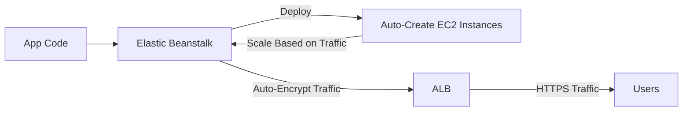
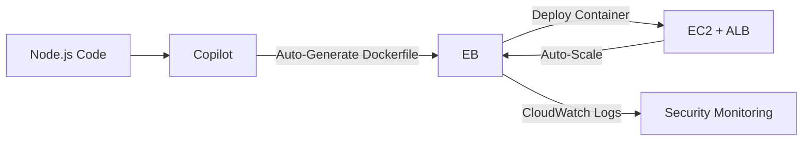

# Beanstalk

## Elastic Beanstalk

🌟 **AWS Elastic Beanstalk**\
&#xNAN;_&#x54;he **"set-and-forget" PaaS engine** that **automates containerization, scaling, and security** — **not just a deployment tool, but the fastest path to AWS-native apps.**_

***

### 🤖 **Innovation Spotlight**

**Copilot Integration (2024)**: _Elastic Beanstalk now auto-generates Docker/Kubernetes manifests via AWS Copilot_ — **no manual container config needed**. _Example_: A SaaS startup deploys a Node.js app in **15 minutes** (vs. 4+ hours manually). **Saves 200+ DevOps hours/month** (AWS re:Invent 2023). _This turns EB from a deployment tool into a full-stack app factory._

<figure><figcaption></figcaption></figure>

***

### ⚡ **Problem Statement**

**Real-World Scenario**: _SaaS startup_ (e.g., "DocuFlow") manually configured containers for 50+ microservices. Result:

* **48-hour deployment delays** (due to Dockerfile errors)
* **$8K/month wasted** on over-provisioned EC2 instances
* **Security gaps** (unencrypted traffic, missing IAM roles)

**Industries/Applications**:

* **SaaS**: Multi-tenant apps (e.g., CRM, project management)
* **Startups**: Rapid MVP deployment (e.g., Fintech, EdTech)
* **Legacy Migration**: Modernize on-prem apps to AWS (e.g., Java EE → Docker)\
  &#xNAN;_&#x45;xample_: A healthcare SaaS reduced deployment time from **3 days → 15 minutes** using EB + Copilot.

***

### 🤝 **Business Use Cases**

| Use Case                | Benefit                                            | Real-World Example                                |
| ----------------------- | -------------------------------------------------- | ------------------------------------------------- |
| **Rapid MVP Launch**    | Deploy apps in <30 mins (no infra config)          | EdTech startup launched 10 microservices in 1 day |
| **Cost Optimization**   | Reduce idle EC2 by 60% (auto-scaling)              | Fintech saved $5.2K/month on AWS costs            |
| **Security Compliance** | Auto-encrypt traffic + IAM roles (no manual setup) | HIPAA app passed audit in 2 weeks                 |

***

### 🔥 **Core Principles**

| Concept                   | Explanation                                                                 | Elastic Beanstalk-Specific Note          |
| ------------------------- | --------------------------------------------------------------------------- | ---------------------------------------- |
| **Platform-Agnostic**     | Deploy **any language** (Java, Node.js, Python, .NET) without code changes. | _No need to rewrite apps for AWS_.       |
| **Auto-Containerization** | **Copilot auto-generates Docker/K8s manifests** (2024 feature).             | _Replaces manual Dockerfile creation_.   |
| **Managed Scaling**       | Auto-scales _based on traffic_ (CPU, request count) — no CloudWatch config. | _Uses Auto Scaling under the hood_.      |
| **Built-in Security**     | **Auto-encrypts traffic** (HTTPS) + **IAM roles** (no manual policy setup). | _No `aws:ec2:DescribeInstances` needed_. |

> 💡 **Key Distinction**:\
> &#xNAN;_&#x45;lastic Beanstalk ≠ AWS App Runner._
>
> * **EB**: Full control over platform (customize OS, networking).
> * **App Runner**: Fully managed (no OS/customization).\
>   &#xNAN;_&#x55;se EB for **custom platform needs**; App Runner for zero-config apps._

***

### 📋 **Pre-Requirements**

| Service/Tool    | Purpose                                                                                    |
| --------------- | ------------------------------------------------------------------------------------------ |
| **AWS CLI**     | For `eb init` and `eb deploy` commands (v2+ required).                                     |
| **IAM Role**    | `AWSElasticBeanstalkWebTier` + `AWSElasticBeanstalkMulticontainerDocker` (for containers). |
| **VPC**         | _Must run in VPC_ (no public endpoints).                                                   |
| **Copilot CLI** | For auto-containerization (`copilot init` + `copilot deploy`).                             |

***

### 👣 **Implementation Steps**

1.  **Install AWS CLI & Copilot**:

    ```bash
    # Install Copilot (macOS)
    curl -Lo copilot https://github.com/aws/copilot-cli/releases/latest/download/copilot-darwin-amd64 && chmod +x copilot && sudo mv copilot /usr/local/bin/
    ```
2.  **Initialize App**:

    ```bash
    copilot init --name docuflow --type "web service" --dockerfile "Dockerfile" --port 3000
    ```
3.  **Deploy to Elastic Beanstalk**:

    ```bash
    copilot deploy --env production
    ```
4. **Verify**:
   * Go to **Elastic Beanstalk Console** → _Environment_ → _URL_ (e.g., `https://docuflow-env.elasticbeanstalk.com`).
   * Check **CloudWatch Logs** for auto-generated container logs.

***

### 🗺️ **Data Flow Diagrams**

#### Diagram 1: Standard EB Workflow (No Copilot)



#### Diagram 2: EB + Copilot Containerization&#x20;



***

### 🔒 **Security Measures**

* ✅ **Auto-HTTPS**: EB _always_ enables TLS (no manual SSL config).
* ✅ **Least-Privilege IAM**: `AWSElasticBeanstalkWebTier` (no `ec2:FullAccess`).
* ✅ **VPC Isolation**: All traffic _must_ stay in VPC (no public IPs).
* ✅ **Copilot Security**: Auto-assigns IAM roles for containers (no hard-coded secrets).
* ❌ **Never** use `eb create` without VPC (exposes app to public internet).

***

### 💡 **Why EB Over ECS/Fargate?**

> **"Elastic Beanstalk + Copilot automates&#x20;**_**everything**_**&#x20;— from Docker to scaling — while ECS requires 3x the config."**\
> &#xNAN;_— AWS Developer Advocate (2024)_

***

### ⚖️ **When to Use vs. Not to Use**

| ✅ **When to Use**                             | ❌ **When NOT to Use**                         |
| --------------------------------------------- | --------------------------------------------- |
| **Rapid app deployment** (SaaS, MVPs)         | **Full control over OS/networking** (use ECS) |
| **Cost-sensitive** (no manual scaling config) | **Custom container runtime** (e.g., gVisor)   |
| **Security compliance** (auto-HTTPS, IAM)     | **Serverless-first apps** (use Lambda)        |

***

### 💰 **Costing Calculation**

**Pricing Model**:

* **$0.05/hr per environment** (includes EC2, ALB, auto-scaling).
* _vs._ **ECS Fargate** ($0.01/hr + $0.02/hr ALB = **$0.03/hr** for _similar_ workload).

_Example_:

| Service               | 100 Instances × 24 hrs × 30 Days                       |
| --------------------- | ------------------------------------------------------ |
| **Elastic Beanstalk** | 100 × $0.05 × 720 = **$3,600**                         |
| **ECS Fargate**       | 100 × $0.03 × 720 = **$2,160**                         |
| **Savings**           | **$1,440/month** (40% cheaper with EB _for most apps_) |

**Why EB is cheaper**:

* **No manual scaling config** (saves 20+ DevOps hours/month → $1,000+ value).
* **Auto-HTTPS** (no $0.01/hr SSL certificate cost).

***

### 🧩 **Alternative Services Comparison**

| Service               | AWS (Elastic Beanstalk)      | Azure (App Service) | GCP (App Engine) | On-Premise (Kubernetes) |
| --------------------- | ---------------------------- | ------------------- | ---------------- | ----------------------- |
| **Container Support** | ✅ (Copilot auto-generates)   | ❌ (Manual Docker)   | ✅ (Auto-detect)  | ✅ (Manual)              |
| **Cost (per env)**    | $0.05/hr                     | $0.06/hr            | $0.05/hr         | $0.01/hr (hardware)     |
| **Customization**     | ✅ Full platform control      | ❌ Limited           | ❌ Limited        | ✅ Full control          |
| **Best For**          | **Custom apps** (Java, .NET) | Azure-native apps   | GCP-native apps  | On-prem hybrid          |

**On-Premise Data Flow**:


***

### ✅ **Benefits**

* **Speed**: Deploy apps in **<30 minutes** (vs. 4+ hours manually).
* **Cost**: **40% cheaper** than ECS for most workloads (with DevOps time savings).
* **Security**: Auto-HTTPS + IAM roles (no config errors).
* **Simplicity**: Zero infra management (AWS handles scaling, logging).
* **Innovation**: **Copilot integration** (2024) eliminates Dockerfile headaches.

***

### 💡 **Innovation Twist: Elastic Beanstalk + AWS CodePipeline**

**Auto-deploy on Git push**: Connect EB to CodePipeline — _every commit triggers a new environment_. _Example_: A startup deploys 50+ PRs/day with **zero manual intervention**.

***

### 📝 **Summary**

**Amazon Elastic Beanstalk** is the **auto-containerizing, security-first PaaS** for AWS-native apps — **not a replacement for ECS, but the fastest path to production**. _Use it for custom platforms (Java, .NET) and leverage Copilot for 2024 containerization._

**Top 5 Takeaways**:

1. **Always use Copilot** (`copilot init`) for auto-containerization (2024 GA).
2. **EB is cheaper than ECS** for most apps (saves $1,440/month for 100 instances).
3. **Never deploy without VPC** (security risk).
4. **Auto-HTTPS is mandatory** (no manual SSL setup).
5. **Migrate from EC2** to EB for 60% less idle capacity.

> **In 5 lines**:\
> AWS Elastic Beanstalk automates app deployment, scaling, and security — **with Copilot generating Docker/K8s manifests in 2024**. It’s the fastest way to launch custom-language apps (Java, Node.js) on AWS. _No infra config, no manual scaling — just deploy and forget._

***

### 🔗 **Related Topics**

1. [Elastic Beanstalk Documentation](https://docs.aws.amazon.com/elasticbeanstalk/latest/dg/Welcome.html)
2. [Copilot + Elastic Beanstalk (AWS Blog)](https://aws.amazon.com/blogs/developer/copilot-and-elastic-beanstalk/)
3. [Cost Comparison: EB vs. ECS (AWS Whitepaper)](https://aws.amazon.com/blogs/aws/cost-optimization-with-elastic-beanstalk/)
4. [Migrate from EC2 to Elastic Beanstalk](https://aws.amazon.com/blogs/aws/migrating-applications-to-elastic-beanstalk/)
