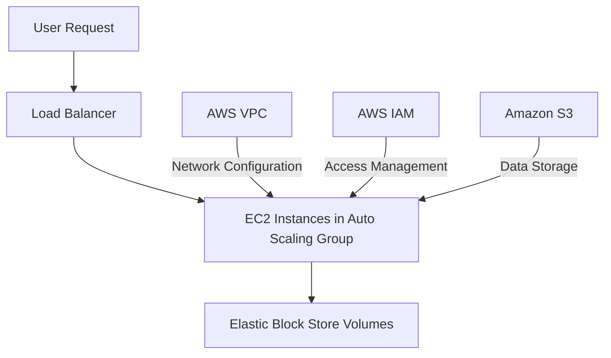
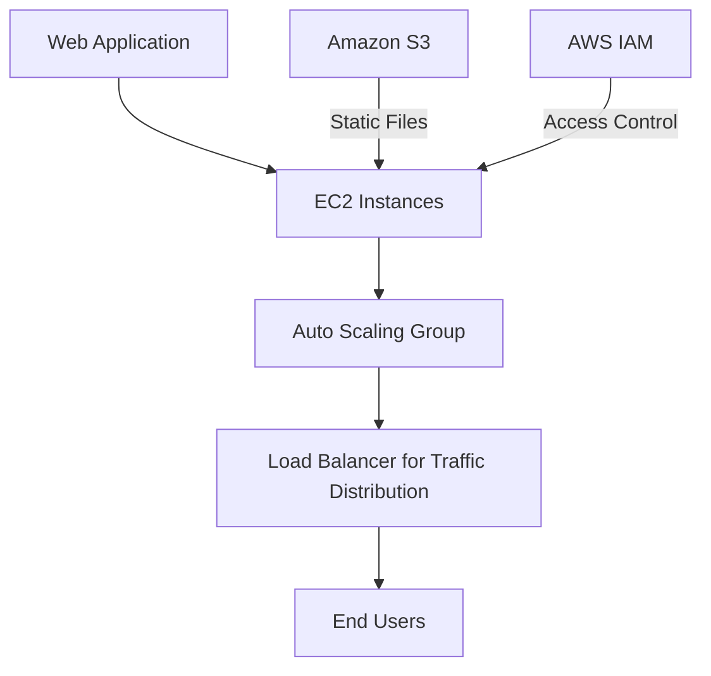
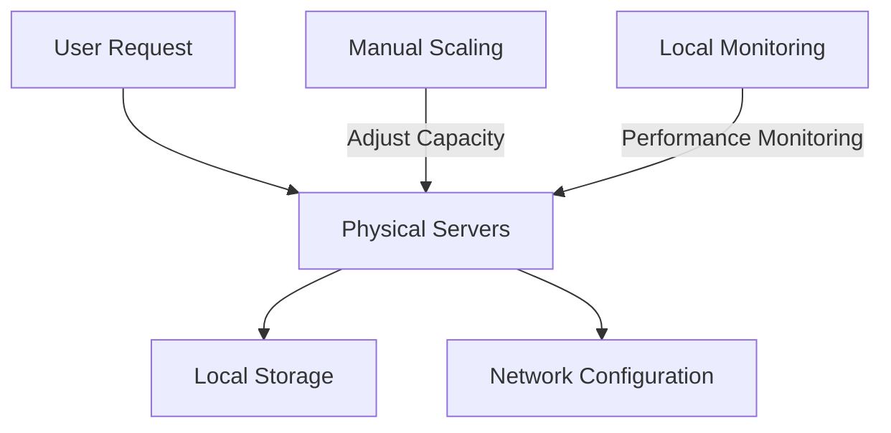

# EC2

## AWS EC2: A Comprehensive Overview

### 1. 🌟 Overview

AWS EC2 (Elastic Compute Cloud) is a central part of Amazon's cloud-computing platform, allowing users to rent virtual servers, known as instances, on which to run their applications. It provides scalable computing capacity in the AWS cloud, making it easier for developers to obtain and configure capacity with minimal friction. EC2 eliminates the need to invest in hardware upfront, so you can develop and deploy applications faster.

<figure><figcaption></figcaption></figure>

#### 🤖 Innovation Spotlight

AWS EC2 has recently introduced enhancements such as **AWS Graviton processors**, which offer significant cost-performance improvements, and **AWS Nitro System**, providing virtually all of the compute and memory resources of the host hardware to your instances. Additionally, new EBS volume types and improvements in Elastic GPUs provide enhanced performance and flexibility.

### 2. ⚡ Problem Statement

**Real-World Scenario:** A tech startup is looking to host a scalable web application but lacks the resources to manage physical servers. They need a solution that provides flexible and scalable compute resources, allowing them to adjust capacity based on demand and quickly deploy and manage applications.

**Industries/Applications:**

* **Tech Startups:** Scalable hosting of web applications and APIs.
* **Enterprise Applications:** Hosting scalable and reliable enterprise applications.
* **Big Data Processing:** Running large-scale data processing tasks on scalable compute resources.
* **Development and Testing:** Providing scalable environments for software development and testing.

### 2.1 🤝 Business Use Cases

AWS EC2 is particularly beneficial for:

* **Web Application Hosting:** Deploy and scale web applications according to traffic demand.
* **Enterprise Solutions:** Run enterprise applications with high availability and security.
* **Big Data Analytics:** Utilize scalable compute resources for processing large datasets.

### 3. 🔥 Core Principles

AWS EC2 is built on several core principles that enhance its functionality and performance:

* **Instances:** Virtual servers in the cloud, with various configurations of CPU, memory, storage, and networking capacity.
* **Amazon Machine Images (AMIs):** Pre-configured templates for instances that include the operating system and additional software.
* **Instance Types:** Various configurations optimized for different workloads, such as compute, memory, or storage-intensive tasks.
* **Elastic Block Store (EBS):** Provides block storage volumes for use with EC2 instances.

Key Resource Terms:

* **Security Groups:** Act as a virtual firewall for your instances to control inbound and outbound traffic.
* **Key Pairs:** Secure login information for your instances (SSH keys).
* **Elastic IPs:** Static IPv4 addresses designed for dynamic cloud computing.
* **Auto Scaling:** Automatically adjusts the number of running EC2 instances based on demand.

### 4. 📋 Pre-Requirements

To implement AWS EC2, you need the following AWS services and tools:

* **AWS Identity and Access Management (IAM):** For managing access to AWS services securely.
* **Amazon Virtual Private Cloud (VPC):** To configure a private network for your EC2 instances.
* **AWS CloudFormation (Optional):** For defining and deploying infrastructure as code.
* **Amazon S3 (Optional):** For storing and retrieving data used by EC2 applications.

### 5. 👣 Implementation Steps

1. **Launch an EC2 Instance:**
   * Log in to the AWS Management Console and navigate to the EC2 dashboard.
   * Click "Launch Instance" and choose an Amazon Machine Image (AMI) that fits your application needs.
   * Select an instance type based on your application requirements (e.g., t2.micro for testing).
2. **Configure Instance:**
   * Configure the instance details, such as the number of instances and network settings.
   * Add storage volumes, and configure security groups to control network traffic.
3. **Add Storage:**
   * Attach EBS volumes to your instance for persistent storage, specifying size and type as required.
4. **Configure Security Groups:**
   * Define rules to allow specific network traffic to your instance, such as SSH for Linux instances or RDP for Windows instances.
5. **Review and Launch:**
   * Review your configuration, launch the instance, and select or create a key pair for SSH access.
6. **Connect to Your Instance:**
   * Use the SSH client to connect to your instance using the key pair and instance's public DNS or IP address.

### 6. 🗺️ Data Flow Diagram

Here is a Mermaid diagram illustrating the architecture of AWS EC2:

The second Mermaid diagram below illustrates a specific use case of a tech startup deploying a web application on AWS EC2:

### 7. 🔒 Security Measures

To secure your AWS EC2 instances, follow these best practices:

* **IAM Roles and Policies:** Apply the principle of least privilege to manage access to your EC2 resources.
* **Security Groups and NACLs:** Configure security groups to act as virtual firewalls and network ACLs for additional network traffic control.
* **Encryption:** Use AWS KMS to encrypt data at rest on EBS volumes and ensure in-transit encryption via SSL/TLS.
* **Monitoring:** Use AWS CloudWatch and AWS CloudTrail to monitor and log all activity and system health.

### 8. 🤝 Integration with Other AWS Services

AWS EC2 integrates seamlessly with various AWS services to enhance its functionality:

* **AWS Lambda:** For serverless execution of code in response to events, complementing EC2-based applications.
* **Amazon RDS:** Provides managed relational database services for applications hosted on EC2.
* **AWS Elastic Beanstalk:** Simplifies the deployment and scaling of applications on EC2.
* **Amazon CloudWatch:** For monitoring EC2 instances and setting alarms for operational events.

These integrations allow for building comprehensive solutions leveraging EC2 as part of a broader AWS environment.

### 9. ⚖️ When to Use and When Not to Use

#### ✅ When to Use

AWS EC2 is ideal for:

* Applications requiring full control over the underlying virtual servers.
* Workloads that benefit from the ability to scale resources quickly and dynamically.
* Development and testing environments that need flexible resources.

#### ❌ When Not to Use

AWS EC2 might not be suitable for:

* Applications that benefit from fully managed services, like AWS Lambda or AWS Fargate.
* Users who prefer avoiding server management entirely and opt for serverless computing wherever possible.

### 10. 💰 Costing Calculation

AWS EC2 pricing is based on several components:

* **Instance Hours:** Costs depend on the type and duration of the instance used.
* **Storage:** Costs associated with EBS volumes and snapshots.
* **Data Transfer:** Costs for data transferred in and out of the EC2 instances.

**Example Cost Calculation:**

Suppose you run an `m5.large` EC2 instance for 730 hours (1 month) with an EBS volume of 100 GB and transfer 100 GB of data out.

* **EC2 Instance Cost:** $0.096 per hour × 730 hours ≈ $70.08
* **EBS Storage Cost:** 100 GB × $0.10 per GB-month = $10.00
* **Data Transfer Cost:** 100 GB × $0.09 per GB = $9.00

**Total Estimated Monthly Cost:** $70.08 + $10.00 + $9.00 = $89.08

_Note: Prices may vary by region and are subject to change. Always refer to the latest AWS pricing for accurate calculations._

### 11. 🧩 Alternative Services

Here’s a comparison table of AWS EC2 with alternative services:

| Feature/Service     | AWS EC2              | Azure Virtual Machines | Google Compute Engine | On-Premise Servers  |
| ------------------- | -------------------- | ---------------------- | --------------------- | ------------------- |
| **Managed Service** | Self-managed         | Self-managed           | Self-managed          | Self-managed        |
| **Scalability**     | High                 | High                   | High                  | Limited             |
| **Pricing Model**   | Pay-as-you-go        | Pay-as-you-go          | Pay-as-you-go         | Capital Expenditure |
| **Integration**     | Full AWS Integration | Azure Services         | GCP Services          | Custom Integration  |

Mermaid Diagram for an on-premise alternative (e.g., self-managed servers):

### 12. ✅ Benefits

AWS EC2 offers several advantages:

* **Flexibility:** Choose from a wide variety of instance types and configurations to match application needs.
* **Scalability:** Easily scale resources up or down to handle changing application demands.
* **Security:** Benefit from AWS’s robust security features and compliance certifications.
* **Cost-Effectiveness:** Pay only for the resources you use, with options for Reserved Instances to reduce costs further.

### 13. 🏢 Enterprise Adoption

AWS EC2 is widely adopted by enterprises due to its flexibility, scalability, and integration with other AWS services. It supports enterprise-grade features such as:

* **Reserved Instances:** For cost savings on long-term workloads.
* **Dedicated Hosts:** For compliance and regulatory requirements.
* **Integration with Enterprise Tools:** Such as AWS Directory Service for managing user access.

### 14. 📝 Summary

AWS EC2 provides scalable virtual servers in the cloud, enabling flexible deployment and management of applications without the need to invest in physical hardware.

* **Top 5 Points to Remember:**
  1. Provides scalable, virtual compute capacity in the cloud.
  2. A wide variety of instance types and configurations to suit different workloads.
  3. Integrates seamlessly with other AWS services for comprehensive solutions.
  4. Offers robust security and compliance features.
  5. Cost-effective with pay-as-you-go pricing and options for reserved instances.

In short, AWS EC2 is all about providing flexible, scalable, and cost-effective compute resources to rapidly develop and deploy applications in the cloud.

### 15. 🔗 Related Topics

* **AWS Lambda:** For running serverless applications and functions.
* **Amazon RDS:** For managed relational database services.
* **AWS Elastic Beanstalk:** For simplified application deployment and scaling.
* **AWS Auto Scaling:** For dynamically scaling EC2 capacity.
