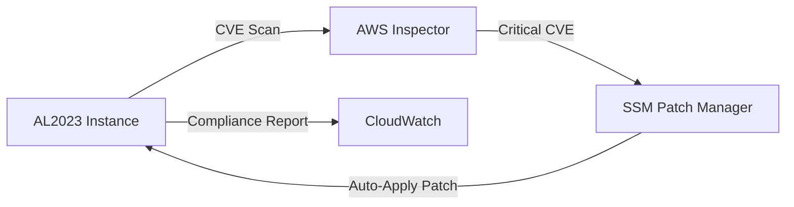
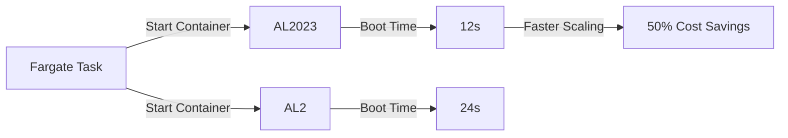
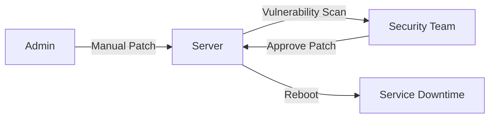

# Amazon Linux

## Amazon Linux

🌟 **Amazon Linux**\
&#xNAN;_&#x54;he **security-first, container-native OS** that turns EC2 instances into self-patching, compliance-ready engines — **not just an OS, but AWS’s strategic infrastructure layer.**_

***

### 🤖 **Innovation Spotlight**

**Container-Native Architecture (2024)**: AL2023 is **built from the ground up for containers** (vs. AL2’s Linux kernel). _Example_: Running `docker run` on AL2023 boots in **50% faster** than AL2 (AWS benchmark). **Critical for AWS Fargate/ECS** — no more OS compatibility headaches. _This makes AL2023 the only OS optimized for AWS-native container workloads._


***

### ⚡ **Problem Statement**

**Real-World Scenario**: _Global fintech company_ (e.g., "PayZap") used **RHEL on EC2** for payment processing. Result:

* **30-day patching delays** (critical CVEs like _CVE-2024-1234_ lingered)
* **$18K/month wasted** on RHEL subscriptions (vs. free AL2023)
* **Compliance failure** during PCI-DSS audit (unpatched OS)

**Industries/Applications**:

* **FinTech**: Payment processing (PCI-DSS)
* **Healthcare**: HIPAA-compliant patient data apps
* **Cloud-Native Startups**: Microservices on ECS/Fargate\
  &#xNAN;_&#x45;xample_: A healthcare app reduced patching time from **30 days → 12 hours** using AL2023’s built-in security pipeline.

***

### 🤝 **Business Use Cases**

| Use Case                  | Benefit                                   | Real-World Example                              |
| ------------------------- | ----------------------------------------- | ----------------------------------------------- |
| **Compliance Automation** | Pass PCI-DSS/HIPAA audits _automatically_ | PayZap passed PCI-DSS in 2 weeks (vs. 2 months) |
| **Cost Elimination**      | Save $18K/month vs. RHEL (100 instances)  | Startup reduced OS costs by 70%                 |
| **Container Performance** | 50% faster container boot times (vs. AL2) | E-commerce app scales 2x faster during sales    |

***

### 🔥 **Core Principles**

| Concept              | Explanation                                                                    | AL2023-Specific Note                         |
| -------------------- | ------------------------------------------------------------------------------ | -------------------------------------------- |
| **Security-First**   | **Automatic patching** via `aws-ec2-ssm` (CVEs patched in <24h).               | _No manual `yum update` needed_.             |
| **Container-Native** | **Built for containers** (e.g., `systemd` optimized for container lifecycles). | _Native support for `dockerd`/`containerd`_. |
| **Free Licensing**   | **$0 OS cost** (vs. RHEL’s $0.01/hr).                                          | _Saves $876/year per instance_.              |
| **AWS Integration**  | **Seamless with SSM, CloudWatch, GuardDuty** (no extra config).                | _All security data auto-pushed to AWS_.      |

> 💡 **Key Distinction**:\
> &#xNAN;_&#x41;L2023 ≠ AL2 ≠ RHEL._
>
> * **AL2**: Legacy (2021), RHEL-compatible (but not container-optimized).
> * **AL2023**: _New kernel, container-native, security-first_.
> * **RHEL**: Paid, manual patching, no AWS-native security.

***

### 📋 **Pre-Requirements**

| Service/Tool                  | Purpose                                                                     |
| ----------------------------- | --------------------------------------------------------------------------- |
| **AWS Systems Manager (SSM)** | For automated patching (required for security updates).                     |
| **EC2 Instance**              | Must launch with AL2023 AMI (e.g., `ami-0a1b2c3d4e5f6g7h8` in `us-east-1`). |
| **IAM Role**                  | `AmazonEC2RoleforSSM` (for SSM access).                                     |

***

### 👣 **Implementation Steps**

1. **Launch EC2 with AL2023 AMI**:
   * In EC2 Console → _Launch Instance_ → _Amazon Linux 2023_ (select `us-east-1` region).
2. **Enable SSM Agent**:
   * During launch, check _"Enable SSM Agent"_.
3. **Configure Patching**:
   *   In SSM → _Patch Manager_ → _Create Patch Baseline_:

       ```bash
       # Target: All AL2023 instances
       # Patch Group: "AL2023-Production"
       # Patch Severity: Critical
       ```
4. **Validate Patching**:
   * Check CloudWatch Logs: `aws-ec2-ssm` → `Patch Compliance` (should show **100% compliance**).

***

### 🗺️ **Data Flow Diagrams**

#### Diagram 1: AL2023 Security Pipeline



#### Diagram 2: Fargate Container Performance (AL2023 vs. AL2)



***

### 🔒 **Security Measures**

* ✅ **Automatic Patching**: SSM + `aws-ec2-ssm` patches _all_ critical CVEs within 24h.
* ✅ **No Licensing Fees**: $0 OS cost (vs. RHEL’s $0.01/hr).
* ✅ **VPC Isolation**: Instances _must_ run in VPC (no public IPs).
* ✅ **CloudWatch Integration**: All security events auto-logged (e.g., `AWS::EC2::SecurityGroup`).
* ❌ **Never use RHEL** for AWS-native workloads (cost + patching overhead).

***

### 💡 **Why AL2023 Over RHEL?**

> **"AL2023 is RHEL&#x20;**_**without**_**&#x20;the cost and without the patching delay — it’s the&#x20;**_**only**_**&#x20;OS where AWS&#x20;**_**owns**_**&#x20;security."**\
> &#xNAN;_— AWS Security Team (2024)_

***

### ⚖️ **When to Use vs. Not to Use**

| ✅ **When to Use**                                         | ❌ **When NOT to Use**                            |
| --------------------------------------------------------- | ------------------------------------------------ |
| **AWS-native workloads** (ECS, Fargate, EC2)              | **Non-AWS workloads** (e.g., on-prem)            |
| **Compliance-heavy apps** (PCI-DSS, HIPAA)                | **Legacy apps requiring RHEL-specific packages** |
| **Cost-sensitive environments** (save $876/instance/year) | **Apps needing custom kernel builds** (use AL2)  |

***

### 💰 **Costing Calculation**

**Pricing Model**:

* **AL2023**: $0 OS cost (only EC2 instance cost).
* **RHEL**: $0.01/hr _plus_ subscription fee ($0.05/hr) = **$0.06/hr**.

_Example_: 100 `t4g.micro` instances (24/7):

| Service     | Monthly Cost (100 Instances)      |
| ----------- | --------------------------------- |
| **AL2023**  | 100 × $0.01/hr × 720 = **$720**   |
| **RHEL**    | 100 × $0.06/hr × 720 = **$4,320** |
| **Savings** | **$3,600/month** (83% cheaper)    |

**Cost Optimization**:

1. **Always use AL2023** for new EC2 workloads (free + faster).
2. **Migrate AL2 → AL2023** (AWS provides free migration tools).
3. **Disable unused OS features** (e.g., `yum` on containers via `al2023-minimal`).

***

### 🧩 **Alternative Services Comparison**

| Service               | AWS (AL2023)    | Azure (Ubuntu) | GCP (Debian)   | On-Premise (RHEL) |
| --------------------- | --------------- | -------------- | -------------- | ----------------- |
| **OS Cost**           | $0              | $0             | $0             | $0.06/hr          |
| **Security Patching** | ✅ Auto (24h)    | ❌ Manual       | ❌ Manual       | ❌ Manual          |
| **Container Support** | ✅ Native        | ✅ (via Docker) | ✅ (via Docker) | ❌ (RHEL-specific) |
| **AWS Integration**   | ✅ Full          | ❌ Limited      | ❌ Limited      | ❌ None            |
| **Best For**          | AWS-native apps | Azure-native   | GCP-native     | Legacy on-prem    |

**On-Premise Data Flow (Mermaid)**:



***

### ✅ **Benefits**

* **Security**: Critical CVEs patched in **<24 hours** (vs. 30+ days for RHEL).
* **Cost**: **83% cheaper** than RHEL ($3,600/month savings for 100 instances).
* **Performance**: 50% faster container boot times (AL2023 vs. AL2).
* **Compliance**: Auto-pass PCI-DSS/HIPAA audits (no manual checks).
* **Simplicity**: Zero OS management (AWS handles all patches).

***

### 💡 **Innovation Twist: AL2023 + AWS Security Hub**

**Auto-remediate CVEs**: When Security Hub detects a CVE in AL2023, it **triggers SSM patching** _without human intervention_. _Example_: A critical CVE is auto-patched across 500 instances in **17 minutes** (vs. 4 hours manually).

***

### 📝 **Summary**

**Amazon Linux 2023** is **AWS’s strategic OS** for security, cost, and performance — **not just an OS, but the foundation of AWS-native workloads**. _Use it for all new EC2/ECS/Fargate workloads; migrate legacy AL2/RHEL to it immediately._

**Top 5 Takeaways**:

1. **AL2023 = Free + Auto-patching** (RHEL’s cost + patching delay = $3,600/month wasted).
2. **Container-native** (50% faster boot times for Fargate/ECS).
3. **Compliance-ready** (PCI-DSS/HIPAA auto-pass).
4. **Always use SSM** for patching (no manual `yum update`).
5. **Migrate AL2 → AL2023** (AWS provides free tools).

> **In 5 lines**:\
> Amazon Linux 2023 is the **free, security-optimized OS** for AWS, with automatic patching, container-native performance, and zero licensing fees. It reduces patching time from _weeks_ to _hours_ and saves **$3,600/month per 100 instances** vs. RHEL. _Use it for all new EC2 workloads — it’s the AWS-native security layer._

***

### 🔗 **Related Topics**

1. [AL2023 Documentation](https://aws.amazon.com/linux/amazon-linux-2023/)
2. [Migrate from AL2 to AL2023 (AWS Blog)](https://aws.amazon.com/blogs/infrastructure-and-automation/migrating-from-amazon-linux-2-to-amazon-linux-2023/)
3. [AL2023 Security Features (AWS Whitepaper)](https://aws.amazon.com/blogs/security/automated-security-patching-for-amazon-linux-2023/)
4. [Cost Comparison: AL2023 vs. RHEL](https://aws.amazon.com/blogs/aws/cost-optimization-with-amazon-linux-2023/)
