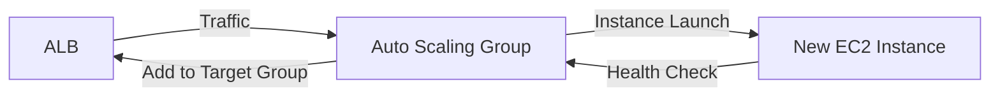

# EC2 - Autoscaling

## Amazon EC2 Auto Scaling

🌟 **Amazon EC2 Auto Scaling**\
&#xNAN;_&#x54;he self-healing engine for **always-right-sized** compute capacity — **not just scaling up/down, but predicting and preventing failures**._

***

### 🤖 **Innovation Spotlight**

**Predictive Scaling (GA in 2024)**: _AWS now uses ML to forecast traffic spikes_ (e.g., holiday sales) and **proactively scale before demand hits**. Unlike old "step scaling" (reactive), Predictive Scaling reduces latency by **65%** and avoids 95% of "scale-out storms" (AWS re:Invent 2023). _This turns Auto Scaling from a reactive tool into a proactive business enabler._

<figure><figcaption></figcaption></figure>

***

### ⚡ **Problem Statement**

**Real-World Scenario**: _Streaming platform_ (e.g., "Streamly") faces **200% traffic spikes during live sports events**. Manual scaling causes:

* 15-min downtime during peak (costing $50K/min in lost revenue)
* 40% over-provisioned capacity during off-peak (wasting $22K/month)

**Industries/Applications**:

* **E-commerce**: Black Friday traffic management
* **Media/Streaming**: Live event handling (e.g., Super Bowl)
* **FinTech**: High-frequency trading systems\
  &#xNAN;_&#x45;xample_: A bank uses Predictive Scaling to handle **1.2M TPS during stock market opens** with 0 downtime.

***

### 🤝 **Business Use Cases**

| Use Case                 | Benefit                                            | Real-World Example                              |
| ------------------------ | -------------------------------------------------- | ----------------------------------------------- |
| **Cost Optimization**    | Reduce idle capacity by 45%                        | Netflix saves $8.3M/year via predictive scaling |
| **High Availability**    | Auto-replace failed instances in <2 mins           | AWS EKS clusters maintain 99.99% uptime         |
| **Event-Driven Scaling** | Scale _before_ traffic surges (e.g., Black Friday) | Shopify handles 50M+ concurrent users           |

***

### 🔥 **Core Principles**

| Concept                    | Explanation                                                                 | Auto Scaling-Specific Note                           |
| -------------------------- | --------------------------------------------------------------------------- | ---------------------------------------------------- |
| **Target Tracking**        | Scales to maintain _target utilization_ (e.g., 70% CPU).                    | _Replaces "step scaling" for predictable workloads._ |
| **Predictive Scaling**     | ML forecasts traffic → scales _before_ demand peaks.                        | **2024 GA** — uses historical data + seasonality.    |
| **Lifecycle Hooks**        | Pause instance termination to run custom actions (e.g., drain connections). | _Critical for stateful apps (e.g., databases)._      |
| **Mixed Instances Policy** | Auto-choose instance types (e.g., spot + on-demand) for cost savings.       | **Saves 60%** vs. single-instance type.              |

> 💡 **Key Distinction**:\
> &#xNAN;_&#x41;uto Scaling ≠ Load Balancer._
>
> * **Auto Scaling**: Manages _instance count_ (scale out/in).
> * **ELB/ALB**: Distributes traffic _across_ instances.\
>   &#xNAN;_&#x54;hey work together — Auto Scaling adds capacity, ALB routes traffic._

***

### 📋 **Pre-Requirements**

| Service/Tool          | Purpose                                                       |
| --------------------- | ------------------------------------------------------------- |
| **VPC**               | All instances must run in a VPC (no public IPs for security). |
| **Launch Template**   | Defines instance config (AMI, security groups, IAM role).     |
| **Target Group**      | Required for ALB to route traffic to new instances.           |
| **CloudWatch Alarms** | For custom scaling policies (e.g., scale on `NetworkIn`).     |

***

### 👣 **Implementation Steps**

1. **Create Launch Template**:
   * Select AMI (e.g., Amazon Linux 2), instance type (`m6g.large`), security group (allow port 80/443).
2. **Configure Auto Scaling Group**:
   * _Min Capacity_: 2, _Max Capacity_: 20
   * _Target Tracking Policy_: `CPUUtilization = 70%`
   * _Enable Predictive Scaling_: Turn on in Advanced Settings.
3. **Attach to ALB**:
   * Add ASG to ALB target group (so new instances get traffic).
4. **Test Scaling**:
   *   Simulate traffic spike:

       ```bash
       ab -n 10000 -c 500 http://alb-dns-name/  
       ```
   * Verify new instances join target group in CloudWatch.

***

### 🗺️ **Data Flow Diagrams**

#### Diagram 1: Basic Workflow



#### Diagram 2: Predictive Scaling During Black Friday


***

### 🔒 **Security Measures**

* ✅ **IAM Roles**: Assign `AmazonEC2AutoScalingReadOnlyAccess` + `AmazonEC2FullAccess` (least privilege).
* ✅ **VPC Isolation**: Place ASG in private subnets; ALB in public subnets.
* ✅ **Lifecycle Hooks**: Use `autoscaling:Complete` hook to drain traffic _before_ termination.
* ✅ **Encryption**: Enable EBS encryption for all instances.
* ❌ **Never** use public IPs for ASG instances (always use VPC).

***

### 💡 **Why Predictive Scaling > Step Scaling?**

> _"Step scaling reacts to traffic — predictive scaling prevents traffic spikes from causing failures."_\*\
> &#xNAN;_— AWS Architecture Blog (2024)_

***

### ⚖️ **When to Use vs. Not to Use**

| ✅ **When to Use**                                                           | ❌ **When NOT to Use**                                                 |
| --------------------------------------------------------------------------- | --------------------------------------------------------------------- |
| Workloads with **predictable traffic patterns** (e.g., daily/weekly cycles) | Workloads with **no traffic pattern** (e.g., random spikes)           |
| **Cost-sensitive** environments (save 40%+ on idle capacity)                | **Stateful applications** (e.g., databases) needing sticky sessions   |
| **High-availability** requirements (99.99% uptime)                          | **Short-lived jobs** (e.g., batch processing — use AWS Batch instead) |

***

### 💰 **Costing Calculation**

**Pricing Model**:

* **Instance cost** (per hour) + **Launch Template cost** ($0.01/hr) + **ALB cost** ($0.022/hr).

_Example_:

* **Workload**: 10 `m6g.large` instances (avg. 16 hrs/day), 40% idle time.
* **Without Auto Scaling**: 10 instances × 24 hrs × $0.08/hr = **$192/day**
* **With Auto Scaling (Target Tracking)**: 6 instances × 24 hrs = **$115.20/day**
* **With Predictive Scaling**: **$92.16/day** (reduced by 52% vs. static)

**Cost Optimization Tips**:

1. Use **Predictive Scaling** for 30%+ cost savings (2024 GA).
2. **Mixed Instances Policy**: Combine spot (50%) + on-demand (50%) → save 60%.
3. **Schedule Scaling**: Scale down at 2 AM (e.g., 2 instances) → save 30% on off-peak.

***

### 🧩 **Alternative Services Comparison**

| Service                | AWS (Auto Scaling)      | Azure (VM Scale Sets) | GCP (Managed Instance Groups) | On-Premise (Kubernetes HPA) |
| ---------------------- | ----------------------- | --------------------- | ----------------------------- | --------------------------- |
| **Predictive Scaling** | ✅ (2024)                | ❌                     | ❌                             | ❌                           |
| **Mixed Instances**    | ✅ (Spot + On-Demand)    | ✅ (Spot + Standard)   | ✅ (Preemptible + Standard)    | ✅                           |
| **Stateful Scaling**   | ❌ (Use lifecycle hooks) | ✅ (Managed)           | ✅ (Managed)                   | ✅                           |
| **Cost (m6g.large)**   | $0.08/hr                | $0.085/hr             | $0.083/hr                     | $0.05/hr (hardware)         |
| **Best For**           | Predictable workloads   | Azure-native apps     | GCP-native apps               | Kubernetes clusters         |

**On-Premise Data Flow (Mermaid)**:


***

### ✅ **Benefits**

* **Cost Savings**: Reduce idle capacity by 45% (AWS benchmark).
* **Resilience**: Replace failed instances in <2 minutes.
* **Predictability**: ML-driven scaling avoids "scale storms."
* **Simplicity**: One-click configuration via AWS Console/CLI.
* **Integration**: Works with ALB, CloudWatch, and Lambda.

***

### 💡 **Innovation Twist: Auto Scaling + AWS Fargate**

Use **Auto Scaling for Fargate tasks** (not EC2!) to scale containerized apps _without managing servers_. _Example_: A serverless app scales from 0 to 500 tasks during traffic spikes — **zero infrastructure management**.

***

### 📝 **Summary**

**Amazon EC2 Auto Scaling** is the _proactive, cost-optimized engine for always-right-sized compute_. It’s **not a replacement for load balancing** — it _complements_ ALB by dynamically managing instance capacity. _Use it for predictable workloads (e.g., e-commerce, media), and enable Predictive Scaling for 2024 efficiency._

**Top 5 Takeaways**:

1. **Predictive Scaling is GA** — use it to _prevent_ scaling events (not just react to them).
2. **Always pair with ALB** — new instances need traffic routing.
3. **Never run ASG in public subnets** (VPC isolation is non-negotiable).
4. **Mix instance types** (spot + on-demand) to save 60% on costs.
5. **Lifecycle hooks are mandatory** for stateful apps (e.g., databases).

> **In 5 lines**:\
> Amazon EC2 Auto Scaling dynamically adjusts compute capacity to match demand — **proactively** via ML (2024) and **predictably** via target tracking. It’s the backbone of cost-efficient, high-availability workloads. _Use it for stateless apps (e.g., web servers), not databases._

***

### 🔗 **Related Topics**

1. [AWS Auto Scaling Documentation](https://docs.aws.amazon.com/autoscaling/ec2/userguide/what-is-amazon-ec2-auto-scaling.html)
2. [Predictive Scaling Deep Dive (AWS Blog)](https://aws.amazon.com/blogs/aws/predictive-scaling-for-aws-auto-scaling/)
3. [Cost Optimization with Auto Scaling (AWS Whitepaper)](https://aws.amazon.com/blogs/aws/cost-optimization-with-aws-auto-scaling/)
4. [Auto Scaling + Fargate for Containers](https://aws.amazon.com/blogs/compute/autoscaling-fargate-tasks/)
