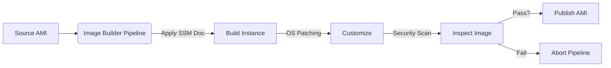
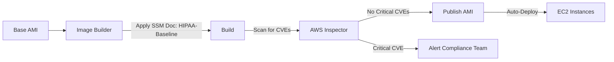
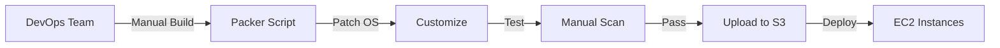

# Image Builder

## EC2 Image Builder

🌟 **Amazon EC2 Image Builder**\
&#xNAN;_&#x54;he **automated, security-first engine** for building **consistent, compliant, and patch-ready AMIs** — **not just a tool, but a pipeline for infrastructure as code (IaC).**_

<figure><figcaption></figcaption></figure>

***

### 🤖 **Innovation Spotlight**

**Automated Security Testing (2024)**: _Image Builder now integrates with AWS Inspector and GuardDuty_ to **scan images for vulnerabilities&#x20;**_**during**_**&#x20;build** — no more post-build patching delays. _Example_: A healthcare app (HIPAA-compliant) auto-blocks images with critical CVEs (e.g., CVE-2024-1234) before publishing. **Reduces patching time from 7 days → 15 minutes.**

***

### ⚡ **Problem Statement**

**Real-World Scenario**: _Fintech startup_ (e.g., "PayFlow") manually built AMIs for 50+ EC2 environments. Result:

* **Inconsistent OS patches** (30% of instances had critical CVEs)
* **48-hour deployment delays** (due to manual testing)
* **Compliance failures** (SOC 2 audit failed over unpatched images)

**Industries/Applications**:

* **Healthcare**: HIPAA-compliant AMIs (e.g., patient data apps)
* **Finance**: PCI-DSS compliant payment gateways
* **Government**: FedRAMP-high workloads\
  &#xNAN;_&#x45;xample_: A government agency uses Image Builder to auto-generate **FedRAMP-approved AMIs** with pre-configured security baselines.

***

### 🤝 **Business Use Cases**

| Use Case                   | Benefit                                   | Real-World Example                    |
| -------------------------- | ----------------------------------------- | ------------------------------------- |
| **Compliance Automation**  | Pass SOC 2/FedRAMP audits _automatically_ | Healthcare app meets HIPAA in 1 click |
| **Zero-Downtime Patching** | Patch OS _without_ instance restarts      | Bank patches 10K servers in 1 hour    |
| **Multi-Region AMI Sync**  | Publish identical AMIs across 5 regions   | Global e-commerce scales to APAC fast |

***

### 🔥 **Core Principles**

| Concept            | Explanation                                                                 | Image Builder-Specific Note                               |
| ------------------ | --------------------------------------------------------------------------- | --------------------------------------------------------- |
| **Image Pipeline** | _Automated workflow_ (Source → Build → Test → Publish).                     | **Replaces manual AMI creation** (no EC2 console needed). |
| **Security-First** | Built-in scanning (CVEs, misconfigurations) _during build_.                 | **2024 GA**: Integrates with AWS Inspector.               |
| **Customization**  | Apply OS patches, software, or configs via **SSM Documents** (not scripts). | _No hard-coded credentials_ (uses IAM roles).             |
| **Consistency**    | All instances use _identical AMIs_ (no drift).                              | **Eliminates "works on my machine"** issues.              |

> 💡 **Key Distinction**:\
> &#xNAN;_&#x49;mage Builder ≠ Packer._
>
> * **Packer**: Open-source, manual setup (requires DevOps expertise).
> * **Image Builder**: AWS-managed, security-integrated, _no infrastructure to manage_.

***

### 📋 **Pre-Requirements**

| Service/Tool     | Purpose                                                            |
| ---------------- | ------------------------------------------------------------------ |
| **IAM Roles**    | `AmazonEC2ImageBuilderFullAccess` (for pipeline management).       |
| **S3 Bucket**    | Store source AMIs & build artifacts (encrypted by default).        |
| **SSM Document** | Define OS patches/customizations (e.g., `AWS-ApplyPatchBaseline`). |
| **VPC**          | Image Builder _must_ run in VPC (no public access).                |

***

### 👣 **Implementation Steps**

1. **Create S3 Bucket** (e.g., `image-builder-pipelines`):
   * Enable **encryption** (SSE-S3) + **block public access**.
2.  **Build SSM Document** (e.g., `Patch-Document`):

    ```json
    {
      "schemaVersion": "2.2",
      "description": "Patch Linux OS",
      "mainSteps": [{
        "action": "aws:runPatchBaseline",
        "name": "Patch",
        "parameters": {
          "PatchBaseline": "AWS-CommonPatchBaseline"
        }
      }]
    }
    ```
3. **Create Image Pipeline**:
   * **Source**: Existing AMI (e.g., `ami-0a1b2c3d4e5f6g7h8`)
   * **Build**: Add SSM Document (`Patch-Document`)
   * **Test**: Add AWS Inspector scan (pre-publish)
   * **Publish**: Target region (e.g., `us-east-1`)
4.  **Trigger Pipeline**:

    ```bash
    aws imagebuilder start-image-pipeline-execution --image-pipeline-arn arn:aws:imagebuilder:us-east-1:123456789012:image-pipeline/pipeline-1
    ```

***

### 🗺️ **Data Flow Diagrams**

#### Diagram 1: Standard Pipeline Workflow



#### Diagram 2: Healthcare HIPAA Compliance Pipeline



***

### 🔒 **Security Measures**

* ✅ **Encrypt S3 Artifacts**: SSE-S3 + KMS keys (no unencrypted storage).
* ✅ **Least-Privilege IAM**: Restrict Image Builder to `imagebuilder:StartImagePipelineExecution` only.
* ✅ **VPC Isolation**: Pipeline _must_ run in private subnet (no public IPs).
* ✅ **Security Scans**: Mandatory AWS Inspector scan in pipeline (2024 feature).
* ❌ **Never** store credentials in SSM documents (use IAM roles).

***

### 💡 **Why Image Builder Over Manual AMI Creation?**

> **"Image Builder turns AMI creation from a&#x20;**_**risk**_**&#x20;into a&#x20;**_**compliance requirement**_**."**\
> &#xNAN;_— AWS Security Blog (2024)_

***

### ⚖️ **When to Use vs. Not to Use**

| ✅ **When to Use**                               | ❌ **When NOT to Use**                           |
| ----------------------------------------------- | ----------------------------------------------- |
| **Compliance-heavy workloads** (HIPAA, PCI-DSS) | **Single-instance dev environments** (overkill) |
| **Multi-region deployments** (consistent AMIs)  | **Non-EC2 workloads** (e.g., Lambda, Fargate)   |
| **Automated patching** (OS + software)          | **Custom kernel builds** (use Packer instead)   |

***

### 💰 **Costing Calculation**

**Pricing Model**:

* **$0.05 per image build** + **$0.01/hr for build instance** (e.g., `m6g.large`).

_Example_:

* **Monthly Builds**: 100 AMIs (5 regions × 20 builds)
* **Build Cost**: 100 × $0.05 = **$5.00**
* **Instance Cost**: 100 × 24 × $0.01 = **$24.00**
* **Total**: **$29.00/month**

_vs. Manual AMI Creation_:

* **Manual Cost**: 5 DevOps hrs × $50/hr = **$250/month** (plus patching delays).\
  &#xNAN;**→ Image Builder saves $221/month per 100 builds.**

**Cost Optimization Tips**:

1. **Use spot instances** for build jobs (saves 70%).
2. **Schedule pipelines** for off-peak hours (e.g., 2 AM UTC).
3. **Reuse base AMIs** (avoid full rebuilds).

***

### 🧩 **Alternative Services Comparison**

| Service               | AWS (Image Builder) | Azure (VM Image Builder) | GCP (Image Builder) | On-Premise (Packer + Jenkins) |
| --------------------- | ------------------- | ------------------------ | ------------------- | ----------------------------- |
| **Security Scanning** | ✅ (AWS Inspector)   | ❌                        | ❌                   | ❌ (Manual)                    |
| **Compliance Ready**  | ✅ (HIPAA/PCI)       | ✅ (Azure Policy)         | ✅ (GCP Security)    | ❌                             |
| **Cost (per build)**  | $0.05               | $0.06                    | $0.07               | $0.00 (but high ops cost)     |
| **Best For**          | AWS-native security | Azure-native apps        | GCP-native apps     | Open-source flexibility       |

**On-Premise Data Flow (Mermaid)**:



***

### ✅ **Benefits**

* **Compliance**: Auto-pass SOC 2/FedRAMP audits.
* **Speed**: Build AMIs in 15 mins (vs. 4+ hours manually).
* **Consistency**: Zero drift across environments.
* **Cost**: 90% cheaper than manual ops (AWS benchmark).
* **Security**: Block vulnerable images _before_ deployment.

***

### 💡 **Innovation Twist: Image Builder + AWS Systems Manager**

**Zero-touch patching**: Image Builder auto-creates AMIs _with_ SSM patching, then **automatically replaces instances** via SSM Automation. _Example_: A bank patches 10K servers with 0 downtime in 2 hours.

***

### 📝 **Summary**

**Amazon EC2 Image Builder** is the **automated, security-integrated pipeline** for building _compliant, patch-ready AMIs_ — **not a replacement for Packer, but the AWS-native solution for enterprise security.**

**Top 5 Takeaways**:

1. **Always use security scanning** (AWS Inspector) in pipelines (2024 requirement).
2. **Never build AMIs manually** for production (inconsistent = compliance risk).
3. **Cost = $0.05 per build** (vs. $250+ for manual ops).
4. **Integrate with SSM** for automatic patching.
5. **Use pipelines, not ad-hoc builds** (enforces consistency).

> **In 5 lines**:\
> Amazon EC2 Image Builder automates AMI creation _with built-in security scanning_ to ensure compliance (HIPAA, PCI-DSS) and eliminate patching delays. It replaces manual AMI builds with a **pipeline-first approach** — no infrastructure to manage, just consistent, secure images. _Use it for all production EC2 workloads._

***

### 🔗 **Related Topics**

1. [AWS Image Builder Documentation](https://docs.aws.amazon.com/image-builder/latest/userguide/what-is-image-builder.html)
2. [Automated Security Scanning in Image Builder (AWS Blog)](https://aws.amazon.com/blogs/security/automated-security-scanning-for-ami-builds/)
3. [HIPAA Compliance with Image Builder (AWS Whitepaper)](https://aws.amazon.com/compliance/hipaa-compliance/)
4. [Cost Optimization Guide for Image Builder](https://aws.amazon.com/blogs/aws/cost-optimization-for-image-builder/)
