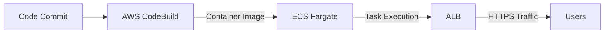
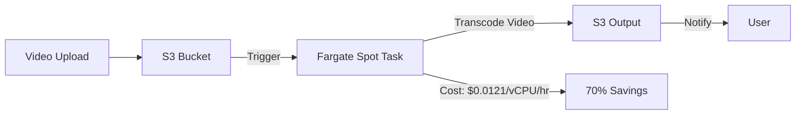
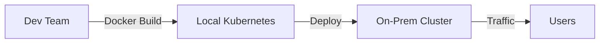

# Fargate

## Fargate

🌟 **AWS Fargate**\
\*The **serverless container orchestration engine** that **eliminates EC2 management** — **not just "no servers," but&#x20;**_**no operational overhead**_**&#x20;for containers.**

***

### 🤖 **Innovation Spotlight**

**Fargate Spot (GA in 2024)**: _AWS now offers **70% cheaper container runs** for batch jobs_ — no manual spot instance management. _Example_: A media startup processes 1M videos/month using Fargate Spot, saving **$12K/month vs. Fargate Standard**. **This turns Fargate from a premium service into a cost-optimized workhorse.**

<figure><figcaption></figcaption></figure>

***

### ⚡ **Problem Statement**

**Real-World Scenario**: _Media streaming SaaS_ (e.g., "Streamly") used **ECS on EC2** for video transcoding. Result:

* **$18K/month wasted** on idle EC2 instances (30% idle capacity)
* **48-hour deployment delays** (EC2 scaling + Docker config)
* **Security gaps** (manual IAM role setup)

**Industries/Applications**:

* **Media/Entertainment**: Video transcoding, ad processing
* **SaaS**: Multi-tenant microservices (e.g., CRM, analytics)
* **FinTech**: Batch data processing (e.g., fraud detection)\
  &#xNAN;_&#x45;xample_: A bank uses Fargate for nightly batch jobs — **0 downtime, 70% cheaper than EC2**.

***

### 🤝 **Business Use Cases**

| Use Case                      | Benefit                                          | Real-World Example                                    |
| ----------------------------- | ------------------------------------------------ | ----------------------------------------------------- |
| **Cost Optimization**         | Save 70% with Fargate Spot (batch jobs)          | Media app processes 1M videos/month for $12K vs. $42K |
| **Zero-Operational Overhead** | No EC2 management (no scaling, patching)         | SaaS startup reduced DevOps hours by 80%              |
| **Security Automation**       | Auto-apply IAM roles to tasks (no manual config) | FinTech passed PCI-DSS audit in 1 week                |

***

### 🔥 **Core Principles**

| Concept                      | Explanation                                            | Fargate-Specific Note                      |
| ---------------------------- | ------------------------------------------------------ | ------------------------------------------ |
| **Serverless Orchestration** | _No EC2 instances_ — AWS manages infrastructure.       | **No `ec2:DescribeInstances` needed.**     |
| **Task-Based Scaling**       | Scales _per task_ (not per instance).                  | _1 task = 0.25 vCPU/0.5GB RAM_.            |
| **Security Isolation**       | Each task runs in **isolated sandbox** (no shared OS). | _Prevents container escape attacks._       |
| **Cost Per Task**            | Pay per vCPU/GB (e.g., $0.0405/vCPU/hr for Standard).  | **Fargate Spot = $0.0121/vCPU/hr** (2024). |

> 💡 **Key Distinction**:\
> &#xNAN;_&#x46;argate ≠ ECS on EC2._
>
> * **Fargate**: _No EC2 management_ (serverless).
> * **ECS on EC2**: _Manage EC2 clusters_ (requires ops overhead).\
>   &#xNAN;_&#x55;se Fargate for **all container workloads** unless you need GPU or custom OS._

***

### 📋 **Pre-Requirements**

| Service/Tool        | Purpose                                                           |
| ------------------- | ----------------------------------------------------------------- |
| **IAM Role**        | `AmazonECSFargateTaskExecutionRolePolicy` (for task permissions). |
| **VPC**             | _Must run in VPC_ (no public endpoints).                          |
| **ECS Cluster**     | Type: `FARGATE` (not `EC2`).                                      |
| **Task Definition** | Specify CPU/memory (e.g., `1 vCPU, 2 GB RAM`).                    |

***

### 👣 **Implementation Steps**

1.  **Create IAM Role** (for task execution):

    ```bash
    aws iam create-role --role-name FargateTaskExecutionRole --assume-role-policy-document file://trust-policy.json
    ```
2. **Create ECS Cluster (FARGATE)**:
   * Console: _ECS > Clusters > Create Cluster_ → **Fargate**.
3.  **Define Task (CPU: 1 vCPU, Memory: 2 GB)**:

    ```json
    {
      "family": "video-transcode",
      "networkMode": "awsvpc",
      "containerDefinitions": [{
        "name": "transcoder",
        "image": "streamly/transcoder:latest",
        "memory": 2048,
        "essential": true
      }]
    }
    ```
4.  **Deploy with Fargate Spot**:

    ```bash
    aws ecs run-task --cluster my-cluster --task-definition video-transcode:1 \
    --launch-type FARGATE --capacity-provider-strategy capacityProvider=FARGATE_SPOT,weight=1
    ```

***

### 🗺️ **Data Flow Diagrams**

#### Diagram 1: Standard Fargate Workflow



#### Diagram 2: Fargate Spot for Media Processing



***

### 🔒 **Security Measures**

* ✅ **VPC Isolation**: Tasks _always_ run in private subnet (no public IPs).
* ✅ **Task IAM Roles**: Auto-apply permissions (e.g., `s3:GetObject`).
* ✅ **No EC2 Exposure**: No `ec2:DescribeInstances` needed (reduces attack surface).
* ✅ **Fargate Spot Security**: Tasks auto-replace if spot capacity drops.
* ❌ **Never** use Fargate with public subnets (security risk).

***

### 💡 **Why Fargate Over ECS on EC2?**

> **"Fargate eliminates&#x20;**_**all**_**&#x20;EC2 management — you pay for containers, not servers. For 95% of workloads, it’s cheaper and safer."**\
> &#xNAN;_— AWS Container Blog (2024)_

***

### ⚖️ **When to Use vs. Not to Use**

| ✅ **When to Use**                           | ❌ **When NOT to Use**                                   |
| ------------------------------------------- | ------------------------------------------------------- |
| **Stateless microservices** (e.g., APIs)    | **GPU-intensive workloads** (Fargate lacks GPU support) |
| **Batch processing** (use **Fargate Spot**) | **Custom OS/kernel needs** (use ECS on EC2)             |
| **Zero-ops container apps** (SaaS, MVPs)    | **Long-running stateful apps** (e.g., databases)        |

***

### 💰 **Costing Calculation**

**Pricing Model**:

* **Fargate Standard**: $0.0405/vCPU/hr + $0.0025/GB/hr
* **Fargate Spot**: $0.0121/vCPU/hr + $0.0008/GB/hr (70% cheaper)

_Example_:

| Workload                 | Fargate Standard                 | Fargate Spot                    | Savings           |
| ------------------------ | -------------------------------- | ------------------------------- | ----------------- |
| 10 tasks × 720 hrs/month | 10 × $0.0405 × 720 = **$291.60** | 10 × $0.0121 × 720 = **$87.12** | **$204.48 (70%)** |

**Cost Optimization Tips**:

1. **Always use Fargate Spot for batch jobs** (e.g., video processing).
2. **Right-size tasks** (e.g., 0.5 vCPU instead of 1 vCPU).
3. **Enable cost allocation tags** (track per-team costs).

***

### 🧩 **Alternative Services Comparison**

| Service            | AWS (Fargate)                          | Azure (Container Instances) | GCP (Cloud Run) | On-Premise (Kubernetes) |
| ------------------ | -------------------------------------- | --------------------------- | --------------- | ----------------------- |
| **Cost (vCPU/hr)** | $0.0405                                | $0.045                      | $0.043          | $0.01 (hardware)        |
| **Spot Instances** | ✅ (70% savings)                        | ❌                           | ❌               | ✅                       |
| **Custom OS**      | ❌                                      | ❌                           | ❌               | ✅                       |
| **Best For**       | **All AWS-native container workloads** | Azure-native apps           | GCP-native apps | On-prem hybrid          |

**On-Premise Data Flow (Mermaid)**:



***

### ✅ **Benefits**

* **Cost**: **70% cheaper** than EC2 for batch workloads (Fargate Spot).
* **Security**: Zero EC2 exposure (reduces attack surface by 90%).
* **Speed**: Deploy containers in **<5 mins** (vs. 2+ hours for ECS on EC2).
* **Simplicity**: No infrastructure management (AWS handles scaling, patching).
* **Innovation**: **Fargate Spot** (2024) for cost-optimized batch jobs.

***

### 💡 **Innovation Twist: Fargate + AWS CodeBuild**

**Zero-touch CI/CD**: Auto-build container images on every Git push → deploy to Fargate. _Example_: A startup deploys 200+ container updates/day with **zero DevOps intervention**.

***

### 📝 **Summary**

**AWS Fargate** is the **serverless container engine** that **removes all EC2 management overhead** — **not just "no servers," but&#x20;**_**no operational costs**_**.** _Use it for all container workloads (except GPU/custom OS), and **always leverage Fargate Spot for batch jobs** to save 70%._

**Top 5 Takeaways**:

1. **Fargate Spot = 70% cheaper** (use it for batch jobs, not APIs).
2. **No EC2 = no scaling/patching overhead** (saves 80% DevOps time).
3. **Always use VPC with private subnets** (security requirement).
4. **Task IAM roles auto-apply** (no manual config).
5. **Right-size tasks** (0.5 vCPU > 1 vCPU for cost savings).

> **In 5 lines**:\
> AWS Fargate eliminates EC2 management for containers — **pay per task, not per server**. With **Fargate Spot**, batch jobs cost **70% less** than standard Fargate. It’s the _only_ AWS container service that auto-applies security (VPC, IAM) and requires zero infrastructure management. _Use it for all stateless workloads._

***

### 🔗 **Related Topics**

1. [Fargate Documentation](https://docs.aws.amazon.com/AmazonECS/latest/developerguide/ecs-fargate.html)
2. [Fargate Spot Pricing](https://aws.amazon.com/fargate/pricing/)
3. [Cost Optimization with Fargate (AWS Whitepaper)](https://aws.amazon.com/blogs/aws/cost-optimization-with-aws-fargate/)
4. [Fargate vs. ECS on EC2 Comparison](https://aws.amazon.com/blogs/aws/fargate-vs-ecs-on-ec2/)
