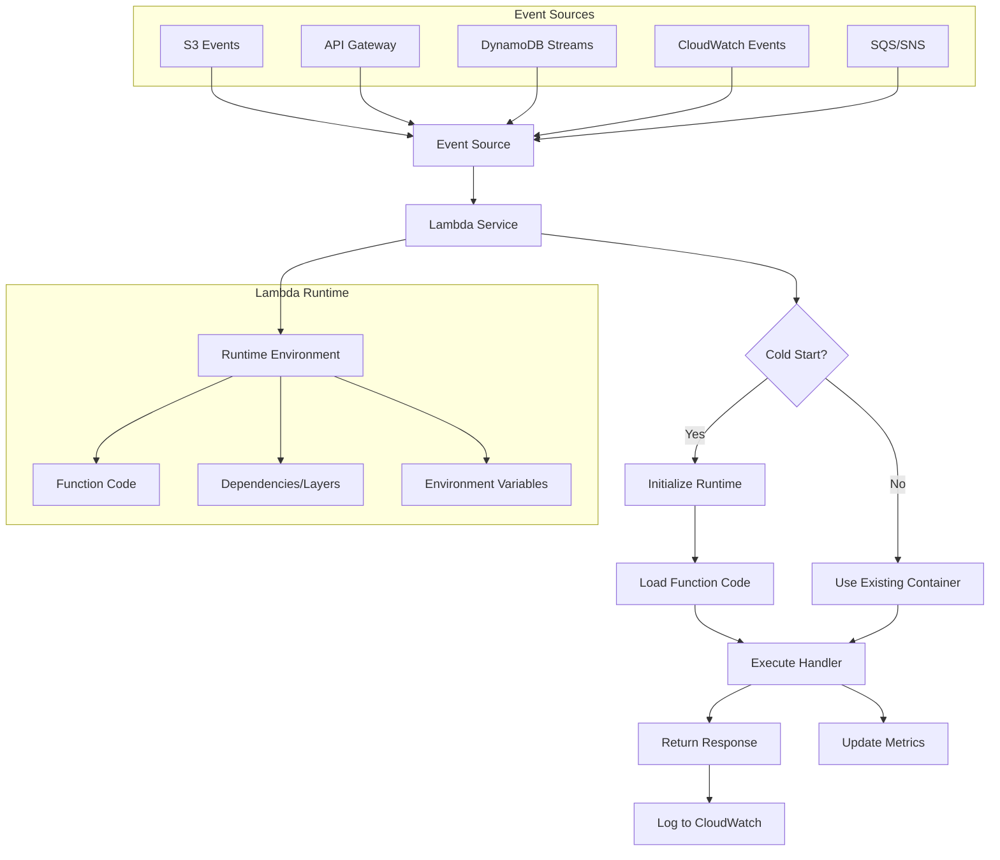
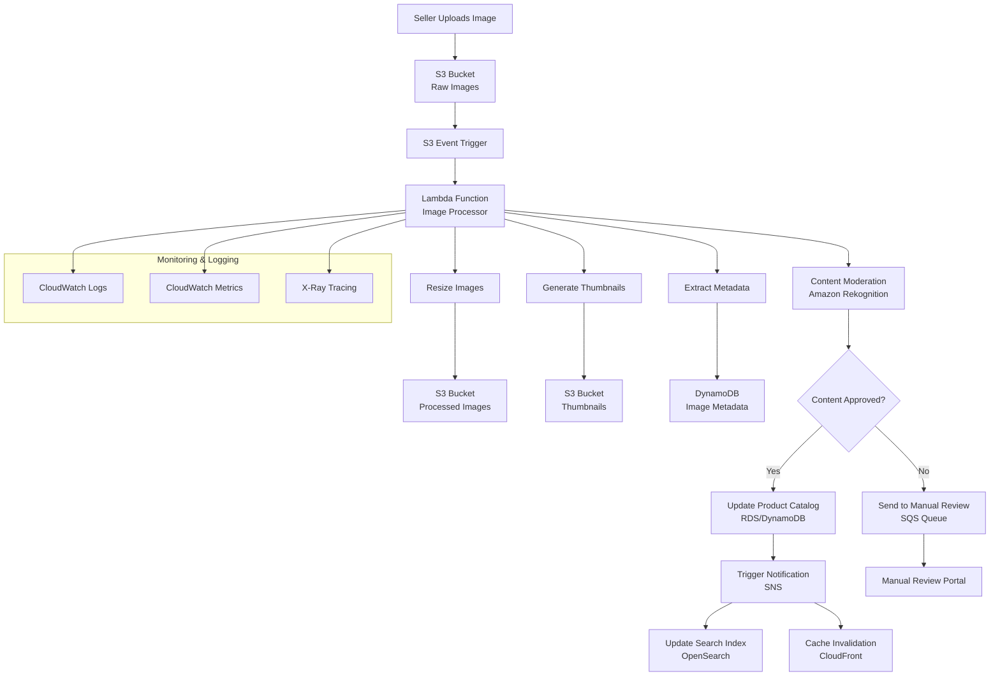
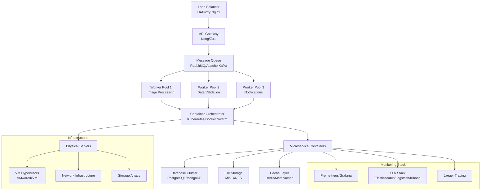

# Lambda

## AWS Lambda - Serverless Computing Deep Dive 🚀

### 1. 🌟 **Overview**

AWS Lambda is a serverless compute service that lets you run code without provisioning or managing servers. It automatically scales your applications by running code in response to each trigger, scaling precisely with the size of the workload. Lambda runs your code on high-availability compute infrastructure and performs all administration of compute resources.

#### **🤖 Innovation Spotlight**

Lambda has evolved with several cutting-edge features:

* **Lambda SnapStart** for Java functions reducing cold start times by up to 10x
* **Advanced Logging Controls** with CloudWatch Lambda Insights
* **Container Image Support** up to 10GB
* **ARM-based Graviton2 processors** offering up to 34% better price performance
* **Provisioned Concurrency** for consistent sub-second response times
* **Lambda Extensions** for enhanced monitoring and security tooling

### 2. ⚡ **Problem Statement**

**Real-World Scenario**: An e-commerce company needs to process product images uploaded by sellers in real-time, generate thumbnails, extract metadata, moderate content, and update the product catalog - all while handling unpredictable traffic spikes during flash sales.

**Case Study Example**: _PhotoMart_, an online marketplace, receives 10,000+ product images daily with traffic spikes of 100x during promotional events. Traditional servers would require:

* Constant provisioning for peak capacity (expensive)
* Complex auto-scaling configurations
* Server maintenance overhead
* Idle resource costs during low traffic

#### **Industries/Applications**:

* **E-commerce**: Image processing, inventory management
* **Media & Entertainment**: Video transcoding, content moderation
* **IoT**: Sensor data processing, device management
* **Finance**: Real-time fraud detection, transaction processing
* **Healthcare**: Medical image analysis, patient data processing

### 2.1 🤝 **Business Use Cases**

1. **Real-time File Processing**: Automatic thumbnail generation when images are uploaded to S3
2. **API Backend**: Serverless REST APIs for mobile applications
3. **Data Transformation**: ETL operations triggered by database changes
4. **Scheduled Tasks**: Automated backups, report generation, cleanup jobs
5. **Event-driven Microservices**: Decoupled service communication via events
6. **Chatbots & AI**: Natural language processing for customer support
7. **IoT Data Processing**: Real-time analytics on sensor data streams

### 3. 🔥 **Core Principles**

#### **Foundational Concepts:**

**Event-Driven Computing**: Lambda functions execute in response to events from AWS services, HTTP requests, or custom applications.

**Serverless Benefits**:

* **No Server Management**: AWS handles infrastructure
* **Automatic Scaling**: Scales from zero to thousands of concurrent executions
* **Pay-per-Request**: Only pay for compute time consumed
* **Built-in Fault Tolerance**: Automatic failure handling and retries

#### **Lambda Service Components:**

* **Lambda Functions**: Your code packaged as deployment packages
* **Runtime Environment**: Execution environment (Python, Node.js, Java, .NET, Go, Ruby, Custom)
* **Event Sources**: Services that trigger Lambda (S3, API Gateway, DynamoDB, etc.)
* **Execution Role**: IAM role that grants permissions to AWS services
* **Environment Variables**: Configuration settings for your function
* **Layers**: Shared libraries and dependencies across functions
* **Destinations**: Configure separate functions for success/failure scenarios
* **Dead Letter Queues**: Handle failed function executions

### 4. 📋 **Pre-Requirements**

| Service/Tool                | Purpose                                             |
| --------------------------- | --------------------------------------------------- |
| **AWS CLI**                 | Command-line interface for AWS services             |
| **IAM Roles**               | Permissions for Lambda to access other AWS services |
| **S3 Bucket**               | Storage for deployment packages and event triggers  |
| **CloudWatch**              | Monitoring and logging Lambda executions            |
| **API Gateway**             | HTTP endpoints for Lambda functions (if needed)     |
| **VPC Configuration**       | Network isolation (if accessing private resources)  |
| **Development Environment** | IDE with AWS SDK/Toolkit                            |

### 5. 👣 **Implementation Steps**

#### **Step-by-Step Lambda Function Creation:**

1. **Create IAM Execution Role**
   * Navigate to IAM → Roles → Create Role
   * Select AWS Lambda as trusted entity
   * Attach policies: `AWSLambdaBasicExecutionRole`
2. **Write Function Code**
   * Choose runtime (Python 3.12, Node.js 20.x, etc.)
   * Implement handler function
   * Package dependencies if required
3. **Create Lambda Function**
   * AWS Console → Lambda → Create Function
   * Configure basic settings (name, runtime, role)
   * Upload code or use inline editor
4. **Configure Triggers**
   * Add event sources (S3, API Gateway, CloudWatch Events)
   * Set up trigger-specific configurations
5. **Set Environment Variables**
   * Add configuration parameters
   * Enable encryption for sensitive data
6. **Configure Function Settings**
   * Memory allocation (128MB - 10GB)
   * Timeout (up to 15 minutes)
   * Concurrency limits
7. **Test and Monitor**
   * Create test events
   * Monitor via CloudWatch metrics
   * Set up alarms and notifications

### 6. 🗺️ **Data Flow Diagrams**

#### **Diagram 1: How Lambda Works**

#### **Diagram 2: E-commerce Image Processing Use Case**

### 7. 🔒 **Security Measures**

#### **Best Practices:**

* **IAM Least Privilege**: Grant minimal required permissions
* **Environment Variable Encryption**: Use AWS KMS for sensitive data
* **VPC Integration**: Isolate functions in private subnets when accessing private resources
* **Resource-Based Policies**: Control who can invoke your functions
* **Dead Letter Queues**: Secure handling of failed executions
* **Input Validation**: Always validate and sanitize inputs
* **Secrets Management**: Use AWS Secrets Manager or Parameter Store
* **Code Signing**: Ensure code integrity and authenticity
* **Runtime Security**: Keep runtimes updated, use Lambda Layers for dependencies
* **Monitoring**: Enable AWS CloudTrail, GuardDuty integration

### 8. 🛡️ **Advanced Security & Compliance**

#### **Enterprise Security Features:**

* **Lambda Authorizers**: Custom authentication for API Gateway
* **AWS WAF Integration**: Web application firewall protection
* **Lambda@Edge**: Execute security functions at CloudFront edge locations
* **Compliance Support**: SOC, PCI DSS, HIPAA eligible configurations
* **Network Security**: VPC endpoints, private subnets, NAT gateways
* **Audit Logging**: Comprehensive execution and access logging

### 9. ⚖️ **When to Use and When Not to Use**

#### ✅ **When to Use:**

* Event-driven applications with unpredictable traffic patterns
* Microservices architectures requiring loose coupling
* Real-time data processing and transformations
* API backends with variable load
* Scheduled tasks and automation
* Applications requiring rapid scaling (0 to thousands of requests)
* Cost optimization for infrequently used services
* Prototyping and MVP development

#### ❌ **When Not to Use:**

* Long-running processes (>15 minutes execution limit)
* Applications requiring persistent connections
* High-frequency, consistently high-load applications
* Applications needing specific hardware requirements
* Complex orchestration better suited for container services
* Applications requiring extensive local storage
* Real-time applications requiring sub-millisecond latency
* Stateful applications requiring session persistence

### 10. 💰 **Costing Calculation**

#### **How Lambda Pricing Works:**

* **Request Charges**: $0.20 per 1M requests
* **Duration Charges**: Based on allocated memory and execution time
  * x86: $0.0000166667 per GB-second
  * ARM (Graviton2): $0.0000133334 per GB-second

#### **Sample Calculations:**

**Scenario 1: Low-Traffic API**

* 100,000 requests/month
* 512 MB memory, 200ms average execution
* Cost: (100,000 × $0.0000002) + (100,000 × 0.2s × 0.5GB × $0.0000166667) = $0.02 + $0.17 = **$0.19/month**

**Scenario 2: Image Processing Service**

* 1M requests/month
* 1024 MB memory, 3s average execution
* Cost: (1,000,000 × $0.0000002) + (1,000,000 × 3s × 1GB × $0.0000166667) = $0.20 + $50 = **$50.20/month**

#### **Cost Optimization Strategies:**

* Right-size memory allocation
* Use ARM-based Graviton2 processors (20% cost reduction)
* Implement efficient code to reduce execution time
* Use provisioned concurrency only when necessary
* Leverage Lambda Layers for common dependencies

### 11. 🧩 **Alternative Services Comparison**

| Feature                | AWS Lambda                 | Azure Functions              | Google Cloud Functions              | On-Premise                |
| ---------------------- | -------------------------- | ---------------------------- | ----------------------------------- | ------------------------- |
| **Max Execution Time** | 15 minutes                 | 10 minutes (Consumption)     | 9 minutes (Gen1), 60 minutes (Gen2) | Unlimited                 |
| **Max Memory**         | 10 GB                      | 1.5 GB (Consumption)         | 8 GB                                | Hardware dependent        |
| **Cold Start**         | 100ms-1s                   | 200ms-2s                     | 100ms-800ms                         | N/A                       |
| **Pricing Model**      | Pay per request + duration | Pay per execution + duration | Pay per invocation + duration       | Fixed infrastructure cost |
| **Supported Runtimes** | 12+ languages              | 8+ languages                 | 6+ languages                        | Any language              |
| **Container Support**  | Yes (10 GB images)         | Yes                          | Yes                                 | Full control              |

#### **On-Premise Alternative: Event-Driven Microservices**

### 12. ✅ **Benefits**

* **Cost Efficiency**: Pay only for actual compute time used, no idle server costs
* **Automatic Scaling**: Seamlessly handles traffic spikes from zero to millions of requests
* **Reduced Operational Overhead**: No server management, patching, or capacity planning
* **Built-in High Availability**: Multi-AZ deployment with automatic failover
* **Fast Time-to-Market**: Focus on business logic instead of infrastructure
* **Integration Ecosystem**: Native integration with 200+ AWS services
* **Performance Optimization**: Sub-second response times with provisioned concurrency
* **Developer Productivity**: Simplified deployment and development workflow

### 13. 🚀 **Innovation & Future Trends**

#### **Cutting-Edge Developments:**

* **Lambda Response Streaming**: Real-time response streaming for improved user experience
* **Advanced Function URLs**: HTTP endpoints with built-in security and throttling
* **Lambda Runtime API**: Custom runtime environments for any programming language
* **Function Concurrency Insights**: Advanced monitoring for concurrent execution patterns
* **Carbon Footprint Optimization**: Graviton2 processors reducing environmental impact
* **Edge Computing Integration**: Tighter integration with AWS IoT Greengrass and Lambda@Edge

### 14. 📝 **Summary**

AWS Lambda revolutionizes application development by eliminating server management while providing unlimited scalability and cost efficiency. This serverless compute service enables developers to build event-driven applications that automatically scale from zero to thousands of concurrent executions, paying only for actual compute time used.

#### **Key Mindset Points:**

1. **Think Event-Driven**: Design applications around events and triggers rather than always-on servers
2. **Optimize for Cold Starts**: Consider initialization time in your architecture decisions
3. **Embrace Statelessness**: Design functions to be stateless and idempotent
4. **Monitor Everything**: Lambda's ephemeral nature makes comprehensive monitoring crucial
5. **Security First**: Implement least-privilege IAM roles and encrypt sensitive data
6. **Cost Awareness**: Right-size memory allocation and optimize execution time
7. **Timeout Management**: Design for the 15-minute execution limit
8. **Error Handling**: Implement proper retry logic and dead letter queues
9. **Testing Strategy**: Develop comprehensive testing for event-driven architectures
10. **Vendor Lock-in Consideration**: Understand AWS-specific features vs. portable solutions

#### **Service Essence:**

AWS Lambda is a revolutionary serverless compute service that executes your code in response to events without requiring server management. It automatically scales applications by running code in stateless containers, charges only for actual compute time, and integrates seamlessly with the entire AWS ecosystem. Lambda enables developers to build highly scalable, cost-effective applications focusing purely on business logic while AWS handles all infrastructure concerns including scaling, patching, and high availability.

### 15. 🔗 **Related Topics & References**

#### **Advanced Learning Paths:**

* **AWS Step Functions**: Orchestrating Lambda functions in complex workflows
* **API Gateway Integration**: Building serverless REST and WebSocket APIs
* **Lambda@Edge**: Running functions at CloudFront edge locations
* **AWS SAM (Serverless Application Model)**: Infrastructure-as-code for serverless apps
* **EventBridge**: Advanced event routing and filtering
* **Lambda Layers**: Sharing code and dependencies across functions

#### **Reference Guidelines:**

* [AWS Lambda Developer Guide](https://docs.aws.amazon.com/lambda/)
* [AWS Lambda Best Practices](https://docs.aws.amazon.com/lambda/latest/dg/best-practices.html)
* [Serverless Application Lens - AWS Well-Architected Framework](https://docs.aws.amazon.com/wellarchitected/latest/serverless-applications-lens/)
* [AWS Lambda Power Tuning Tool](https://github.com/alexcasalboni/aws-lambda-power-tuning)
* [Lambda Cold Start Analysis](https://mikhail.io/serverless/coldstarts/aws/)
