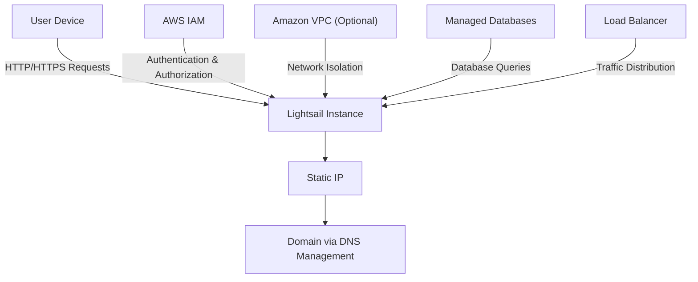
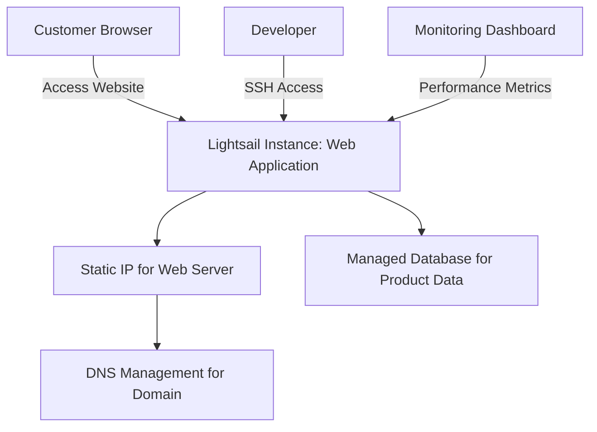
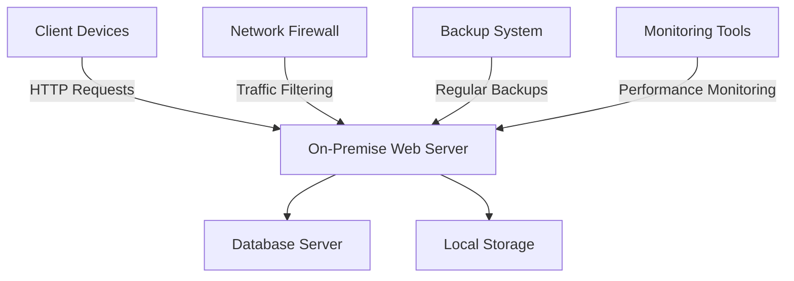

# Lightsail

## Amazon Lightsail: A Comprehensive Overview

### 1. 🌟 Overview

Amazon Lightsail is a simplified cloud platform offered by AWS, designed to help users quickly launch and manage applications and websites. It provides virtual private servers (instances), databases, storage, and networking capabilities at a predictable, low cost. Lightsail abstracts much of the complexity involved in traditional cloud deployments, making it particularly appealing for developers, small businesses, and startups.

<figure><figcaption></figcaption></figure>

#### 🤖 Innovation Spotlight

Amazon Lightsail has recently expanded its capabilities to include managed databases for MySQL and PostgreSQL, and load balancers for distributing traffic across multiple instances. These enhancements extend Lightsail's utility to more complex application architectures while maintaining simplicity and ease of use.

### 2. ⚡ Problem Statement

**Real-World Scenario:** A startup wants to launch a new e-commerce website with limited technical resources and a tight budget. They require a solution that can be deployed quickly, scales with their business growth, and maintains operational simplicity.

**Industries/Applications:**

* **Startups and Small Businesses:** Deploying web applications and websites with minimal overhead.
* **Developers:** Setting up development and testing environments quickly.
* **Educational Institutions:** Providing students with easy-to-manage cloud resources for learning purposes.

### 2.1 🤝 Business Use Cases

Amazon Lightsail is particularly beneficial for:

* **Web Hosting:** Hosting small to medium websites with predictable pricing and scalability.
* **Development Environments:** Providing isolated and consistent development and testing environments.
* **Simple Applications:** Running low-to-medium traffic web applications and APIs.

### 3. 🔥 Core Principles

Amazon Lightsail is designed with simplicity and ease of use in mind, focusing on several core principles:

* **Simplified Cloud Deployment:** Offers pre-configured instances and easy setup for websites and applications.
* **Managed Services:** Includes managed databases and load balancers, reducing the operational burden on users.
* **Cost Predictability:** Provides fixed pricing plans to help users manage and predict their cloud costs effectively.
* **Scalable Resources:** Allows users to scale their resources up or down with a few clicks, accommodating growth or changing needs.

Key Resource Terms:

* **Instances:** Pre-configured virtual servers with options for different CPU, memory, and storage capacities.
* **Static IPs:** Fixed IP addresses that can be attached to instances, facilitating consistent connections.
* **DNS Management:** Simplified domain name management integrated with Lightsail.
* **Snapshots:** Point-in-time backups of instances that can be used for recovery or replication.

### 4. 📋 Pre-Requirements

To implement Amazon Lightsail, you need the following AWS services and tools:

* **AWS Identity and Access Management (IAM):** For managing access to AWS services and resources securely.
* **AWS CloudFormation (Optional):** For users familiar with infrastructure as code, though Lightsail simplifies direct instance management.
* **AWS Route 53 (Optional):** For advanced DNS management, though Lightsail offers integrated DNS management.

### 5. 👣 Implementation Steps

1. **Create a Lightsail Instance:**
   * Log in to the AWS Management Console and navigate to the Lightsail service.
   * Click on "Create instance" and choose an instance image (e.g., Linux/Unix, Windows, or application-specific stacks like WordPress).
   * Select an instance plan based on your resource requirements and give your instance a name.
2. **Configure Networking and Security:**
   * Attach a static IP address to your instance for consistent accessibility.
   * Configure firewall rules to control traffic to your instance, allowing only necessary ports (e.g., HTTP/HTTPS for web applications).
3. **Set Up DNS:**
   * Use Lightsail’s integrated DNS management to map a domain name to your static IP address.
   * Alternatively, use AWS Route 53 for more advanced DNS configurations.
4. **Deploy Your Application:**
   * Connect to your instance via SSH (for Linux/Unix) or RDP (for Windows).
   * Deploy your application code and configure your web server, database, and other dependencies.
5. **Monitor and Manage:**
   * Utilize the Lightsail dashboard to monitor your instance’s performance and manage resources.
   * Set up alerts and notifications to stay informed about your instance’s status and performance.

### 6. 🗺️ Data Flow Diagram

Here is a Mermaid diagram illustrating the architecture of Amazon Lightsail:

The second Mermaid diagram below illustrates a specific use case of a small business deploying a web application on Amazon Lightsail:

### 7. 🔒 Security Measures

To secure your Amazon Lightsail instance, follow these best practices:

* **Firewall Configuration:** Set restrictive firewall rules in your Lightsail instance to allow only necessary inbound and outbound traffic.
* **SSH Key Management:** Use secure SSH key pairs for instance access and rotate keys regularly.
* **IAM Policies:** Apply AWS IAM policies to control access to Lightsail resources, adhering to the principle of least privilege.
* **Regular Backups:** Utilize Lightsail snapshots and automated backups to ensure data resilience and quick recovery.

### 8. 🤝 Integration with Other AWS Services

Amazon Lightsail integrates seamlessly with other AWS services to enhance its functionality:

* **Amazon RDS:** For applications requiring more powerful, fully-managed database solutions.
* **Amazon S3:** For cost-effective object storage and backup solutions.
* **AWS CloudFront:** For delivering content faster with a content delivery network (CDN).
* **AWS Lambda:** For serverless computing needs that extend Lightsail capabilities.

These integrations allow for building comprehensive, scalable solutions leveraging Lightsail as part of a broader AWS environment.

### 9. ⚖️ When to Use and When Not to Use

#### ✅ When to Use

Amazon Lightsail is ideal for:

* Small-scale web applications and websites that require simplicity and ease of use.
* Development and testing environments where quick setup and teardown are beneficial.
* Applications with predictable traffic and workload requirements, benefiting from fixed pricing models.

#### ❌ When Not to Use

Amazon Lightsail might not be suitable for:

* Large-scale enterprise applications requiring extensive customization and complex architectures.
* Highly variable or unpredictable workloads that demand the flexibility and scalability of more granular AWS services.

### 10. 💰 Costing Calculation

Amazon Lightsail pricing is structured around several components:

* **Instance Plans:** Fixed monthly costs based on the selected instance size (CPU, memory, and storage).
* **Data Transfer:** Costs for data transferred in and out of the Lightsail instance.
* **Additional Services:** Costs for managed databases, load balancers, and additional storage or snapshots.

**Example Cost Calculation:**

Suppose you deploy a Lightsail instance with:

* A monthly instance plan priced at $20/month.
* Data transfer of 50 GB out per month at $0.09 per GB.

**Monthly Costs:**

* Instance Plan Cost: $20/month
* Data Transfer Cost: 50 GB × $0.09/GB = $4.50/month

**Total Estimated Monthly Cost:** $20 + $4.50 = $24.50

_Note: Prices may vary by region and are subject to change. Always refer to the latest AWS pricing for accurate calculations._

### 11. 🧩 Alternative Services

Here’s a comparison table of Amazon Lightsail with alternative services:

| Feature/Service     | Amazon Lightsail | AWS EC2           | Azure App Service | Google Cloud Run | On-Premise Servers  |
| ------------------- | ---------------- | ----------------- | ----------------- | ---------------- | ------------------- |
| **Managed Service** | Yes              | No (Self-managed) | Yes               | Yes              | No                  |
| **Ease of Setup**   | High             | Medium            | High              | Medium           | Low                 |
| **Pricing Model**   | Fixed Monthly    | Pay-as-you-go     | Fixed + Usage     | Pay-as-you-go    | Capital Expenditure |
| **Scalability**     | Limited          | High              | Medium            | High             | Manual              |

Mermaid Diagram for an on-premise alternative (e.g., self-managed servers):

### 12. ✅ Benefits

Amazon Lightsail offers several advantages:

* **Simplicity and Ease of Use:** Enables users to deploy and manage applications without deep cloud expertise.
* **Predictable Pricing:** Fixed monthly costs help manage and predict expenses effectively.
* **Scalability:** Offers easy scaling options to accommodate growing application needs.
* **Integration with AWS:** Benefits from the broader AWS ecosystem, enhancing functionality and flexibility.

### 13. 🏢 Enterprise Adoption

While primarily designed for smaller deployments, Amazon Lightsail is also utilized by enterprises for lightweight applications, development environments, and small-scale services. It supports:

* **Rapid Prototyping:** Quickly deploy prototypes and test ideas.
* **Microservices Architecture:** Deploy individual components of larger applications.
* **Training and Education:** Provide students and teams with isolated development environments.

### 14. 📝 Summary

Amazon Lightsail is a user-friendly, cost-effective cloud platform designed for users needing straightforward deployment and management of applications and websites.

* **Top 5 Points to Remember:**
  1. Simplified cloud platform for quick and easy deployments.
  2. Fixed pricing with optional scalability for growing needs.
  3. Suitable for web hosting, development environments, and simple web applications.
  4. Integrates with broader AWS services for enhanced functionality.
  5. Ideal for small businesses, startups, and individual developers with limited cloud expertise.

In short, Amazon Lightsail is all about simplicity and affordability, providing an accessible entry point into cloud computing with predictable costs and straightforward management.

### 15. 🔗 Related Topics

* **AWS EC2:** For more complex and scalable cloud computing needs.
* **AWS Elastic Beanstalk:** For easy-to-use application deployment and management.
* **AWS for Startups:** Resources and programs designed to help startups grow on AWS.
* **AWS Cost Management Tools:** For managing and optimizing cloud costs across AWS services.
