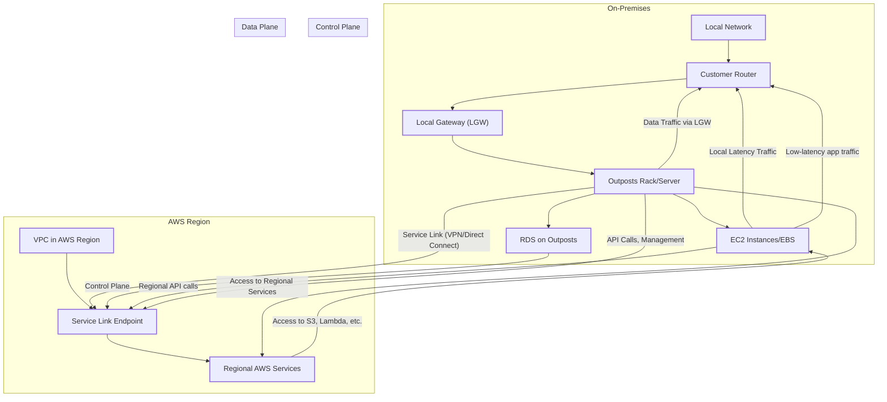
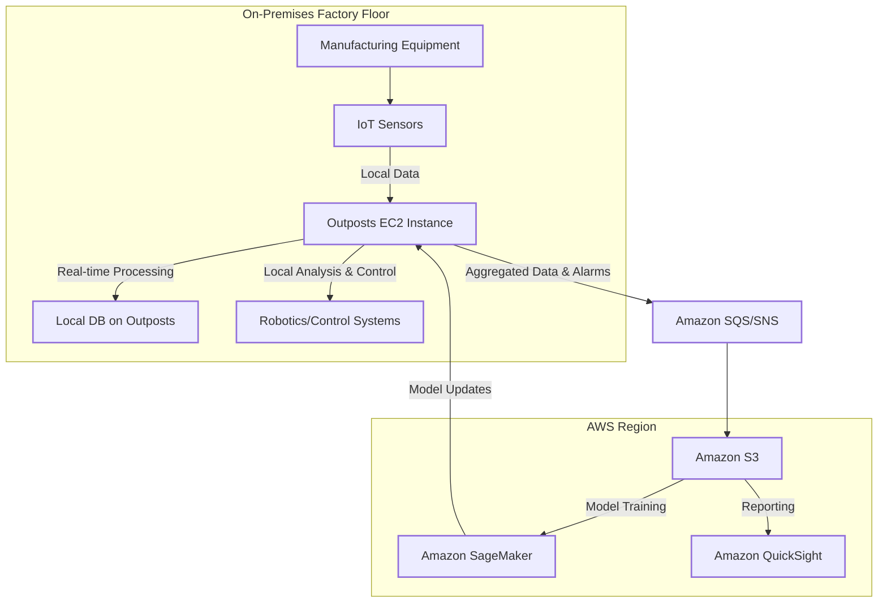
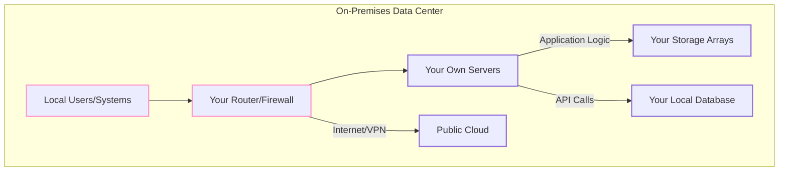

# Outpost

## AWS Outposts

### 🚀 AWS Outposts: Extending the Cloud to Your Data Center

This is a service that bridges the gap between the public cloud and on-premises environments: AWS Outposts. This solution is a game-changer for organizations with specific latency, data residency, or local data processing needs.

### 🌟 1. Overview

AWS Outposts is a family of fully managed solutions that extend AWS infrastructure, AWS services, APIs, and tools to virtually any on-premises or edge location. It provides a consistent hybrid experience, allowing you to run supported AWS services locally while still seamlessly connecting to the broader range of services available in the AWS Region. AWS takes care of the hardware delivery, installation, management, and maintenance, so you can focus on your applications.

#### Innovation Spotlight 💡

The latest generations of AWS Outposts racks are bringing significant innovations. The introduction of second-generation Outposts racks with the latest-generation EC2 instances (like C7i, M7i, R7i) delivers breakthrough performance and scalability. This includes simplified network scaling with a new Outposts network rack and specialized EC2 instances with accelerated networking for ultra-low latency, mission-critical workloads. This evolution demonstrates AWS's commitment to making the hybrid cloud experience more powerful and more integrated than ever before.

### ⚡ 2. Problem Statement

Many businesses face a dilemma: they want to leverage the agility and scalability of the AWS Cloud, but their workloads have specific on-premises requirements. This could be due to:

* Ultra-low latency: Applications like real-time gaming, high-frequency trading, or manufacturing automation require latency in the single-digit milliseconds to function effectively. A round trip to a public cloud region, even a nearby one, is simply too slow.
* Local data processing: Industries dealing with massive volumes of data, such as oil and gas exploration or media and entertainment, need to process data locally to avoid the time, cost, and bandwidth constraints of moving it all to the cloud.
* Data residency: Certain industries (e.g., finance, government, healthcare) or countries have strict regulations that mandate data must remain within a specific geographic boundary. Outposts allows them to use a cloud-like model while meeting these compliance requirements.

#### 2.1 🤝 Business Use Cases

* Smart Manufacturing: A manufacturing plant can deploy Outposts to run applications for real-time quality control, predictive maintenance, and robotics. This allows them to process sensor data locally to make instantaneous decisions on the factory floor, improving efficiency and reducing downtime.
* Healthcare: Hospitals can use Outposts to run applications for patient monitoring and medical imaging. This ensures patient data is processed and stored on-premises to meet HIPAA and other data residency regulations, while still benefiting from cloud management tools.
* Retail: A large retail chain can deploy Outposts in its stores to manage point-of-sale systems, inventory management, and in-store analytics. This provides a consistent experience across all locations and ensures business continuity even if the internet connection to the cloud is interrupted.

### 🔥 3. Core Principles

* Consistent Hybrid Experience: Outposts extends your AWS VPC to your on-premises environment. You get a single, unified experience with the same AWS APIs, tools, and services, making it easy to build, deploy, and manage your applications.
* Local Services: Outposts delivers a subset of AWS services to your on-premises location, including Amazon EC2, Amazon EBS, Amazon RDS, Amazon ECS, and Amazon EKS. These services run on the Outposts hardware, providing low-latency access to local resources.
* Regional Connectivity: The Outpost is "homed" to a specific AWS Region. It maintains a secure, persistent connection, known as a "service link," back to this parent Region. This connection is used for all control plane operations, management, and access to the full range of regional AWS services.

#### Key Terms:

* Outpost Site: The physical location at your data center or edge location where the Outposts rack or server is installed.
* Outpost Rack: An industry-standard 42U rack that includes servers, storage, and networking equipment, all managed by AWS.
* Outpost Server: A smaller 1U or 2U form factor for environments with limited space or capacity requirements.
* Service Link: A secure, encrypted VPN connection between the Outpost hardware and its parent AWS Region, used for management and data plane traffic.
* Local Gateway (LGW): A component of the Outpost that provides local network connectivity and is used to route traffic between your on-premises network and the Outpost.

### 📋 4. Pre-Requirements

* Physical Space & Power: You need a suitable physical location with adequate power, cooling, and rack space (for Outposts racks). AWS provides detailed specifications for these requirements.
* Network Connectivity: A reliable, high-speed network connection (e.g., AWS Direct Connect or a high-bandwidth public internet connection) to the AWS Region is essential for the service link.
* IP Addressing: You need to provide a non-overlapping IP address range for your Outpost, which will be used for your VPC subnets and resources running on Outposts. You also need a Customer-Owned IP (CoIP) range for public IP addresses.
* IAM Roles: You'll need an IAM role with the necessary permissions to manage your Outposts, EC2 instances, and other services.

### 👣 5. Implementation Steps

* Order the Outpost: Consult with an AWS Solutions Architect to determine the right Outposts configuration (rack or servers, capacity, etc.) for your needs.
* Prepare Your Site: Ensure your physical location meets all the power, cooling, and networking requirements. This is a critical step to ensure a smooth installation.
* AWS Installation: AWS will deliver and install the Outpost hardware at your site.
* Create Outpost in AWS Console: In the AWS Management Console, create an Outpost resource and link it to an existing or new VPC in the parent AWS Region.
* Create Outpost Subnet: Create a new subnet within your VPC and specify the Outpost as its location. This will be the subnet where you launch your on-premises resources.
* Configure Network: Configure your Local Gateway (LGW) to enable routing between your on-premises network and the Outpost subnet.
* Launch Resources: Launch EC2 instances, deploy RDS databases, or run ECS/EKS workloads directly into your new Outpost subnet using the same familiar AWS console, CLI, or APIs.

### 🗺️ 6. Data Flow Diagram

**Diagram 1: How AWS Outposts Works**

**Diagram 2: Use Case: Real-time Manufacturing Analytics**

### 🔒 7. Security Measures

* Shared Responsibility Model: AWS is responsible for the security of the Outposts hardware and underlying infrastructure. You are responsible for security in the cloud, including your data, applications, and access control.
* IAM Roles and Policies: Use the principle of least privilege. Create granular IAM roles to control who can manage the Outpost and what actions they can perform on resources running on it.
* VPC Security: Leverage the same VPC security features as in the public cloud, including Security Groups and Network ACLs, to control network traffic to and from your instances.
* Data Encryption: All data at rest on Outposts is encrypted by default. You can enable additional encryption for services like EBS and S3 on Outposts.
* Service Link Security: The service link connection back to the AWS Region is a secure, encrypted VPN, ensuring all management and control plane traffic is protected.

### 9. ⚖️ When to use and when not to use

* ✅ When to use
  * Low-latency requirements: Your application needs to respond in single-digit milliseconds to local users or systems.
  * Data residency constraints: Legal or compliance requirements mandate that your data remains on-premises.
  * Local data processing: You are dealing with massive datasets that are costly or time-consuming to transfer to the cloud.
  * Application migration with interdependencies: You have a monolithic application with tight dependencies on on-premises systems, and you want to move parts of it to a cloud-like environment without a full re-architecture.
* ❌ When not to use
  * No on-premises constraints: If your application can run entirely in a public AWS Region and meets all performance, cost, and security requirements, Outposts is an unnecessary complexity.
  * Budget constraints: The upfront cost of Outposts can be significant compared to a pay-as-you-go public cloud model.
  * Small-scale needs: For very small workloads or a single server, Outposts might be overkill. Consider AWS Local Zones or a custom on-premises server instead.

### 💰 10. Costing Calculation

* How it is calculated?
  * Capacity-based: Outposts is a capacity-based service. You pay for the pre-configured hardware and capacity you commit to for a 3-year term.
  * Upfront, Partial, or No Upfront: You have flexible payment options similar to EC2 Reserved Instances.
  * Additional Charges: You are also charged for any regional AWS services consumed (e.g., S3 storage for backups, Lambda functions) and for data transfer from your Outpost to the public internet.
* Efficient way of handling this service:
  * Rightsizing: Accurately forecast your capacity needs. Work with AWS to select a configuration that aligns with your current and future requirements to avoid over-provisioning.
  * Term Commitment: A longer-term commitment provides significant cost savings. The 3-year term with an all-upfront payment offers the greatest discount.
  * Hybrid Architecture: Design your applications to leverage a mix of Outposts for latency-sensitive components and regional AWS services for everything else (e.g., analytics, backups). This optimizes both performance and cost.
* Sample Calculations (Illustrative, prices vary):
  * A company needs a medium-sized Outposts rack with a mix of compute and storage.
  * Configuration: One rack with 10 x M7i.16xlarge instances and 50 TB of EBS gp3 storage.
  * Payment Option: 3-year term, Partial Upfront.
  * Upfront Cost: \~$35,000 (illustrative)
  * Monthly Cost: \~$1,500 (illustrative)
  * Total 3-Year Cost: \~$89,000 (illustrative)
  * Note: This does not include OS licenses or the cost of the on-premises network link (Direct Connect).

### 🧩 11. Alternative services in AWS/Azure/GCP/On-Premise

| Feature        | AWS Outposts                                                             | Azure Stack                                                                  | Google Anthos                                                                          | On-Premise Solution (DIY)                                             |
| -------------- | ------------------------------------------------------------------------ | ---------------------------------------------------------------------------- | -------------------------------------------------------------------------------------- | --------------------------------------------------------------------- |
| Core Concept   | Extends the AWS cloud to your location with managed hardware.            | Brings Azure services and APIs to your data center.                          | A platform for managing workloads across multiple clouds and on-premises environments. | You procure, manage, and operate all hardware and software yourself.  |
| Hardware       | Fully managed, delivered, and operated by AWS.                           | You purchase and operate hardware from a certified vendor (e.g., Dell, HPE). | No specific hardware. Runs on your existing infrastructure.                            | You are responsible for all hardware procurement and maintenance.     |
| Management     | Managed entirely by AWS. Unified management with the AWS Region.         | You manage the hardware and some of the software updates.                    | Managed via the Google Cloud console with agents running on your clusters.             | You are responsible for all management, patching, and upgrades.       |
| API/Experience | Consistent AWS APIs and console. Same experience as the public cloud.    | Consistent Azure APIs, Portal, and tools.                                    | Uses standard Kubernetes APIs and other open-source tools.                             | Varies widely based on your chosen technology stack.                  |
| Connectivity   | Requires a persistent, high-bandwidth connection to a parent AWS Region. | Can operate in a connected or disconnected mode.                             | Requires connectivity to GCP for control plane.                                        | Can be fully disconnected or connected as per your needs.             |
| Use Case       | Ideal for low-latency, data residency, and seamless hybrid cloud.        | Great for disconnected environments or specific Azure services on-prem.      | Best for multi-cloud and hybrid Kubernetes management.                                 | Full control and customization, but high operational overhead.        |

**On-Premise DIY Data Flow Diagram**

### ✅ 12. Benefits

* Consistency: Provides the same AWS experience, APIs, and tools on-premises, streamlining developer workflows and reducing operational overhead.
* Low Latency: Enables you to run applications that require single-digit millisecond latency to local systems.
* Data Residency & Security: Helps meet strict data residency and compliance requirements by keeping data within your premises.
* Fully Managed: AWS handles the undifferentiated heavy lifting of infrastructure management, including patching, maintenance, and hardware replacement.
* Hybrid Cloud Migration: Eases the transition to the cloud for workloads with complex on-premises dependencies.
* Scalability: You can scale your on-premises compute and storage capacity on demand, just like in the cloud.

### 📝 14. Summary

AWS Outposts is a powerful solution that brings the AWS Cloud directly to your data center. It's designed for organizations that need to meet specific low-latency, data residency, or local processing requirements while maintaining a consistent and fully managed cloud experience. By extending your VPC on-premises, Outposts allows you to use familiar AWS services and tools to build true hybrid applications.

**Top 5 Things to Keep in Mind:**

* It's a "Cloud-in-a-Box": Outposts is not just hardware; it's a fully managed extension of the AWS cloud, bringing a consistent experience to your on-premises environment.
* Parented to an AWS Region: Outposts requires a constant, high-speed connection back to its parent AWS Region for management and control plane functions.
* Use Case Driven: It is specifically for workloads with strict on-premises requirements. If your application can run in the public cloud, it's often more cost-effective.
* Capacity-Based Pricing: You commit to a capacity for a term, which differs from the public cloud's pay-as-you-go model.
* Simplified Operations: While it requires some on-premises setup, the day-to-day management of the infrastructure is handled by AWS, freeing your teams to focus on applications.

> In short, AWS Outposts provides a seamless, consistent hybrid cloud experience by bringing a subset of AWS infrastructure and services to your on-premises environment. It's the ideal solution for workloads that demand low latency or need to comply with local data residency requirements, all while being fully managed by AWS.

### 🔗 15. Related Topics

* AWS Local Zones: For workloads that need low latency but not a full on-premises data center.
* AWS Wavelength: For ultra-low latency applications on 5G networks at the edge.
* AWS Direct Connect: The recommended connectivity solution for a stable and high-bandwidth service link.
* AWS Hybrid Cloud Solutions: Official AWS guide for understanding and implementing hybrid architectures.
* AWS Outposts Documentation: The complete technical reference for planning, deploying, and managing Outposts.
