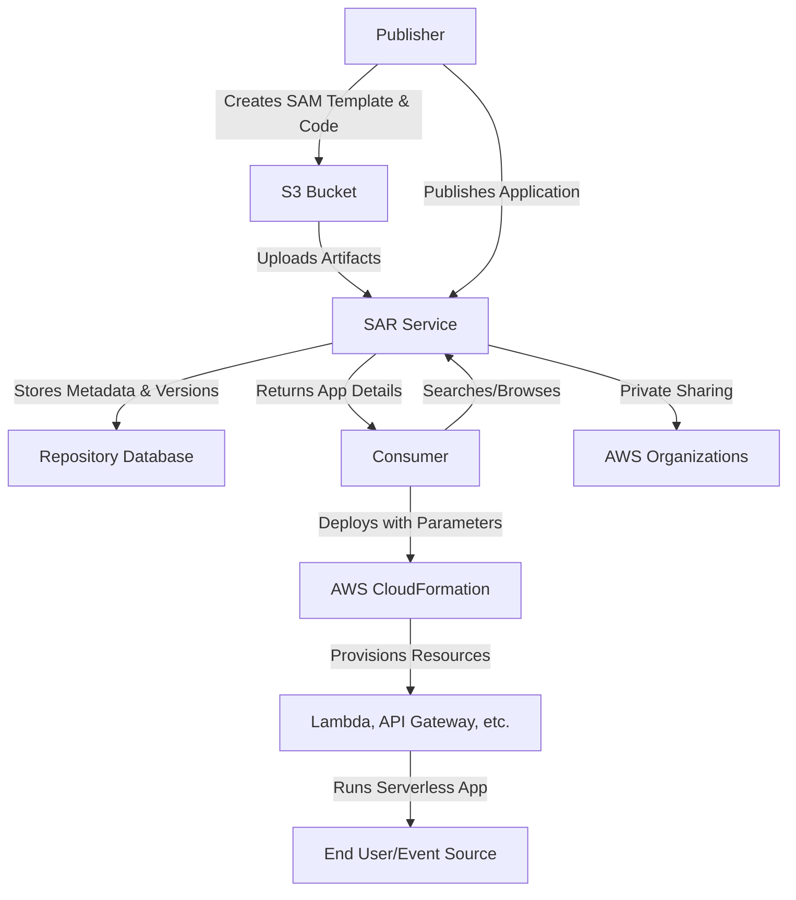
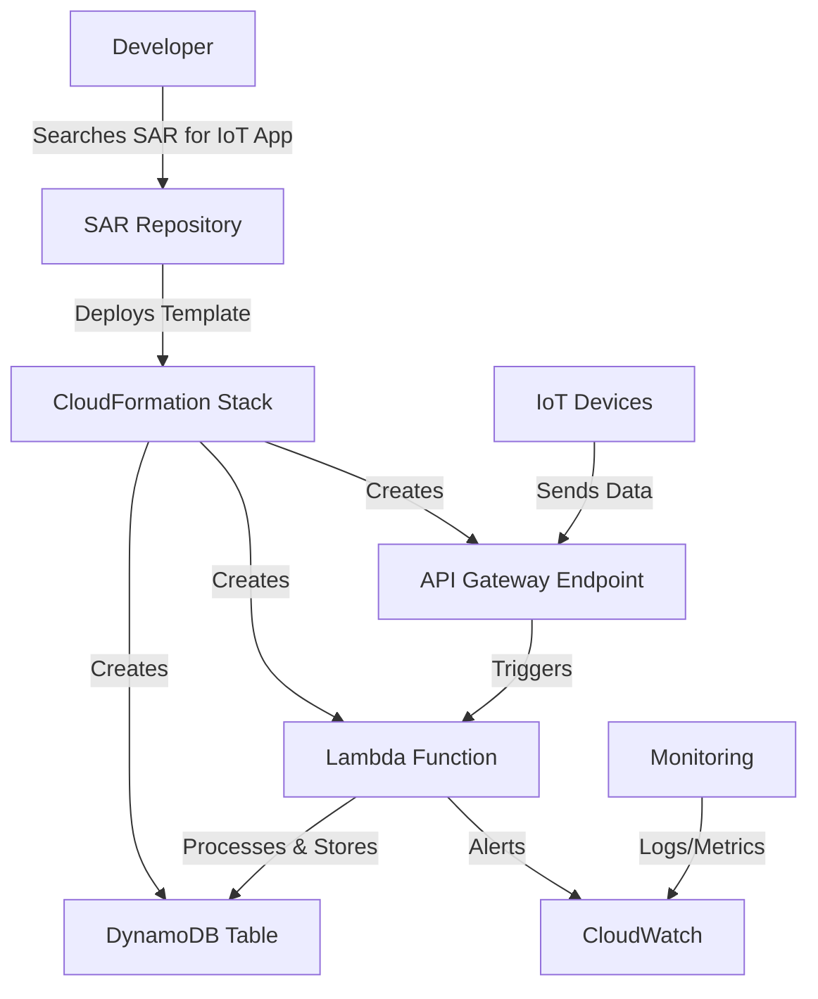
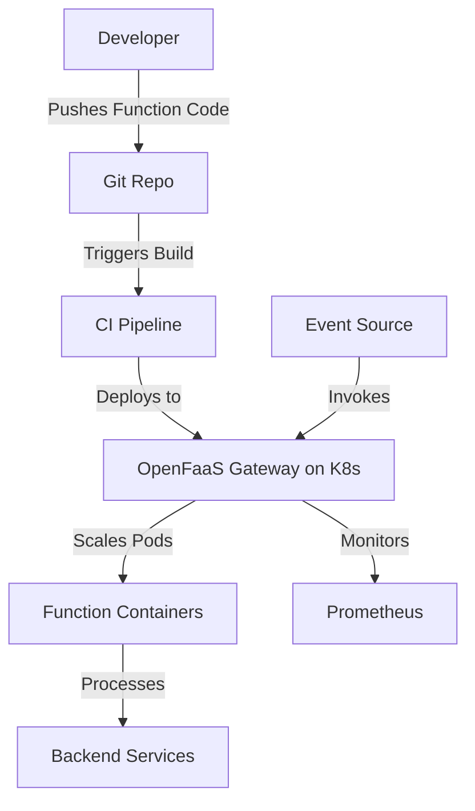

# SAR

## **AWS Serverless Application Repository**

### **🌟 Overview**

AWS Serverless Application Repository (SAR) is a fully managed service that enables developers, teams, and organizations to discover, deploy, and publish serverless applications in the AWS Cloud. It serves as a centralized repository for sharing reusable serverless components, such as AWS Lambda functions, API Gateway configurations, and Step Functions workflows, all packaged using AWS Serverless Application Model (SAM) templates. This eliminates the need to manually recreate common application patterns, accelerating development cycles.&#x20;

<figure><figcaption></figcaption></figure>

In a deep dive, SAR supports public sharing for community contributions and private sharing within AWS Organizations or specific accounts, with built-in search capabilities by keywords, categories (e.g., IoT, chatbots, data processing), publishers, or event sources. Applications can include nested structures for complex architectures, and deployments automatically create necessary resources like IAM roles, S3 buckets, and Lambda layers. SAR integrates seamlessly with the AWS Management Console, CLI, SDKs, and CI/CD pipelines, ensuring idempotent deployments and version control for updates without disrupting existing instances.

**🤖 Innovation Spotlight**: As of September 2025, AWS introduced the open-source Serverless MCP (Model Context Protocol) Server, an AI-powered tool that enhances SAR by providing contextual guidance for initializing, building, and deploying serverless applications. It uses AI to recommend best practices, SAM templates, and architectures, streamlining workflows for developers and integrating directly with SAR for faster app discovery and customization.&#x20;

### **⚡ Problem Statement**

In modern software development, teams often reinvent serverless architectures for common tasks like building REST APIs or processing data streams, leading to duplicated effort, inconsistencies, and longer time-to-market. For example, a startup developing a mobile backend might struggle to quickly implement user authentication and real-time notifications across multiple projects, resulting in fragmented codebases and increased maintenance costs.

This service applies to industries like **software development** (reusing components for agile teams), **startups** (accelerating MVPs with pre-built IoT integrations), and **enterprises** (standardizing serverless patterns in finance for secure transaction processing). In e-commerce, it helps deploy scalable inventory management apps without custom coding.

#### **2.1 🤝 Business Use Cases**

* **Rapid Prototyping**: Deploy pre-built chatbots for customer support in retail apps, reducing setup time from days to minutes.
* **IoT Data Processing**: Use shared applications to handle device telemetry in manufacturing, enabling predictive maintenance pipelines.
* **Web Backend Standardization**: Enforce consistent API frameworks across dev teams in media companies for streaming services.
* **Compliance Templates**: Publish audited serverless workflows for healthcare data handling under HIPAA regulations.

### **🔥 Core Principles**

AWS Serverless Application Repository is founded on principles of **reusability**, **discoverability**, and **serverless efficiency**, allowing applications to run without provisioning servers while promoting collaboration. It leverages event-driven architectures for scalability, automatic resource management, and pay-per-use economics, reducing operational overhead.

Core resources and terms:

* **Application**: A deployable unit consisting of SAM templates, code artifacts, and metadata; can be public or private.
* **SAM Template**: YAML/JSON file defining serverless resources (e.g., Lambda functions, API Gateway endpoints); based on AWS CloudFormation for infrastructure as code.
* **Version**: Immutable snapshots of applications for updates; semantic versioning ensures compatibility.
* **Deployment**: Process of instantiating an application in a user’s account, creating resources like Lambda functions and IAM roles.
* **Publisher**: User or organization uploading applications; verified publishers add trust.
* **Consumer**: Developer deploying applications; can configure parameters like environment variables during deployment.

### **📋 Pre-Requirements**

* **AWS Account**: Active account with billing enabled (purpose: access SAR via console or API).
* **AWS SAM CLI**: Installed locally (purpose: package and publish applications with SAM templates).
* **IAM Permissions**: Roles like AWSLambda\_FullAccess and ServerlessRepositoryAdmin (purpose: authorize publishing, deploying, and resource creation).
* **S3 Bucket**: For storing application artifacts (purpose: upload code zips or layers during publishing).
*   **AWS Organizations (Optional)**: For private sharing across accounts (purpose: control access in multi-account setups).

    ### **👣 Implementation Steps**

1. **Set Up Environment**: Install AWS SAM CLI and configure AWS credentials via `aws configure`.
2. **Create Application**: Define a SAM template (e.g., for a Lambda-based API), package code into a ZIP, and upload to S3.
3. **Publish to SAR**: Use AWS Console or CLI (`aws serverlessrepo create-application`) to upload the template and metadata; set visibility (public/private).
4. **Search and Discover**: Browse SAR in the console, filter by keywords, and view details including source code and README.
5. **Deploy Application**: Select an app, configure parameters (e.g., runtime environment), and deploy; SAR auto-creates resources.
6. **Update and Manage**: Publish new versions via CLI, deploy updates to existing stacks, and monitor via CloudWatch.

### **🗺️ Data Flow Diagram**

#### **Diagram 1: How AWS Serverless Application Repository Works**

This diagram shows publishing flow from artifacts to repository, discovery, and deployment via CloudFormation to serverless resources.

#### **Diagram 2: Example Use Case - Deploying an IoT Backend**

Here, SAR deploys a pre-built IoT app, provisioning API, Lambda, and storage for real-time device data handling.

### **🔒 Security Measures**

* **IAM Least Privilege**: Use scoped roles for publishing (e.g., allow only serverlessrepo:CreateApplication) and deploying; enable MFA for accounts.
* **Private Sharing**: Restrict apps to specific AWS accounts or organizations to prevent unauthorized access.
* **Parameter Validation**: Enforce input sanitization in SAM templates to avoid injection attacks.
* **Encryption**: Enable S3 server-side encryption for artifacts; use KMS for sensitive parameters.
*   **Auditing**: Integrate with CloudTrail for API call logging and GuardDuty for threat detection on deployed resources.

    ### **🚀 Advanced Topic: AI-Assisted App Customization with MCP Server**

Leverage the 2025 MCP Server innovation to dynamically customize SAR applications using AI-generated SAM templates, enabling adaptive architectures for hybrid workloads without manual refactoring.

### **⚖️ When to Use and When Not to Use**

* ✅ **When to Use**: For sharing reusable serverless patterns in teams or communities; accelerating development with pre-built apps; in CI/CD for standardized deployments.
* ❌ **When Not to Use**: For highly customized, non-serverless apps (use CloudFormation directly); in isolated environments without AWS access; when apps require heavy state management better suited to containers.

### **💰 Costing Calculation**

SAR itself is free; costs arise from deployed resources (e.g., Lambda invocations, API Gateway requests). Pricing is pay-per-use based on underlying services.

**Efficient Handling**: Use versioning to minimize redeployments; share apps privately to avoid public exposure fees; monitor with Cost Explorer and set budgets.

**Sample Calculations** (for deploying a Lambda-based app with 1M requests/month):

* Lambda: $0.20 per 1M requests + $0.00001667/GB-second (assume 128MB, 100ms: \~$0.21).
* API Gateway: $3.50 per 1M requests.
* Total: \~$3.92/month. For 10 deploys: Scales to \~$39.20; optimize by reusing shared layers to cut compute costs by 20%.

### **🧩 Alternative Services in AWS/Azure/GCP/On-Premise**

| Aspect                    | AWS Serverless Application Repository                    | Azure Functions Apps (via Azure Marketplace)                        | Google Cloud Functions Templates (via Artifact Registry)           | On-Premise (e.g., OpenFaaS on Kubernetes)           |
| ------------------------- | -------------------------------------------------------- | ------------------------------------------------------------------- | ------------------------------------------------------------------ | --------------------------------------------------- |
| **Central Management**    | Managed repo for SAM-based apps; public/private sharing. | Marketplace for publishing Functions; integrates with Azure DevOps. | Artifact Registry for storing functions; templates via gcloud CLI. | Self-hosted on K8s; manual repo management via Git. |
| **Supported Protections** | Serverless focus (Lambda, API GW); version control.      | Triggers for blobs/events; durable functions.                       | Eventarc integrations; containerized functions.                    | Custom FaaS gateways; auto-scaling on clusters.     |
| **Automation/Scaling**    | Auto-deploys via CloudFormation; infinite scale.         | GitHub Actions for CI/CD; auto-scales.                              | Cloud Build for automation; global scaling.                        | Helm charts for deploy; K8s auto-scaling.           |
| **Cost Model**            | Free repo + resource usage (\~$0.20/1M Lambda).          | Free publishing + $0.20/1M executions.                              | Free storage + $0.0000025/GB-second.                               | Hardware costs $5K+; no per-use fees.               |
| **Key Difference**        | Deep SAM integration; AI enhancements (MCP).             | Strong hybrid with on-prem; app insights.                           | ML-focused templates; seamless with BigQuery.                      | Full control but ops-heavy; no cloud lock-in.       |

For on-premise alternative (OpenFaaS), data flow uses container orchestration:

This illustrates code push to repo, build/deploy to gateway, and event-driven invocation with scaling.

### **✅ Benefits**

* **Cost Savings**: Zero upfront costs for repo; pay only for deployed resources, saving 50-70% vs. provisioned servers.
* **Scalability**: Auto-scales with serverless backend; handles millions of deployments effortlessly.
* **Automation & Consistency**: Streamlines sharing, reducing dev time by 40%; ensures uniform architectures.
* **Performance**: Instant deployments; low-latency executions via Lambda.
* **Quality/Compliance**: Built-in versioning and audits simplify governance.

### **🔍 Advanced Topic: Integrating SAR with EventBridge for Event-Driven Apps**

Combine SAR with Amazon EventBridge (2025 updates include schema inference) to deploy event-driven templates that auto-adapt to schema changes, enhancing resilience in microservices without code rewrites.

***

### **📝 Summary**

AWS Serverless Application Repository simplifies serverless app lifecycle by enabling easy sharing and deployment, fostering collaboration and innovation in cloud-native development.

**Top 8 Points to Keep in Mind**:

1. Use SAM templates for all apps; validate before publishing.
2. Private sharing requires AWS Organizations for secure multi-account access.
3. Deployments create independent stacks; manage updates via versions.
4. Integrate MCP Server for AI-guided customizations.
5. Monitor costs from underlying services, not SAR itself.
6. Search effectively with categories to find relevant apps.
7. Test deployments in sandbox accounts first.
8. Regularly review published apps for security vulnerabilities.

> **In Short**: AWS SAR is a free repository for discovering, deploying, and publishing serverless applications using SAM templates. It promotes reusability across teams and communities. Deployments auto-provision resources like Lambda. Innovations like AI-assisted MCP Server enhance development. Ideal for accelerating serverless adoption.

### **🔗 Related Topics**

* Official Docs: [AWS Serverless Application Repository Overview](https://docs.aws.amazon.com/serverlessrepo/latest/devguide/what-is-serverlessrepo.html)
* Pricing Details: [AWS SAR Pricing](https://aws.amazon.com/serverless/serverlessrepo/pricing/)
* Best Practices Guide: [Publishing to SAR](https://docs.aws.amazon.com/serverlessrepo/latest/devguide/serverlessrepo-publishing-applications.html)
* Blog on MCP Server: [Introducing AWS Serverless MCP Server](https://aws.amazon.com/blogs/compute/introducing-aws-serverless-mcp-server-ai-powered-development-for-modern-applications/)
* Related Services: AWS SAM, AWS Lambda, Amazon EventBridge (explore via AWS Console for hands-on).
