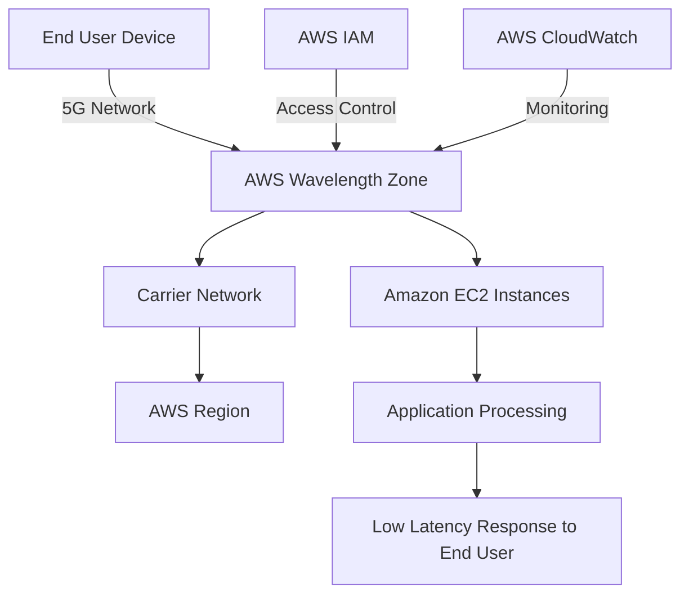
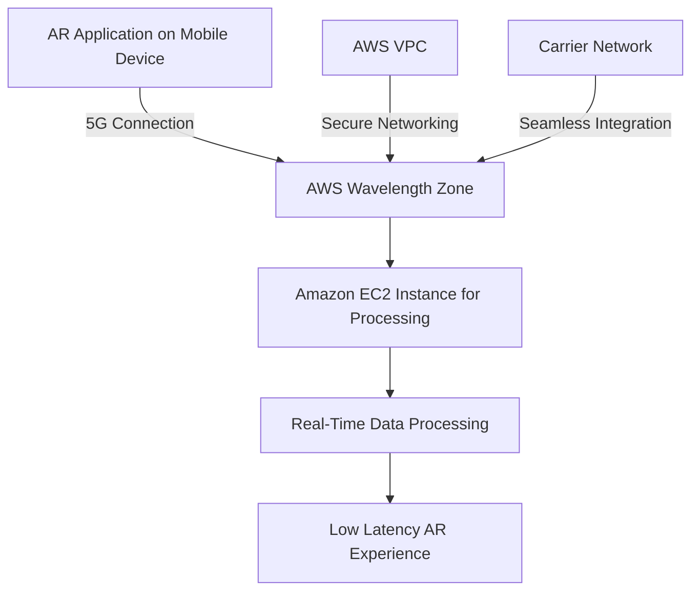
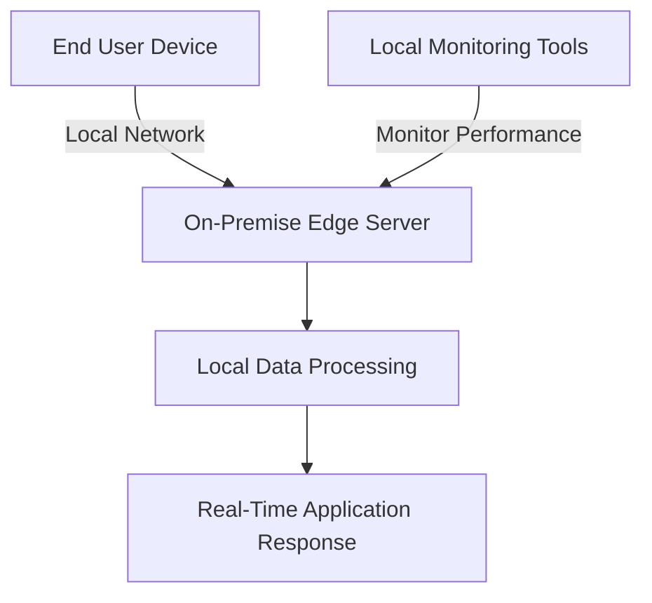

# WaveLength

## AWS Wavelength: A Comprehensive Overview

### 1. 🌟 Overview

AWS Wavelength is designed to bring AWS services to the edge of 5G networks, enabling developers to build applications that require ultra-low latency by placing AWS compute and storage services at the edge of telecommunication providers’ networks. This allows for the rapid processing and delivery of data, which is crucial for applications such as autonomous vehicles, augmented reality (AR), virtual reality (VR), and real-time gaming.

<figure><figcaption></figcaption></figure>

#### 🤖 Innovation Spotlight

AWS Wavelength has recently expanded its reach to more telecommunication providers globally, enhancing its ability to support low-latency applications in more regions. This expansion includes new features that allow developers to deploy applications at the edge seamlessly using familiar AWS services like EC2, EBS, and VPC.

### 2. ⚡ Problem Statement

**Real-World Scenario:** A company developing AR applications needs to minimize latency for end-users to ensure a seamless and immersive experience. Traditional cloud infrastructure introduces delays due to the distance between data centers and end-users. AWS Wavelength addresses this by deploying AWS compute and storage services at the edge of 5G networks, significantly reducing latency and improving application responsiveness.

**Industries/Applications:**

* **Augmented and Virtual Reality:** Providing immersive experiences with minimal lag.
* **Autonomous Vehicles:** Enabling real-time data processing for navigation and decision-making.
* **IoT and Smart Cities:** Supporting the real-time analysis of data from sensors and devices.
* **Real-Time Gaming:** Enhancing user experiences by reducing latency for multiplayer games.

### 2.1 🤝 Business Use Cases

AWS Wavelength is particularly beneficial for:

* **Mobile Edge Computing:** Deploying applications that require low latency and high bandwidth.
* **Real-Time Data Processing:** Enabling real-time data analytics and decision-making.
* **Enhanced User Experience:** Improving the performance of applications that rely on real-time interactions.

### 3. 🔥 Core Principles

AWS Wavelength operates on several core principles to deliver low-latency applications:

* **Wavelength Zones:** AWS infrastructure deployments that embed AWS compute and storage services within telecommunications providers’ datacenters at the edge of the 5G network.
* **Carrier Integration:** Close integration with telecommunication providers to offer seamless access to AWS services at the network edge.
* **AWS Services at the Edge:** Extending services like Amazon EC2, Amazon EBS, and Amazon VPC to the edge to support low-latency applications.

Key Resource Terms:

* **Wavelength Zone:** An AWS infrastructure deployment that extends AWS services to the edge of telecommunication networks.
* **Carrier Network:** The telecommunication provider’s network that integrates with AWS Wavelength to provide low latency connectivity.
* **Edge Computing:** A distributed computing paradigm that brings computation and data storage closer to the sources of data to reduce latency.

### 4. 📋 Pre-Requirements

To implement AWS Wavelength, you need the following AWS services and tools:

* **AWS Identity and Access Management (IAM):** For securely managing access to AWS services and resources within Wavelength Zones.
* **Amazon Virtual Private Cloud (VPC):** To configure network settings and security groups for your edge applications.
* **Amazon EC2:** For deploying compute instances in Wavelength Zones.
* **AWS CloudFormation (Optional):** For defining and deploying infrastructure as code in Wavelength Zones.

### 5. 👣 Implementation Steps

1. **Select a Wavelength Zone:**
   * Determine the geographic locations and telecommunication providers that support AWS Wavelength and select the appropriate Wavelength Zone for your application needs.
2. **Configure Network Resources:**
   * Set up your VPC and configure subnets in the selected Wavelength Zone to manage resources efficiently.
3. **Deploy Applications:**
   * Launch EC2 instances or other AWS services within your chosen Wavelength Zone to deploy your application.
4. **Configure Security and Access:**
   * Set up IAM roles and policies to manage access to resources in the Wavelength Zone.
   * Configure security groups and network ACLs to control traffic to and from your application.
5. **Monitor and Optimize:**
   * Use AWS CloudWatch to monitor the performance of your applications and optimize resources in the Wavelength Zone.

### 6. 🗺️ Data Flow Diagram

Here is a Mermaid diagram illustrating the architecture of AWS Wavelength:

The second Mermaid diagram below illustrates a specific use case of deploying an AR application using AWS Wavelength:

### 7. 🔒 Security Measures

To secure your applications deployed on AWS Wavelength, follow these best practices:

* **Data Encryption:** Encrypt data at rest and in transit using AWS KMS and other encryption tools.
* **IAM Policies:** Apply the principle of least privilege to restrict access to Wavelength resources.
* **Network Security:** Use VPC security groups and network ACLs to control and monitor traffic within the Wavelength Zone.
* **Monitoring and Logging:** Implement AWS CloudWatch and CloudTrail for monitoring and logging access and activities within your Wavelength environment.

### 8. 🤝 Integration with Other AWS Services

AWS Wavelength integrates seamlessly with various AWS services to enhance its functionality:

* **Amazon EC2:** For deploying compute instances at the edge.
* **Amazon EBS:** For providing block storage to EC2 instances in Wavelength Zones.
* **Amazon VPC:** For secure and isolated network configurations.
* **AWS Lambda:** For running serverless applications at the edge if supported.

These integrations allow for building comprehensive edge computing solutions that leverage the AWS ecosystem.

### 9. ⚖️ When to Use and When Not to Use

#### ✅ When to Use

AWS Wavelength is ideal for:

* Applications requiring ultra-low latency interactions, such as AR, VR, and autonomous vehicles.
* Use cases needing real-time data processing and analytics at the edge.
* Scenarios where proximity to end-users significantly improves application performance.

#### ❌ When Not to Use

AWS Wavelength might not be suitable for:

* Traditional web applications that do not require low-latency processing.
* Applications that do not benefit from edge computing capabilities.

### 10. 💰 Costing Calculation

The cost of using AWS Wavelength is based on standard AWS service pricing within Wavelength Zones, plus any additional data transfer fees associated with the carrier network:

* **EC2 Instances:** Charges for compute resources deployed in Wavelength Zones.
* **Data Transfer:** Additional costs may apply for data transferred through the carrier network.

_Note: Pricing may vary by region and carrier network. Always refer to the latest AWS pricing for accurate calculations._

### 11. 🧩 Alternative Services

Here’s a comparison table of AWS Wavelength with alternative services:

| Feature/Service         | AWS Wavelength     | Azure Edge Zones   | Google Cloud Edge      | On-Premise Edge     |
| ----------------------- | ------------------ | ------------------ | ---------------------- | ------------------- |
| **Managed Service**     | Yes                | Yes                | Limited                | No                  |
| **Edge Infrastructure** | Integrated with 5G | Integrated with 5G | Limited 5G Integration | Custom Setup        |
| **Latency**             | Ultra-Low          | Low                | Low                    | Varies              |
| **Cost Model**          | Pay-as-you-go      | Pay-as-you-go      | Pay-as-you-go          | Capital Expenditure |

Mermaid Diagram for an on-premise edge computing alternative:

### 12. ✅ Benefits

AWS Wavelength offers several advantages:

* **Ultra-Low Latency:** By placing AWS services at the edge of 5G networks, it minimizes latency for end users.
* **Seamless AWS Integration:** Leverages existing AWS services and tools, simplifying deployment and management.
* **Enhanced User Experience:** Provides real-time processing and interaction for latency-sensitive applications.
* **Scalability and Flexibility:** Offers the ability to scale resources based on demand, with flexible deployment options.

### 13. 🚗 Autonomous Vehicles and Real-Time Systems

AWS Wavelength is particularly transformative in industries like autonomous vehicles, where real-time data processing and low-latency communication are crucial. It allows vehicles to make split-second decisions based on real-time data, improving safety and efficiency.

### 14. 📝 Summary

AWS Wavelength extends AWS infrastructure to the edge of telecommunication providers' 5G networks, enabling ultra-low latency applications and services.

* **Top 5 Points to Remember:**
  1. Extends AWS services to the edge of 5G networks to reduce latency.
  2. Supports ultra-low latency applications such as AR, VR, and autonomous vehicles.
  3. Seamlessly integrates with existing AWS services and tools.
  4. Improves user experience by enabling real-time data processing and interactions.
  5. Follows a pay-as-you-go pricing model, similar to standard AWS services.

> In short, AWS Wavelength is all about bringing the power of AWS closer to end-users to enable real-time, low-latency applications that leverage the speed and responsiveness of 5G networks.

### 15. 🔗 Related Topics

* **AWS Outposts:** For running AWS infrastructure on-premises for a truly consistent hybrid experience.
* **AWS Local Zones:** For deploying applications closer to end-users in metropolitan areas.
* **Edge Computing:** Best practices and use cases for deploying applications at the edge.
* **5G and Cloud Computing:** Exploring the intersection of 5G networks and cloud technologies.
