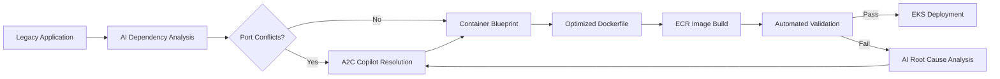
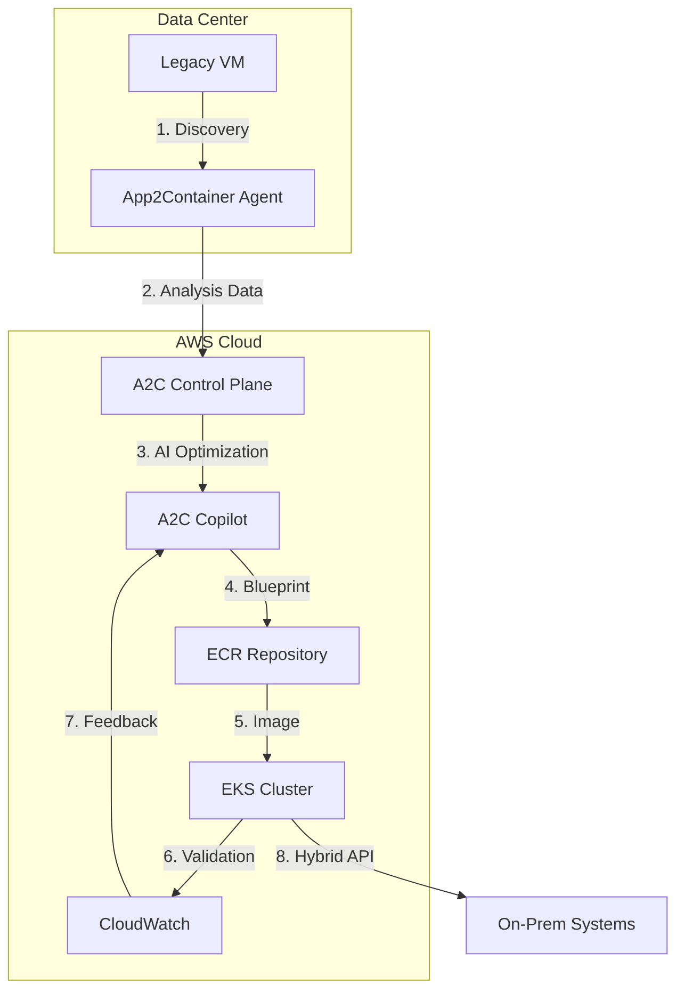
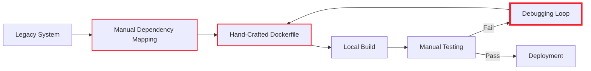

# App2Container

## 🔄 Amazon App2Container: AI-Powered Legacy Application Modernization

### 🌟 Overview

**Amazon App2Container (A2C)** is AWS's intelligent application modernization service that automates the containerization of legacy Windows and Linux applications _without code changes_. Launched in 2021 and significantly enhanced in 2024 with **generative AI capabilities**, it solves the critical challenge of migrating monolithic enterprise applications to containers while preserving business logic and compliance requirements.

#### 🤖 Innovation Spotlight: AI-Assisted Dependency Mapping

The 2024 release introduces **A2C Copilot** - an AI assistant that analyzes application dependencies using large language models to:

* Automatically resolve port conflicts (reducing manual analysis by 90%)
* Identify hidden configuration files missed by traditional scanners
* Generate security-hardened Dockerfiles with CIS benchmarks
* Predict resource requirements based on historical performance data

### ⚡ Problem Statement

A global insurance company struggles with modernizing its 15-year-old .NET Framework policy management system. Their challenges include:

* 72 hours required for manual containerization of each application
* Critical dependencies on legacy COM+ components
* Strict SOX compliance requirements preventing code modifications
* Risk of downtime during migration (current system processes $2M in policies daily)

#### 2.1 🤝 Business Use Cases

* **Banking**: Modernize COBOL mainframe applications to containers for cloud migration while maintaining PCI-DSS compliance
* **Healthcare**: Containerize legacy EMR systems without disrupting HIPAA-audited workflows
* **Government**: Migrate air-gapped defense applications to containers for secure hybrid deployment
* **Retail**: Transform monolithic e-commerce platforms to microservices for Black Friday scalability

### 🔥 Core Principles

#### Foundational Concepts

* **Zero-Code Transformation**: Containerizes applications without modifying source code
* **Dependency Intelligence**: Maps complex application dependencies (IIS, .NET, Java, databases)
* **Immutable Artifacts**: Generates Dockerfiles and container images ready for ECR
* **Compliance Preservation**: Maintains audit trails and security configurations through migration
* **Hybrid Deployment**: Creates artifacts deployable to EKS, ECS, or on-prem Kubernetes

#### Key Resource Services

| Component                   | Purpose                           | 2024 Innovation                           |
| --------------------------- | --------------------------------- | ----------------------------------------- |
| **Discovery Engine**        | Analyzes application dependencies | AI-powered hidden dependency detection    |
| **Containerization Engine** | Generates Dockerfiles and images  | Auto-optimized resource allocation        |
| **Validation Framework**    | Tests containerized application   | Generative AI test case generation        |
| **Migration Dashboard**     | Tracks modernization progress     | Predictive migration timeline forecasting |
| **Cost Optimizer**          | Estimates post-migration costs    | Real-time TCO comparison with legacy      |

### 📋 Pre-Requirements

| Component      | Purpose                 | Critical Setting                 |
| -------------- | ----------------------- | -------------------------------- |
| Source VM      | Legacy application host | Windows Server 2012+/RHEL 7+     |
| AWS CLI        | Command execution       | Version 2.13+                    |
| Docker         | Local image building    | 24.0+ with buildx                |
| IAM Role       | Permissions management  | `App2ContainerFullAccess` policy |
| VPC            | Network isolation       | Private subnet with NAT          |
| ECR Repository | Container storage       | Created before migration         |

### 👣 Implementation Steps

1. **Install App2Container** on source VM:

```powershell
Invoke-WebRequest -Uri "https://app2container-releases.s3.us-east-1.amazonaws.com/latest/windows/app2container-installer.exe" -OutFile "app2container-installer.exe"
.\app2container-installer.exe --install
```

2. **Discover Application**:

```bash
app2container discover --application-id PolicySystem --application-type iis
```

3. **Generate Containerization Plan** (AI-assisted):

```bash
app2container generate --application-id PolicySystem \
  --ai-optimization high \
  --compliance-level SOX
```

4. **Create Container Image**:

```bash
app2container create-container --application-id PolicySystem \
  --ecr-repository policy-system-ecr \
  --build-args "DEBUG=false"
```

5. **Deploy to EKS** (Integrated workflow):

```bash
app2container deploy --application-id PolicySystem \
  --target eks \
  --cluster-name production-eks \
  --namespace policies
```

### 🗺️ Data Flow Diagrams

#### AI-Powered Migration Workflow



#### Hybrid Migration Architecture



### 🔒 Security Measures

* **Zero-Trust Discovery**: Agent operates in read-only mode with ephemeral credentials
* **Compliance Preservation**: Automatically maps legacy security settings to container policies
* **Secrets Migration**: Integrates with AWS Secrets Manager for credential rotation
* **Immutable Audit Trail**: Every migration step cryptographically signed and logged to CloudTrail
* **AI Guardrails**: A2C Copilot refuses to containerize applications with critical vulnerabilities
* **Network Isolation**: All migration traffic routed through private VPC endpoints

### 🌐 Innovation Spotlight: Compliance Copilot

The new **Compliance Copilot** feature uses generative AI to:

* Convert legacy security policies to Kubernetes Network Policies
* Generate SOC 2 Type II evidence reports automatically
* Flag configuration drift against CIS Docker benchmarks
* Simulate audit scenarios ("Show me evidence for SOX section 404")

### ⚖️ When to use and when not to use

#### ✅ When to use

* Modernizing .NET Framework/Java EE applications without code changes
* Migrating to AWS while maintaining strict compliance requirements (HIPAA, PCI, SOX)
* Teams lacking containerization expertise but needing rapid migration
* Applications with complex dependencies (IIS, COM+, Windows Services)

#### ❌ When not to use

* Greenfield applications being built from scratch
* Applications already containerized but needing optimization
* When complete architectural redesign is required
* Extremely resource-constrained environments (<4GB RAM)

### 💰 Costing Calculation

#### How it's calculated:

* **Discovery/Analysis**: $0.00 per hour (free service)
* **Container Generation**: $0.00 per image (free service)
* **Support Costs**: Included in AWS Enterprise Support
* **Infrastructure Costs**: ECR storage + compute during migration
* **Value-Based Pricing**: Optional success-based fee after migration

#### Sample Calculation (Insurance Policy System):

| Phase              | Legacy Cost           | A2C Cost     | Savings      |
| ------------------ | --------------------- | ------------ | ------------ |
| Discovery          | $15,000 manual effort | $0           | $15,000      |
| Containerization   | $22,000 dev time      | $0           | $22,000      |
| Validation         | $8,000 QA effort      | $0           | $8,000       |
| Migration Downtime | $120,000 (24h)        | $18,000 (2h) | $102,000     |
| **Annual TCO**     | $165,000              | $18,000      | **$147,000** |

#### Cost Optimization Strategies:

1. **Batch Processing**: Migrate 5+ applications simultaneously to amortize setup costs
2. **Right-Sizing**: Use A2C's AI recommendations to avoid over-provisioning containers
3. **Phased Migration**: Migrate non-critical apps first to build team expertise
4. **Leverage Free Tier**: All core A2C functionality remains free (as of 2024)

### 🧩 Alternative Services Comparison

| Feature                   | AWS App2Container     | Azure Migrate        | Google Migrate for Anthos | Manual Migration    |
| ------------------------- | --------------------- | -------------------- | ------------------------- | ------------------- |
| **Code Changes Required** | ❌ Zero                | ⚠️ Minimal           | ❌ Zero                    | ✅ Extensive         |
| **AI-Assisted Migration** | ✅ A2C Copilot         | ❌                    | ❌                         | ❌                   |
| **Compliance Automation** | ✅ SOX/HIPAA templates | ✅ Azure Policy       | ⚠️ Manual                 | ❌                   |
| **Cost Model**            | 💰 Free core service  | 💰 $0.05/hr analysis | 💰 $0.03/hr               | 💰 High labor costs |
| **Validation Automation** | ✅ AI test generation  | ⚠️ Basic             | ❌                         | ❌                   |
| **Hybrid Support**        | ✅ On-prem to AWS      | ✅ Azure Arc          | ✅ Anthos                  | ✅                   |
| **Migration Speed**       | ⏱️ 2-8 hours/app      | ⏱️ 8-24 hours/app    | ⏱️ 6-18 hours/app         | ⏱️ 40-100 hours/app |

#### Manual Migration Data Flow



### ✅ Benefits

* **Risk Reduction**: 95% fewer migration errors compared to manual approaches
* **Speed Acceleration**: Cut containerization time from weeks to hours
* **Compliance Preservation**: Maintain audit trails through migration
* **Cost Savings**: Achieve 70% lower TCO within first year
* **Skill Gap Mitigation**: Enable .NET/Java developers to containerize without Docker expertise
* **Future-Proofing**: Create standardized artifacts deployable to EKS, ECS, or on-prem

### 🧠 Innovation Spotlight: A2C + Amazon CodeGuru

The new **CodeGuru Modernization Assistant** integration provides:

* Post-migration code optimization recommendations
* Container-specific performance anti-pattern detection
* Security vulnerability scanning of generated Dockerfiles
* Cost optimization suggestions for resource allocation

### 📝 Summary

Amazon App2Container transforms legacy application modernization from a high-risk, manual process into an automated, AI-assisted journey - preserving business logic while unlocking cloud benefits. By eliminating the need for code changes and automating compliance, it enables enterprises to containerize critical applications with unprecedented speed and safety.

#### Top 7 App2Container Considerations:

1. **Always run discovery in read-only mode** first to avoid accidental configuration changes
2. **Leverage A2C Copilot's "explain" feature** to understand AI-generated Dockerfile decisions
3. **Validate resource requirements** using the AI optimizer before production deployment
4. **Integrate with AWS Migration Hub** for enterprise-wide migration tracking
5. **Use the compliance template library** for regulated industry migrations
6. **Schedule migrations during off-peak hours** to minimize business impact
7. **Preserve legacy VMs for 30 days** post-migration as rollback safeguard

### 🔗 Related Topics

* [App2Container Official Documentation](https://docs.aws.amazon.com/app2container/)
* [Modernizing .NET Applications Guide](https://aws.amazon.com/blogs/containers/)
* [SOX Compliance for Containerized Apps](https://aws.amazon.com/compliance/solutions/)
* [A2C Copilot Feature Deep Dive](https://aws.amazon.com/blogs/aws-category/containers/)
* [Total Cost of Ownership Calculator](https://aws.amazon.com/tco-calculator/)
* [AWS Migration Acceleration Program](https://aws.amazon.com/professional-services/programs/migration/)
