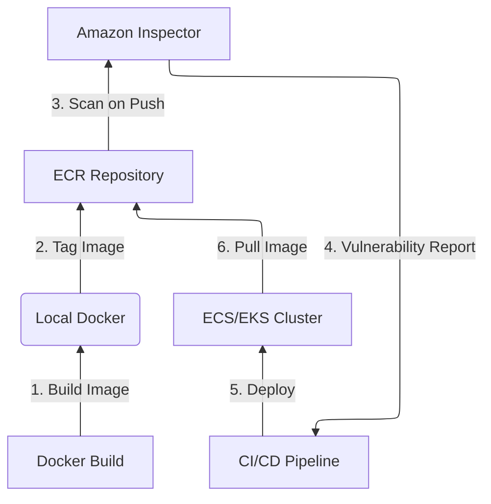
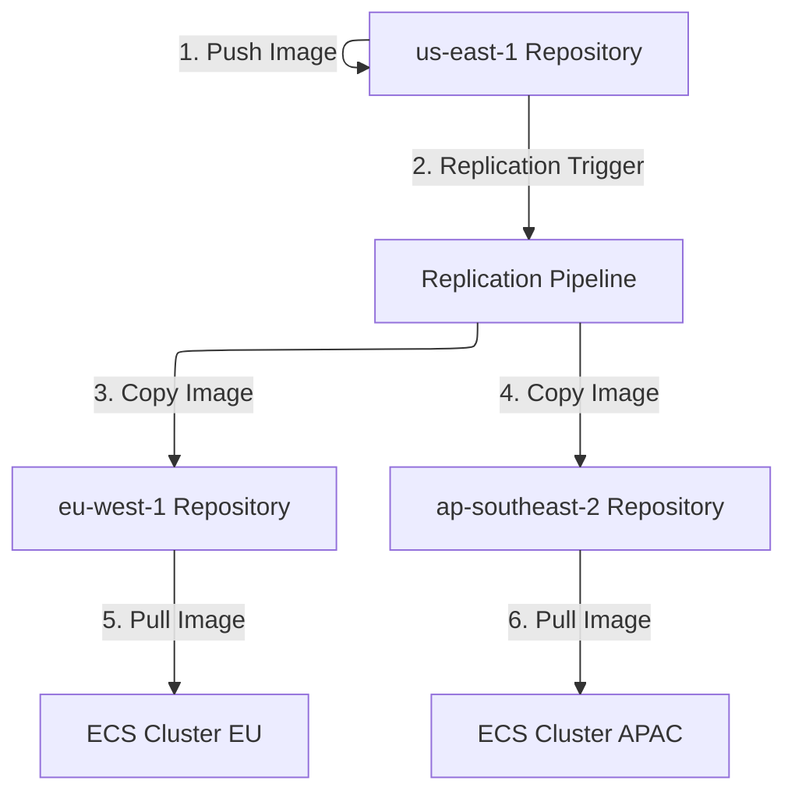
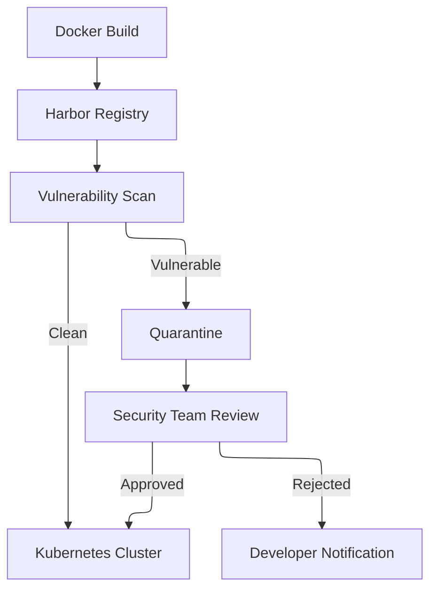

# ECR

## 🐳 Amazon ECR&#x20;

Amazon ECR is a fully managed Docker container registry provided by AWS. It makes it easy for developers to store, manage, and deploy Docker container images.

<figure><figcaption></figcaption></figure>

### 🌟 Overview

**Amazon Elastic Container Registry (ECR)** is AWS's fully managed Docker container registry service that makes it easy to store, manage, and deploy container images. In 2024, AWS significantly enhanced ECR with a **10x increase in the default repository limit** (up to 100,000 repositories per region per account), addressing scalability needs for enterprise container adoption.

#### 🤖 Innovation Spotlight: AI-Powered Vulnerability Management

ECR's image scanning now integrates with Amazon Inspector to provide **AI-enhanced vulnerability prioritization**, automatically identifying critical security issues while filtering out false positives - reducing developer alert fatigue by up to 70% in recent implementations.

### ⚡ Problem Statement

A global fintech company struggles with container image management across 15 development teams. They face:

* Inconsistent image versions causing "works on my machine" deployment failures
* Critical security vulnerabilities slipping into production (like Log4j-style flaws)
* Slow deployments due to image pull latency across global regions
* Compliance risks from unscanned container images

#### 2.1 🤝 Business Use Cases

* **Healthcare**: Securely manage HIPAA-compliant container images for patient data processing systems
* **Financial Services**: Ensure PCI-DSS compliance for containerized payment processing applications
* **Retail**: Maintain consistent container images across global e-commerce platforms during peak shopping seasons

### 🔥 Core Principles

Amazon ECR operates on these foundational concepts:

* **Managed Registry**: Fully managed Docker container registry eliminating infrastructure maintenance
* **Image Scanning**: Automatic vulnerability detection using Clair and integration with Amazon Inspector
* **Cross-Region Replication**: Automatic image replication across AWS regions for low-latency global deployments
* **Pull-through Cache**: Caches public images from Docker Hub and other registries while adding security scanning
* **Immutable Tags**: Prevents image overwriting for production stability (new 2024 feature)
* **Lifecycle Policies**: Automatically clean up untagged or old images to control storage costs

### 📋 Pre-Requirements

| Service/Tool     | Purpose                                       |
| ---------------- | --------------------------------------------- |
| AWS CLI          | Command-line interface for ECR operations     |
| Docker           | Containerization platform for building images |
| IAM Roles        | Permissions for ECR access and scanning       |
| Amazon Inspector | Enhanced vulnerability scanning (optional)    |
| AWS KMS          | Encryption key management for private images  |

### 👣 Implementation Steps

1.  **Create ECR Repository**:

    ```bash
    aws ecr create-repository --repository-name my-app --image-tag-mutability MUTABLE
    ```
2. **Configure Cross-Region Replication**:
   * In ECR console, enable replication and specify destination regions
   * Set up IAM role with permissions for replication
3. **Enable Automated Scanning**:
   * In repository settings, enable "Scan on push"
   * Configure Amazon Inspector for enhanced vulnerability reporting
4.  **Set Lifecycle Policy**:

    ```json
    {
      "rules": [
        {
          "rulePriority": 1,
          "description": "Keep last 30 images",
          "selection": {
            "tagStatus": "untagged",
            "countType": "imageCountMoreThan",
            "countNumber": 30
          },
          "action": { "type": "expire" }
        }
      ]
    }
    ```
5.  **Push Docker Image**:

    ```bash
    docker push <aws-account-id>.dkr.ecr.<region>.amazonaws.com/my-app:latest
    ```

### 🗺️ Data Flow Diagrams

#### Standard Image Workflow



#### Cross-Region Replication Flow



### 🔒 Security Measures

* **Enable Scan on Push**: Automatically scan all images upon repository push (free of charge)
* **Implement Least Privilege IAM**: Restrict ECR access using granular permissions
* **Enable Cross-Region Replication**: Ensure consistent security posture across regions
* **Use Immutable Tags**: Prevent image overwriting in production environments
* **Enable KMS Encryption**: Encrypt images at rest with AWS KMS keys
* **Set Repository Policies**: Control who can pull/push images using resource-based policies

### 🌐 Innovation Spotlight: ECR Private Gallery

AWS recently introduced **ECR Private Gallery** - a visual interface for discovering and sharing container images across organizational boundaries while maintaining security controls. This enterprise-grade feature enables:

* Curated image catalogs with versioning
* Approval workflows for production images
* Integration with AWS Service Catalog
* Custom metadata tagging for compliance tracking

### ⚖️ When to use and when not to use

#### ✅ When to use

* You need a fully managed, secure container registry integrated with AWS ecosystem
* Your organization requires automated vulnerability scanning
* You operate multi-region applications needing low-latency image pulls
* You need tight integration with ECS, EKS, and AWS CI/CD services

#### ❌ When not to use

* You require complex RBAC beyond AWS IAM capabilities
* Your container images exceed 10 GB (ECR limit)
* You need native Helm chart repository functionality (consider ECR Public or alternatives)
* You operate in a hybrid environment without reliable AWS connectivity

### 💰 Costing Calculation

#### How it's calculated:

* **Storage**: $0.10 per GB/month for image storage
* **Data Transfer**: Standard AWS data transfer rates apply
* **API Requests**: $0.00005 per 10,000 API requests (`GetDownloadUrlForLayer`, `BatchCheckLayerAvailability`)
* **Image Scanning**: **Free of cost** for basic scanning
* **Replication**: Data transfer costs apply between regions

#### Sample Calculation:

For a medium enterprise:

* 500 GB storage/month: $50.00
* 50M API requests: $0.25
* Cross-region replication (500 GB to 2 regions): $25.00 (data transfer)
* **Total**: \~$75.25/month

#### Cost Optimization Tips:

1. Implement strict lifecycle policies to delete untagged images
2. Use multi-architecture images instead of separate images per architecture
3. Enable compression for large layers
4. Use pull-through cache for public images to avoid redundant storage

### 🧩 Alternative Services Comparison

| Feature                      | AWS ECR               | Azure Container Registry | Google Container Registry | On-Prem (Harbor)       |
| ---------------------------- | --------------------- | ------------------------ | ------------------------- | ---------------------- |
| **Managed Service**          | ✅ Fully managed       | ✅ Fully managed          | ✅ Fully managed           | ❌ Self-managed         |
| **Vulnerability Scanning**   | ✅ Free basic scanning | ✅ (Requires Defender)    | ✅ (Container Analysis)    | ✅ (Trivy integration)  |
| **Cross-Region Replication** | ✅ Native              | ✅ Geo-replication        | ✅ Multi-region            | ✅ (Manual setup)       |
| **Free Tier**                | ✅ 500 MB storage      | ✅ 2 GB storage           | ✅ 1 GB storage            | ❌                      |
| **Max Image Size**           | 10 GB                 | 10 GB                    | 10 GB                     | Configurable           |
| **On-Prem Integration**      | ❌ Limited             | ✅ Azure Arc              | ❌                         | ✅ Native               |
| **Cost (500 GB)**            | \~$50                 | \~$65                    | \~$55                     | Hardware + maintenance |

#### On-Premise Data Flow (Harbor)



### ✅ Benefits

* **Security First**: Automated vulnerability scanning catches issues before deployment
* **Global Performance**: Cross-region replication ensures low-latency image pulls worldwide
* **Seamless Integration**: Native compatibility with ECS, EKS, CodePipeline, and CodeBuild
* **Cost Efficiency**: No infrastructure management overhead, pay only for storage used
* **Compliance Ready**: Supports HIPAA, GDPR, PCI-DSS with proper configuration
* **Scalability**: 100,000 repositories per region supports massive container adoption

### 🚀 Innovation Spotlight: ECR with Amazon CodeGuru Reviewer

Integrating ECR with **Amazon CodeGuru Reviewer** provides AI-powered container security recommendations. CodeGuru analyzes your Dockerfiles and ECR image manifests to:

* Identify insecure base images
* Detect misconfigurations (like running as root)
* Recommend optimized multi-stage builds
* Predict potential runtime vulnerabilities

### 📝 Summary

Amazon ECR delivers a secure, scalable, and fully managed container registry that eliminates infrastructure management while enhancing security through automated scanning and cross-region replication. This service is essential for organizations adopting containerization at scale while maintaining strict security and compliance standards.

#### Top 5 ECR Considerations:

1. Always enable "Scan on push" - it's free and catches vulnerabilities early
2. Implement lifecycle policies to control storage costs
3. Use cross-region replication for global applications to reduce deployment latency
4. Leverage immutable tags for production environments to prevent accidental overwrites
5. Monitor repository permissions regularly - over-permissive policies are the #1 security risk

### 🔗 Related Topics

* [Amazon ECR Documentation](https://docs.aws.amazon.com/ecr/)
* [ECR Security Best Practices Whitepaper](https://aws.amazon.com/blogs/security/)
* [Implementing CI/CD with ECR and CodePipeline](https://aws.amazon.com/blogs/devops/)
* [ECR Public Gallery for Open Source Images](https://gallery.ecr.aws/)
* [Container Security Best Practices Guide](https://aws.amazon.com/security/container-security/)
