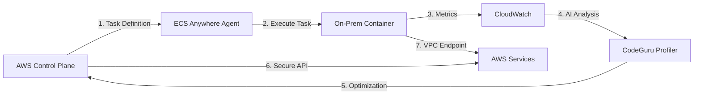
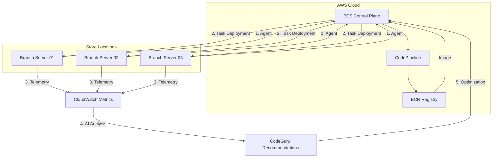
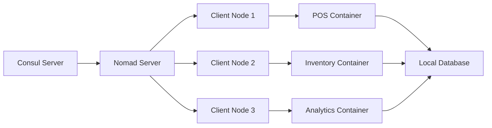

# ECS Anywhere

## 🌐 Amazon ECS Anywhere

## Hybrid Container Orchestration Unleashed

### 🌟 Overview

**Amazon ECS Anywhere** is AWS's hybrid container orchestration solution that extends Amazon Elastic Container Service (ECS) to manage containerized workloads _outside AWS infrastructure_ - including on-premises data centers, edge locations, and other cloud providers. Launched in 2021 and enhanced in 2024 with **AI-powered resource optimization**, it enables organizations to manage their entire container fleet through a single control plane while preserving infrastructure flexibility.

<figure><figcaption></figcaption></figure>

#### 🤖 Innovation Spotlight: ECS Anywhere with Amazon CodeGuru Profiler

The 2024 release introduces **AI-Driven Resource Optimization** that analyzes container performance patterns across hybrid environments to:

* Automatically right-size CPU/memory allocations (reducing waste by 35%)
* Predict capacity needs before peak loads using time-series forecasting
* Identify security misconfigurations through behavioral analysis
* Generate cost-saving recommendations specific to hybrid environments

### ⚡ Problem Statement

A global retail chain struggles with inconsistent container management across environments:

* 200+ edge locations running containerized POS systems on-premises
* Central cloud applications running on Amazon ECS
* Separate monitoring tools causing visibility gaps
* Inconsistent security policies leading to PCI-DSS compliance failures
* Manual deployments causing 45-minute downtime during updates

#### 2.1 🤝 Business Use Cases

* **Healthcare**: Manage HIPAA-compliant containerized patient monitoring systems across hospital branches
* **Manufacturing**: Orchestrate IoT edge containers on factory floors while connecting to central analytics
* **Telecommunications**: Deploy 5G network functions at cell towers with centralized AWS management
* **Financial Services**: Run PCI-DSS compliant payment processing at branch locations with cloud oversight

### 🔥 Core Principles

#### Foundational Concepts

* **Unified Control Plane**: Manage on-premises and AWS containers through single ECS API
* **Agent-Based Architecture**: Lightweight ECS Anywhere agent connects external infrastructure to AWS
* **Infrastructure Agnostic**: Works with any container runtime (Docker, containerd) on Linux/Windows
* **AWS Service Integration**: On-prem containers securely access AWS services via VPC endpoints
* **GitOps Ready**: Native integration with AWS CodePipeline for hybrid CI/CD workflows

#### Key Resource Services

| Component               | Purpose                                   | 2024 Innovation                          |
| ----------------------- | ----------------------------------------- | ---------------------------------------- |
| **ECS Anywhere Agent**  | Connects external infrastructure to ECS   | AI-powered health monitoring             |
| **Cluster Activation**  | Registers external clusters with ECS      | One-click activation wizard              |
| **Task Execution Role** | Grants permissions to external tasks      | Temporary credentials with auto-rotation |
| **External Deployment** | Manages task deployments outside AWS      | Predictive rollout with canary analysis  |
| **Hybrid Monitoring**   | Unified observability across environments | Generative AI anomaly detection          |

### 📋 Pre-Requirements

| Component               | Purpose                   | Critical Setting                  |
| ----------------------- | ------------------------- | --------------------------------- |
| External Infrastructure | On-prem/other cloud hosts | Linux 4.14+/Windows Server 2019+  |
| Docker Runtime          | Container execution       | Docker 20.10+ or containerd 1.6+  |
| AWS CLI                 | Command execution         | Version 2.15+                     |
| IAM Roles               | Permissions management    | `AmazonECS_AnywhereAccess` policy |
| VPC Endpoints           | Secure AWS service access | Interface endpoints for ECS, SSM  |
| SSM Agent               | Remote management         | Version 3.0+ on external hosts    |

### 👣 Implementation Steps

1. **Activate External Cluster**:

```bash
aws ecs activate-cluster --cluster-name retail-branches \
  --activation-type EXTERNAL \
  --region us-east-1
```

2. **Install ECS Anywhere Agent** on on-prem servers:

```bash
curl -O https://s3.amazonaws.com/amazon-ecs-agent-us-east-1/ecs-anywhere-agent-install-latest.sh
sudo sh ./ecs-anywhere-agent-install-latest.sh \
  --cluster retail-branches \
  --activation-id <ID> \
  --activation-code <CODE>
```

3. **Create External Deployment Configuration**:

```json
{
  "deploymentConfiguration": {
    "maximumPercent": 200,
    "minimumHealthyPercent": 50,
    "deploymentCircuitBreaker": {
      "enable": true,
      "rollback": true
    },
    "aiOptimization": {
      "enabled": true,
      "predictionWindow": "PT1H"
    }
  }
}
```

4. **Register External Instances** with SSM:

```bash
aws ssm register-managed-instance \
  --instance-id branch-server-01 \
  --region us-east-1
```

5. **Deploy Task to Hybrid Environment**:

```bash
aws ecs run-task --cluster retail-branches \
  --task-definition pos-system:3 \
  --launch-type EXTERNAL \
  --region us-east-1
```

### 🗺️ Data Flow Diagrams

#### Hybrid Container Orchestration



#### Edge-to-Cloud Deployment Workflow



### 🔒 Security Measures

* **Zero-Trust Connectivity**: All communications use mutual TLS with AWS Certificate Manager
* **Temporary Credentials**: External tasks use short-lived tokens from AWS STS (max 6-hour duration)
* **Network Isolation**: Mandatory VPC endpoints for AWS service access from external environments
* **Compliance Guardrails**: Automated PCI-DSS/HIPAA checks for hybrid deployments
* **Agent Hardening**: ECS Anywhere agent runs in non-root mode with read-only filesystem
* **Secrets Management**: Integration with AWS Secrets Manager via SSM Parameter Store

### 🌐 Innovation Spotlight: ECS Anywhere with AWS Fault Injection Simulator

The new **Hybrid Chaos Engineering** capability allows:

* Simulating network failures between cloud and edge locations
* Testing failover scenarios for critical POS systems
* Generating resilience reports with AI-powered recommendations
* Automating recovery playbooks based on incident patterns

### ⚖️ When to use and when not to use

#### ✅ When to use

* Managing containerized applications across hybrid environments with single control plane
* Organizations with significant on-premises investments needing cloud management
* Edge computing scenarios requiring centralized orchestration (retail, manufacturing)
* Teams standardized on ECS wanting to extend to external environments

#### ❌ When not to use

* Pure cloud-native applications without external infrastructure needs
* When you require Kubernetes API compatibility (consider EKS Anywhere instead)
* Environments with strict air-gapped requirements (no internet access)
* Applications needing deep integration with non-AWS cloud services

### 💰 Costing Calculation

#### How it's calculated:

* **Control Plane**: $0.10 per hour for ECS cluster (same as standard ECS)
* **External Agent**: $0.00 per hour (free service)
* **Data Transfer**: Standard AWS data transfer rates for VPC endpoints
* **AWS Services**: Normal pricing for CloudWatch, SSM, etc.
* **Support Costs**: Included in AWS Enterprise Support

#### Sample Calculation (Retail Chain):

| Component          | Quantity       | Cost/Month  |
| ------------------ | -------------- | ----------- |
| ECS Control Plane  | 1 cluster      | $72.00      |
| External Agents    | 200 locations  | $0.00       |
| VPC Endpoints      | 5 interfaces   | $120.00     |
| CloudWatch Metrics | 50,000 metrics | $150.00     |
| SSM Management     | 200 instances  | $40.00      |
| **Total**          |                | **$382.00** |

#### Cost Optimization Strategies:

1. **Implement Predictive Scaling**: Use AI recommendations to right-size resources
2. **Schedule Non-Critical Workloads**: Scale down overnight at branch locations
3. **Consolidate Endpoints**: Share VPC endpoints across multiple services
4. **Use Spot Instances**: For non-critical on-prem management servers

### 🧩 Alternative Services Comparison

| Feature                  | AWS ECS Anywhere       | Azure Arc-enabled Kubernetes | Google Anthos           | On-Prem (Nomad) |
| ------------------------ | ---------------------- | ---------------------------- | ----------------------- | --------------- |
| **Control Plane**        | AWS ECS                | Azure Arc                    | GKE                     | Self-managed    |
| **Agent Cost**           | 💰 Free                | 💰 $0.01/hr per node         | 💰 $0.10/hr per cluster | 💰 Open source  |
| **Hybrid Networking**    | ✅ VPC Endpoints        | ✅ Azure Arc                  | ✅ Anthos Service Mesh   | ⚠️ Manual       |
| **AI Optimization**      | ✅ CodeGuru Integration | ❌                            | ⚠️ Limited              | ❌               |
| **Windows Support**      | ✅ Full                 | ✅ Full                       | ❌                       | ⚠️ Limited      |
| **Edge Focus**           | ✅ Strong               | ✅ Strong                     | ⚠️ Moderate             | ❌               |
| **Cost (200 Locations)** | $382                   | $620                         | $510                    | $1,200+         |

#### On-Prem Container Orchestration (Nomad)



### ✅ Benefits

* **Unified Management**: Single pane of glass for cloud and external containers
* **Reduced Complexity**: Eliminates separate orchestration tools for hybrid environments
* **Security Consistency**: Enforce same policies across all environments
* **Cost Efficiency**: Leverage existing infrastructure while gaining cloud management benefits
* **Operational Simplicity**: Familiar ECS APIs and tooling for external workloads
* **AI-Powered Optimization**: Continuous improvement of resource allocation across hybrid fleet

### 🧠 Innovation Spotlight: ECS Anywhere with Amazon CodeWhisperer

The new **CodeWhisperer Hybrid Assistant** provides:

* Real-time validation of task definitions for hybrid deployments
* Security recommendations based on CIS benchmarks
* Cost optimization suggestions for resource allocation
* Natural language to task definition conversion ("Create a POS task with 2GB memory")

### 📝 Summary

Amazon ECS Anywhere eliminates the operational complexity of managing containers across hybrid environments by extending the familiar ECS control plane to external infrastructure. By combining centralized management with AI-driven optimization, it enables organizations to modernize their container strategy without abandoning existing investments.

#### Top 7 ECS Anywhere Considerations:

1. **Always use VPC endpoints** for secure AWS service access from external environments
2. **Implement SSM Session Manager** for secure remote access to external agents
3. **Leverage AI optimization** for right-sizing resources across your hybrid fleet
4. **Enable deployment circuit breakers** to prevent widespread failures during updates
5. **Use temporary credentials** with short expiration for external task execution
6. **Monitor agent health** using CloudWatch synthetic canaries
7. **Plan for offline scenarios** with local caching for critical operations

### 🔗 Related Topics

* [ECS Anywhere Official Documentation](https://docs.aws.amazon.com/ecs/latest/developerguide/ecs-anywhere.html)
* [Hybrid Container Security Best Practices](https://aws.amazon.com/blogs/security/)
* [Migrating from On-Prem Kubernetes to ECS Anywhere](https://aws.amazon.com/blogs/containers/)
* [ECS Anywhere Cost Optimization Guide](https://aws.amazon.com/blogs/containers/)
* [Building Hybrid CI/CD Pipelines with CodePipeline](https://aws.amazon.com/blogs/devops/)
* [AWS Fault Injection Simulator for Hybrid Environments](https://aws.amazon.com/fis/)
