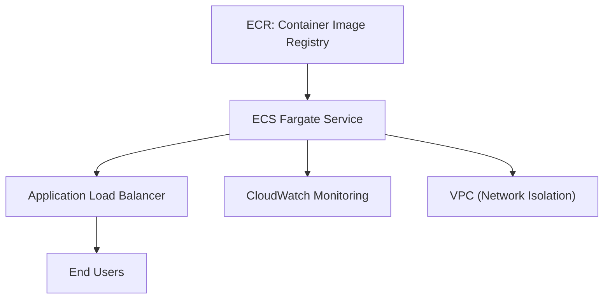
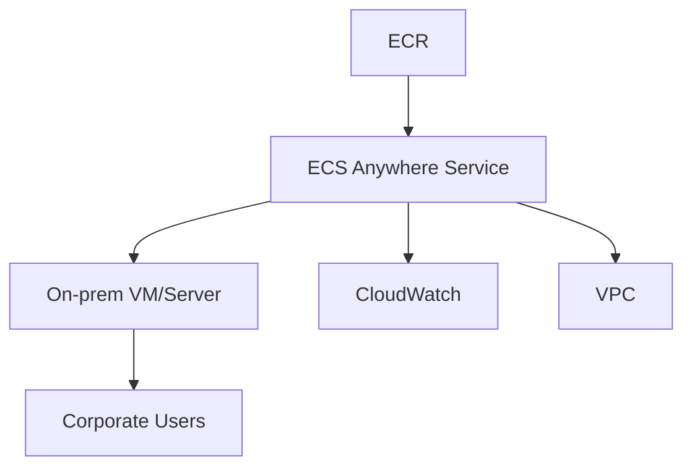
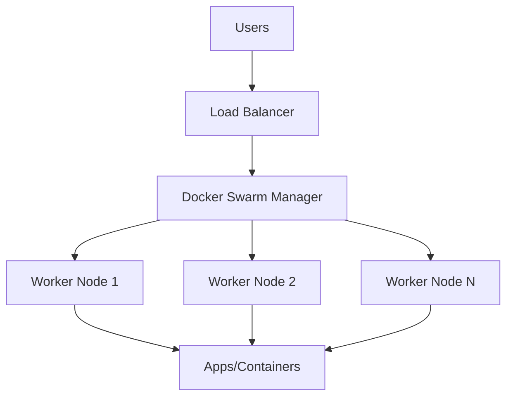

# ECS

##  Amazon ECS

🚀 **Amazon Elastic Container Service (ECS)** is AWS's fully managed container orchestration service designed for deploying, managing, and scaling modern containerized applications using Docker containers. It offers seamless integration with AWS services and flexibility between serverless (Fargate) and EC2-based compute.

<figure><figcaption></figcaption></figure>

***

### 🌟 Overview: Innovation Spotlight

Amazon ECS enables organizations to **efficiently run containerized workloads** in the cloud or on-premises with simplified operations, native AWS integration, and support for hybrid architectures. Innovative features include **ECS Anywhere for hybrid deployment**, deep **automation**, and tight integration with networking, monitoring, and security services.

***

### ⚡ Problem Statement

Deploying and scaling containerized microservices for a large e-commerce platform. With dynamic customer traffic, the platform requires efficient resource allocation, high availability, and secure operations without manual server management.

#### 🤝 Business Use Cases

* **Retail/E-commerce**: Scaling APIs, order processing, and real-time analytics.
* **Healthcare**: Secure containerized data processing pipelines.
* **Finance**: Running stateless microservices for trading and account management.
* **IoT**: Aggregating device streams and event-driven compute with flexibility.

***

### 🔥 Core Principles

* **Container Orchestration**: Automates deployment, scaling, and management of containers.
* **Launch Types**:
  * **EC2 Launch Type**: Complete infrastructure control via EC2 instances.
  * **Fargate Launch Type**: Serverless, pay-per-use compute with no server management.
  * **ECS Anywhere**: Manage containers both in AWS and on-premises VMs.
* **Resources & Terms**:
  * **Task Definition**: Blueprint describing containers, resources, and configurations.
  * **Task**: Running instance(s) of the task definition.
  * **Service**: Long-running task manager with health check and scaling policies.
  * **Cluster**: Logical grouping of resources for running applications.
  * **Container Agent**: Software on EC2 instances managing container tasks.

***

### 📋 Pre-Requirements

* **Amazon ECS**: Container orchestration.
* **Amazon ECR**: Container image registry and storage.
* **AWS IAM**: Role-based access control.
* **VPC & Subnets**: Network isolation and routing.
* **CloudWatch**: Monitoring, logging, and alarms.

> Optionally : **Application/Network Load Balancer** for traffic distribution.

***

### 👣 Implementation Steps

1. Create and push Docker images to Amazon ECR.
2. Define task and service in ECS with resource and network settings.
3. Choose launch type: EC2 or Fargate (setup cluster accordingly).
4. Configure VPC, security groups, and load balancing (if needed).
5. Define auto scaling policies (CPU/memory/service target).
6. Deploy service, verify health, and monitor via CloudWatch.
7. Automate CI/CD via CodePipeline or third-party tools.

***

### 🗺️ Data Flow Diagram

#### 1. ECS with Fargate & ALB

#### 2. Hybrid Deployment with ECS Anywhere

***

### 🔒 Security Measures

* **Enable encryption at rest and in transit** for images, data, and network traffic.
* **Use least-privilege IAM roles** for tasks and services.
* **VPC isolation**: Deploy clusters in private subnets.
* **Security groups and network ACLs**: Restrict access by source and port.
* **Enable ECS task role security**, CloudWatch logging, and container image scanning.

***

### ⚖️ When to use and when not to use

#### ✅ When to Use

* Native AWS integration needed with streamlined container operations.
* Spinning up microservices with autoscaling and zero server management needs.
* Managing stateless or scalable workloads in AWS cloud and hybrid scenarios.

#### ❌ When Not to Use

* Highly customized networking (overlay networks, specialized protocols).
* Workloads demanding Kubernetes-native features (use EKS instead).
* Tight dependency on non-AWS policies or legacy infrastructure.

***

### 💰Costing Calculation

* **EC2 Launch Type**: Pay for EC2 instances, EBS storage, network resources.
* **Fargate Launch Type**: Charged for vCPU and memory requested per second.
* ECS cluster management is free; pay for underlying resources.
* **Cost Optimization Tips**:
  * Use auto scaling and spot instances.
  * Choose right size for memory/vCPU in task definition.
  * Monitor cost via AWS Cost Explorer.
  * Example: 1 Fargate task with 0.25 vCPU, 0.5 GB for 30 days ≈ (0.25 \* Fargate vCPU rate + 0.5 \* Fargate GB rate) \* 720 hours.

***

### 🧩 Alternative services in AWS/Azure/GCP/On-Premise

| Feature / Platform     | AWS ECS                | AWS EKS (K8s)  | Azure AKS  | GCP GKE    | On-Prem Docker Swarm |
| ---------------------- | ---------------------- | -------------- | ---------- | ---------- | -------------------- |
| Orchestration Engine   | ECS native             | Kubernetes     | Kubernetes | Kubernetes | Swarm                |
| Serverless Option      | Yes (Fargate)          | Yes (Fargate)  | Yes        | Yes        | NA                   |
| Multi-cloud support    | Partial (ECS Anywhere) | Yes            | Yes        | Yes        | Yes                  |
| Networking Flexibility | Basic AWS VPC          | Advanced (K8s) | Advanced   | Advanced   | Flexible             |
| Cost Simplicity        | High                   | Medium         | Medium     | Medium     | High                 |

#### On-Premise Data Flow (Docker Swarm)

***

### ✅ Benefits

* **Cost savings** with serverless and auto scaling.
* **Scalability** for dynamic workloads.
* **Automation** via deep integration with AWS services.
* **Performance** and reliability through built-in monitoring and fault tolerance.
* **Hybrid/multi-cloud readiness** with ECS Anywhere.

***

🚀 - **Amazon ECS** (Latest capabilities focus on hybrid, serverless, and optimized cloud-native applications.)

***

### 📝 Summary

Amazon ECS offers a modern solution for deploying, scaling, and managing containerized applications, reducing operational overhead and providing robust integration across AWS and hybrid cloud environments. It is ideal for rapid microservices deployment, autoscaling, and secure production workloads.\[6]\[5]

#### Keep In Mind: Top Points

* Choose between EC2 and Fargate based on control and serverless needs.
* Leverage ECS Anywhere for hybrid deployments.
* Use IAM, VPC, and ELB for best security practices.
* Monitor usage and costs closely with CloudWatch and Cost Explorer.
* Optimize scaling and resource allocation for efficiency.
* ECS tightly integrates with AWS services from ECR to logging.
* Plan network and storage requirements upfront.
* Automation with CI/CD is recommended for frequent deployments.

***

### 🔗 Related Topics

* AWS Fargate
* Amazon ECR
* AWS IAM Roles for ECS
* AWS CloudWatch Integration
* ECS vs EKS vs Docker Swarm
* Cost Optimization in AWS Container Services
* ECS Anywhere Hybrid Cloud
* Security best practices for Containers
