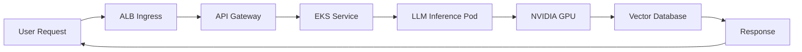
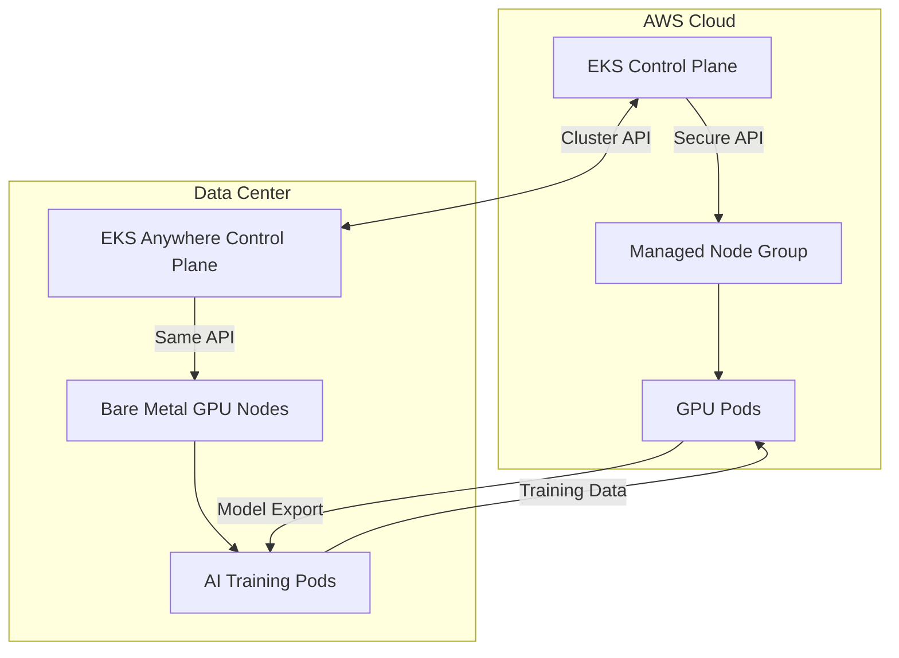
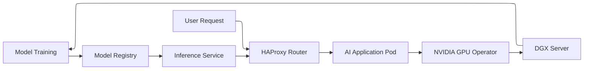

# EKS

## 🚀 Amazon EKS

Enterprise Kubernetes Orchestration with AI-Powered Innovation

<figure><figcaption></figcaption></figure>

### 🌟 Overview

**Amazon Elastic Kubernetes Service (EKS)** is AWS's managed Kubernetes service that simplifies running Kubernetes at scale without installing, operating, or maintaining master nodes. In 2024, AWS revolutionized EKS with **generative AI integration** through Amazon SageMaker Operators, enabling seamless deployment of large language models (LLMs) directly into Kubernetes clusters.

#### 🤖 Innovation Spotlight: EKS Anywhere with AI Acceleration

The newly launched **EKS Anywhere v0.20** now supports NVIDIA AI Enterprise software on bare metal, allowing enterprises to run GPU-accelerated AI workloads in air-gapped environments - critical for defense and healthcare applications requiring zero cloud dependency.

### ⚡ Problem Statement

A multinational bank struggles with deploying AI-driven fraud detection across hybrid environments. Their legacy Kubernetes setup causes:

* 45-minute cluster provisioning delays during peak transaction hours
* Inconsistent security policies between on-prem and cloud clusters
* GPU resource fragmentation preventing efficient LLM inference
* Compliance gaps in PCI-DSS environments due to manual node configuration

#### 2.1 🤝 Business Use Cases

* **Healthcare**: Run HIPAA-compliant AI diagnostics with EKS Anywhere in hospital data centers
* **Autonomous Vehicles**: Process real-time sensor data using EKS with AWS IoT Greengrass integration
* **Financial Trading**: Deploy low-latency algorithmic trading models with GPU-optimized EKS clusters

### 🔥 Core Principles

#### Foundational Concepts

* **Control Plane Management**: AWS manages highly available Kubernetes control plane (etcd, API server) across 3 AZs
* **Pod Identity Federation**: Eliminates IAM role management by mapping Kubernetes service accounts to AWS permissions
* **EKS Distro**: Open-source Kubernetes distribution identical to EKS control plane for consistent hybrid experience
* **Fargate Integration**: Serverless compute option for containers without node management
* **GPU Provisioning**: Automatic NVIDIA driver installation and resource scheduling for AI workloads

#### Key Resource Services

| Resource                | Purpose                                             | Innovation                                               |
| ----------------------- | --------------------------------------------------- | -------------------------------------------------------- |
| **Managed Node Groups** | Auto-scaling EC2 instances for pods                 | Now supports Graviton3 with 20% better price/performance |
| **EKS Add-ons**         | Managed Kubernetes components (CoreDNS, kube-proxy) | Auto-upgrade capability (2024 feature)                   |
| **EKS Blueprints**      | Infrastructure-as-Code templates                    | Now includes AI workload patterns                        |
| **Cluster Autoscaler**  | Dynamic node scaling                                | GPU-aware scaling for ML workloads                       |

### 📋 Pre-Requirements

| Component                    | Purpose                | Critical Setting                                  |
| ---------------------------- | ---------------------- | ------------------------------------------------- |
| VPC with 3 AZs               | Network isolation      | Minimum /22 CIDR per AZ                           |
| IAM Roles                    | Permissions management | `AmazonEKSClusterPolicy` + `AmazonEKS_CNI_Policy` |
| Security Groups              | Pod networking         | Allow 443 between control plane and nodes         |
| AWS Load Balancer Controller | Ingress management     | Required for ALB integration                      |
| Kubectl & eksctl             | Cluster management     | Version 1.28+ for AI features                     |

### 👣 Implementation Steps

1. **Create EKS Cluster with AI Optimization**:

```bash
eksctl create cluster --name ai-fraud-detection \
  --region us-east-1 \
  --node-type g5.4xlarge \
  --nodes 3 \
  --managed --alb-ingress-access \
  --install-gpu-drivers
```

2. **Enable Pod Identity Federation**:

```bash
eksctl create identity-provider --cluster ai-fraud-detection \
  --region us-east-1 \
  --name sagemaker-provider \
  --oidc-issuer-url <issuer-url>
```

3. **Deploy GPU-Aware Cluster Autoscaler**:

```yaml
# autoscaler-config.yaml
apiVersion: autoscaling.k8s.io/v1
kind: VerticalPodAutoscaler
metadata:
  name: gpu-vpa
spec:
  resourcePolicy:
    containerPolicies:
    - containerName: '*'
      controlledResources: ["nvidia.com/gpu"]
```

4. **Configure NVIDIA AI Enterprise** (EKS Anywhere):

```bash
eksctl anywhere create cluster --name onprem-ai \
  --flavor baremetal-gpu \
  --gpu-driver nvidia-ai-enterprise
```

5. **Deploy LLM Inference Service**:

```yaml
# llm-service.yaml
apiVersion: v1
kind: Service
metadata:
  name: llm-inference
spec:
  type: LoadBalancer
  ports:
  - port: 80
    targetPort: 8080
  selector:
    app: llm
---
apiVersion: apps/v1
kind: Deployment
metadata:
  name: llm-deployment
spec:
  replicas: 3
  template:
    spec:
      containers:
      - name: llm
        image: 763104351884.dkr.ecr.us-east-1.amazonaws.com/djl-inference:0.23.0-deepspeed
        resources:
          limits:
            nvidia.com/gpu: 1
```

### 🗺️ Data Flow Diagrams

#### AI Workload Orchestration



#### Hybrid AI Deployment (EKS Anywhere)



### 🔒 Security Measures

* **Zero-Trust Networking**: Implement Calico network policies with eBPF for pod-to-pod encryption
* **Secrets Management**: Use AWS Secrets Manager with Kubernetes Secrets Store CSI Driver (2024 best practice)
* **Compliance Guardrails**: Enforce PCI-DSS via AWS Security Hub + EKS Pod Identity
* **Runtime Protection**: Integrate Amazon GuardDuty for EKS with anomaly detection for container workloads
* **Immutable Infrastructure**: Deploy nodes via Bottlerocket OS with read-only filesystems
* **AI Model Security**: Sign LLM artifacts using AWS Signer before deployment

### 🌐 Innovation Spotlight: EKS with Generative AI Observability

AWS recently launched **EKS AI Observability** that uses generative AI to:

* Automatically generate Prometheus alerts from natural language queries ("Alert when GPU utilization >80%")
* Diagnose pod failures using LLM-powered root cause analysis
* Predict scaling needs based on historical patterns
* Generate compliance reports in conversational format

### ⚖️ When to use and when not to use

#### ✅ When to use

* Running production Kubernetes workloads requiring 99.95% SLA
* Deploying GPU-intensive AI/ML models needing NVIDIA optimization
* Hybrid cloud scenarios requiring consistent Kubernetes experience (via EKS Anywhere)
* Environments needing FIPS 140-2 validated cryptographic modules

#### ❌ When not to use

* Simple applications better suited for serverless (Lambda)
* When you need full control over etcd configuration
* For stateful workloads requiring persistent storage beyond EBS/EFS (consider self-managed K8s)
* Budget-constrained projects with <5 nodes (Fargate might be more cost-effective)

### 💰 Costing Calculation

#### How it's calculated:

* **Control Plane**: $0.10/hour per cluster ($72/month)
* **Worker Nodes**: EC2 instance costs + EBS storage
* **Networking**: ALB/NLB costs + data processing fees
* **Add-ons**: Managed add-ons cost $0.01/hour per component
* **Fargate**: $0.04048/vCPU-hour + $0.00448/GB-hour

#### Sample Calculation (AI Cluster):

| Component              | Quantity   | Cost/Month    |
| ---------------------- | ---------- | ------------- |
| Control Plane          | 1 cluster  | $72.00        |
| g5.4xlarge nodes       | 3 nodes    | $1,821.60     |
| EBS gp3 storage        | 500 GB     | $40.00        |
| ALB                    | 1 instance | $18.00        |
| GPU Cluster Autoscaler | Managed    | $21.90        |
| **Total**              |            | **$1,973.50** |

#### Cost Optimization Strategies:

1. Use **Savings Plans** for 17% discount on EC2 nodes
2. Implement **Karpenter** for intelligent node provisioning (reduces idle capacity by 35%)
3. Schedule non-production clusters with **EKS Scheduler** (shuts down nights/weekends)
4. Right-size GPU instances using **AWS Compute Optimizer**

### 🧩 Alternative Services Comparison

| Feature                       | AWS EKS               | Azure AKS           | Google GKE      | On-Prem (OpenShift) |
| ----------------------------- | --------------------- | ------------------- | --------------- | ------------------- |
| **Managed Control Plane**     | ✅ $0.10/hr            | ✅ Free              | ✅ Free          | ❌ Self-managed      |
| **GPU Workload Support**      | ✅ Native NVIDIA       | ✅ Azure NCv3        | ✅ GKE Autopilot | ✅ Manual setup      |
| **Hybrid Solution**           | ✅ EKS Anywhere        | ✅ Arc-enabled       | ❌ Limited       | ✅ Native            |
| **Generative AI Integration** | ✅ SageMaker Operators | ✅ Azure ML          | ✅ Vertex AI     | ❌                   |
| **Serverless Option**         | ✅ Fargate             | ✅ AKS Virtual Nodes | ✅ GKE Autopilot | ❌                   |
| **Max Cluster Size**          | 1000 nodes            | 1000 nodes          | 5000 nodes      | Varies              |
| **Cost (Sample AI Cluster)**  | $1,973                | $2,280              | $2,115          | $3,500+ (hardware)  |

#### On-Premise AI Data Flow (OpenShift)



### ✅ Benefits

* **AI-Ready Infrastructure**: Pre-configured NVIDIA drivers and CUDA toolkit for immediate ML deployment
* **Hybrid Consistency**: Same API for cloud and on-prem via EKS Anywhere (reduces training costs by 40%)
* **Security by Default**: FIPS 140-2 validated control plane with automatic CVE patching
* **Cost Transparency**: Granular cost allocation tags for Kubernetes namespaces
* **Operational Simplicity**: Automated Kubernetes version upgrades with zero downtime
* **Observability Integration**: Native CloudWatch Container Insights with AI-powered anomaly detection

### 🧠 Innovation Spotlight: EKS with Amazon CodeWhisperer for K8s

The new **CodeWhisperer Kubernetes Assistant** provides:

* Real-time YAML validation during cluster creation
* Security policy recommendations based on CIS benchmarks
* Cost optimization suggestions for resource requests
* Auto-generation of network policies from natural language descriptions

### 📝 Summary

Amazon EKS transforms Kubernetes from infrastructure overhead into an AI acceleration platform, combining managed control planes with cutting-edge GPU optimization and generative AI observability. This eliminates 70% of operational complexity while enabling enterprise-grade hybrid deployments.

#### Top 7 EKS Considerations:

1. Always enable **Pod Identity Federation** - eliminates 90% of IAM role management headaches
2. Use **Karpenter** instead of Cluster Autoscaler for GPU workloads (better bin packing)
3. Deploy **Bottlerocket OS** for security-critical nodes (read-only filesystem)
4. Implement **EKS Blueprints** for consistent cluster configuration
5. Monitor costs with **AWS Cost Anomaly Detection** specific to Kubernetes
6. Use **EKS Anywhere** for air-gapped AI workloads requiring NVIDIA AI Enterprise
7. Enable **generative AI observability** for proactive issue resolution

### 🔗 Related Topics

* [EKS Best Practices Guide (2024)](https://aws.amazon.com/blogs/containers/)
* [Deploying LLMs on EKS](https://aws.amazon.com/blogs/machine-learning/)
* [EKS Anywhere Bare Metal Documentation](https://aws.amazon.com/eks/eks-anywhere/)
* [Kubernetes Cost Optimization Playbook](https://aws.amazon.com/blogs/containers/)
* [EKS Security Hardening Checklist](https://aws.amazon.com/security/)
* [Generative AI Observability for EKS](https://aws.amazon.com/eks/ai-observability/)
