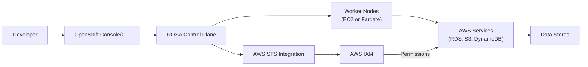
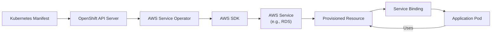
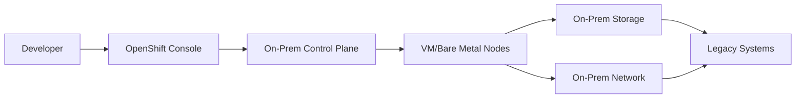

# OpenShift

## 🌐 Red Hat OpenShift Service on AWS (ROSA): Enterprise Kubernetes with Hybrid Cloud Power

### 🌟 Overview

**Red Hat OpenShift Service on AWS (ROSA)** is a _jointly managed service_ between AWS and Red Hat (not an "Amazon OpenShift" product) that delivers fully managed OpenShift clusters on AWS infrastructure. Launched as Generally Available in 2021, ROSA combines Red Hat's enterprise Kubernetes platform with AWS's cloud infrastructure, providing a seamless hybrid cloud experience for organizations already invested in the OpenShift ecosystem.

<figure><figcaption></figcaption></figure>

#### 🤖 Innovation Spotlight: AWS Service Operator for Kubernetes

The 2024 release introduces the **AWS Service Operator for Kubernetes (AWS Service Operator)**, which allows OpenShift users to provision and manage AWS services (like RDS, S3, and DynamoDB) directly through Kubernetes manifests - eliminating context switching between cloud consoles and Kubernetes environments.

### ⚡ Problem Statement

A global manufacturing company struggles with inconsistent Kubernetes experiences across environments:

* Development teams use OpenShift on-premises for legacy applications
* New cloud-native applications use Amazon EKS
* Inconsistent security policies between platforms causing compliance gaps
* Developers require context switching between different CLI tools and consoles
* 40% longer deployment cycles due to platform fragmentation

#### 2.1 🤝 Business Use Cases

* **Financial Services**: Run PCI-DSS compliant applications using OpenShift's advanced security features while leveraging AWS financial services
* **Healthcare**: Maintain HIPAA compliance with OpenShift's audit capabilities while using AWS health data services
* **Retail**: Handle Black Friday traffic spikes with ROSA's auto-scaling while maintaining consistent developer experience
* **Government**: Meet FedRAMP requirements with OpenShift's certification while benefiting from AWS GovCloud

### 🔥 Core Principles

#### Foundational Concepts

* **Jointly Managed Service**: AWS and Red Hat share management responsibilities - AWS manages the underlying infrastructure while Red Hat manages the OpenShift control plane
* **Hybrid Cloud Consistency**: Same OpenShift experience across AWS, on-premises, and edge locations
* **Integrated Identity**: Native integration with AWS IAM for authentication and authorization
* **Serverless Kubernetes**: Option to deploy with AWS Fargate for worker nodes, eliminating node management
* **AWS Service Integration**: Direct access to AWS services through Operators and Service Bindings

#### Key Resource Services

| Component                                | Purpose                                   | ROSA Advantage                            |
| ---------------------------------------- | ----------------------------------------- | ----------------------------------------- |
| **Control Plane**                        | Hosts Kubernetes master components        | Fully managed by Red Hat with 99.95% SLA  |
| **Worker Nodes**                         | Runs application workloads                | EC2 instances or AWS Fargate (serverless) |
| **STSD (Security Token Service Daemon)** | Bridges AWS IAM and OpenShift identities  | Eliminates separate IAM role management   |
| **AWS Service Operator**                 | Provision AWS services via Kubernetes API | Unified infrastructure-as-code experience |
| **OpenShift Pipelines**                  | CI/CD capabilities                        | Integrates with AWS Code services         |

### 📋 Pre-Requirements

| Component         | Purpose                | Critical Setting                            |
| ----------------- | ---------------------- | ------------------------------------------- |
| AWS Account       | Cloud infrastructure   | Must enable ROSA in AWS Organizations       |
| Red Hat Account   | OpenShift management   | Must have OpenShift Cluster Manager access  |
| ROSA CLI (`rosa`) | Cluster management     | Version 1.3+ required                       |
| IAM Roles         | Permissions management | `AdministratorAccess-AWSServiceRoleForROSA` |
| VPC               | Network isolation      | Minimum /22 CIDR with 3 AZs                 |
| Hosted Zone       | DNS management         | Route 53 hosted zone for cluster access     |

### 👣 Implementation Steps

1. **Prepare AWS Account**:

```bash
aws iam create-service-linked-role --aws-service-name openshift.redhat.com
rosa init --token=<redhat-token>
```

2. **Create ROSA Cluster with Fargate**:

```bash
rosa create cluster --cluster-name financial-services \
  --sts --mode auto --region us-east-1 \
  --fargate --compute-nodes 0
```

3. **Configure IAM Roles for Service Accounts**:

```bash
rosa create operator-roles --cluster financial-services \
  --mode auto
```

4. **Deploy AWS Service Operator**:

```bash
oc apply -f https://github.com/aws-controllers-k8s/community/releases/latest/download/community-operator-bundle.yaml
```

5. **Provision AWS RDS Database via Kubernetes Manifest**:

```yaml
apiVersion: rds.services.k8s.aws/v1alpha1
kind: DBInstance
metadata:
  name: customer-data
spec:
  allocatedStorage: 100
  dbInstanceClass: db.t4g.micro
  engine: postgres
  masterUsername: admin
  masterUserPassword:
    name: db-credentials
    key: password
```

### 🗺️ Data Flow Diagrams

#### ROSA Architecture with AWS Integration



#### AWS Service Operator Workflow



### 🔒 Security Measures

* **Unified Identity**: STSD bridges OpenShift identities with AWS IAM permissions, eliminating separate credential management
* **PrivateLink Integration**: Deploy ROSA clusters with VPC endpoints for secure AWS service access
* **FIPS Compliance**: ROSA supports FIPS 140-2 validated cryptographic modules for regulated industries
* **Network Policies**: Implement Calico network policies with eBPF for zero-trust pod communication
* **Secrets Management**: Integrate AWS Secrets Manager with OpenShift Secrets Provider
* **Compliance Scanning**: Enable OpenSCAP profiles for CIS benchmark compliance validation

### 🌐 Innovation Spotlight: ROSA with Amazon CodeWhisperer

The newly integrated **CodeWhisperer for OpenShift** provides:

* Real-time Kubernetes YAML validation with security recommendations
* Natural language to OpenShift manifest generation ("Create a deployment with 3 replicas")
* Security policy suggestions based on CIS OpenShift benchmarks
* Cost optimization recommendations for resource requests

### ⚖️ When to use and when not to use

#### ✅ When to use

* Your organization already uses Red Hat OpenShift and needs AWS integration
* You require consistent Kubernetes experience across hybrid environments
* Your compliance requirements demand Red Hat's certified OpenShift (e.g., FedRAMP, PCI-DSS)
* You want to leverage AWS services while maintaining OpenShift developer experience
* Your team has OpenShift expertise but limited AWS knowledge

#### ❌ When not to use

* You're starting a new project without existing OpenShift investment
* You need the lowest cost Kubernetes option (Amazon EKS may be more cost-effective)
* Your applications require deep AWS service integration not available through Operators
* You need full control over the Kubernetes control plane configuration
* Your team has strong EKS expertise but no OpenShift experience

### 💰 Costing Calculation

#### How it's calculated:

* **ROSA Service Fee**: $0.171 per 4 vCPU of worker nodes per hour
* **Control Plane**: Included in service fee (no separate charge)
* **Worker Nodes**: EC2 instance costs or Fargate compute costs
* **AWS Services**: Standard AWS pricing for RDS, S3, etc.
* **OpenShift Licensing**: Included in ROSA service fee

#### Sample Calculation (Financial Services Cluster):

| Component            | Quantity             | Cost/Month  |
| -------------------- | -------------------- | ----------- |
| ROSA Service Fee     | 16 vCPU worker nodes | $207.36     |
| m6i.xlarge nodes     | 4 nodes              | $657.28     |
| EBS Storage          | 500 GB               | $100.00     |
| AWS Service Operator | Managed              | $0.00       |
| **Total**            |                      | **$964.64** |

#### Cost Optimization Strategies:

1. Use **Fargate** for variable workloads to eliminate idle node costs
2. Implement **cluster autoscaling** with OpenShift's Cluster Autoscaler
3. Schedule non-production clusters to scale to zero during off-hours
4. Right-size worker nodes using OpenShift's Vertical Pod Autoscaler

### 🧩 Alternative Services Comparison

| Feature                   | ROSA             | Amazon EKS | Azure OpenShift       | On-Prem OpenShift      |
| ------------------------- | ---------------- | ---------- | --------------------- | ---------------------- |
| **Managed By**            | AWS + Red Hat    | AWS        | Microsoft + Red Hat   | Self-managed           |
| **Control Plane Cost**    | Included         | $0.10/hr   | Included              | Hardware + maintenance |
| **OpenShift Version**     | Latest certified | N/A        | Latest certified      | Manual updates         |
| **AWS Integration**       | ✅ Native         | ✅ Native   | ⚠️ Limited            | ❌                      |
| **Fargate Support**       | ✅                | ✅          | ❌                     | ❌                      |
| **Joint Support**         | ✅ AWS + Red Hat  | ✅ AWS      | ✅ Microsoft + Red Hat | ❌                      |
| **Cost (Sample Cluster)** | $965             | $720       | $1,150                | $1,800+                |

#### On-Prem OpenShift Data Flow



### ✅ Benefits

* **Hybrid Consistency**: Same OpenShift experience across AWS and on-premises environments
* **Reduced Operational Overhead**: AWS manages infrastructure while Red Hat manages OpenShift
* **Enhanced Security**: Unified identity management between OpenShift and AWS services
* **Cost Transparency**: Single bill through AWS while maintaining OpenShift compatibility
* **Faster Innovation**: Direct access to AWS services through Kubernetes-native interfaces
* **Enterprise Support**: Joint support from both AWS and Red Hat for end-to-end issues

### 🚀 Innovation Spotlight: ROSA with Amazon SageMaker

The new **SageMaker Operator for ROSA** enables:

* Direct deployment of ML models from SageMaker to OpenShift
* Automatic scaling of inference endpoints based on ROSA metrics
* Unified monitoring of ML workloads across AWS and OpenShift
* Secure data exchange between SageMaker processing jobs and OpenShift applications

### 📝 Summary

Red Hat OpenShift Service on AWS (ROSA) delivers the best of both worlds - Red Hat's enterprise Kubernetes platform with AWS's cloud infrastructure - creating a seamless hybrid cloud experience for organizations invested in the OpenShift ecosystem. By eliminating the operational burden of managing OpenShift while preserving its enterprise features, ROSA enables organizations to focus on application development rather than infrastructure management.

#### Top 7 ROSA Considerations:

1. **Always use STS mode** for better security and IAM integration (non-STS mode is deprecated)
2. **Leverage AWS Service Operator** to manage AWS resources through Kubernetes manifests
3. **Implement Fargate for variable workloads** to reduce node management overhead
4. **Use OpenShift's built-in monitoring** with CloudWatch integration for unified observability
5. **Enable PrivateLink** for secure access to AWS services without public internet exposure
6. **Take advantage of joint AWS/Red Hat support** for end-to-end issue resolution
7. **Plan for OpenShift version upgrades** using ROSA's managed upgrade process

### 🔗 Related Topics

* [ROSA Official Documentation](https://docs.openshift.com/rosa/)
* [ROSA Quick Start Guide](https://aws.amazon.com/blogs/containers/getting-started-with-red-hat-openshift-service-on-aws-rosa/)
* [AWS Service Operator for Kubernetes](https://aws.amazon.com/blogs/containers/introducing-aws-service-operator-k8s-aws-controllers-for-k8s/)
* [ROSA Pricing Details](https://aws.amazon.com/blogs/containers/red-hat-openshift-service-on-aws-pricing/)
* [Migrating from Self-Managed OpenShift to ROSA](https://aws.amazon.com/blogs/containers/migrating-from-self-managed-openshift-to-rosa/)
* [ROSA Security Best Practices](https://aws.amazon.com/blogs/security/security-best-practices-for-red-hat-openshift-service-on-aws/)
