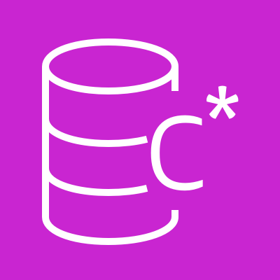
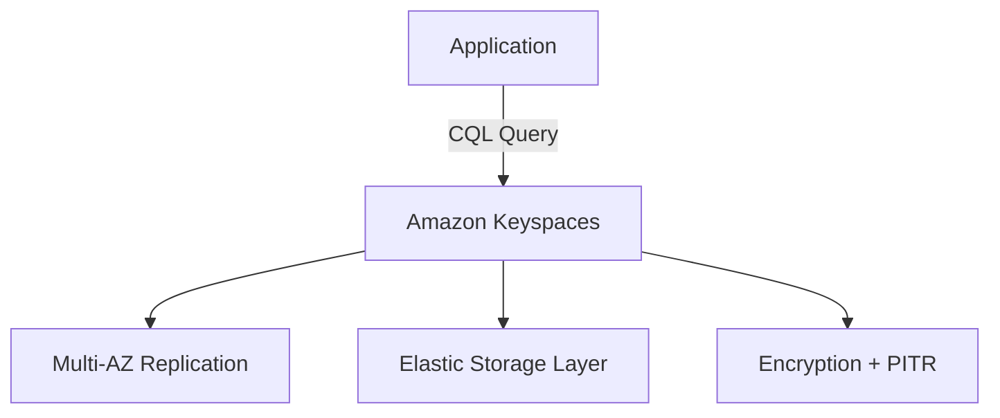
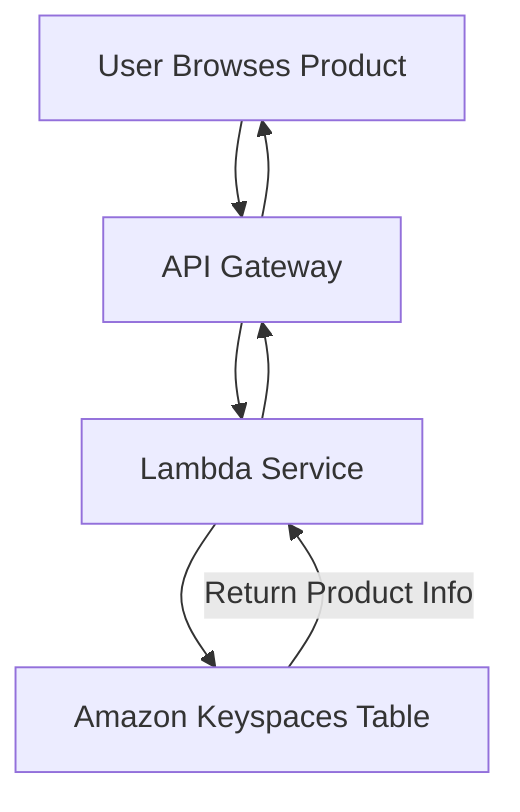
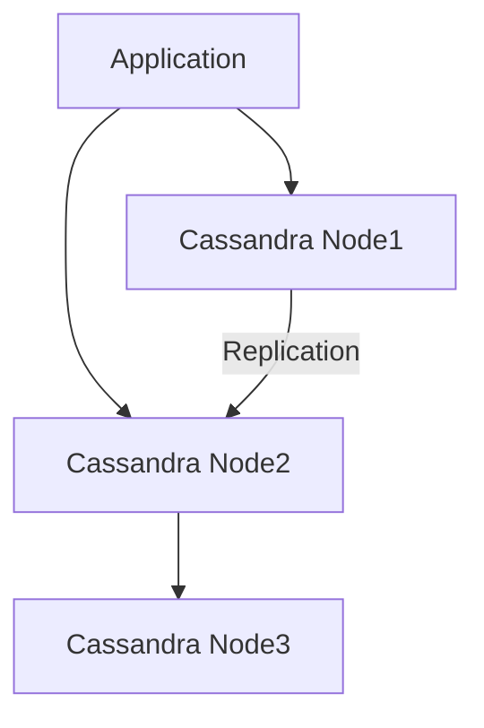

# Amazon Keyspaces (Cassandra)

## **🚀 Amazon Keyspaces (for Apache Cassandra)**

### **🌟 Overview**

Amazon Keyspaces (for Apache Cassandra) is a serverless, fully managed, and highly available database service built to run applications using the open-source Apache Cassandra query language (CQL). It provides elastic scalability, automatic replication across multiple Availability Zones, and on-demand throughput without the operational overhead of maintaining a Cassandra cluster.

<figure><figcaption></figcaption></figure>

Unlike traditional Cassandra clusters, where you manage nodes, replication, and scaling, Keyspaces abstracts this complexity. Developers interact with it just like Cassandra, using familiar CQL APIs, but AWS handles infrastructure, scaling, backups, patching, and replication.

🤖 Innovation Spotlight: Amazon Keyspaces recently introduced Point-in-Time Recovery (PITR), allowing developers to restore data from any second in the preceding 35 days. This capability bridges operational gaps, reducing risks of accidental deletes or overwrites, which has historically been a pain point in Cassandra environments.

***

### **⚡ Problem Statement**

Scenario: A financial services company running a fraud detection engine on Cassandra struggles with scaling. During peak shopping seasons, traffic spikes cause cluster instability, high maintenance costs, and operational overhead.

Solution with Keyspaces: The company migrates to Amazon Keyspaces, offloading cluster management. Scaling is automatic, storage is elastic, and throughput adjusts on demand. This enables real-time fraud detection with no downtime during traffic surges.

#### **2.1 🤝 Business Use Cases**

* Banking/Finance → Fraud detection, transaction history queries.
* E-commerce → Catalog management, recommendation engines.
* IoT → Device telemetry ingestion and querying.
* Gaming → Real-time leaderboards with high read/write performance.
* Healthcare → Patient records management with strict uptime requirements.

***

### **🔥 Core Principles**

* Serverless Cassandra → No cluster provisioning, just CQL access.
* On-Demand & Provisioned Capacity Modes → Scale dynamically or reserve throughput.
* Elastic Storage → Data automatically scales without sharding.
* Multi-AZ Replication → High availability by default.
* Encryption → At rest (KMS-managed) and in transit (TLS).

Key Concepts:

* Tables → Like Cassandra, store partitioned and clustered data.
* Keyspaces → Group of tables, equivalent to Cassandra namespaces.
* Capacity Modes → On-demand vs provisioned.
* Replication → Automatically managed across AZs.
* Backups → Continuous and Point-in-Time Recovery (PITR).

***

### **📋 Pre-Requirements**

* AWS Account with IAM role permissions.
* Familiarity with CQL (Cassandra Query Language).
* AWS SDK or CQLSH for querying.
* VPC Peering (if connecting from private subnets).
* Optional: AWS Data Migration Service (DMS) for Cassandra migration.

***

### **👣 Implementation Steps**

1. Create a Keyspace in AWS Console or via CLI.
2. Define Tables using CQL (partition & clustering keys).
3. Choose Capacity Mode (on-demand or provisioned).
4. Enable PITR for recovery.
5. Connect using AWS SDK, JDBC, or Cassandra driver.
6. Integrate Applications for real-time queries.
7. Monitor with CloudWatch metrics.

***

### **🗺️ Data Flow Diagram**

#### **Diagram 1: How Amazon Keyspaces Works**



```
```

#### **Diagram 2: Example – E-commerce Catalog**




***

### **🔒 Security Measures**

* Use IAM authentication (fine-grained access).
* Enable VPC Peering or PrivateLink for private access.
* Apply least privilege roles for applications.
* Use encryption (KMS at rest, TLS in transit).
* Enable CloudTrail logs for compliance monitoring.

***

### **⚖️ When to Use & When Not to Use**

✅ When to Use

* You need Cassandra compatibility without managing clusters.
* Workloads require scaling automatically.
* Applications demand high availability with zero downtime.
* Real-time analytics, IoT, gaming, fraud detection.

❌ When Not to Use

* You need multi-region replication (not yet supported natively).
* Workloads with heavy batch analytics (consider DynamoDB + Athena).
* Low-latency apps requiring <10ms response consistently (Keyspaces \~10–30ms).

***

### **💰 Costing Calculation**

* Charges:
  * Reads, Writes, Storage, PITR backup.
  * On-Demand (per request) vs Provisioned (reserved throughput).

Example Calculation:

* 1M reads/month @ $1.35 per million = $1.35
* 500K writes/month @ $1.45 per million = $0.73
* 50GB storage @ $0.25/GB = $12.5
*   PITR backup (50GB) @ $0.20/GB = $10

    ➡️ Total ≈ $24.6/month

***

### **🧩 Alternative Services**

| Platform   | Alternative Service       | Key Difference                       |
| ---------- | ------------------------- | ------------------------------------ |
| AWS        | DynamoDB                  | Key-value store, lower latency       |
| Azure      | Cosmos DB (Cassandra API) | Global replication, multi-model      |
| GCP        | Cloud Bigtable            | Wide-column but no Cassandra API     |
| On-Premise | Apache Cassandra          | Full control, but heavy ops overhead |

#### **On-Premise Cassandra Data Flow**



***

### **✅ Benefits**

* No cluster management – serverless.
* Elastic scaling with no downtime.
* CQL compatibility (drop-in replacement for Cassandra).
* High availability with Multi-AZ replication.
* Built-in security & compliance.
* Cost-efficient with pay-per-use.

***

### **📝 Summary**

Amazon Keyspaces delivers Cassandra compatibility without operational overhead. It is ideal for real-time, high-throughput workloads that require high availability and elastic scaling.

🔑 Top 5 Key Points:

1. Serverless Cassandra, fully managed.
2. Supports on-demand and provisioned modes.
3. PITR backup for up to 35 days.
4. Multi-AZ high availability.
5. Ideal for IoT, gaming, finance, and e-commerce.

***

### **🔗 Related Topics**

* [Amazon Keyspaces Documentation](https://docs.aws.amazon.com/keyspaces/)
* [Cassandra Query Language (CQL)](https://cassandra.apache.org/doc/latest/cql/)
* [AWS DMS for Cassandra Migration](https://docs.aws.amazon.com/dms/)
* [AWS Keyspaces Pricing](https://aws.amazon.com/keyspaces/pricing/)

***
