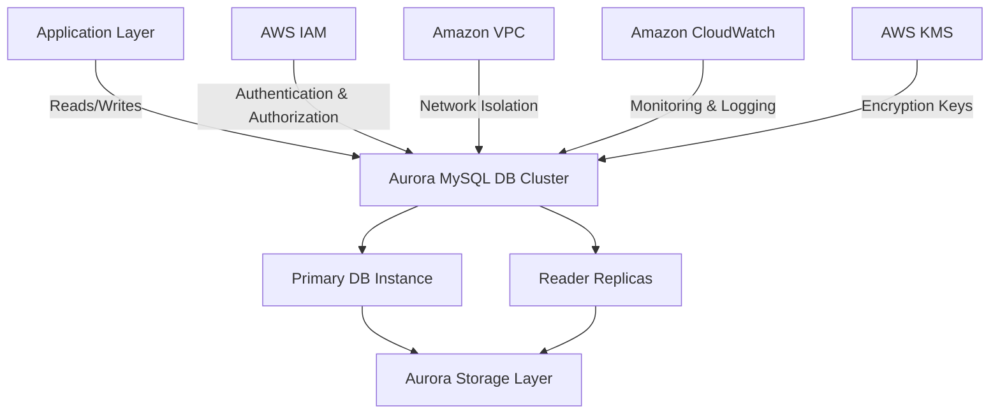
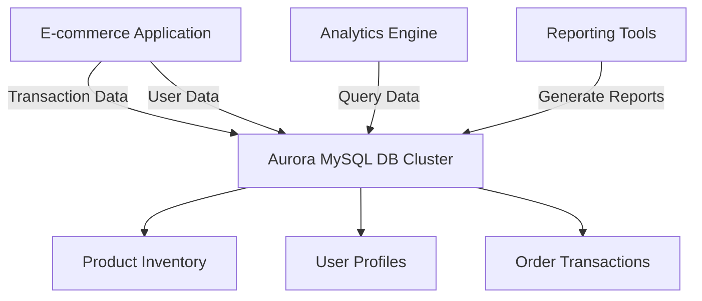
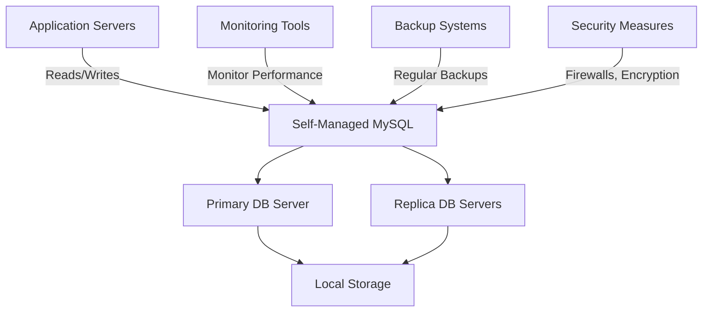

# Aurora MySQL

## Amazon Aurora MySQL: A Comprehensive Overview

### 1. 🌟 Overview

Amazon Aurora MySQL is a MySQL-compatible relational database engine that combines the speed and availability of high-end commercial databases with the simplicity and cost-effectiveness of open-source databases. Aurora MySQL is a fully managed database service that offers enhanced performance, scalability, and durability.

#### 🤖 Innovation Spotlight

Amazon Aurora MySQL has recently introduced enhancements such as **Aurora Serverless v2**, which automatically scales database capacity up and down based on your application’s needs. Additionally, Aurora now supports **multi-master replication**, improving write scalability and availability across multiple Availability Zones (AZs).

### 2. ⚡ Problem Statement

**Real-World Scenario:** An e-commerce platform requires a highly available, scalable, and performant database solution to handle millions of transactions and user requests during peak shopping seasons.

**Industries/Applications:**

* **E-commerce:** Managing inventories, transactions, and user profiles.
* **Finance:** Handling secure financial transactions and compliance.
* **Healthcare:** Managing patient records and healthcare transactions securely.

### 2.1 🤝 Business Use Cases

Amazon Aurora MySQL is particularly beneficial for:

* **Online Transaction Processing (OLTP):** Handling high-volume transactions with low latency.
* **Real-Time Analytics:** Enabling real-time data analysis and reporting.
* **High Availability Applications:** Ensuring continuous availability and fault tolerance.

### 3. 🔥 Core Principles

Amazon Aurora MySQL is built on several core principles that enhance its functionality and performance:

* **Architectural Design:** Aurora separates storage and compute, allowing for rapid scaling and fault tolerance.
* **Compatibility:** Fully compatible with MySQL 5.6, 5.7, and 8.0, facilitating easy migration.
* **Scalability and Performance:** Offers up to 5x the throughput of standard MySQL and scales storage automatically up to 128TB.
* **High Availability:** Designed to offer 99.99% availability, replicating six copies of your data across three AZs.

Key Resource Terms:

* **DB Instances:** The smallest unit of deployment in Aurora, acting as a virtual database server.
* **DB Clusters:** A collection of DB instances managed together as a single unit.
* **Endpoints:** Used to connect to your Aurora database. There are different endpoints for reader and writer operations.
* **Read Replicas:** Replicas of your primary database instance that improve read scalability.

### 4. 📋 Pre-Requirements

To implement Amazon Aurora MySQL, you need the following AWS services and tools:

* **AWS Identity and Access Management (IAM):** For managing access to AWS services securely.
* **Amazon Virtual Private Cloud (VPC):** To isolate your Aurora cluster within a private network.
* **AWS CloudFormation:** For defining and provisioning your infrastructure as code.
* **AWS Secrets Manager:** For managing database credentials securely.
* **Amazon CloudWatch:** For monitoring and logging database activities.

### 5. 👣 Implementation Steps

1. **Create an Aurora MySQL DB Cluster:**
   * Log in to the AWS Management Console.
   * Navigate to the Amazon RDS service and select "Create database."
   * Choose Amazon Aurora with MySQL compatibility.
   * Configure your DB cluster by specifying the DB engine version, instance class, and multi-AZ deployment options.
2. **Configure Network & Security:**
   * Set up a VPC to host your Aurora cluster.
   * Configure security groups to control inbound and outbound traffic to the cluster.
   * Set up IAM roles and policies to manage access to your cluster securely.
3. **Set Up Database Instances:**
   * Define the number of DB instances and their specifications.
   * Configure storage settings, including allocated storage and auto-scaling policies.
4. **Configure Database Settings:**
   * Define initial database configurations, such as parameters for memory and performance tuning.
   * Set up databases, tables, and users according to your application requirements.
5. **Connect to the Database:**
   * Use standard MySQL drivers and connectors to connect to your Aurora MySQL cluster.
   * Implement connection pooling in your application for efficient database connections.
6. **Monitor and Maintain:**
   * Use Amazon CloudWatch to set up monitoring for performance metrics, logs, and events.
   * Schedule regular backups and maintenance windows to ensure data integrity and availability.

### 6. 🗺️ Data Flow Diagram

Here is a Mermaid diagram illustrating the architecture of Amazon Aurora MySQL:

The second Mermaid diagram below illustrates a specific use case of an e-commerce platform using Amazon Aurora MySQL:

### 7. 🔒 Security Measures

To secure your Amazon Aurora MySQL cluster, follow these best practices:

* **Encryption:** Enable encryption at rest and in transit. Use AWS KMS to manage encryption keys.
* **IAM Roles and Policies:** Apply the principle of least privilege to manage access to your cluster.
* **VPC and Security Groups:** Isolate your cluster within a VPC and configure security groups to restrict traffic.
* **Backup and Recovery:** Implement regular backups and test recovery procedures to ensure data resilience.
* **Monitoring and Logging:** Use Amazon CloudWatch to monitor performance and set up alerts for suspicious activities.

### 8. 🏢 Integration with Other AWS Services

Amazon Aurora MySQL integrates seamlessly with various AWS services to enhance its functionality:

* **AWS Lambda:** For serverless execution of code in response to database events.
* **Amazon S3:** For data backup and archival.
* **AWS Glue:** For ETL processes and data integration.
* **Amazon QuickSight:** For business intelligence and data visualization.
* **AWS Secrets Manager:** For managing database credentials securely.

These integrations allow for building comprehensive solutions leveraging Aurora MySQL as the core database.

### 9. ⚖️ When to Use and When Not to Use

#### ✅ When to Use

Amazon Aurora MySQL is ideal for:

* Applications requiring high availability and durability.
* Scalable solutions for handling large volumes of transactions.
* Use cases that benefit from MySQL compatibility and need reduced operational complexity through managed services.

#### ❌ When Not to Use

Amazon Aurora MySQL might not be suitable for:

* Applications requiring NoSQL capabilities or non-relational models.
* Use cases needing extensive custom database configurations not supported by MySQL.
* Scenarios with tight budget constraints where manual management of standard MySQL might be more cost-effective.

### 10. 💰 Costing Calculation

Amazon Aurora MySQL pricing is based on several factors:

* **Instance Hours:** Costs depend on the number and size of DB instances in the cluster.
* **Storage:** Charges are based on the amount of data stored and I/O operations performed.
* **Data Transfer:** Costs for data transferred in and out of the cluster.

**Example Cost Calculation:**

Suppose you have a cluster with 2 DB instances of type `db.r5.large` (priced at $0.30 per hour per instance) and 100 GB of storage (priced at $0.10 per GB per month).

* **DB Instance Cost:** 2 instances \* $0.30/hour \* 730 hours/month = $438/month
* **Storage Cost:** 100 GB \* $0.10/GB/month = $10/month
* **Total Estimated Monthly Cost:** $448/month

_Note: Prices may vary by region and are subject to change. Always refer to the latest AWS pricing for accurate calculations._

### 11. 🧩 Alternative Services

Here’s a comparison table of Amazon Aurora MySQL with alternative services:

| Feature/Service       | Amazon Aurora MySQL | Amazon RDS for MySQL | Azure Database for MySQL | Google Cloud SQL for MySQL | Self-Managed MySQL  |
| --------------------- | ------------------- | -------------------- | ------------------------ | -------------------------- | ------------------- |
| **Managed Service**   | Yes                 | Yes                  | Yes                      | Yes                        | No                  |
| **High Availability** | Yes                 | Yes                  | Yes                      | Yes                        | Manual Setup        |
| **Scalability**       | Automatic           | Manual               | Semi-Automatic           | Automatic                  | Manual              |
| **Pricing Model**     | Pay-as-you-go       | Pay-as-you-go        | Pay-as-you-go            | Pay-as-you-go              | Capital Expenditure |
| **Integration**       | AWS Services        | AWS Services         | Azure Services           | GCP Services               | Custom              |

Mermaid Diagram for an on-premise alternative (e.g., self-managed MySQL):

### 12. ✅ Benefits

Amazon Aurora MySQL offers several advantages:

* **High Availability:** Built-in fault tolerance with automatic failover.
* **Scalability:** Automatically scales with your application's needs without downtime.
* **Performance Optimization:** Enhanced performance compared to standard MySQL databases.
* **Ease of Use:** Fully managed service reducing operational overhead.
* **Security and Compliance:** Built-in security features and compliance certifications to meet regulatory requirements.

### 13. 🏢 Enterprise Adoption

Amazon Aurora MySQL is widely adopted by enterprises for its ability to handle large-scale, mission-critical workloads. It supports enterprise-grade features like:

* **Multi-Region Replication:** For disaster recovery and global data distribution.
* **Advanced Monitoring and Alerting:** Through integration with Amazon CloudWatch and AWS CloudTrail.
* **Enterprise Support:** Access to AWS support plans for mission-critical applications.

### 14. 📝 Summary

Amazon Aurora MySQL is a powerful, scalable, and fully managed MySQL-compatible relational database service that offers high availability, enhanced performance, and seamless integration with other AWS services.

* **Top 5 Points to Remember:**
  1. Fully managed and highly scalable MySQL-compatible database.
  2. Provides enhanced performance and availability compared to standard MySQL.
  3. Offers robust security features and compliance certifications.
  4. Seamless integration with other AWS services enhances functionality.
  5. Cost-effective for applications with variable workloads due to its pay-as-you-go pricing model.

In short, Amazon Aurora MySQL is all about providing a managed, scalable, and high-performance database solution for modern applications, ensuring high availability and reducing operational overhead.

### 15. 🔗 Related Topics

* **Amazon RDS:** For managing relational databases on AWS.
* **Amazon DynamoDB:** A NoSQL database for applications needing low-latency data access.
* **MySQL Best Practices:** Guidelines for optimizing MySQL performance and security.
* **AWS Database Migration Service:** For migrating databases to AWS with minimal downtime.
