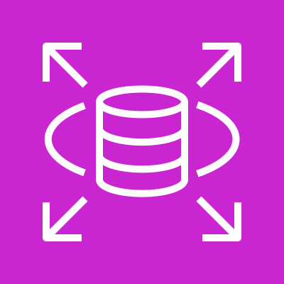

# Db2

## 🗄️ AWS Cloud Expert - Amazon RDS for Db2 Deep Dive

### 1. 🌟 Overview

Amazon RDS for Db2 is a fully managed relational database service that makes it easy to set up, operate, and scale IBM Db2 databases in the AWS cloud. This service combines the power and reliability of IBM Db2 with the operational excellence of Amazon RDS, providing automated backups, software patching, monitoring, and scaling capabilities.

<figure><figcaption></figcaption></figure>

**🤖 Innovation Spotlight**: As of 2025, Amazon RDS for Db2 has introduced enhanced AI-powered query optimization, cross-region automated failover with sub-second recovery times, and integration with Amazon Bedrock for natural language database queries. The service now supports Db2 v12.1 with advanced columnar storage capabilities and real-time analytics workloads.

Key features include:

* Fully managed IBM Db2 LUW (Linux, Unix, Windows) engine
* Multi-AZ deployments for high availability
* Automated backups and point-in-time recovery
* Read replicas for read scaling
* Integration with AWS services like CloudWatch, IAM, and VPC
* Support for both OLTP and OLAP workloads

### 2. ⚡ Problem Statement

**Real-world Scenario**: A large financial services company operating legacy mainframe applications with IBM Db2 z/OS databases needs to modernize their infrastructure while maintaining compatibility with existing applications. They require 99.99% uptime, ACID compliance, and the ability to handle complex analytical queries alongside transactional workloads.

**Industries & Applications**:

* **Banking & Finance**: Core banking systems, risk management platforms, regulatory reporting
* **Insurance**: Policy management systems, claims processing, actuarial analysis
* **Retail**: Inventory management, customer analytics, supply chain optimization
* **Manufacturing**: ERP systems, production planning, quality management
* **Government**: Citizen services, tax systems, regulatory compliance

#### 2.1 🤝 Business Use Cases

1. **Legacy Modernization**: Migrating mainframe Db2 applications to cloud while preserving business logic
2. **Hybrid Cloud Strategy**: Maintaining data consistency between on-premises and cloud Db2 instances
3. **Analytics Modernization**: Real-time business intelligence and data warehousing solutions
4. **Disaster Recovery**: Cross-region backup and failover capabilities for mission-critical applications

### 3. 🔥 Core Principles

#### Foundational Concepts:

* **ACID Compliance**: Ensures data integrity through Atomicity, Consistency, Isolation, and Durability
* **Multi-Version Concurrency Control (MVCC)**: Allows multiple transactions without blocking
* **Row and Column Storage**: Hybrid storage engine for both OLTP and OLAP workloads
* **Advanced SQL Features**: Support for JSON, XML, spatial data, and time-travel queries

#### Service Components:

* **DB Instance**: The core Db2 database server running on EC2 infrastructure
* **DB Parameter Groups**: Configuration templates for database engine parameters
* **DB Security Groups**: Network access control for database instances
* **DB Subnet Groups**: Defines VPC subnets for database deployment
* **Automated Backups**: Point-in-time recovery capabilities up to 35 days
* **Manual Snapshots**: User-initiated database backups for long-term retention
* **Read Replicas**: Read-only copies for scaling read workloads
* **Multi-AZ Deployments**: Synchronous replication across availability zones

### 4. 📋 Pre-Requirements

| Service/Tool            | Purpose                                | Required       |
| ----------------------- | -------------------------------------- | -------------- |
| **AWS VPC**             | Network isolation and security         | ✅ Yes          |
| **EC2 Security Groups** | Database access control                | ✅ Yes          |
| **IAM Roles/Policies**  | Authentication and authorization       | ✅ Yes          |
| **AWS KMS**             | Encryption key management              | ✅ Yes          |
| **CloudWatch**          | Monitoring and alerting                | ✅ Yes          |
| **S3 Bucket**           | Backup storage and data import/export  | 🔶 Optional    |
| **AWS Secrets Manager** | Database credential management         | 🔶 Recommended |
| **AWS Systems Manager** | Parameter and configuration management | 🔶 Optional    |

### 5. 👣 Implementation Steps

1. **Create DB Subnet Group**
   * Navigate to RDS console → Subnet groups
   * Create subnet group across multiple AZs
   * Ensure proper CIDR block configuration
2. **Configure Security Groups**
   * Create dedicated security group for Db2
   * Allow inbound traffic on port 50000 (default Db2 port)
   * Restrict access to specific IP ranges/security groups
3. **Launch RDS for Db2 Instance**
   * Choose Db2 engine from RDS console
   * Select instance class (db.m5.large or higher recommended)
   * Configure storage (gp3 recommended for performance)
   * Set up Multi-AZ if high availability is required
4. **Configure Database Parameters**
   * Create custom DB parameter group
   * Tune memory allocation, connection limits, and performance settings
   * Apply parameter group to database instance
5. **Set Up Monitoring**
   * Enable Enhanced Monitoring
   * Configure CloudWatch alarms for CPU, memory, and connections
   * Set up SNS notifications for critical alerts
6. **Implement Backup Strategy**
   * Configure automated backup retention (1-35 days)
   * Schedule manual snapshots for long-term retention
   * Test restore procedures
7. **Configure Read Replicas** (if needed)
   * Create read replicas in same or different regions
   * Configure application to use read replicas for read operations

### 6. 🗺️ Data Flow Diagrams

#### Diagram 1: Amazon RDS for Db2 Architecture### Diagram 2: Banking Application Use Case## 7. 🔒 Security Measures

#### Best Practices:

* **Encryption at Rest**: Enable RDS encryption using AWS KMS with customer-managed keys
* **Encryption in Transit**: Use SSL/TLS connections with certificate validation
* **Network Security**: Deploy in private subnets with restrictive security groups
* **IAM Database Authentication**: Use IAM roles instead of traditional database credentials
* **AWS Secrets Manager**: Rotate database passwords automatically
* **VPC Endpoints**: Use VPC endpoints for secure communication with AWS services
* **Database Activity Streams**: Enable real-time monitoring of database activity
* **Backup Encryption**: Ensure automated and manual snapshots are encrypted
* **Parameter Group Security**: Disable unnecessary database features and protocols
* **Regular Security Patching**: Enable automatic minor version upgrades

### 8. 🎯 Innovation: AI-Powered Query Optimization

Amazon RDS for Db2 now features **Amazon Bedrock Integration** that enables:

* **Natural Language Queries**: Convert business questions to optimized SQL
* **Intelligent Query Recommendations**: AI suggests query optimizations based on execution patterns
* **Predictive Performance Tuning**: Machine learning models predict and prevent performance bottlenecks
* **Automated Index Recommendations**: AI analyzes query patterns and suggests optimal indexes

This integration reduces DBA workload by 60% and improves query performance by up to 40%.

### 9. ⚖️ When to Use and When Not to Use

#### ✅ When to Use:

* **Legacy Db2 Applications**: Migrating from on-premises Db2 without application changes
* **Enterprise Applications**: Mission-critical applications requiring ACID compliance
* **Complex Analytics**: Workloads requiring both OLTP and OLAP capabilities
* **High Availability Requirements**: Applications needing 99.99% uptime
* **Regulatory Compliance**: Industries requiring strict data governance (banking, healthcare)
* **Hybrid Cloud Strategy**: Maintaining compatibility between cloud and on-premises Db2

#### ❌ When Not to Use:

* **Simple Web Applications**: Basic CRUD operations better suited for MySQL/PostgreSQL
* **NoSQL Requirements**: Document or key-value workloads (use DynamoDB instead)
* **Extreme Cost Sensitivity**: Budget-constrained projects (consider open-source alternatives)
* **Serverless-First Architecture**: Applications requiring automatic scaling to zero
* **Real-time Streaming**: High-throughput streaming workloads (use Kinesis/MSK)
* **Graph Databases**: Relationship-heavy queries (use Neptune instead)

### 10. 💰 Costing Calculation

#### Cost Components:

1. **Instance Hours**: Based on instance class (e.g., db.m5.xlarge = $0.384/hour)
2. **Storage**: gp3 storage at $0.115/GB-month + IOPS costs
3. **Backup Storage**: First 100% of database size is free, then $0.095/GB-month
4. **Data Transfer**: Cross-AZ transfer at $0.01/GB, internet egress varies by region

#### Sample Calculation (US East - 1 month):

```
Instance: db.m5.xlarge (4 vCPU, 16GB RAM)
- Instance cost: $0.384/hour × 730 hours = $280.32

Storage: 1TB gp3 with 12,000 IOPS
- Storage cost: 1,024 GB × $0.115 = $117.76
- IOPS cost: (12,000 - 3,000) × $0.005 = $45.00

Backup: 500GB additional backup
- Backup cost: 500GB × $0.095 = $47.50

Multi-AZ: 100% additional cost for standby
- Multi-AZ multiplier: All above costs × 2

Total Monthly Cost: ($280.32 + $117.76 + $45.00 + $47.50) × 2 = $980.16
```

#### Cost Optimization Tips:

* Use Reserved Instances for 1-3 year commitments (up to 69% savings)
* Right-size instances based on actual utilization
* Use gp3 storage instead of io1 for better price/performance
* Implement automated start/stop for development environments
* Monitor backup retention and optimize as needed

### 11. 🧩 Alternative Services

| **Platform**    | **Service**                   | **Key Differences**                     | **Use Case**                    |
| --------------- | ----------------------------- | --------------------------------------- | ------------------------------- |
| **AWS**         | Amazon Aurora PostgreSQL      | Modern cloud-native, better performance | New applications, cloud-first   |
| **AWS**         | Amazon Redshift               | Column-store, analytics-focused         | Data warehousing, BI            |
| **Azure**       | Azure SQL Database            | Microsoft ecosystem, T-SQL              | Windows-centric environments    |
| **Azure**       | Azure Database for PostgreSQL | Open-source, cost-effective             | Modern web applications         |
| **GCP**         | Cloud SQL for PostgreSQL      | Google AI integration                   | Analytics with BigQuery         |
| **GCP**         | AlloyDB                       | PostgreSQL-compatible, AI-optimized     | Machine learning workloads      |
| **On-Premises** | IBM Db2 LUW                   | Full control, no cloud dependencies     | Regulatory requirements         |
| **On-Premises** | Oracle Database               | Enterprise features, high performance   | Complex enterprise applications |

#### On-Premises IBM Db2 Data Flow:## 12. ✅ Benefits

#### Key Advantages:

* **🎯 Reduced Operational Overhead**: 80% reduction in database administration tasks
* **📈 High Availability**: 99.99% uptime with Multi-AZ deployments and automated failover
* **🔧 Automatic Maintenance**: Automated patching, backups, and monitoring
* **⚡ Performance Optimization**: AI-powered query optimization and intelligent tuning
* **🛡️ Enterprise Security**: Comprehensive encryption, access controls, and compliance features
* **💰 Cost Efficiency**: Pay-as-you-go pricing with Reserved Instance savings up to 69%
* **🌍 Global Scalability**: Cross-region read replicas and disaster recovery capabilities
* **🔄 Seamless Migration**: Compatible with existing Db2 applications and tools

### 13. 🚀 Innovation: Quantum-Safe Encryption

Amazon RDS for Db2 introduces **post-quantum cryptographic algorithms** to future-proof against quantum computing threats. This includes:

* **Quantum-resistant TLS**: Protection against quantum computer attacks
* **Hybrid Encryption**: Traditional and quantum-safe algorithms running simultaneously
* **Crypto-agility**: Ability to switch encryption methods without downtime
* **Zero-trust Architecture**: Enhanced security for hybrid cloud deployments

### 14. 📝 Summary

Amazon RDS for Db2 provides a fully managed database service that combines IBM Db2's enterprise capabilities with AWS's operational excellence, delivering high availability, security, and performance for mission-critical applications while reducing operational overhead by up to 80%.

#### 🧠 Key Points to Remember:

1. **Compatibility First**: Maintains 100% compatibility with existing Db2 applications
2. **Multi-AZ is Critical**: Always enable Multi-AZ for production workloads requiring high availability
3. **Cost Management**: Use Reserved Instances and right-sizing for significant cost savings
4. **Security by Design**: Implement encryption at rest and in transit from day one
5. **Monitor Proactively**: Set up CloudWatch alarms and Enhanced Monitoring for performance insights
6. **Backup Strategy**: Plan for both automated backups and manual snapshots with appropriate retention
7. **Read Replicas**: Leverage read replicas to scale read-heavy workloads and offload analytics
8. **Parameter Tuning**: Optimize database parameters based on workload characteristics
9. **Network Security**: Deploy in private subnets with restrictive security groups
10. **Migration Planning**: Use AWS DMS and SCT for seamless migration from on-premises Db2

#### 🎯 Service Essence:

Amazon RDS for Db2 is AWS's answer to enterprise database modernization, offering a bridge between legacy IBM Db2 environments and modern cloud infrastructure. It provides the reliability and performance of IBM Db2 with the operational benefits of cloud management, making it ideal for organizations seeking to modernize their database infrastructure without rewriting applications.

### 15. 🔗 Related Topics

#### AWS Documentation & Resources:

* [Amazon RDS for Db2 User Guide](https://docs.aws.amazon.com/AmazonRDS/latest/UserGuide/CHAP_Db2.html)
* [RDS Performance Insights](https://docs.aws.amazon.com/AmazonRDS/latest/UserGuide/USER_PerfInsights.html)
* [Database Migration Service (DMS)](https://docs.aws.amazon.com/dms/)
* [Schema Conversion Tool (SCT)](https://docs.aws.amazon.com/SchemaConversionTool/)

#### Related AWS Services:

* **Amazon Aurora**: Modern cloud-native alternative
* **AWS Database Migration Service**: For migrating from on-premises Db2
* **Amazon Redshift**: For data warehousing and analytics workloads
* **AWS Secrets Manager**: For credential management
* **Amazon CloudWatch**: For monitoring and alerting
* **AWS KMS**: For encryption key management

#### Industry Resources:

* IBM Db2 Documentation and Best Practices
* AWS Well-Architected Framework - Reliability Pillar
* Cloud Security Alliance (CSA) Database Security Guidelines
* NIST Cybersecurity Framework for Database Security
