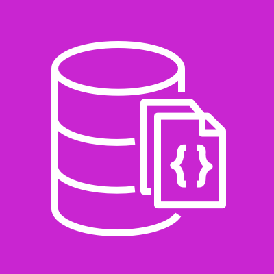
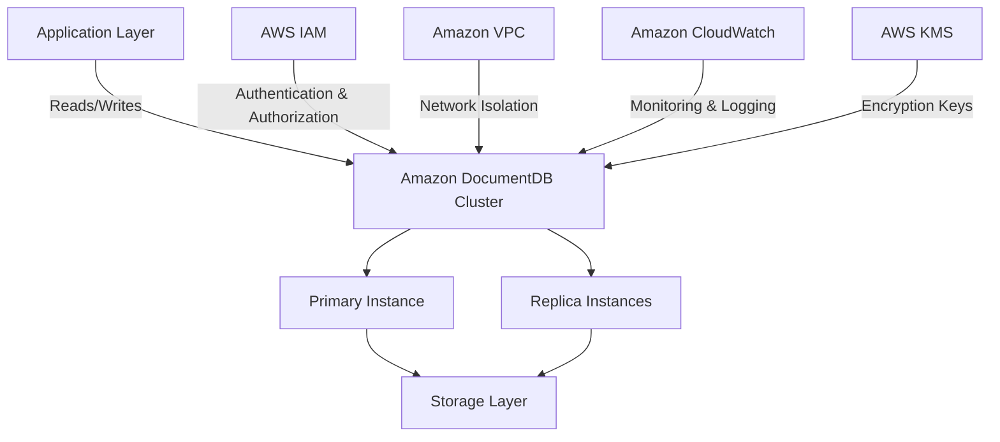
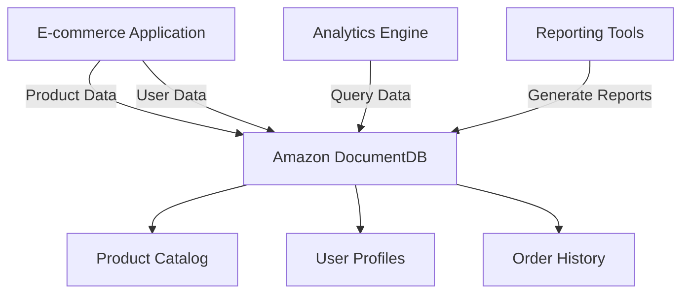
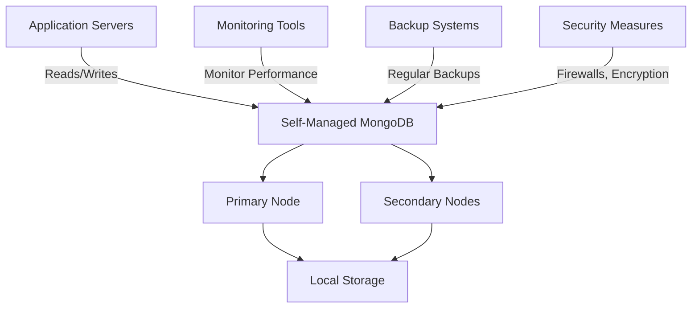

# Document DB

## Amazon DocumentDB: A Comprehensive Overview

### 1. 🌟 Overview

Amazon DocumentDB is a fully managed, scalable, and highly available document database service offered by AWS. It is designed to be compatible with MongoDB, a popular NoSQL database, allowing users to store, query, and index JSON data efficiently. DocumentDB is engineered to provide the scalability, durability, and performance needed for modern applications that deal with semi-structured data.

<figure><figcaption></figcaption></figure>

#### 🤖 Innovation Spotlight

Amazon DocumentDB has recently introduced several enhancements to improve performance and integration capabilities. For instance, it now supports MongoDB 4.0 compatibility, which includes features like array updates, multi-document ACID transactions, and improved aggregation pipelines.

### 2. ⚡ Problem Statement

**Real-World Scenario:** An e-commerce platform needs to manage vast amounts of product information, user profiles, and order histories efficiently. The platform requires a database that can handle semi-structured data with high scalability to accommodate growth and seasonal spikes in traffic.

**Industries/Applications:**

* **E-commerce:** Managing product catalogs, customer profiles, and order data.
* **Gaming:** Storing player profiles, game states, and in-game transactions.
* **IoT:** Handling data from various sensors and devices with varying data structures.

### 2.1 🤝 Business Use Cases

Amazon DocumentDB is particularly useful for:

* **Content Management Systems (CMS):** Storing and managing various types of content and metadata.
* **User Profile Management:** Handling diverse user information and preferences.
* **Catalog Management:** Managing large inventories with varied attributes.
* **Real-time Big Data Analytics:** Processing and analyzing large volumes of semi-structured data in real time.

### 3. 🔥 Core Principles

Amazon DocumentDB's core principles revolve around its document data model, compatibility with MongoDB, scalability, and managed service capabilities. Key concepts include:

* **Document Data Model:** Data is stored in JSON-like documents, which allows for flexible schemas.
* **Query Language:** Uses MongoDB-compatible query language for querying and aggregating data.
* **Scalability:** Automatically scales storage and compute resources to meet application demands.
* **Managed Service:** AWS manages the underlying infrastructure, including provisioning, patching, and backups.

Key Resource Terms:

* **Collections:** A grouping of MongoDB documents, analogous to tables in relational databases.
* **Indexes:** Data structures that improve the speed of data retrieval operations on a document database.
* **Instances:** Individual database servers within a cluster.
* **Shards:** Horizontal partitions of data in a database or search engine.

### 4. 📋 Pre-Requirements

To implement Amazon DocumentDB, you need several AWS services and tools:

* **AWS Identity and Access Management (IAM):** For managing access to AWS services securely.
* **Amazon Virtual Private Cloud (VPC):** To isolate your DocumentDB cluster within a private network.
* **AWS CloudFormation:** For defining and provisioning your infrastructure as code.
* **MongoDB Shell and Drivers:** For connecting to and interacting with your DocumentDB cluster.
* **Amazon CloudWatch:** For monitoring and logging.
* **AWS Key Management Service (KMS):** For managing encryption keys.

### 5. 👣 Implementation Steps

1. **Create a DocumentDB Cluster:**
   * Log in to the AWS Management Console.
   * Navigate to the Amazon DocumentDB service and click on "Create Cluster."
   * Specify cluster details like name, instance class, and number of instances.
2. **Configure Network & Security:**
   * Set up a VPC to host your DocumentDB cluster.
   * Configure security groups to control inbound and outbound traffic.
   * Set up IAM roles and policies to manage access to the cluster.
3. **Set Up Database Instances:**
   * Define the number of instances and their specifications.
   * Configure storage settings, including allocated storage and auto-scaling policies.
4. **Configure Database Settings:**
   * Define initial database configurations, such as parameters for memory and performance tuning.
   * Set up databases and collections according to your application requirements.
5. **Connect to the Database:**
   * Use the MongoDB shell or drivers to connect to your DocumentDB cluster.
   * Implement connection pooling in your application for efficient database connections.
6. **Monitor and Maintain:**
   * Use Amazon CloudWatch to set up monitoring for performance metrics.
   * Schedule regular backups and maintenance windows.

### 6. 🗺️ Data Flow Diagram

Here is a Mermaid diagram illustrating the architecture of Amazon DocumentDB:

The second Mermaid diagram below illustrates a specific use case of an e-commerce platform using Amazon DocumentDB:

### 7. 🔒 Security Measures

To secure your Amazon DocumentDB cluster, follow these best practices:

* **Encryption:** Enable encryption at rest and in transit. Use AWS KMS to manage encryption keys.
* **IAM Roles and Policies:** Apply the principle of least privilege to manage access to your cluster.
* **VPC and Security Groups:** Isolate your cluster within a VPC and configure security groups to restrict traffic.
* **Backup and Recovery:** Implement regular backups and test recovery procedures to ensure data resilience.
* **Monitoring and Logging:** Use Amazon CloudWatch to monitor performance and set up alerts for suspicious activities.

### 8. 🏢 Integration with Other AWS Services

Amazon DocumentDB integrates seamlessly with various AWS services to enhance its functionality:

* **AWS Lambda:** For serverless execution of code in response to database events.
* **Amazon S3:** For data backup and archival.
* **AWS Glue:** For ETL processes and data integration.
* **Amazon QuickSight:** For business intelligence and data visualization.
* **AWS Secrets Manager:** For managing database credentials securely.

These integrations allow for building comprehensive solutions leveraging DocumentDB as the core database.

### 9. ⚖️ When to Use and When Not to Use

#### ✅ When to Use

Amazon DocumentDB is ideal for:

* Applications requiring a flexible schema due to evolving data structures.
* High scalability needs, such as handling large volumes of data with varying query patterns.
* Use cases that benefit from MongoDB compatibility and need managed services to reduce operational overhead.
* Real-time applications that require low-latency access to semi-structured data.

#### ❌ When Not to Use

Amazon DocumentDB might not be suitable for:

* Applications requiring complex transactions or ACID compliance across multiple documents.
* Use cases where SQL-based queries are predominant and relational database features are needed.
* Scenarios with very limited budgets, as managed services can be more expensive than self-managed databases for small-scale applications.

### 10. 💰 Costing Calculation

Amazon DocumentDB pricing is based on several factors:

* **Instance Hours:** Costs depend on the number and size of instances in the cluster.
* **Storage:** Charges are based on the amount of data stored and I/O operations performed.
* **Data Transfer:** Costs for data transferred in and out of the cluster.

**Example Cost Calculation:**

Suppose you have a cluster with 2 instances of type `db.r5.large` (priced at $0.20 per hour per instance) and 100 GB of storage (priced at $0.10 per GB per month).

* **Instance Cost:** 2 instances \* $0.20/hour \* 730 hours/month = $292/month
* **Storage Cost:** 100 GB \* $0.10/GB/month = $10/month
* **Total Estimated Monthly Cost:** $302/month

_Note: Prices may vary by region and are subject to change. Always refer to the latest AWS pricing for accurate calculations._

### 11. 🧩 Alternative Services

Here’s a comparison table of Amazon DocumentDB with alternative services:

| Feature/Service         | Amazon DocumentDB | MongoDB Atlas | Azure Cosmos DB | Google Cloud Firestore |
| ----------------------- | ----------------- | ------------- | --------------- | ---------------------- |
| **Managed Service**     | Yes               | Yes           | Yes             | Yes                    |
| **Compatibility**       | MongoDB           | MongoDB       | Multiple APIs   | Firestore API          |
| **Scalability**         | Automatic         | Manual/Auto   | Automatic       | Automatic              |
| **Pricing Model**       | Pay-as-you-go     | Tiered        | Pay-as-you-go   | Pay-as-you-go          |
| **Global Distribution** | Limited           | Yes           | Yes             | Yes                    |
| **Integration**         | AWS Services      | Multi-cloud   | Azure Services  | GCP Services           |

Mermaid Diagram for an on-premise alternative (e.g., self-managed MongoDB):

### 12. ✅ Benefits

Amazon DocumentDB offers several advantages:

* **Scalability:** Easily scales with your application needs without downtime.
* **Performance:** Optimized for low-latency access to semi-structured data.
* **Managed Service:** Reduces operational overhead with automated backups, patching, and monitoring.
* **MongoDB Compatibility:** Simplifies migration and integration for applications already using MongoDB.
* **Security and Compliance:** Built-in security features and compliance certifications to meet regulatory requirements.

### 13. 🏢 Enterprise Adoption

Amazon DocumentDB is widely adopted by enterprises for its ability to handle large-scale, mission-critical workloads. It supports enterprise-grade features like:

* **Multi-Region Replication:** For disaster recovery and global data distribution.
* **Advanced Monitoring and Alerting:** Through integration with Amazon CloudWatch and AWS CloudTrail.
* **Enterprise Support:** Access to AWS support plans for mission-critical applications.

### 14. 📝 Summary

Amazon DocumentDB is a powerful, scalable, and fully managed document database service that is compatible with MongoDB. It is ideal for applications requiring flexible schemas, high scalability, and low-latency access to semi-structured data.

* **Top 5 Points to Remember:**
  1. Fully managed and scalable document database.
  2. Compatible with MongoDB, simplifying migration and integration.
  3. Offers robust security features and compliance certifications.
  4. Seamless integration with other AWS services enhances functionality.
  5. Cost-effective for applications with variable workloads due to its pay-as-you-go pricing model.

In short, Amazon DocumentDB is all about providing a managed, scalable, and high-performance database solution for modern applications dealing with semi-structured data. It simplifies database management and allows developers to focus on building applications rather than managing infrastructure.

### 15. 🔗 Related Topics

* **Amazon DynamoDB:** A NoSQL database for applications needing low-latency data access.
* **Amazon RDS:** For applications requiring relational database features.
* **MongoDB Best Practices:** Guidelines for optimizing MongoDB performance and security.
* **AWS Database Migration Service:** For migrating databases to AWS with minimal downtime.
