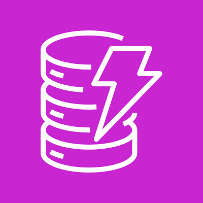
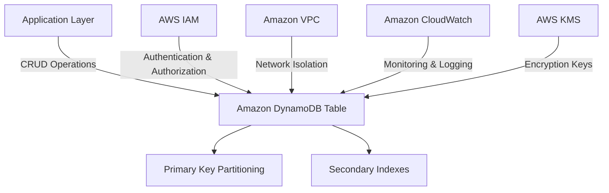
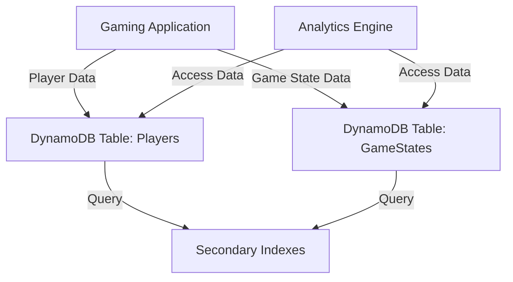
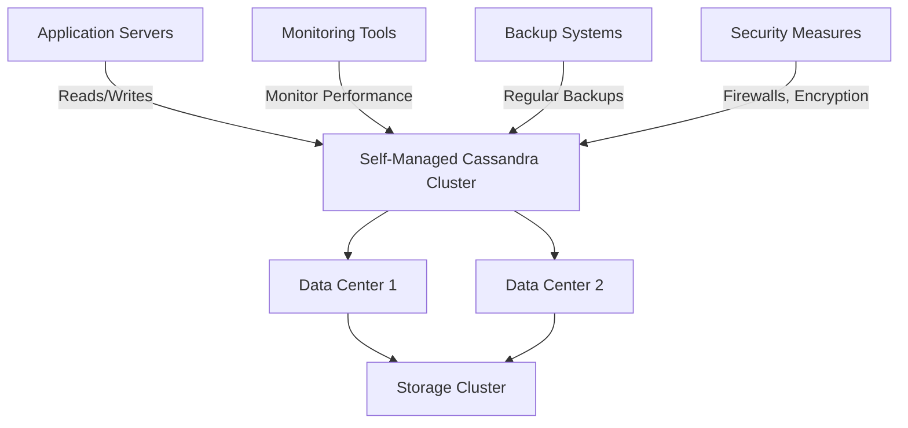

# DynamoDB

## Amazon DynamoDB: A Comprehensive Overview

### 1. 🌟 Overview

Amazon DynamoDB is a fully managed proprietary NoSQL database service that supports key-value and document data structures and is offered by AWS. It is designed to provide low-latency performance at any scale, making it ideal for web, mobile, gaming, ad tech, IoT, and other applications that need consistent, single-digit millisecond latency.

<figure><figcaption></figcaption></figure>

#### 🤖 Innovation Spotlight

Amazon DynamoDB has recently introduced innovations such as **on-demand capacity mode**, which automatically scales read and write capacities based on the application's traffic without manual intervention. Additionally, **DynamoDB Streams** and **Triggers** have been enhanced to facilitate real-time data processing and automated workflows.

### 2. ⚡ Problem Statement

**Real-World Scenario:** A gaming platform needs to manage millions of user profiles, game states, and in-game transactions with low latency and high availability. The platform requires a database solution capable of scaling seamlessly to accommodate unpredictable traffic spikes during game releases or special events.

**Industries/Applications:**

* **Gaming:** Storing player profiles, game states, and session information.
* **IoT:** Managing data from various sensors and devices in real time.
* **Mobile Applications:** Handling user data and application states across millions of devices.
* **Ad Tech:** Serving targeted ads and tracking user interactions in real time.

### 2.1 🤝 Business Use Cases

Amazon DynamoDB is particularly beneficial for:

* **High-Velocity Data Management:** Scaling to support millions of requests per second.
* **Real-Time Processing:** Enabling real-time analytics and decision-making.
* **Serverless Applications:** Supporting applications that require flexible scaling and pay-per-request pricing.

### 3. 🔥 Core Principles

Amazon DynamoDB operates on several core principles that enhance its performance and scalability:

* **Data Model:** Supports key-value and document data structures, allowing for flexible schema design.
* **Partitioning:** Automatically distributes data and traffic across servers using partition keys.
* **Indexing:** Provides primary keys and also supports secondary indexes to enhance query flexibility.
* **Scalability and Performance:** Scales horizontally by distributing data across multiple partitions and automatically adjusting throughput capacity.

Key Resource Terms:

* **Tables:** Collections of items, analogous to tables in relational databases.
* **Items:** Individual records in a table.
* **Attributes:** Data elements associated with items, analogous to columns in relational databases.
* **Primary Key:** A unique identifier for items within a table, consisting of either a partition key or a composite key (partition key + sort key).
* **Secondary Indexes:** Allow querying on non-primary key attributes.

### 4. 📋 Pre-Requirements

To implement Amazon DynamoDB, you need the following AWS services and tools:

* **AWS Identity and Access Management (IAM):** For managing access to AWS services securely.
* **AWS CloudFormation:** For defining and provisioning infrastructure as code.
* **AWS SDKs:** For integrating DynamoDB with your applications through various programming languages.
* **Amazon CloudWatch:** For monitoring and logging DynamoDB activities.

### 5. 👣 Implementation Steps

1. **Create a DynamoDB Table:**
   * Log in to the AWS Management Console and navigate to the DynamoDB dashboard.
   * Click on "Create table" and specify the table name, primary key, and partition key.
   * Configure settings such as read/write capacity mode (provisioned or on-demand).
2. **Configure Security:**
   * Use IAM to create roles and policies that define the permissions for accessing DynamoDB resources.
   * Set up encryption at rest using AWS Key Management Service (KMS).
   * Enable encryption in transit using SSL/TLS.
3. **Set Up Indexes:**
   * Define local secondary indexes (LSIs) or global secondary indexes (GSIs) based on query patterns.
   * Configure indexes during table creation or add them later as needed.
4. **Integrate with Applications:**
   * Use AWS SDKs to interact with DynamoDB from your application code.
   * Implement error handling and retry logic to manage throttling and faults.
5. **Monitor and Maintain:**
   * Use Amazon CloudWatch to monitor DynamoDB metrics such as throughput, latency, and errors.
   * Set up alerts to notify you of unusual activity or performance issues.

### 6. 🗺️ Data Flow Diagram

Here is a Mermaid diagram illustrating the architecture of Amazon DynamoDB:

The second Mermaid diagram below illustrates a specific use case of a gaming platform using Amazon DynamoDB:

### 7. 🔒 Security Measures

To secure your Amazon DynamoDB, follow these best practices:

* **Encryption:** Enable encryption at rest using AWS KMS and ensure encryption in transit with SSL/TLS.
* **IAM Policies:** Apply the principle of least privilege to restrict access to DynamoDB resources.
* **VPC Endpoints:** Use VPC endpoints to allow private connectivity between your VPC and DynamoDB, enhancing network security.
* **Backup and Recovery:** Utilize DynamoDB’s point-in-time recovery feature to back up data and protect against accidental writes or deletes.
* **Monitoring and Logging:** Use Amazon CloudWatch and AWS CloudTrail to monitor and log all access and changes to DynamoDB tables for auditing and security analysis.

### 8. 🤝 Integration with Other AWS Services

Amazon DynamoDB integrates seamlessly with various AWS services to enhance its functionality:

* **AWS Lambda:** For executing serverless functions in response to DynamoDB events or triggers.
* **Amazon S3:** For exporting DynamoDB data to S3 for backup or big data analytics.
* **AWS Glue:** For ETL processes and integrating DynamoDB with data lakes.
* **Amazon Kinesis:** For streaming DynamoDB changes to Kinesis data streams for real-time processing.
* **Amazon Aurora:** For integrating with relational databases for hybrid data solutions.

These integrations allow for building comprehensive solutions leveraging DynamoDB as the core database.

### 9. ⚖️ When to Use and When Not to Use

#### ✅ When to Use

Amazon DynamoDB is ideal for:

* Applications requiring low-latency data access even at massive scales.
* Use cases needing flexible schema design to accommodate evolving data structures.
* Scenarios where serverless architecture and automatic scaling are beneficial to handle unpredictable workloads.

#### ❌ When Not to Use

Amazon DynamoDB might not be suitable for:

* Applications needing complex transactions and relational queries (JOINs, complex aggregations, etc.).
* Situations requiring structured schema and ACID compliance across multiple operations or tables.
* Scenarios with predictable workloads where cost-efficiency might favor traditional relational databases.

### 10. 💰 Costing Calculation

Amazon DynamoDB pricing is structured around several components:

* **Read/Write Throughput:** Costs depend on the number of read and write capacity units (RCUs/WCUs) consumed.
* **Storage:** Charges based on the amount of data stored per GB per month.
* **Data Transfer:** Costs for data transferred in and out of DynamoDB.

**Example Cost Calculation:**

Suppose you have a table with:

* 100 write capacity units (WCUs) and 200 read capacity units (RCUs) provisioned.
* Storage of 100 GB.
* Data transfer of 10 GB out per month.

Assuming prices:

* Provisioned WCU: $0.00065 per hour per WCU
* Provisioned RCU: $0.00013 per hour per RCU
* Storage: $0.25 per GB per month
* Data transfer out: $0.09 per GB

**Monthly Costs:**

* Write Capacity Cost: 100 WCUs × $0.00065 × 730 hours ≈ $47.45
* Read Capacity Cost: 200 RCUs × $0.00013 × 730 hours ≈ $18.98
* Storage Cost: 100 GB × $0.25/GB ≈ $25
* Data Transfer Cost: 10 GB × $0.09/GB = $0.90

**Total Estimated Monthly Cost:** $47.45 + $18.98 + $25 + $0.90 = $92.33

_Note: Prices may vary by region and are subject to change. Always refer to the latest AWS pricing for accurate calculations._

### 11. 🧩 Alternative Services

Here’s a comparison table of Amazon DynamoDB with alternative services:

| Feature/Service     | Amazon DynamoDB    | MongoDB Atlas | Azure Cosmos DB | Google Cloud Firestore | Self-Managed Cassandra |
| ------------------- | ------------------ | ------------- | --------------- | ---------------------- | ---------------------- |
| **Managed Service** | Yes                | Yes           | Yes             | Yes                    | No                     |
| **Data Model**      | Key-Value/Document | Document      | Multi-model     | Document               | Wide-column            |
| **Scalability**     | Automatic          | Manual/Auto   | Automatic       | Automatic              | Manual                 |
| **Pricing Model**   | Pay-as-you-go      | Tiered        | Pay-as-you-go   | Pay-as-you-go          | Capital Expenditure    |
| **Integration**     | AWS Services       | Multi-cloud   | Azure Services  | GCP Services           | Custom                 |

Mermaid Diagram for an on-premise alternative (e.g., self-managed Cassandra):

### 12. ✅ Benefits

Amazon DynamoDB offers several advantages:

* **Scalability:** Easily scales to handle massive amounts of data and traffic without manual intervention.
* **Performance:** Provides consistent, single-digit millisecond latency for read and write operations.
* **Managed Service:** Reduces operational overhead with automated provisioning, scaling, and maintenance.
* **Flexibility:** Supports flexible schema design and integrates seamlessly with other AWS services.
* **Security and Compliance:** Built-in security features and compliance certifications ensure data protection and regulatory adherence.

### 13. 🏢 Enterprise Adoption

Amazon DynamoDB is widely adopted by enterprises for its ability to handle large-scale, mission-critical applications. It supports enterprise-grade features like:

* **Global Tables:** For multi-region replication and disaster recovery.
* **Advanced Monitoring and Alerting:** Through integration with Amazon CloudWatch and AWS CloudTrail.
* **Enterprise Support:** Access to AWS support plans for mission-critical applications.

### 14. 📝 Summary

Amazon DynamoDB is a fully managed NoSQL database service that offers scalability, low-latency performance, and seamless integration with other AWS services.

* **Top 5 Points to Remember:**
  1. Fully managed NoSQL database service with low-latency performance.
  2. Supports key-value and document data models with flexible schema design.
  3. Scales automatically to handle massive workloads.
  4. Integrates seamlessly with other AWS services for comprehensive solutions.
  5. Cost-effective for variable workloads with its pay-as-you-go pricing model.

In short, Amazon DynamoDB is all about providing a scalable, high-performance database solution for applications requiring flexible data structures and low-latency access, with minimal operational overhead.

### 15. 🔗 Related Topics

* **Amazon RDS:** For managing relational databases on AWS.
* **Amazon Aurora:** For applications needing relational database features with enhanced performance and availability.
* **NoSQL Database Design:** Guidelines for designing scalable and efficient NoSQL databases.
* **AWS Database Migration Service:** For migrating databases to AWS with minimal downtime.
