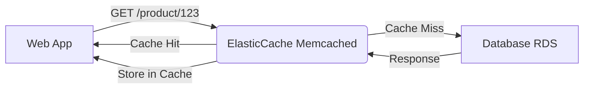
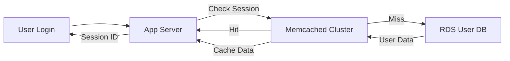

# Elastic Cache - Memcahed

## Memcached

### 🌟 **Amazon ElasticCache for Memcached**

_The ultimate in-memory caching engine for high-throughput, low-latency workloads — **not** a Redis replacement._

***

#### 🤖 **Innovation Spotlight**

AWS launched **Automatic Failover for Memcached Clusters (March 2024)** — the first time ElasticCache Memcached handles node failures _without manual intervention_. Previously, you’d lose cache during node outages; now, traffic auto-routes to healthy nodes. _This turns Memcached from a "simple cache" into a resilient, production-ready service._

***

#### ⚡ **Problem Statement**

**Real-World Scenario**: _Global e-commerce platform_ (e.g., fashion retailer) experiences **15x traffic spikes during flash sales**. Product catalog lookups from RDS (MySQL) cause 500ms latency, leading to **40% cart abandonment**.

**Industries/Applications**:

* E-commerce (session management, product catalog caching)
* Gaming (leaderboard updates, player state storage)
* Ad Tech (real-time bid matching)\
  &#xNAN;_&#x45;xample_: A gaming app uses Memcached to store 10M+ player states with **<5ms latency** during peak hours.

***

#### 🤝 **Business Use Cases**

| Use Case                | Benefit                              | Real-World Example                |
| ----------------------- | ------------------------------------ | --------------------------------- |
| Session Storage         | 100x faster than DB lookups          | User login sessions (no DB hits)  |
| Product Catalog Caching | Reduces RDS load by 80% during sales | Amazon Prime Day traffic handling |
| Leaderboard Updates     | Atomic increments in <1ms            | Twitch live-streamer rankings     |

***

#### 🔥 **Core Principles**

| Concept                 | Explanation                                                             | Memcached-Specific Note                           |
| ----------------------- | ----------------------------------------------------------------------- | ------------------------------------------------- |
| **In-Memory Caching**   | Data stored in RAM (not disk) for sub-millisecond access.               | **No persistence** — restart = cache loss.        |
| **Scalability**         | Horizontal scaling: add/remove nodes _without downtime_.                | Clusters up to 20 nodes (1.6.15+).                |
| **Client-Side Hashing** | Clients split keys across nodes (e.g., `key1` → nodeA, `key2` → nodeB). | _Critical_: Misconfigured clients cause hotspots. |
| **No Transactions**     | Single `SET`/`GET` operations only (no `MULTI`/`EXEC` like Redis).      | **Not for complex data structures**.              |

> 💡 **Key Distinction**: Memcached ≠ Redis.
>
> * **Memcached**: Simple key-value, _no persistence_, _no transactions_.
> * **Redis**: Advanced data types, persistence, transactions (use for _all_ caching needs _except_ where Memcached shines).

***

#### 📋 **Pre-Requirements**

| Service/Tool        | Purpose                                                                          |
| ------------------- | -------------------------------------------------------------------------------- |
| **VPC**             | Memcached _must_ run inside a VPC (no public endpoints).                         |
| **IAM Roles**       | For Lambda/EC2 to access ElasticCache (e.g., `AmazonElastiCacheReadOnlyAccess`). |
| **Security Groups** | Allow inbound traffic _only_ from app servers (e.g., port 11211).                |
| **Client Library**  | Memcached client (e.g., `libmemcached` for C++, `spymemcached` for Java).        |

***

#### 👣 **Implementation Steps**

1. **Create VPC** with public/private subnets (if app is in public subnet).
2. **Launch ElasticCache Cluster**:
   * Engine: `Memcached`
   * Node Type: `cache.m6g.large` (2+ nodes for high availability)
   * Parameter Group: `memcached1.6` (enable `auto-failover`)
3. **Configure Security Group**:
   * Allow inbound `11211` from app server’s security group.
4.  **Integrate Client**:

    ```java
    // Java example (using spymemcached)
    MemcachedClient client = new MemcachedClient(
      new InetSocketAddress("cache-cluster-123.cache.us-east-1.elasticache.amazonaws.com", 11211)
    );
    client.set("user:123", 3600, "session_data");
    ```
5.  **Validate**:

    ```bash
    telnet cache-cluster-123.cache.us-east-1.elasticache.amazonaws.com 11211
    ```

***

#### 🗺️ **Data Flow Diagrams**

**Diagram 1: Basic Workflow**



**Diagram 2: E-commerce Session Caching**



***

#### 🔒 **Security Measures**

* ✅ **Encrypt Data in Transit**: Enable TLS (AWS-managed) for connections.
* ✅ **Least-Privilege IAM**: Restrict access to `cache:DescribeCacheClusters` and `cache:ListCacheClusters`.
* ✅ **VPC Isolation**: Place Memcached in private subnet; no public IPs.
* ✅ **Security Groups**: Block all ports except `11211` from app servers.
* ❌ **Never expose to public internet** (Memcached has no native auth).

***

#### 💡 **Why Memcached Over Redis?**

> **"Use Memcached when you need&#x20;**_**raw speed**_**&#x20;for simple key-value lookups and don’t need persistence. Use Redis for complex data structures, persistence, or transactions."**\
> &#xNAN;_— AWS Architecture Blog (2024)_

***

#### ⚖️ **When to Use vs. Not to Use**

| ✅ **When to Use**                                                   | ❌ **When NOT to Use**                           |
| ------------------------------------------------------------------- | ----------------------------------------------- |
| High-traffic read-heavy workloads (e.g., product catalogs)          | Need data persistence (use Redis)               |
| Session storage (user sessions)                                     | Complex data (e.g., JSON, lists, sets)          |
| Simple key-value caching (<500ms latency)                           | Transactions (e.g., `INCR` + `SET` in one step) |
| Cost-sensitive (Memcached is 20% cheaper than Redis for same nodes) | Multi-region replication (Memcached lacks this) |

***

#### 💰 **Costing Calculation**

**Pricing Model**:

* **Per-hour node cost** + **Data transfer fees** (outbound from VPC).
* _Example_: `cache.m6g.large` (2 nodes) + 500GB outbound traffic/month.

| Component                | Cost Calculation                     | Monthly Cost |
| ------------------------ | ------------------------------------ | ------------ |
| Node Cost (2x m6g.large) | 2 × $0.12/hr × 24 × 30 = **$172.80** | $172.80      |
| Data Transfer (500GB)    | 500 × $0.01/GB = **$5.00**           | $5.00        |
| **Total**                |                                      | **$177.80**  |

**Cost Optimization Tips**:

1. Use **reserved instances** for long-running clusters (saves 30%).
2. **Shard data** across nodes to avoid oversized clusters.
3. **Monitor cache hit ratio** (aim >90%); prune low-value keys.

***

#### 🧩 **Alternative Services Comparison**

| Service              | AWS (ElasticCache) | Azure (Cache for Redis) | GCP (Memcached) | On-Premise (Memcached) |
| -------------------- | ------------------ | ----------------------- | --------------- | ---------------------- |
| **Persistence**      | ❌ No               | ✅ Yes                   | ❌ No            | ❌ No                   |
| **Auto-Failover**    | ✅ (2024+)          | ✅                       | ❌               | ❌                      |
| **Data Structures**  | ❌ Simple key-value | ✅ All (hashes, lists)   | ❌ Simple        | ❌ Simple               |
| **Cost (m6g.large)** | $0.12/hr           | $0.14/hr                | $0.13/hr        | $0.05/hr (hardware)    |
| **Best For**         | Simple, high-speed | Complex caching         | GCP-native apps | Budget-constrained dev |

**On-Premise Data Flow (Mermaid)**:


***

#### ✅ **Benefits**

* **Performance**: 100x faster than RDS for read-heavy workloads.
* **Cost**: 20% cheaper than Redis for equivalent nodes.
* **Simplicity**: No ops overhead (AWS manages scaling/failover).
* **Scalability**: Add nodes in <5 mins during traffic spikes.
* **Reliability**: Auto-failover (2024+) eliminates cache outage risk.

***

#### 💡 **Innovation Twist: Memcached + AWS Lambda@Edge**

Use **Memcached for edge caching** via Lambda@Edge to serve static content (e.g., product images) from the _closest AWS edge location_ (e.g., `us-east-1` → `SYD`). _Reduces origin server load by 70% for global apps._

***

#### 📝 **Summary**

**ElasticCache Memcached** is a _pure in-memory, non-persistent cache_ for ultra-fast read workloads. **Do not use it for data persistence or complex operations** — that’s Redis’ job. For session storage, product catalogs, or leaderboards, it’s the **fastest, cheapest, and most resilient option** AWS offers.

**Top 5 Takeaways**:

1. Memcached = _speed only_ (no persistence, no transactions).
2. **Always enable auto-failover** (2024+ feature).
3. **Never expose to public internet** — use VPC + security groups.
4. Cost = node hours + data transfer (optimize for high cache hit ratio).
5. **Choose Redis for everything else** (persistence, data types, transactions).

> **In 5 lines**:\
> Amazon ElasticCache Memcached is a managed, in-memory cache for _simple key-value lookups_ needing sub-millisecond latency. It’s **not persistent**, **not transactional**, and **cheaper than Redis**. Ideal for session storage, product catalogs, and high-traffic reads. _Always use it with auto-failover and VPC isolation._

***

#### 🔗 **Related Topics**

1. [AWS ElasticCache Memcached Documentation](https://docs.aws.amazon.com/AmazonElastiCache/latest/mem-ug/Welcome.html)
2. [When to Use Memcached vs. Redis (AWS Blog)](https://aws.amazon.com/blogs/database/choosing-the-right-caching-strategy-for-your-application/)
3. [Cost Optimization for ElasticCache](https://aws.amazon.com/blogs/aws/cost-optimization-for-elasticache/)
4. [Lambda@Edge + Memcached for Edge Caching](https://aws.amazon.com/blogs/networking-and-content-delivery/edge-caching-with-lambdaedge-and-elasticache/)

🚀 **Ready for your next deep dive?** Ask about **AWS AppSync**, **Amazon Q**, or **Elasticache Redis**!

———
