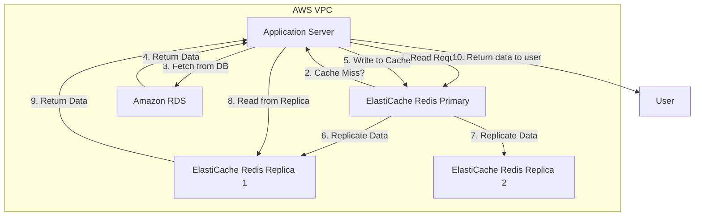
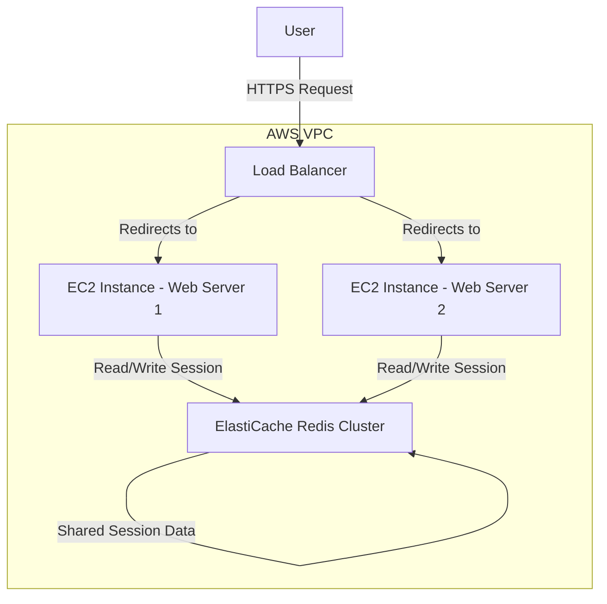
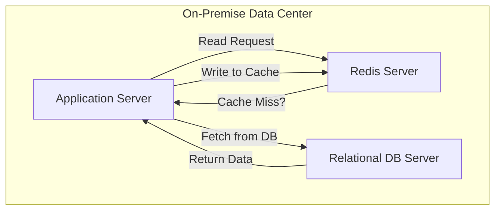

# Elastic Cache - Redis

## Amazon ElasticCache for Redis

### 🌟 Overview: Amazon ElastiCache for Redis 🚀

Amazon ElastiCache for Redis is a fully managed, in-memory data store service. It is compatible with the open-source Redis (Remote Dictionary Server) software, providing a high-performance, scalable, and cost-effective caching solution. Unlike a self-managed Redis deployment, ElastiCache handles the heavy lifting of provisioning, patching, backup, recovery, and scaling, allowing developers and architects to focus on building applications rather than managing infrastructure. Redis is more than just a simple key-value store; it's a data structure server. This means the values associated with keys can be complex data types like strings, hashes, lists, sets, sorted sets, bitmaps, and HyperLogLogs. This versatility makes it ideal for a wide range of use cases beyond simple caching.

#### 🤖 Innovation Spotlight: ElastiCache Serverless

The latest and most significant innovation is Amazon ElastiCache Serverless. This feature radically simplifies the management of ElastiCache. With ElastiCache Serverless, you no longer need to provision, plan, and manage cluster size, instance types, or scaling. The service automatically and instantly scales your cache to accommodate fluctuating application traffic and data storage needs. You simply create a cache and start using it, paying only for the data stored and the compute used, measured in Gigabyte-Hours (GB-hrs). This eliminates the need for manual scaling policies and provides a truly "hands-off" caching solution, making it even more accessible for a wider range of applications and teams.

### ⚡ Problem Statement: The Database Bottleneck

A common challenge in modern web and mobile applications is the performance bottleneck caused by the database. As user traffic grows, the number of read requests to the backend database increases, leading to higher latency, increased load on the database, and potential performance degradation or even service outages. Disk-based databases, by nature, are slower than in-memory data stores. Example Scenario: An e-commerce website experiences a massive traffic spike during a flash sale. Thousands of users are simultaneously browsing product listings, leading to a flood of read requests to the relational database (e.g., Amazon RDS). The database struggles to keep up, leading to slow page load times and frustrated customers, potentially resulting in lost sales.

#### Industries/Applications where it can be applied:

* E-commerce: Caching product catalogs, user sessions, and shopping cart data.
* Gaming: Storing player session data, real-time leaderboards, and game state.
* Social Media: Caching user timelines, live feeds, and real-time comment streams.
* Ad-Tech: Caching user profiles for real-time bidding and ad personalization.
* Financial Services: Caching frequently accessed financial data, such as stock quotes.
* Real-time Analytics: Storing real-time metrics for dashboards and reporting.

### 🤝 Business Use Cases

* Database Caching: Cache the results of frequently executed database queries to reduce the load on your primary database and improve application response times.
* Session Store: Store and manage user session data for web applications. This is especially useful in a microservices architecture where multiple services need to access shared session data.
* Real-Time Leaderboards: Leverage Redis's sorted sets to build and maintain real-time, dynamic leaderboards for gaming or social applications.
* Message Broker/Pub/Sub: Use the publish/subscribe (Pub/Sub) feature of Redis to facilitate real-time communication between different parts of a distributed system, for example, for chat applications or real-time event processing.
* Geospatial Indexing: Use Redis's built-in geospatial data structures and commands to store and query location-based data.

### 🔥 Core Principles

ElastiCache for Redis operates on several core principles that make it a powerful caching solution:

* In-Memory Speed: Data is stored in RAM, providing microsecond-level latency for read and write operations, significantly faster than disk-based databases.
* Scalability: ElastiCache offers both horizontal and vertical scaling.
  * Horizontal Scaling (Sharding): Using Redis Cluster mode, you can distribute your data across multiple nodes (shards) to increase the total memory capacity and throughput.
  * Vertical Scaling: You can scale up or down to a larger or smaller instance type to adjust the compute and memory resources of your nodes.
* High Availability & Durability:
  * Replication Groups: You can create a replication group with a primary node and multiple read replicas. This setup provides high availability with automatic failover, as a replica can be promoted to a primary if the original primary node fails.
  * Multi-AZ Deployment: Deploying replicas across different Availability Zones (AZs) protects against an AZ-level failure.
  * Persistence: Redis offers persistence mechanisms (RDB snapshots and AOF logs) to save the dataset to disk, ensuring data durability in case of a crash or reboot.

#### Key Resources & Terms:

* Cache Cluster: A logical grouping of one or more cache nodes.
* Cache Node: The smallest building block of an ElastiCache cluster. Each node is an instance type with a specific amount of memory and compute.
* Replication Group: A collection of one primary node and up to five read replicas. It provides high availability and read scalability.
* Shards (Cluster Mode): A logical partition of your data. In Redis Cluster mode, a cluster is composed of multiple shards, each being a replication group.
* Engine: The underlying in-memory data store software (Redis OSS or Memcached). This topic focuses on Redis.
* Node Type: The EC2 instance type for your cache nodes (e.g., cache.t4g.medium, cache.r7g.large).
* Security Groups: Control network access to your ElastiCache cluster.

### 📋 Pre-Requirements

* An AWS Account: With necessary IAM permissions to create ElastiCache clusters, VPCs, and EC2 instances.
* Amazon VPC: An existing Virtual Private Cloud (VPC) to launch the ElastiCache cluster into. The cluster must be launched in a VPC for security and network isolation.
* Subnet Group: A subnetwork group within the VPC where the ElastiCache nodes will be provisioned. It's recommended to span multiple subnets across different Availability Zones for high availability.
* Security Group: A security group configured to allow inbound traffic on the Redis port (default 6379) from your application's EC2 instances or Lambda functions.
* Application Code: Your application code needs to be modified to use a Redis client library (e.g., redis-py for Python, StackExchange.Redis for .NET) to interact with the ElastiCache cluster endpoint.

### 👣 Implementation Steps

Here is a simplified step-by-step guide for setting up a basic ElastiCache for Redis cluster with a replication group:

* Set up VPC and Security Group:
  * Navigate to the VPC console and ensure you have a VPC with at least two subnets in different Availability Zones.
  * Create a new Security Group for your ElastiCache cluster. Add an inbound rule to allow traffic on TCP port 6379 from the security group of your application's EC2 instances or Lambda functions.
* Create a Subnet Group:
  * In the ElastiCache console, go to "Subnet Groups."
  * Click "Create Subnet Group." Give it a name, description, and select the VPC and the subnets you prepared in the previous step.
* Launch the ElastiCache Redis Cluster:
  * In the ElastiCache console, go to "Redis."
  * Click "Create."
  * Choose the Redis engine.
  * For the "Location," select Amazon Cloud.
  * For "Engine Version Compatibility," choose a recent stable version (e.g., Redis 7.x).
  * Select the Redis cluster mode disabled for a single shard replication group or Redis cluster mode enabled for multiple shards.
  * Provide a unique "Redis cluster name."
  * Under "Replication," choose to create a "Replication group."
  * Configure the "Number of Replicas" (e.g., 2) for high availability. This will give you one primary and two read replicas.
  * Under "Node type," select an appropriate instance size (e.g., cache.t4g.medium).
  * Under "Connectivity," select the VPC and the Subnet Group you created.
  * Choose the Security Group you configured.
  * Review all other settings (e.g., backups, maintenance window, encryption) and click "Create."
* Update Application Code:
  * Once the cluster is in the "available" state, retrieve the primary endpoint from the ElastiCache console.
  * Update your application's configuration to use this primary endpoint for write operations and the reader endpoint for read operations (if applicable, for read replicas).
  * Implement your caching logic (e.g., cache-aside pattern) in your application.

### 🗺️ Data Flow Diagram

**Diagram 1: How Amazon ElastiCache for Redis Works (Read/Write)**

This diagram shows a typical cache-aside pattern, where the application checks the cache first before going to the database.

**Flow Description:**

* An application receives a request to read data.
* The application first checks the ElastiCache Redis primary node for the data.
* If the data is not found (cache miss), the application queries the backend database (Amazon RDS).
* The database returns the data.
* The application writes the fetched data to the Redis cache.
* The ElastiCache primary node automatically replicates the data to its read replicas.
* The application serves the data to the user.
* Subsequent read requests for the same data go directly to the ElastiCache primary or one of the replicas, which provides a fast response (cache hit).

**Diagram 2: ElastiCache as a Session Store**

This diagram illustrates how multiple web servers can share a single, distributed session store.

**Flow Description:**

* A user makes a request, which is routed by a Load Balancer to one of the web servers (e.g., EC2 Instance 1).
* The web server needs to access the user's session data and retrieves it from the central ElastiCache Redis cluster.
* The user's subsequent requests might be routed to a different web server (e.g., EC2 Instance 2).
* EC2 Instance 2 can seamlessly retrieve the same session data from the ElastiCache cluster, ensuring a consistent user experience across the fleet of web servers.

### 🔒 Security Measures

* VPC Isolation: Always launch your ElastiCache cluster inside a private subnet of a VPC. Do not expose it to the public internet.
* Security Groups: Use Security Groups to strictly control inbound and outbound traffic. Only allow traffic on the Redis port (6379) from trusted sources, such as your application's EC2 instances.
* IAM Roles: Use IAM roles and policies to control who can create, modify, and delete ElastiCache clusters. Follow the principle of least privilege.
* Encryption:
  * Encryption at Rest: Enable encryption at rest, which encrypts data stored on disk during backups. This is done automatically when you create a new cluster.
  * Encryption in Transit: Use Transport Layer Security (TLS) to encrypt all data in transit between your application and the ElastiCache cluster. This is a crucial security measure.
* Redis AUTH: For an extra layer of security, enable Redis AUTH to require a password for clients to connect.
* Network Access Control Lists (ACLs): Use VPC NACLs as a stateless firewall to control traffic at the subnet level.

### ⚖️ When to use and when not to use

**✅ When to use**

* High-Read Workloads: Your application has a high volume of read requests to the database, leading to performance bottlenecks.
* Real-time Applications: You need sub-millisecond latency for data access, such as for gaming, real-time analytics, or chat applications.
* Session Management: You need a centralized, scalable, and highly available session store for a multi-server or microservices application.
* Complex Data Structures: Your use case requires more than simple key-value pairs, such as sorted sets for leaderboards or hashes for user profiles.
* Message Queuing: You need a lightweight message broker for publish/subscribe patterns.

**❌ When not to use**

* Primary Database: ElastiCache is not a primary database. While it can be configured for data persistence, it's not a substitute for a durable, transactional database like Amazon RDS or DynamoDB.
* Small, Infrequent Workloads: For a simple website with very low and infrequent traffic, the cost and complexity of setting up and managing a cache might not be justified. You can often rely on the database's internal caching.
* Purely Write-Heavy Workloads: If your application is predominantly writing new data with very few reads, a cache won't provide significant value.
* Complex Querying: Redis is a key-value store, not a relational database. It is not suitable for complex joins or advanced SQL-like queries.

### 💰 Costing Calculation

ElastiCache costs are primarily based on:

* **Node Type and Size** : The EC2 instance type you choose for your cache nodes (e.g., cache.t4g.medium). Larger instances cost more.
* **Number of Nodes**: The number of primary nodes and replicas in your cluster.
* **Data Transfer**: Data transfer out of the AWS region. Data transfer within the same Availability Zone is free.
* **Backups**: Backup storage beyond the free allocation. Efficient way of handling this service:
* **Choose the right Node Type**: Start with smaller, burstable instance types (e.g., T4g) and scale up if needed. The R-family instances are memory-optimized and are often the best choice for production workloads.
* **Reserved Instances**: For predictable, long-term workloads, purchase Reserved Instances (1 or 3 years) to get a significant discount (up to 70%).
* **ElastiCache Serverless**: Use ElastiCache Serverless for highly variable or unpredictable workloads, as it automatically scales and you only pay for what you use, eliminating the need to over-provision.
* **Monitor and Tune**: Use Amazon CloudWatch to monitor key metrics like FreeableMemory and CPUUtilization. Adjust your cluster size (scaling out or up) based on these metrics to avoid over-provisioning and to ensure optimal performance.

**Sample Calculation (Example):**

* **Configuration**: One cache.r7g.large primary node and two cache.r7g.large replicas in a single region (e.g., N. Virginia).
* **Pricing**:
  * On-Demand: $0.165/hour per cache.r7g.large node.
* **Calculation**:
  * Total Nodes: 3 (1 primary + 2 replicas)
  * Cost per hour: 3 \* $0.165 = $0.495
  * Cost per month (730 hours): 0.495 \* 730 = $361.35
* **Note**: This is a basic calculation. It doesn't include data transfer, which is usually a small component, or backup costs. Using Reserved Instances would significantly lower this cost.

### 🧩 Alternative services in AWS/Azure/GCP/On-Premise

| Service                           | Provider         | Key Comparison/Difference                                                                                                                                                                                              |
| --------------------------------- | ---------------- | ---------------------------------------------------------------------------------------------------------------------------------------------------------------------------------------------------------------------- |
| Amazon DynamoDB Accelerator (DAX) | AWS              | A fully managed, in-memory cache for DynamoDB. It's purpose-built for DynamoDB and simplifies caching logic by being API-compatible.                                                                                   |
| Amazon ElastiCache for Memcached  | AWS              | A simpler, more basic key-value caching service. Lacks Redis's rich data structures, persistence, and Pub/Sub features. Ideal for basic object caching.                                                                |
| Azure Cache for Redis             | Azure            | A fully managed, co-branded Redis service from Microsoft. Offers similar features to AWS ElastiCache, including high availability, scaling, and integration with Azure services.                                       |
| Memorystore for Redis             | Google Cloud     | A fully managed Redis service on GCP. Provides high availability, scaling, and network security. Aligns with Google's cloud ecosystem.                                                                                 |
| Self-managed Redis/Valkey         | On-Premise/Cloud | You have full control over the Redis/Valkey instance, but you are responsible for all management tasks: provisioning, scaling, patching, backups, monitoring, and security. Requires significant operational overhead. |

On-Premise Self-Managed Redis Data Flow:

**Description**: In this self-managed setup, the application code still follows a cache-aside pattern. However, the Redis server, database, and application are all managed manually within a local data center or on EC2 instances. This requires manual setup of clustering, replication, and failover mechanisms, which can be complex and error-prone.

**✅ Benefits**

* Performance: Drastically improves application performance and reduces latency by serving data from an in-memory cache with microsecond response times.
* Scalability: Easily scales to meet high-demand workloads by adding more nodes or shards, without disrupting the application.
* Cost Savings: Reduces the load on more expensive, transactional databases, which can lead to lower database costs.
* Fully Managed: AWS handles all the operational tasks (patching, backups, failover), freeing up your team to focus on development.
* High Availability: Provides automatic failover and multi-AZ deployments, ensuring your cache is always available even during node or AZ failures.
* Rich Features: The Redis engine supports a wide range of data structures and features (Pub/Sub, streams), enabling diverse and complex use cases.

### 📝 Summary

Amazon ElastiCache for Redis is a highly performant, scalable, and fully managed in-memory data store service. It provides a simple way to offload read-heavy workloads from your primary database, significantly reducing latency and improving application throughput. Its compatibility with open-source Redis and its rich set of data structures make it a versatile tool for a variety of use cases, from simple caching to real-time analytics and session management.

<strong>Top 5 things to keep in mind:</strong>

* It's a Cache, not a Database: While it offers persistence, ElastiCache is not a substitute for a durable, transactional database. Use it to cache frequently accessed data.
* **Redis vs. Memcached**: Choose Redis for its advanced data structures, persistence, and high availability features. Use Memcached for simple, non-persistent object caching.
* **Security is Key**: Always deploy within a VPC, use security groups, and enable encryption in transit and at rest.
* **Monitor Your Metrics**: Keep a close eye on FreeableMemory and CPUUtilization to ensure you are appropriately sized and to avoid cache eviction or performance degradation.
* **Consider ElastiCache Serverless**: For new projects or highly variable workloads, ElastiCache Serverless is a game-changer that eliminates manual capacity planning and scaling.

`In short : Amazon ElastiCache for Redis` is a fully managed, in-memory caching service that accelerates application performance by providing microsecond latency for data retrieval. It is ideal for read-heavy workloads, session stores, and real-time applications, offering high availability, scalability, and simplified management.

### 🔗 Related Topics

* AWS ElastiCache for Redis Documentation
* AWS CloudWatch for ElastiCache Metrics
* Redis Persistence Options
* AWS ElastiCache Best Practices

***
